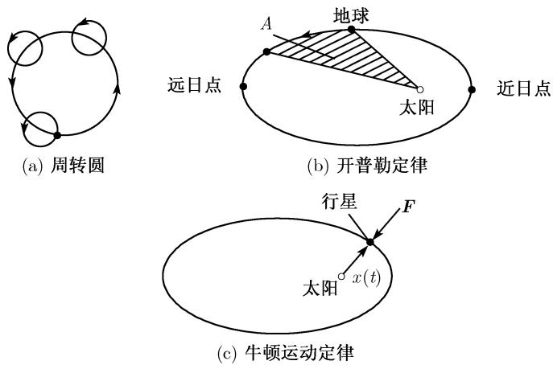

##### 0.1.12 在行星运动中的应用——数学在太空中的一次胜利

如果我们不完全了解在我们之前的其他人拥有什么，就不可能真正地了解自己拥有什么。

J. W. 歌德 (1749—1832)

准确地说, 前几节的结果在今天看来当属初等数学. 但事实上, 这一点是人类在解决大自然所赋予我们的重要问题的过程中, 经历数世纪的辛勤耕耘与思索之后才获得的. 我们不妨以行星运动为例详细说明.

人们在古时候就对圆锥曲线作了深入研究. 为了描述行星在天空中的位置, 古代天文学家使用了珀加的阿波罗尼奥斯(Appolonius, 约公元前260—前190)的周转圆(epicycles)\*的思想. 根据这一理论, 行星沿一个小的圆形轨道运动, 而小的圆形轨道反过来又沿着一个更大的圆形轨道运动 (图0.21(a)).

  
图 0.21 历史上圆锥曲线的出现

周转圆理论比较准确地描述了行星每年在天空中看似非常复杂的运动. 它生动地印证了：试图让理论符合观察结果的这种做法可能会使我们得到一个完全错误的模型.

哥白尼的世界观 1543 年 N. 哥白尼 (Nicolaus Copernicus, 1473 年生于波兰的托伦城) 去世, 同年, 他的划时代之作《天体运行论》(De revolutionibus orbium coelestium) 发表. 这部著作打破了古代传统的世界观——托勒密 (Ptolemy) 宣称的地心说. 哥白尼指出地球绕太阳旋转, 但仍认为其轨道为圆形的.

开普勒三定律 在丹麦天文学家第谷(Tycho Brahe, 1546–1601) 的大量观测资料的基础上, J. 开普勒 (Kepler, 1571—1630, 生于德国威尔) 经过诸多计算之后发现下面的行星运动三大定律(图 0.21(b)):

1. 行星沿椭圆轨道运动, 且太阳位于椭圆的一个焦点上.

2. 行星在椭圆轨道上运动时, 在相等的时间内扫过的面积相等 (图 0.21(b) 中的 A).

3. 所有行星的公转周期 T 的平方与椭圆长半轴 a 的立方的比都是一个常量:

$$
\boxed {\frac {T ^ {2}}{a ^ {3}} = \mathrm{常量}.}
$$

1609 年, 开普勒在《新天文学》(Astronomia nova) 中发表了前两条定律, 10 年后, 在《宇宙和谐论》(Harmonices mundi) $^{1)}$ 中发表第三条定律.

1624 年, 开普勒完成了 1601 年德国皇帝鲁道夫二世交给他的绘制“鲁道夫表”的大部分工作. 在接下来 200 年的时间里, 天文学家一直沿用这些表. 借助它们, 也许可以精确地预测出行星的运动以及过去和将来任何时候的日食和月食. 在当时计算器计算水平下, 特别是注意到天文学中使用的是精确的结果, 而不是粗略的近似值, 我们简直难以想象开普勒在当时取得的是怎样一项伟大的成就. 还有一点值得一提, 那就是开普勒不得不在没有对数表的情况下工作. 1614 年, 苏格兰贵族纳皮尔发表了第一个对数表, 开普勒马上意识到这种把乘法简化成加法的数学工具的威力. 事实上, 开普勒在此方面的论文对普及对数表很有帮助.

牛顿力学 1643 年, 也就是恰逢哥白尼去世 100 周年之际, 人类真正的天才之一, 一个农庄主的儿子——牛顿在英国东海岸的一个小村庄里降生了. J. L. 拉格朗日 (Lagrange) 曾写道: “他是最幸运的, 因为宇宙系统只能被发现一次.” 26 岁时, 牛顿成为 (英国) 剑桥著名的三一学院的教授, 事实上, 他早在 23 岁时就利用开普勒第三定律估算出万有引力, 并发现它一定与距离平方的倒数成比例. 1687 年, 他的名著《自然哲学的数学原理》(Philosophiae Naturalis Principia Mathematica) 问世, 其中讲述了经典力学, 得到并应用了著名的运动定律

$$
\boxed {\text {力} = \text {质量} \times \text {加速度}.}
$$

同时, 他还创立了微积分理论. 牛顿的定律用现代符号写出来就是行星运动的微分方程

$$
\boxed {m \boldsymbol {x} ^ {\prime \prime} (t) = \boldsymbol {F} (\boldsymbol {x} (t)).}\tag{0.26}
$$

向量 $\boldsymbol{x}(t)$ 表示行星在 t 时刻的位置 ${}^{1)}$ (图 0.21(c)), 时间的二阶导数 $\boldsymbol{x}''(t)$ 对应行星在 t 时刻的加速度向量, 正常数 m 表示行星的质量. 按照牛顿的说法, 太阳的万有引力是

$$
\boxed {\boldsymbol {F} (x) = - \frac {G m M}{| \boldsymbol {x} | ^ {2}} \boldsymbol {e},}
$$

其中单位向量

$$
e = \frac {\boldsymbol {x}}{| \boldsymbol {x} |}.
$$

F 的负号表示引力的方向与 $-x(t)$ 一致, 即由行星指向太阳. 另外, M 表示太阳的质量, G 是自然的万有常量, 称为万有引力常量:

$$
G = 6. 6 7 2 6 \cdot 1 0 ^ {- 1 1} \mathrm{m} ^ {3} \cdot \mathrm{kg} ^ {- 1} \cdot \mathrm{s} ^ {- 2}.
$$

牛顿发现 (0.26) 的解是椭圆 (以极坐标形式表示)

$$
r = \frac {p}{1 - \varepsilon \cos \varphi},
$$

其中数值离心率 $\varepsilon$ 和半参数 $p$ 由如下方程确定：

$$
\varepsilon = \sqrt {1 + \frac {2 E D ^ {2}}{G ^ {2} m ^ {3} M ^ {2}}}, \quad p = \frac {D ^ {2}}{G ^ {2} m ^ {3} M ^ {2}}.
$$

能量 $E$ 和角动量 $D$ 由行星在某一时刻的速度和位置决定. 轨道运动 $\varphi = \varphi(t)$ 通过解如下关于角 $\varphi$ 的方程得到:

$$
t = \frac {m}{D} \int_ {0} ^ {\varphi} r ^ {2} (\varphi) \mathrm{d} \varphi .
$$

高斯重新发现谷神星 1801 年新年之夜, 巴勒莫天文台发现了一颗暗淡的 8 等星, 它运动相对很快, 不久就消失了. 这对当时的天文学家来说是一次不可思议的挑战, 因为已知的轨道只有 9 度. 所有用于天体计算的方法都失败了. 然而, 24 岁的高斯用一种全新的方法克服了求解第 8 度轨道所满足的方程的困难, 1809 年, 他将其发表在《行星沿圆锥曲线的绕日运动理论》(Theoria motus corporum coelestium in sectionibus conicis Solem ambientium) 中.

根据高斯的计算结果, 谷神星应该在 1802 年的新年之夜再次出现. 它是人类观察到的第一颗小行星. 据估计, 在火星与木星之间的区域, 还存在约 50 000 颗这样的小行星, 但其总质量只及地球质量的几千分之一. 谷神星的直径是 768 km, 是目前知道的最大的小行星.

海王星的发现 1781 年 3 月的一个晚上, W. 赫歇尔 (Herschel) 发现一颗新行星, 后来称为天王星, 其绕日公转周期为 84 年 (表 0.13). 剑桥的 J. 亚当斯 (Adams, 1819—1892) 和巴黎的 J. 勒维耶 (Leverrier, 1811—1877) 这两位年轻的天文学家彼此独立地确定出了天王星的轨道, 并从观测到的天王星轨道的扰动中判断出存在一颗新的行星, 根据勒维耶所说, G. 伽勒 (Galle) 早在 1846 年在柏林天文台就观察到了这颗行星并命名为海王星. 这是牛顿力学的一次胜利, 同时也是天体运行论中的一项实际计算.

通过观察海王星运动过程中的扰动, 随后人们又推断出在距离太阳非常遥远的地方还存在一颗光线暗淡的行星, 1930 年人们发现了它, 以罗马冥王的名字命名为

表 0.13 太阳系模型 (1m 表示 $10^{6}$ km)

<table><tr><td>天体</td><td>距日距离</td><td>公转周期</td><td>数值轨道离心率 ε</td><td>天体直径</td><td>相对大小</td></tr><tr><td>太阳</td><td>—</td><td>—</td><td>—</td><td>1.4m</td><td>—</td></tr><tr><td>水星</td><td>58 m</td><td>88d</td><td>0.206</td><td>5 mm</td><td>豌豆</td></tr><tr><td>金星</td><td>108 m</td><td>255d</td><td>0.007</td><td>12 mm</td><td>樱桃</td></tr><tr><td>地球</td><td>149 m</td><td>1a</td><td>0.017</td><td>13 mm</td><td>樱桃</td></tr><tr><td>火星</td><td>229 m</td><td>2a</td><td>0.093</td><td>7 mm</td><td>豌豆</td></tr><tr><td>木星</td><td>778 m</td><td>12a</td><td>0.048</td><td>143 mm</td><td>椰子</td></tr><tr><td>土星</td><td>1400 m</td><td>30a</td><td>0.056</td><td>121 mm</td><td>椰子</td></tr><tr><td>天王星</td><td>2900 m</td><td>84a</td><td>0.047</td><td>50 mm</td><td>苹果</td></tr><tr><td>海王星</td><td>4500 m</td><td>165a</td><td>0.009</td><td>53 mm</td><td>苹果</td></tr><tr><td>冥王星 1)</td><td>5900 m</td><td>249a</td><td>0.249</td><td>10 mm</td><td>樱桃</td></tr></table>

1) 根据 2006 年国际天文学联合会大会通过的决议, 幂王星不再被称为行星. —— 编者

冥王星 (表 0.13).

水星的近日点运动 行星的轨道计算起来非常复杂, 因为不仅要说明来自太阳的引力, 还要说明来自其他行星的引力. 此外, 它还要在数学的扰动理论的背景下来解决, 一般地, 扰动理论考虑的是方程 (的系数) 在微小扰动下解的取向. 尽管已经有了非常精确的计算, 距离太阳最近的行星 —— 水星的轨道还是沿椭圆的长轴有一个旋转, 其速度大约为一世纪 43 角秒, 这真的无法理解. 直到 1916 年爱因斯坦的广义相对论问世, 这一现象才得以解释.

大爆炸的背景微波辐射 广义相对论方程存在一个解, 刻画了不断膨胀的宇宙. 这一膨胀的起点称为大爆炸. 1965 年, 美国物理学家彭齐亚斯 (Penzias) 和威尔逊 (Wilson) 在新泽西的贝尔实验室发现一种极其微弱的 (微波)、方向完全一样的辐射, 如今我们认为它们是 150 亿年前宇宙大爆炸的残余物与实验证据. 这是科学史上的一次轰动, 他们两个因此荣获诺贝尔奖. 因为在 3K 时 (绝对零度以上) 这种辐射可以看成光子气体, 所以我们可说成是 3K 辐射. 另一方面, 在很长一段时间内很难理解这种辐射的方向为什么完全一样, 它显然与宇宙中银河系的形成相矛盾. 1992 年, 经过几年的大量准确工作之后, G. 史莫特 (Smoot) 设计的人造卫星 COBE 最终在背景微波辐射中观察到了错综复杂的各向异性. 这也有望使我们很快知道在大爆炸 300 000 年之后宇宙的质量分布情况, 并了解大约 100 亿年前银河系的形成过程. $^{1)}$

天体物理学、微分方程、数值计算、快速计算机与太阳的毁灭 由于暗物质的吸引与压缩, 50 亿年前, 我们的生命之源 —— 太阳与其他行星形成了. 现代数学的一个目标就是描述出太阳的生存与毁灭过程, 这需要用到由复杂的微分方程组构成的太阳模型, 而这个模型是几代天文学家的劳动成果. 虽然我们不可能得到这个复杂的微分方程组的精确解, 但是借助巨型电子计算机的计算能力, 数值计算中的现代方法为计算近似解提供了有效工具. 慕尼黑工业大学 R. 布利尔施 (Bulirsch) 教授进行了这项计算. 他用动画描述了按这种方法所发现的解, 整个过程活灵活现. 这些解展现了太阳在 110 亿岁的时候会向金星轨道扩张, 那时, 地球上的所有生命将会由于这一扩张所产生的难以想象的热量而不复存在. 稍后, 太阳开始毁灭, 进而成为一个灰色的侏儒, 不再发光.
