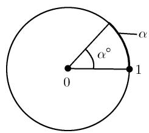
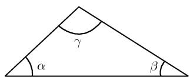
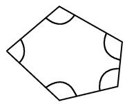
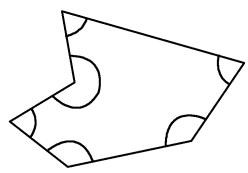

##### 0.1.2 量角

度数 图 0.1 给出了几个以度为度量单位的最常用的角, $90^{\circ}$ 角称为直角. 4000 多年前, 幼发拉底河和底格里斯河流域的古苏美尔地区使用了一种以 60 为基底的数系. 关于这种重要的使用方法, 可以追溯到度量时间和角时所使用的 12, 24, 60 和 360. 角的度量单位除了度以外, 还有其他的, 例如在天文学中使用了如下更小的度量单位:

  
图0.1 正角和负角

例 1(天文学): 日面位于天空大约 $30'$ (半度) 的位置. 因为地球和太阳的运动, 恒星在天空中的位置不断变化. 每年最大变化的一半称为视差, 它等于角 $\alpha$ , 即当日地距离最大时, 恒星与二者的夹角 (参看图 0.2 和表 0.2).

  
图0.2

表 0.2 视差与距离

<table><tr><td>恒星</td><td>视差</td><td>距离</td></tr><tr><td>毗邻星(最近的恒星)</td><td>0.765&#x27;&#x27;</td><td>4.2 光年</td></tr><tr><td>天狼星(最亮的恒星)</td><td>0.371&#x27;&#x27;</td><td>8.8 光年</td></tr></table>

一角秒的视差相当于 3.26 光年的距离 $(3.1 \cdot 10^{13} \text{km})$ ，这个距离也称为秒差距.

弧度 $\alpha$ 度 ( $\alpha^{\circ}$ ) 的角对应弧度

$$
\boxed {\alpha = 2 \pi \left(\frac {\alpha^ {\circ}}{3 6 0 ^ {\circ}}\right),}
$$

  
图0.3

其中 $\alpha$ 是单位圆上 $\alpha^{\circ}$ 角对应的弧长 (图 0.3). 表 0.3

列出了这一度量单位的几个常用值.

约定 如非特殊说明, 本书所有角都为弧度制.

表 0.3 角度与弧度

<table><tr><td>角度</td><td> $1^{\circ}$ </td><td> $45^{\circ}$ </td><td> $60^{\circ}$ </td><td> $90^{\circ}$ </td><td> $120^{\circ}$ </td><td> $135^{\circ}$ </td><td> $180^{\circ}$ </td><td> $270^{\circ}$ </td><td> $360^{\circ}$ </td></tr><tr><td>弧度</td><td> $\frac{\pi}{180}$ </td><td> $\frac{\pi}{4}$ </td><td> $\frac{\pi}{3}$ </td><td> $\frac{\pi}{2}$ </td><td> $\frac{2\pi}{3}$ </td><td> $\frac{3\pi}{4}$ </td><td> $\pi$ </td><td> $\frac{3\pi}{2}$ </td><td> $2\pi$ </td></tr></table>

$$
1 ^ {\prime} = \frac {\pi}{1 0 8 0 0} = 0. 0 0 0 2 9 1, \quad 1 ^ {\prime \prime} = \frac {\pi}{6 4 8 0 0 0} = 0. 0 0 0 0 0 5.
$$

三角形内角和 在一个三角形中, 各个角的和总是 $\pi$ , 即

$$
\boxed {\alpha + \beta + \gamma = \pi}
$$

(图 0.4).

四边形内角和 因为四边形可以分解成两个三角形, 所以各个角之和一定为 $2\pi$ , 即

$$
\boxed {\alpha + \beta + \gamma + \delta = 2 \pi}
$$

(图 0.5).

  
图0.4 三角形中的各个角

  
图 0.5 四边形中的各个角

n 边形内角和 一般而言, 有

$n$ 边形的内角和 $= (n - 2)\pi .$

例 2: 五边形(和六边形)的内角和为 $3\pi$ (和 $4\pi$ ) (图 0.6).

  
(a)五边形

  
(b)六边形  
图0.6 五边形和六边形
