##### 0.1.3 平面图形的面积与周长

表 0.4 阐明了最重要的平面图形. 0.2.8 中详细解释了三角函数 $\sin\alpha$ 与 $\cos\alpha$ 的含义.

表 0.4 多边形的面积与周长

<table><tr><td>图形</td><td>图</td><td>面积A</td><td>周长C</td></tr><tr><td>正方形</td><td>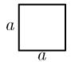</td><td> $A = a^{2}$  (a为一边的长度)</td><td> $C = 4a$ </td></tr><tr><td>矩形</td><td>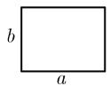</td><td> $A = ab$  (a,b为边长)</td><td> $C = 2a + 2b$ </td></tr><tr><td>平行四边形</td><td>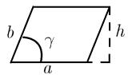</td><td> $\begin{array}{c}\text{A} = ah = absin\gamma \\(\text{a为底长},\text{b为边长},\text{h为高})\end{array}$ </td><td> $C = 2a + 2b$ </td></tr><tr><td>菱形(等边平行四边形)</td><td>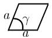</td><td> $A = a^{2}\sin\gamma$ </td><td> $C = 4a$ </td></tr><tr><td>梯形(有两个边相平行的四边形)</td><td>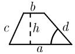</td><td> $A = \frac{1}{2}(a + b)h$  $(a,b \text{为两平行边的长度},\text{h为高})$ </td><td> $C = a + b + c + d$ </td></tr><tr><td>三角形</td><td>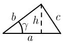</td><td> $\begin{array}{c}\text{A} = \frac{1}{2}ah = \frac{1}{2}absin\gamma \\(\text{a为底长},\text{b},\text{c为其他两边的长},\text{h为高},\text{s} := \text{C/2})\end{array}$ 面积的海伦公式为 $\begin{array}{c}\text{A} = \sqrt{s(s - a)(s - b)(s - c)}\end{array}$ </td><td> $C = a + b + c$ </td></tr><tr><td>直角三角形等边三角形</td><td>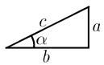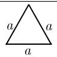</td><td> $\begin{array}{c}\text{A} = \frac{1}{2}ab \\ \text{边角关系:}\\ \text{a} = \text{csin}\alpha, \text{b} =\\ \text{ccos}\alpha, \text{a} = \text{b tan}\alpha\end{array}$ (c为斜边 $^{1)}$ ,a为对边,b为邻边)毕达哥拉斯定理 $^{2)}$ : $\begin{array}{c}\text{a}^{2} + \text{b}^{2} = \text{c}^{2} \\ \text{高的欧几里得关系:}\\ \text{h}^{2} = pq\end{array}$ 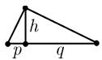 $A = \frac{\sqrt{3}}{4} a^{2}$ </td><td> $C = a + b + c$  $C = 3a$ </td></tr><tr><td>圆</td><td>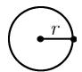</td><td> $A = \pi r^{2}$ (r为半径)</td><td> $C = 2\pi r$ </td></tr><tr><td>扇形</td><td>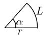</td><td> $A = \frac{1}{2} \alpha r^{2}$ </td><td> $C = L + 2r, L = \alpha r$ </td></tr><tr><td>圆环</td><td>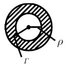</td><td> $A = \pi (r^{2} - \rho^{2})$ (r为外圆的半径, $\rho$ 为内圆的半径)</td><td> $C = 2\pi (r + \rho)$ </td></tr><tr><td>抛物扇形3)</td><td>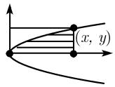</td><td> $A = \frac{1}{3} xy$ </td><td></td></tr><tr><td>双曲扇形</td><td>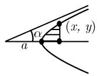</td><td> $A = \frac{1}{2} \left( xy - ab \cdot \text{arcosh} \frac{x}{a} \right)$  $(b = \text{atan}\alpha)$ </td><td></td></tr><tr><td>椭圆扇形</td><td>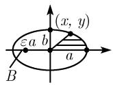</td><td> $A = \frac{1}{2} ab \cdot \text{arcosh} \frac{x}{a}$ </td><td></td></tr><tr><td>椭圆</td><td>图同上,其中B为焦点</td><td> $A = \pi ab$  $(a, b \text{为轴长}, b < a, \varepsilon \text{为数值离心率})$ </td><td> $C = 4aE(\varepsilon)$ (参看(0.5))</td></tr></table>

1) 直角三角形中直角的对边称为斜边, 其他两条边称为直角边或侧边.  
2) 即勾股定理．人们认为萨摩斯岛的毕达哥拉斯 (Pythagoras, 公元前 500 年) 是古希腊最著名的学派 (毕达哥拉斯学派) 的创立者．然而早在距那时大约 1000 年之前，汉谟拉比 (Hammurapi, 公元前 1728—前 1686) 国王统治下的巴比伦人就知道了毕达哥拉斯定理.  
3) 0.1.7 中将考虑抛物线、双曲线和椭圆；0.2.12 中介绍函数 arcosh.

用于计算椭圆周长的椭圆积分的含义 椭圆的数值离心率 $\varepsilon$ 表示如下:

$$
\boxed \varepsilon = \sqrt {1 - \frac {b ^ {2}}{a ^ {2}}}.
$$

$\varepsilon$ 的几何解释来自于椭圆焦点到椭圆中心的距离 $\varepsilon a$ 。对圆而言, 有 $\varepsilon = 0$ 。椭圆越扁, 数值离心率 $\varepsilon$ 越大.

早在 18 世纪, 人们就已经注意到不可能用初等方法计算出椭圆的周长. 椭圆周长公式为 $C = 4aE(\varepsilon)$ , 其中记号

$$
\boxed {E (\varepsilon) := \int_ {0} ^ {\pi / 2} \sqrt {1 - \varepsilon^ {2} \sin^ {2} \varphi} \mathrm{d} \varphi}\tag{0.5}
$$

表示勒让德第二类完全椭圆积分．本书给出了这个积分的表值(参看0.5.4).对椭圆,总有 $0\leqslant\varepsilon<1$ .作为所有这些值的近似,有级数

$$
\begin{array}{c} E (\varepsilon) = 1 - \left(\frac {1}{2}\right) ^ {2} \varepsilon^ {2} - \left(\frac {1 \cdot 3}{2 \cdot 4}\right) \frac {\varepsilon^ {4}}{3} - \left(\frac {1 \cdot 3 \cdot 5}{2 \cdot 4 \cdot 6}\right) \frac {\varepsilon^ {6}}{5} - \dots \\ = 1 - \frac {\varepsilon^ {2}}{4} - \frac {3 \varepsilon^ {4}}{6 4} - \frac {5 \varepsilon^ {6}}{2 5 6} - \dots . \end{array}
$$

19 世纪创立了椭圆积分的一般理论(参看 1.14.19).

正 n 边形 一个 n 边形称为正 n 边形, 若它的所有边和角都相等 (图 0.7).

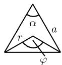  
$n = 3$

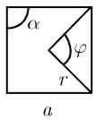  
$n = 4$

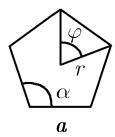  
$n = 5$

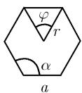  
$n = 6$  
图0.7 正 $n$ 边形

若把正 $n$ 边形的中心到各个角的距离记作 $r$ , 则下面的结果确立了正 $n$ 边形的几何关系:

中心角

$$
\varphi = \frac {2 \pi}{n},
$$

补角

$$
\alpha = \pi - \varphi ,
$$

边长

$$
a = 2 r \sin {\frac {\varphi}{2}},
$$

周长

$$
C = n a,
$$

面积

$$
A = \frac {1}{2} n r ^ {2} \sin \varphi .
$$

高斯定理 一个 $n(n \leqslant 20)$ 边形可以用尺规作出, 当且仅当

$$
\boxed {n = 3, 4, 5, 6, 8, 1 0, 1 2, 1 5, 1 6, 1 7, 2 0.}
$$

特别地, 当 $n = 7, 9, 11, 13, 14, 18, 19$ 时, 不可能由尺规作出正 $n$ 边形. 该结果是伽罗瓦理论的一个推论, 2.6.6 中将更详细地讨论它.
