##### 0.1.4 立体图形的体积与表面积

表 0.5 中列出了最重要的三维图形.

表 0.5 某些立体图形的体积与表面积

<table><tr><td>立体图形</td><td>图</td><td>体积V</td><td>表面积O,侧面积M</td></tr><tr><td>立方体</td><td>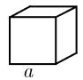</td><td> $V = a^{3}$  (a为边长)</td><td> $O = 6a^{2}$ </td></tr><tr><td>长方体</td><td>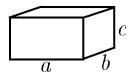</td><td> $V = abc$  (a,b,c为边长)</td><td> $O = 2(ab + bc + ca)$ </td></tr><tr><td>球</td><td>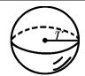</td><td> $\boxed{V = \frac{4}{3}\pi r^{3}}$  (r为半径)</td><td> $\boxed{O = 4\pi r^{2}}$ </td></tr><tr><td>棱柱</td><td>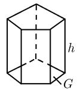</td><td> $\boxed{V = Gh}$  (G为底面积,h为高)</td><td></td></tr><tr><td>圆柱</td><td>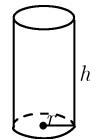</td><td> $V = \pi r^{2}h$  (r为半径,h为高)</td><td> $O = M + 2\pi r^{2}, M = 2\pi rh$ </td></tr><tr><td>立体圆环</td><td>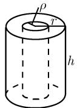</td><td> $V = \pi h(r^{2} - \rho^{2})$ (r为外半径, $\rho$ 为内半径,h为高)</td><td></td></tr><tr><td>棱锥</td><td>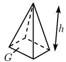</td><td> $\boxed{V = \frac{1}{3}Gh}$  (G为底面积,h为高)</td><td></td></tr><tr><td>圆锥</td><td>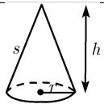</td><td> $V = \frac{1}{3}\pi r^{2}h$ (r为半径,h为高,s为母线长)</td><td> $O = M + \pi r^{2}, M = \pi rs$ </td></tr><tr><td>棱台</td><td>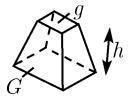</td><td> $V = \frac{h}{3}(G + \sqrt{Gg} + g)$ (G为下底面积,g为上底面积)</td><td></td></tr><tr><td>圆台</td><td>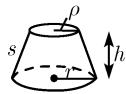</td><td> $V = \frac{\pi h}{3}(r^2 + r\rho + \rho^2)$  $(r, \rho \text{为半径}, h \text{为高}, s \text{为母线长})$ </td><td> $O = M + \pi(r^2 + \rho^2),$  $M = \pi s(r + \rho)$ </td></tr><tr><td>方尖形</td><td>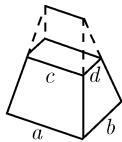</td><td> $V = \frac{1}{6}(ab + (a + c)(b + d) + cd)$  $(a, b, c, d \text{为边长})$ </td><td></td></tr><tr><td>楔形(侧面为等边三角形)</td><td>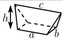</td><td> $V = \frac{\pi}{6}bh(2a + c)$  $(a, b \text{为底边长}, c \text{为上边}, h \text{为高})$ </td><td></td></tr><tr><td>(由纬线所界定的)球冠</td><td>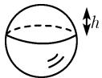</td><td> $V = \frac{\pi}{3}h^2(3r - h)$  $(r \text{为球的半径}, h \text{为高})$ </td><td> $O = 2\pi rh$ (顶部)</td></tr><tr><td>(由两条纬线所界定的)球台</td><td>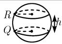</td><td> $V = \frac{\pi h}{6}(3R^2 + 3\rho^2 + h^2)$  $(r \text{为球的半径}, h \text{为高}, R \text{和} \rho \text{为两条纬线圈的半径})$ </td><td> $O = 2\pi rh$ (中部)</td></tr><tr><td>圆环</td><td>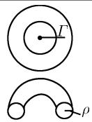</td><td> $V = 2\pi r^2\rho$  $(r \text{为圆环的半径}, \rho \text{为截面半径})$ </td><td> $O = 4\pi^2r\rho$ </td></tr><tr><td>桶形(圆形截面)</td><td>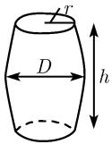</td><td> $V = 0.0873h(2D + 2r)^2$  $(D \text{为直径}, r \text{为顶的半径}, h \text{为高}; \text{这是一个近似公式})$ </td><td></td></tr><tr><td>椭球</td><td>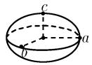</td><td> $V = \frac{4}{3}\pi abc$  $(a, b, c \text{为轴长}, c < b < a)$ </td><td>对于O,见勒让德公式(L)</td></tr></table>

用于计算椭球表面积的椭圆积分的含义 我们不可能用初等方法计算出椭球的表面积, 还需要用到椭圆积分, 为此, 有勒让德公式

$$
\boxed {O = 2 \pi c ^ {2} + \frac {2 \pi b}{\sqrt {a ^ {2} - c ^ {2}}} (c ^ {2} F (k, \varphi) + (a ^ {2} - c ^ {2}) E (k, \varphi)),}\tag{L}
$$

其中

$$
k = \frac {a}{b} \frac {\sqrt {b ^ {2} - c ^ {2}}}{\sqrt {a ^ {2} - c ^ {2}}}, \quad \varphi = \arcsin \frac {\sqrt {a ^ {2} - c ^ {2}}}{a}.
$$

椭圆积分公式 $E(k,\varphi)$ 和 $F(k,\varphi)$ ，见 0.5.4.
