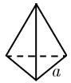
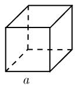
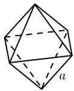
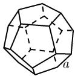
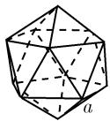

##### 0.1.5 正多面体的体积与表面积

多面体 多面体是以初等图形 (平面图形) 为边界的立体图形.

正多面体(也称为柏拉图立体)的每个面都是全等的边长为 a 的正 n 边形, 且在所有顶点处相交平面的个数相同. 共存在 5 种正多面体, 如表 0.6 所示.

表 0.6 5 种正多面体 $^{1)}$

<table><tr><td>正多面体</td><td>图</td><td>面</td><td>体积</td><td>表面积</td></tr><tr><td>四面体</td><td></td><td>4个等边三角形</td><td> $\frac{\sqrt{2}}{12} \cdot a^{3}$ </td><td> $\sqrt{3}a^{2}$ </td></tr><tr><td>立方体</td><td></td><td>6个正方形</td><td> $a^{3}$ </td><td> $6a^{2}$ </td></tr><tr><td>八面体</td><td></td><td>8个等边三角形</td><td> $\frac{\sqrt{2}}{3} \cdot a^{3}$ </td><td> $2\sqrt{3} \cdot a^{2}$ </td></tr><tr><td>十二面体</td><td></td><td>12个正五边形</td><td> $7.663 \cdot a^{3}$ </td><td> $20.646 \cdot a^{2}$ </td></tr><tr><td>二十面体2)</td><td></td><td>20个等边三角形</td><td> $2.182 \cdot a^{3}$ </td><td> $8.660 \cdot a^{2}$ </td></tr></table>

欧拉多面体公式 对正多面体, 下列关系式成立: 1)

顶点数 c- 边数  $e+$  面数 f=2.

表 0.7 证明了这一公式.

表 0.7 正多面体的一些关键数字

<table><tr><td>正多面体</td><td>c</td><td>e</td><td>f</td><td>c-e+f</td></tr><tr><td>四面体</td><td>4</td><td>6</td><td>4</td><td>2</td></tr><tr><td>立方体</td><td>8</td><td>12</td><td>6</td><td>2</td></tr><tr><td>八面体</td><td>6</td><td>12</td><td>8</td><td>2</td></tr><tr><td>十二面体</td><td>20</td><td>30</td><td>12</td><td>2</td></tr><tr><td>二十面体</td><td>12</td><td>30</td><td>20</td><td>2</td></tr></table>
