##### 0.1.7 平面解析几何学中的基本公式

解析几何学利用坐标方程描述诸如直线、平面和圆锥曲线这样的几何对象，通过不等式研究它们的几何性质。几何学中不断使用算术与代数的这种思想可以追溯到哲学家、科学家和数学家 R. 笛卡儿 (1596—1650)，笛卡儿坐标系正是以他的名字命名的。

0.1.7.1 直线

下面所有公式都是根据笛卡儿坐标系得到的, 其中 $y$ 轴与 $x$ 轴相互垂直. 点 $(x_{1}, y_{1})$ 的坐标如图 0.8(a) 所示. $y$ 轴左边一点的 $x$ 坐标为负值, $x$ 轴下方一点的 $y$ 坐标也为负值.

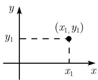  
(a)

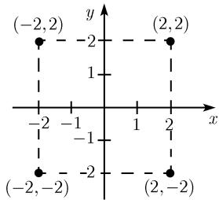  
(b)  
图 0.8 笛卡儿坐标

例 1: 点 $(2,2)$ , $(2,-2)$ , $(-2,-2)$ , $(-2,2)$ 如图 0.8(b) 所示.
两点 $(x_{1},y_{1})$ 和 $(x_{2},y_{2})$ 间的距离

$$
\boxed {d = \sqrt {(x _ {2} - x _ {1}) ^ {2} + (y _ {2} - y _ {1}) ^ {2}}}
$$

(图 0.9). 这个公式对应毕达哥拉斯定理.

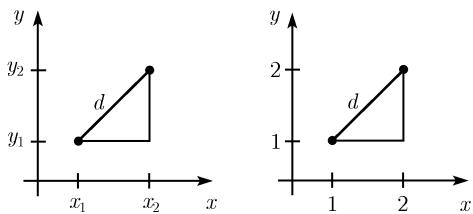  
图 0.9 两点间的距离

例 2: 点 $(1,1)$ 和 $(2,2)$ 间的距离是

$$
d = \sqrt {(2 - 1) ^ {2} + (2 - 1) ^ {2}} = \sqrt {2}.
$$

直线方程

$$
\boxed {y = m x + b,}\tag{0.6}
$$

其中 $b$ 是直线在 $y$ 轴上的截距 $(y$ 截距), 直线的斜率是 $m$ (图0.10). 对于倾斜角 $\alpha$ , 有如下关系:

$$
\boxed {\tan \alpha = m.}
$$

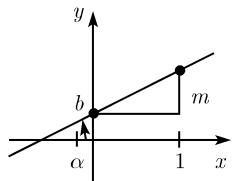  
(a) $m > 0$

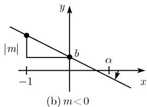  
图 0.10 直线方程

(i) 若已知直线上一点 $(x_{1},y_{1})$ 和斜率 $m$ , 可以求出 $b = y_{1} - mx_{1}$ .

(ii) 若已知直线上两点 $(x_{1},y_{1})$ 和 $(x_{2},y_{2})$ ，且 $x_{1}\neq x_{2}$ ，则有

$$
\boxed {m = \frac {y _ {2} - y _ {1}}{x _ {2} - x _ {1}}, \quad b = y _ {1} - m x _ {1}.}\tag{0.7}
$$

例 3: 过 $(1,1)$ 和 $(3,2)$ 两点的直线方程是

$$
y = \frac {1}{2} x + \frac {1}{2},
$$

这是因为由 (0.7), 有 $m = \frac{2 - 1}{3 - 1} = \frac{1}{2}$ 和 $b = 1 - \frac{1}{2} = \frac{1}{2}$ (图 0.11).

直线的 x 轴方程 $^{*}$ 若用 b 除直线方程 (0.6)，并令 $\frac{1}{a} := -\frac{m}{b}$ ，就得到

$$
\boxed { \begin{array}{c} \frac {x}{a} + \frac {y}{b} = 1. \end{array} }\tag{0.8}
$$

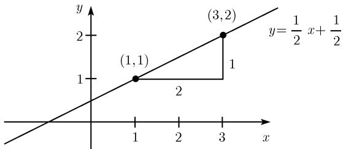  
图0.11 直线的斜率

当 $y = 0(x = 0)$ 时, 可以口算得出直线在点 $(a,0)$ 处与 $x$ 轴相交 (在点 $(0,b)$ 处与 $y$ 轴相交)(图0.12(a)).

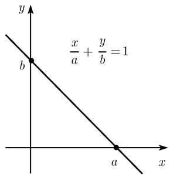

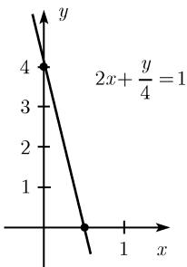  
图0.12 直线在 $x$ 轴处的情形

例 4: 若用 4 除直线方程

$$
y = - 8 x + 4,
$$

就得到 $\frac{y}{4} = -2x + 1$ ，因此

$$
2 x + \frac {y}{4} = 1.
$$

若令 $y = 0$ ，则有 $x = \frac{1}{2}$ 因此直线与 $x$ 轴在 $x = \frac{1}{2}$ 处相交（图0.12(b)). $\pmb{y}$ 轴的方程

$$
\boxed {x = 0.}
$$

这个方程不是 (0.6) 的特例. 它在形式上对应斜率 $m = \infty$ (无穷斜率) 的情况. 直线的一般方程 所有直线都可以定义成满足如下方程的点的集合：

$$
\boxed {A x + B y + C = 0,}
$$

其中 A, B, C 为常数, 满足条件 $A^{2} + B^{2} \neq 0$ .

例 5: 当 A = 1, B = C = 0 时, 我们得到 y 轴方程 x = 0.

线性代数的应用 利用向量的语言 (线性代数), 解析几何学中的一系列问题都能迎刃而解. 我们在 3.3 中讨论这一点.

0.1.7.2 圆

中心在 $(c,d)$ 、半径为 $r$ 的圆的方程

$$
\boxed {(x - c) ^ {2} + (y - d) ^ {2} = r ^ {2}}\tag{0.9}
$$

(图 0.13(a)).

例：中心在原点 $(0,0)$ 、半径 r=1 的圆的方程 (图 0.13(b)):

$$
x ^ {2} + y ^ {2} = 1.
$$

圆的切线方程

$$
\boxed {(x - c) (x _ {0} - c) + (y - d) (y _ {0} - d) = r ^ {2}.}
$$

这是圆 (0.9) 在点 $(x_{0}, y_{0})$ 处的切线的方程 (图 0.13(c)).

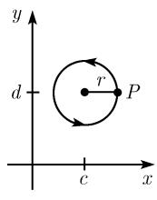  
(a)

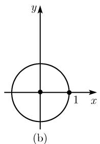

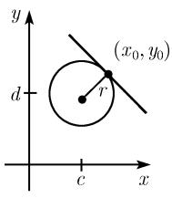  
(c)  
图0.13 平面中的圆

中心在 $(c,d)$ 、半径为 $r$ 的圆的参数方程

$$
x = c + r \cos t, y = d + r \sin t, 0 \leqslant t <   2 \pi .
$$

如果把 t 理解成时间, 那么起点 t = 0 就对应图 0.13(a) 中的点 P. 当时间由参数 t = 0 过渡到 $t = 2\pi$ 时, P 将以恒速逆时针 (数学上的正方向) 跨过整个圆周. 半径为 R 的圆的曲率 K 由定义, 有

$$
\boxed {K = \frac {1}{R}.}
$$

0.1.7.3 椭圆

中心在原点的椭圆方程

$$
\boxed {\frac {x ^ {2}}{a ^ {2}} + \frac {y ^ {2}}{b ^ {2}} = 1,}\tag{0.10}
$$

我们假设 $0 < b < a$ . 椭圆关于原点对称, 长半轴和短半轴\*的长度分别等于 $a$ 和 $b$ (图0.14(a)). 另外, 也可以引入下面的量:

$$
\mathrm{线性离心率} e = \sqrt {a ^ {2} - b ^ {2}},
$$

数值离心率 $\varepsilon = \frac{e}{a}$

$$
\text { 半参数 } \quad p = {\frac {b ^ {2}}{a}}.
$$

两个点 $(\pm e,0)$ 称为椭圆的焦点 $B_{\pm}$ (图 0.14(a)).

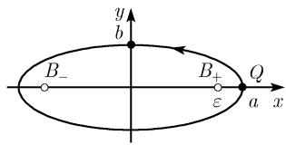  
(a)

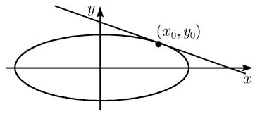

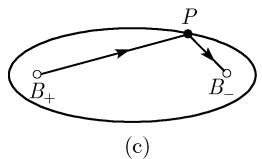  
(b)  
图0.14 椭圆

椭圆的切线方程

$$
\boxed {\frac {x x _ {0}}{a ^ {2}} + \frac {y y _ {0}}{b ^ {2}} = 1.}
$$

这是椭圆 (0.10) 在点 $(x_{0}, y_{0})$ 处的切线的方程 (图 0.14(b)).

椭圆的参数方程

$$
\boxed {x = a \cos t, \quad y = b \sin t, \quad 0 \leqslant t <   2 \pi .}
$$

当参数 t 从 0 变化到 $2\pi$ 时, 椭圆 (0.10) 上的一点 Q 沿逆时针方向运动一周. 起点 t = 0 对应椭圆上的点 Q(图 0.14(a)).

椭圆的几何刻画 椭圆是到两定点 $B_{-}$ 与 $B_{+}$ 的距离之和等于定长 $2a$ 的点 $P$ 的集合 (图0.14(c)). 这两个点称为焦点.

作图 为了作出一个椭圆, 我们要固定两个点 $B_{-}$ 与 $B_{+}$ 作为焦点, 然后用图钉把一根绳的两端固定在这两个焦点上, 使绳拉紧让笔沿绳运动, 笔所画过的轨迹就是一个椭圆 (图 0.14(c)).

焦点的物理性质 从焦点 $B_{-}$ 发出的光线经椭圆反射之后过另一焦点 $B_{+}$ (图0.14(c)). 椭圆的周长与面积 见表0.4.

极坐标中的椭圆方程、准线性质和曲率半径 见 0.1.7.6.

0.1.7.4 双曲线

中心在原点的双曲线方程

$$
\boxed {\frac {x ^ {2}}{a ^ {2}} - \frac {y ^ {2}}{b ^ {2}} = 1,}\tag{0.11}
$$

其中 $a$ 与 $b$ 为正常数.

双曲线的渐近线 双曲线与 x 轴相交于两点 $(\pm a,0)$ . 两直线

$$
y = \pm \frac {b}{a} x
$$

称为双曲线的渐近线. 当离原点越来越远时, 这两条直线逐渐趋近于双曲线的两支 (图 0.15(b)).

焦点 定义

$$
\mathrm{线性离心率} e = \sqrt {a ^ {2} + b ^ {2}},
$$

数值离心率 $\varepsilon=\frac{e}{a}$ ,

半参数 $p = \frac{b^2}{a}$

两点 $(\pm e,0)$ 称为双曲线的焦点 $B_{\pm}$ (图 0.15(a)).

双曲线的切线方程

$$
\boxed {\frac {x x _ {0}}{a ^ {2}} - \frac {y y _ {0}}{b ^ {2}} = 1.}
$$

这是双曲线 (0.11) 在点 $(x_{0}, y_{0})$ 处的切线的方程 (图 0.15(c)).

双曲线的参数方程 $^{1)}$

$$
\boxed {x = a \cosh t, \quad y = b \sinh t, \quad - \infty <   t <   + \infty .}
$$

当参数 t 取遍所有实数时, 图 0.15(a) 中双曲线右支上的点按箭头所示方向遍及双曲线的右支. 起点 t = 0 对应双曲线上的点 $(a, 0)$ . 类似地, (图 0.15(a)) 双曲线的左支上的点依参数方程

$$
x = - a \cosh t, \quad y = b \sinh t, \quad - \infty <   t <   + \infty
$$

遍及双曲线的左支.

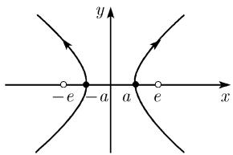  
(a)

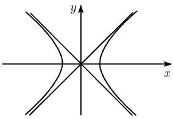  
(b)

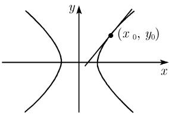  
(c)

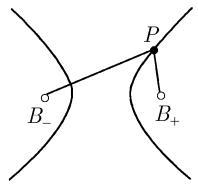  
(d)

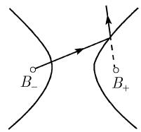  
(e)  
图 0.15 双曲线的性质

双曲线的几何刻画 双曲线是到两定点 $B_{-}$ 与 $B_{+}$ 的距离之差等于定长 $2a$ 的点 $P$ 的集合 (参看图0.15(d)). 这两个点也称为焦点.

焦点的物理性质 从焦点 $B_{-}$ 发出的光线经双曲线反射之后其反向延长线过另一焦点 $B_{+}$ (图0.15(e)).

双曲扇形的面积 见表 0.4.

极坐标中的双曲线方程、准线性质和曲率半径 见 0.1.7.6.

0.1.7.5 抛物线

抛物线方程

$$
\boxed {y ^ {2} = 2 p x,}\tag{0.12}
$$

其中 $p$ 是一个正常数 (图0.16), 我们定义:

$$
\mathrm{线性离心率} e = \frac {p}{2},
$$

数值离心率 $\varepsilon = 1$

点 $(e,0)$ 称为抛物线的焦点(图 0.16(a)).

抛物线的切线方程

$$
\boxed {y y _ {0} = p (x + x _ {0}).}
$$

这是抛物线 (0.12) 在点 $(x_{0}, y_{0})$ 处的切线的方程 (图 0.16(b)).

抛物线的几何刻画 抛物线是到定点 $B$ (焦点) 与到定直线 $L$ (准线) 距离相等的点 $P$ 的集合 (图0.16(c)).

焦点的物理性质 (抛物镜像) 平行于 x 的光线射到抛物线上时其反射光线过焦点 (图 0.16(d)).

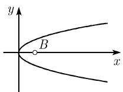  
(a)

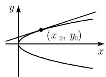  
(b)

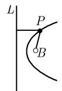  
(c)

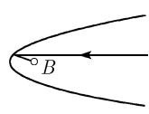  
图 0.16 抛物线的性质  
(d)

抛物扇形的面积 见表 0.4.

极坐标中的抛物线方程和曲率半径 见 0.1.7.6.

0.1.7.6 极坐标与圆锥曲线

极坐标 在某些问题中, 为了利用方程的对称性, 常常用极坐标系代替笛卡儿坐标系. 平面中点 P 的极坐标 $(r, \varphi)$ 如图 0.17 所示, 它是由点 P 到原点的距离 r 和线段 OP 与 x 轴所成的角 $\varphi$ 给出的. 点 P 的笛卡儿坐标 $(x, y)$ 与极坐标 $(r, \varphi)$ 存在如下关系:

$$
\boxed { \begin{array}{c c c} x = r \cos \varphi , & y = r \sin \varphi , & 0 \leqslant \varphi <   2 \pi . \end{array} }\tag{0.13}
$$

另外, 我们有

$$
r = \sqrt {x ^ {2} + y ^ {2}}, \quad \tan \varphi = \frac {y}{x}.
$$

圆锥曲线 一个平面截对顶圆锥时产生的截线就是圆锥曲线 (图 0.18). 用这种方法能得到如下两组图形:

(i) 正则圆锥曲线：圆、椭圆、双曲线或抛物线.

(ii) 退化圆锥曲线：两条线、一条线或一个点.

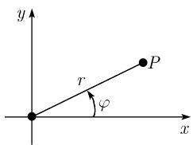  
图0.17

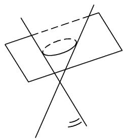  
图0.18

极坐标中的正则圆锥曲线方程

$$
\boxed {r = \frac {p}{1 - \varepsilon \cos \varphi}}
$$

(参看表 0.8). 正则圆锥曲线由其几何性质所刻画, 即它们是满足如下关系的所有点的集合:

$$
\frac {r}{d} = \varepsilon ,
$$

其中 $\varepsilon$ 为常数, r 是到定点 B(焦点) 的距离, d 是到定直线 L(准线) 的距离.

表 0.8 正则圆锥曲线

<table><tr><td>圆锥曲线</td><td>数值离心率 ε</td><td>线性离心率 e</td><td>半参数 p</td><td>准线-性质  $\frac{r}{d} = \varepsilon$ </td></tr><tr><td>双曲线1)</td><td>ε &gt; 1</td><td> $e = \frac{\varepsilon p}{(1 - \varepsilon)^2}$ </td><td> $p = \frac{b^2}{a}$ </td><td>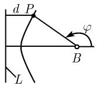</td></tr><tr><td>抛物线</td><td>ε = 1</td><td> $e = \frac{p}{2}$ </td><td></td><td>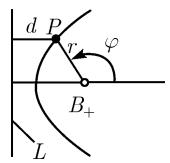</td></tr><tr><td>椭圆</td><td>0 ≤ ε &lt; 1</td><td> $e = \frac{\varepsilon p}{1 - \varepsilon^2}$ </td><td> $p = \frac{b^2}{a}$ </td><td>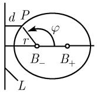</td></tr><tr><td>圆</td><td>ε = 0(极限情况 d = ∞)</td><td>e = 0</td><td>p = 半径 r</td><td>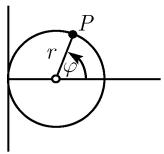</td></tr></table>

垂直圆与曲率半径 我们可以在一条正则圆锥曲线的顶点 S 处用如下方法画出一个圆, 即垂直圆: 该圆在点 S 上切触圆锥曲线即该圆与圆锥曲线在点 S 有相同切线. 这个垂直圆的半径称为在点 S 处的曲率半径 R. 同样, 在圆锥曲线的任意一点 $P(x_{0}, y_{0})$ 上都可能画出这样一个圆 (参看表 0.9), 点 P 处曲率 K 定义为

$$
\boxed {K = \frac {1}{R _ {0}}.}
$$

1) 由不等式 $\varepsilon > 1$ , $\varepsilon = 1$ 和 $\varepsilon < 1$ , 希腊数学家阿波罗尼奥斯 (约公元前 260—前 190) 引进术语 $\bar{\nu}\pi\varepsilon\rho\beta o\lambda\acute{\eta}$ (双曲线, 意指超出), $\pi\alpha\rho\alpha\beta o\lambda\acute{\eta}$ (抛物线, 意指相等) 和 $\tilde{\varepsilon}\lambda\lambda\varepsilon\nu\psi\iota\zeta$ (椭圆, 意指不足).

表 0.9 内切圆

<table><tr><td>圆锥曲线</td><td>方程</td><td>曲率半径</td><td>图</td></tr><tr><td>椭圆</td><td> $\frac{x^{2}}{a^{2}} + \frac{y^{2}}{b^{2}} = 1$ </td><td> $R_{0} = a^{2} b^{2} \left( \frac{x_{0}^{2}}{a^{4}} + \frac{y_{0}^{2}}{b^{4}} \right)^{3/2},$  $R = \frac{b^{2}}{a} = p$ </td><td>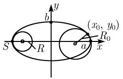</td></tr><tr><td>双曲线</td><td> $\frac{x^{2}}{a^{2}} - \frac{y^{2}}{b^{2}} = 1$ </td><td> $R_{0} = a^{2} b^{2} \left( \frac{x_{0}^{2}}{a^{4}} + \frac{y_{0}^{2}}{b^{4}} \right)^{3/2},$  $R = \frac{b^{2}}{a} = p$ </td><td>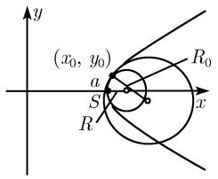</td></tr><tr><td>抛物线</td><td> $y^{2} = 2px$ </td><td> $R_{0} = \frac{(p + 2x_{0})^{3/2}}{\sqrt{p}},$  $R = p$ </td><td>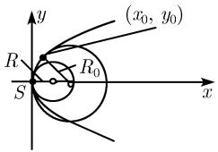</td></tr></table>
