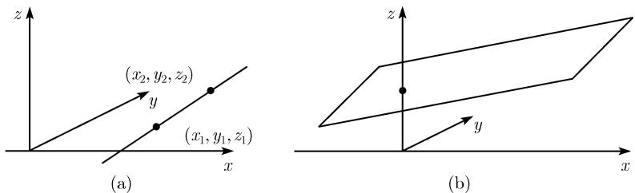

##### 0.1.8 空间解析几何学中的基本公式

空间中的笛卡儿坐标 空间笛卡儿坐标系如图 0.19 所示: 它有三个相互垂直的坐

标轴 —— 记为 x 轴、y 轴和 z 轴, 分别与右

手大拇指、食指和中指的方向相同 (右手系). 空间一点的坐标 $(x_{1}, y_{1}, z_{1})$ 由到轴的垂直投影确定.

过点 $(x_{1},y_{1},z_{1})$ 和 $(x_{2},y_{2},z_{2})$ 的直线方程

$$
\boxed { \begin{array}{c} x = x _ {1} + t (x _ {2} - x _ {1}), y = y _ {1} + t (y _ {2} - y _ {1}), \\ z = z _ {1} + t (z _ {2} - z _ {1}), \end{array} }
$$

图0.19

参数 t 遍及所有实数, 可以理解为时间 (图 0.20(a)).

两点 $(x_{1},y_{1},z_{1})$ 和 $(x_{2},y_{2},z_{2})$ 间的距离 $d$

$$
d = \sqrt {(x _ {1} - x _ {2}) ^ {2} + (y _ {1} - y _ {2}) ^ {2} + (z _ {1} - z _ {2}) ^ {2}}.
$$

平面方程

$$
\boxed {A x + B y + C z = D.}
$$

实常数 A, B, C 应满足条件 $A^{2} + B^{2} + C^{2} \neq 0$ (图 0.20(b)).

  
图 0.20 三维空间中的直线与平面方程

向量代数在三维空间中的直线和平面上的应用 见 3.3.
