##### 0.10.2 拉普拉斯变换

0.10.2.1 其拉普拉斯变换为一有理函数的函数的逆变换表

这个表是根据分母的次数排序的. 除了个别函数的分母为高次外, 大部分函数的分母最高可至 3 次.

<table><tr><td> $\mathcal{L}\{f(t)\}$ </td><td> $f(t)$ </td></tr><tr><td> $\frac{1}{s}$ </td><td>1</td></tr><tr><td> $\frac{1}{s+\alpha}$ </td><td> $e^{-\alpha t}$ </td></tr><tr><td> $\frac{1}{s^2}$ </td><td> $t$ </td></tr><tr><td> $\frac{1}{s(s+\alpha)}$ </td><td> $\frac{1}{\alpha}[1-e^{-\alpha t}]$ </td></tr><tr><td> $\frac{1}{(s+\alpha)(s+\beta)}$ </td><td> $\frac{1}{\beta-\alpha}[e^{-\alpha t}-e^{-\beta t}]$ </td></tr><tr><td> $\frac{s}{(s+\alpha)(s+\beta)}$ </td><td> $\frac{1}{\alpha-\beta}[\alpha e^{-\alpha t}-\beta e^{-\beta t}]$ </td></tr><tr><td> $\frac{1}{(s+\alpha)^2}$ </td><td> $te^{-\alpha t}$ </td></tr><tr><td> $\frac{s}{(s+\alpha)^2}$ </td><td> $e^{-\alpha t}(1-\alpha t)$ </td></tr><tr><td> $\frac{1}{s^2-\alpha^2}$ </td><td> $\frac{1}{\alpha}\sinh(\alpha t)$ </td></tr><tr><td> $\frac{s}{s^2-\alpha^2}$ </td><td> $\cosh(\alpha t)$ </td></tr><tr><td> $\frac{1}{s^2+\alpha^2}$ </td><td> $\frac{1}{\alpha}\sin(\alpha t)$ </td></tr><tr><td> $\frac{s}{s^2+\alpha^2}$ </td><td> $\cos\alpha t$ </td></tr><tr><td> $\frac{1}{(s+\beta)^2+\alpha^2}$ </td><td> $\frac{1}{\alpha}e^{-\beta t}\sin\alpha t$ </td></tr><tr><td> $\frac{s}{(s+\beta)^2+\alpha^2}$ </td><td> $e^{-\beta t}\left[\cos\alpha t-\frac{\beta}{\alpha}\sin\alpha t\right]$ </td></tr><tr><td> $\frac{1}{s^3}$ </td><td> $\frac{1}{2}t^2$ </td></tr><tr><td> $\frac{1}{s^2(s+\alpha)}$ </td><td> $\frac{1}{\alpha^2}(e^{-\alpha t}+\alpha t-1)$ </td></tr><tr><td> $\frac{1}{s(s+\alpha)(s+\beta)}$ </td><td> $\frac{1}{\alpha\beta(\alpha-\beta)}[(\alpha-\beta)+\beta e^{-\alpha t}-\alpha e^{-\beta t}]$ </td></tr><tr><td> $\frac{1}{s(s+\alpha)^2}$ </td><td> $\frac{1}{\alpha^2}[1-e^{-\alpha t}-\alpha te^{-\alpha t}]$ </td></tr><tr><td> $\frac{1}{(s+\alpha)(s+\beta)(s+\gamma)}$ </td><td> $\frac{1}{(\alpha-\beta)(\beta-\gamma)(\gamma-\alpha)}\times[(\gamma-\beta)e^{-\alpha t}+(\alpha-\gamma)e^{-\beta t}+(\beta-\alpha)e^{-\gamma t}]$ </td></tr><tr><td> $\frac{s}{(s+\alpha)(s+\beta)(s+\gamma)}$ </td><td> $\frac{1}{(\alpha-\beta)(\beta-\gamma)(\gamma-\alpha)}\times[\alpha(\beta-\gamma)e^{-\alpha t}+\beta(\gamma-\alpha)e^{-\beta t}+\gamma(\alpha-\beta)e^{-\gamma t}]$ </td></tr></table>

续表

$$
\begin{array} { l l } \mathcal { L } \{ f ( t ) \} & f ( t ) \\ \hline \frac { s ^ { 2 } } { ( s + \alpha ) ( s + \beta ) ( s + \gamma ) } & \frac { 1 } { ( \alpha - \beta ) ( \beta - \gamma ) ( \gamma - \alpha ) } \\ & \times [ - \alpha ^ { 2 } ( \beta - \gamma ) e ^ { - \alpha t } - \beta ^ { 2 } ( \gamma - \alpha ) e ^ { - \beta t } - \gamma ^ { 2 } ( \alpha - \beta ) e ^ { - \gamma t } ] \\ \hline \frac { 1 } { ( s + \alpha ) ( s + \beta ) ^ { 2 } } & \frac { 1 } { ( \beta - \alpha ) ^ { 2 } } [ e ^ { - \alpha t } - e ^ { - \beta t } - ( \beta - \alpha ) t e ^ { - \beta t } ] \\ \hline \frac { s } { ( s + \alpha ) ( s + \beta ) ^ { 2 } } & \frac { 1 } { ( \beta - \alpha ) ^ { 2 } } [ - \alpha e ^ { - \alpha t } + [ \alpha + \beta t ( \beta - \alpha ) ] e ^ { - \beta t } ] \\ \hline \frac { s ^ { 2 } } { ( s + \alpha ) ( s + \beta ) ^ { 2 } } & \frac { 1 } { ( \beta - \alpha ) ^ { 2 } } [ \alpha ^ { 2 } e ^ { - \alpha t } + \beta [ \beta - 2 \alpha - \beta ^ { 2 } t + \alpha \beta t ] e ^ { - \beta t } ] \\ \hline \frac { 1 } { ( s + \alpha ) ^ { 3 } } & \frac { t ^ { 2 } } { 2 } e ^ { - \alpha t } \\ \hline \frac { s } { ( s + \alpha ) ^ { 3 } } & e ^ { - \alpha t } t [ 1 - \frac { \alpha } { 2 } t ] \\ \hline \frac { s ^ { 2 } } { ( s + \alpha ) ^ { 3 } } & e ^ { - \alpha t } [ 1 - 2 \alpha t + \frac { \alpha ^ { 2 } } { 2 } t ^ { 2 } ] \\ \hline \frac { 1 } { s [ ( s + \beta ) ^ { 2 } + \alpha ^ { 2 } ] } & \frac { 1 } { \alpha ^ { 2 } + \beta ^ { 2 } } [ 1 - e ^ { - \beta t } (\cos \alpha t + \frac { \beta } { \alpha } \sin \alpha t) ] \\ \hline \frac { 1 } { s ( s ^ { 2 } + \alpha ^ { 2 } ) } & \frac { 1 } { \alpha ^ { 2 } } ( 1 - \cos \alpha t ) \\ \hline \frac { 1 } { ( s + \alpha ) ( s ^ { 2 } + \beta ^ { 2 } ) } & \frac { 1 } { \alpha ^ { 2 } + \beta ^ { 2 } } [ e ^ { - \alpha t } + \frac { \alpha } { \beta } \sin \beta t - \cos \beta t ] \\ \hline \frac { s } { ( s + \alpha ) ( s ^ { 2 } + \beta ^ { 2 } ) } & \frac { 1 } { \alpha ^ { 2 } + \beta ^ { 2 } } [ - \alpha e ^ { - \alpha t } + \alpha \cos \beta t + \beta \sin \beta t ] \\ \hline \frac { s ^ { 2 } } { ( s + \alpha ) ( s ^ { 2 } + \beta ^ { 2 } ) } & \frac { 1 } { \alpha ^ { 2 } + \beta ^ { 2 } } [ a ^ { 2 } e ^ { - \alpha t } - a b   b   c   c   c   c   c   c   c   c   c   c   c   c   c   c   c   c   c   c   c   c   c   c   c   c   c   c   c   c   c   c   c   c   c   c   c   c   c   c   c   c   c   c   c   c   c   c   c   c   c   c   . \\ \hline \frac { 1 } { ( s + \alpha ) [ ( s + \beta ) ^ { 2 } + y ^ { 2 } ] } & \frac { 1 } { ( b - a ) ^ { 2 } + y ^ { 2 } } [ e ^ { - a t } - e ^ { - b t } c o s y t + \frac {\alpha - b}{\gamma} e ^ { - b t} s i n y t ] \\ \hline s _ { ( s + a ) [ ( s + b ) ^ { 2 } + y ^ { 2 } ] } & \frac { 1 } { ( b - a ) ^ { 2 } + y ^ { 2 } } [ - a e ^ { - a t } + a e ^ { - b t} c o s y t \\ & - \frac {\alpha b - b ^ { 2 } - y ^ { 2 }}{ y } e ^ { - b t} s i n y t ] \\ \hline s ^ { 2 } _ {( s + a ) [ ( s + b ) ^ { 2 } + y ^ { 2 } ] } & \frac { 1 } { ( b - a ) ^ { 2 } + y ^ { 2 } } [ a ^ { 2 } e ^ { - a t } + (( a - b ) ^ { 2 } + y ^ { 2 } - a ^ { 2 }) e ^ { - b t} c o s y t \\ & - (a y + b (\gamma - (\frac {(a - b) b)}{ y})) e ^ { - b t} s i n y t ] \\ \end{array}
$$

续表

<table><tr><td> $\mathcal{L}\{f(t)\}$ </td><td> $f(t)$ </td></tr><tr><td> $\frac{1}{s^4}$ </td><td> $\frac{1}{6}t^3$ </td></tr><tr><td> $\frac{1}{s^3(s+\alpha)}$ </td><td> $\frac{1}{\alpha^3}-\frac{1}{\alpha^2}t+\frac{1}{2\alpha}t^2-\frac{1}{\alpha^3}e^{-\alpha t}$ </td></tr><tr><td> $\frac{1}{s^2(s+\alpha)(s+\beta)}$ </td><td> $-\frac{\alpha+\beta}{\alpha^2\beta^2}+\frac{1}{\alpha\beta}t+\frac{1}{\alpha^2(\beta-\alpha)}e^{-\alpha t}+\frac{1}{\beta^2(\alpha-\beta)}e^{-\beta t}$ </td></tr><tr><td> $\frac{1}{s^2(s+\alpha)^2}$ </td><td> $\frac{1}{\alpha^2}t(1+e^{-\alpha t})+\frac{2}{\alpha^3}(e^{-\alpha t}-1)$ </td></tr><tr><td> $\frac{1}{(s+\alpha)^2(s+\beta)^2}$ </td><td> $\frac{1}{(\alpha-\beta)^2}\left[e^{-\alpha t}\left(t+\frac{2}{\alpha-\beta}\right)+e^{-\beta t}\left(t-\frac{2}{\alpha-\beta}\right)\right]$ </td></tr><tr><td> $\frac{1}{(s+\alpha)^4}$ </td><td> $\frac{1}{6}t^3e^{-\alpha t}$ </td></tr><tr><td> $\frac{s}{(s+\alpha)^4}$ </td><td> $\frac{1}{2}t^2e^{-\alpha t}-\frac{\alpha}{6}t^3e^{-\alpha t}$ </td></tr><tr><td> $\frac{1}{(s^2+\alpha^2)(s^2+\beta^2)}$ </td><td> $\frac{1}{\beta^2-\alpha^2}\left[\frac{1}{\alpha}\sin\alpha t-\frac{1}{\beta}\sin\beta t\right]$ </td></tr><tr><td> $\frac{s}{(s^2+\alpha^2)(s^2+\beta^2)}$ </td><td> $\frac{1}{\beta^2-\alpha^2}[\cos\alpha t-\cos\beta t]$ </td></tr><tr><td> $\frac{s^2}{(s^2+\alpha^2)(s^2+\beta^2)}$ </td><td> $\frac{1}{\beta^2-\alpha^2}[-\alpha\sin\alpha t+\beta\sin\beta t]$ </td></tr><tr><td> $\frac{s^3}{(s^2+\alpha^2)(s^2+\beta^2)}$ </td><td> $\frac{1}{\beta^2-\alpha^2}[-\alpha^2\cos\alpha t+\beta^2\cos\beta t]$ </td></tr><tr><td> $\frac{1}{(s^2-\alpha^2)(s^2-\beta^2)}$ </td><td> $\frac{1}{\beta^2-\alpha^2}\left[\frac{1}{\beta}\sinh\beta t-\frac{1}{\alpha}\sinh\alpha t\right]$ </td></tr><tr><td> $\frac{s}{(s^2-\alpha^2)(s^2-\beta^2)}$ </td><td> $\frac{1}{\beta^2-\alpha^2}[\cosh\beta t-\cosh\alpha t]$ </td></tr><tr><td> $\frac{s^2}{(s^2-\alpha^2)(s^2-\beta^2)}$ </td><td> $\frac{1}{\beta^2-\alpha^2}[\beta\sinh\beta t-\alpha\sinh\alpha t]$ </td></tr><tr><td> $\frac{s^3}{(s^2-\alpha^2)(s^2-\beta^2)}$ </td><td> $\frac{1}{\beta^2-\alpha^2}[\beta^2\cosh\beta t-\alpha^2\sinh\alpha t]$ </td></tr><tr><td> $\frac{1}{(s^2+\alpha^2)^2}$ </td><td> $\frac{1}{2\alpha^2}\left[\frac{1}{\alpha}\sin\alpha t-t\cos\alpha t\right]$ </td></tr><tr><td> $\frac{s}{(s^2+\alpha^2)^2}$ </td><td> $\frac{1}{2\alpha}t\sin\alpha t$ </td></tr><tr><td> $\frac{s^2}{(s^2+\alpha^2)^2}$ </td><td> $\frac{1}{2\alpha}[\sin\alpha t+\alpha t\cos\alpha t]$ </td></tr><tr><td> $\frac{s^3}{(s^2+\alpha^2)^2}$ </td><td> $\frac{1}{2}[2\cos\alpha t-\alpha t\sin\alpha t]$ </td></tr><tr><td> $\frac{1}{(s^2-\alpha^2)^2}$ </td><td> $\frac{1}{2\alpha^2}\left[t\cosh\alpha t-\frac{1}{\alpha}\sinh\alpha t\right]$ </td></tr><tr><td> $\frac{s}{(s^2-\alpha^2)^2}$ </td><td> $\frac{1}{2\alpha}t\sinh\alpha t$ </td></tr><tr><td> $\frac{s^2}{(s^2-\alpha^2)^2}$ </td><td> $\frac{1}{2\alpha}[\sinh\alpha t+\alpha t\cosh\alpha t]$ </td></tr><tr><td> $\frac{s^3}{(s^2-\alpha^2)^2}$ </td><td> $\frac{1}{2}[2\cosh\alpha t+\alpha t\sin h\alpha t]$ </td></tr><tr><td> $\frac{1}{s^2(s^2+\alpha^2)}$ </td><td> $\frac{1}{\alpha^2}\left[t-\frac{1}{\alpha}\sin\alpha t\right]$ </td></tr><tr><td> $\frac{1}{s^2(s^2-\alpha^2)}$ </td><td> $\frac{1}{a^2}\left[\frac{1}{\alpha}\sinh\alpha t-t\right]$ </td></tr><tr><td> $\frac{1}{s^4+\alpha^4}$ </td><td> $\frac{1}{\sqrt{2}\alpha^3}\left[\cosh\frac{\alpha}{\sqrt{2}}t\sin\frac{\alpha}{\sqrt{2}}t-\sinh\frac{\alpha}{\sqrt{2}}t\cos\frac{\alpha}{\sqrt{2}}t\right]$ </td></tr><tr><td> $\frac{s}{s^4+\alpha^4}$ </td><td> $\frac{1}{\alpha^2}\sin\frac{\alpha}{\sqrt{2}}t\sinh\frac{\alpha}{\sqrt{2}}t$ </td></tr><tr><td> $\frac{s^2}{s^4+\alpha^4}$ </td><td> $\frac{1}{\sqrt{2}\alpha}\left[\cos\frac{\alpha}{\sqrt{2}}t\sinh\frac{\alpha}{\sqrt{2}}t+\sin\frac{\alpha}{\sqrt{2}}t\cosh\frac{\alpha}{\sqrt{2}}t\right]$ </td></tr><tr><td> $\frac{s^3}{s^4+\alpha^4}$ </td><td> $\cos\frac{\alpha}{\sqrt{2}}t\cosh\frac{\alpha}{\sqrt{2}}t$ </td></tr><tr><td> $\frac{1}{s^4-\alpha^4}$ </td><td> $\frac{1}{2\alpha^3}[\sinh\alpha t-\sin\alpha t]$ </td></tr><tr><td> $\frac{s}{s^4-\alpha^4}$ </td><td> $\frac{1}{2\alpha^2}[\cosh\alpha t-\cos\alpha t]$ </td></tr><tr><td> $\frac{s^2}{s^4-\alpha^4}$ </td><td> $\frac{1}{2\alpha}[\sinh\alpha t+\sin\alpha t]$ </td></tr><tr><td> $\frac{s^3}{s^4-\alpha^4}$ </td><td> $\frac{1}{2}[\cosh\alpha t+\cos\alpha t]$ </td></tr><tr><td> $\frac{1}{s^2(s^2+\alpha^2)}$ </td><td> $\frac{1}{\alpha^2}\left[t-\frac{1}{\alpha}\sin\alpha t\right]$ </td></tr><tr><td> $\frac{1}{s^2(s^2-\alpha^2)}$ </td><td> $\frac{1}{\alpha^2}\left[\frac{1}{\alpha}\sinh\alpha t-t\right]$ </td></tr><tr><td> $\frac{1}{s^n}$ </td><td> $\frac{1}{(n-1)!}t^{n-1}$ </td></tr><tr><td> $\frac{1}{(s+\alpha)^n}$ </td><td> $\frac{1}{(n-1)!}t^{n-1}e^{-\alpha t}$ </td></tr><tr><td> $\frac{1}{s(s+\alpha)^n}$ </td><td> $\frac{1}{\alpha^n}\left[1-\sum_{k=0}^{n-1}\frac{(\alpha t)^k}{k!}\mathrm{e}^{-\alpha t}\right]$ </td></tr><tr><td> $\frac{1}{s(\alpha s+1)\cdots(\alpha s+n)}$ </td><td> $\frac{1}{n!}\left(1-\exp\left(-\frac{t}{\alpha}\right)\right)^n$ </td></tr></table>

0.10.2.2 几个非有理函数的拉普拉斯变换

在接下来的内容中， $\gamma$ 表示常数 $\gamma = e^{C}$ ，C 是欧拉常数，其定义如下 (也可参看 0.1.1):

$$
\mathrm{C} = \lim _ {n \rightarrow \infty} \left(\sum_ {\nu = 1} ^ {n} \frac {1}{\nu} - \ln n\right) = 0. 5 7 7 2 1 5 6 7 \dots .
$$

<table><tr><td> $\mathcal{L}\{f(t)\}$ </td><td> $f(t)$ </td></tr><tr><td> $\frac{\ln s}{s}$ </td><td> $-\ln \gamma t$ </td></tr><tr><td> $-\frac{\ln \gamma s}{s}$ </td><td> $\ln t$ </td></tr><tr><td> $-\sqrt{\frac{\pi}{s}} \ln 4\gamma s$ </td><td> $\frac{\ln t}{\sqrt{t}}$ </td></tr><tr><td> $\frac{\ln s}{s^{n+1}}$ </td><td> $\frac{t^n}{n!} \left[ 1 + \frac{1}{2} + \cdots + \frac{1}{n} - \ln \gamma t \right]$ </td></tr><tr><td> $\frac{1}{s^{n+1}} \left[ \sum_{\nu=1}^n \frac{1}{\nu} - \ln \gamma s \right]$ </td><td> $\frac{t^n}{n!} \ln t$ </td></tr><tr><td> $\frac{(\ln s)^2}{s}$ </td><td> $(\ln \gamma t)^2 - \frac{\pi^2}{6}$ </td></tr><tr><td> $\frac{(\ln \gamma s)^2}{s}$ </td><td> $(\ln t)^2 - \frac{\pi^2}{6}$ </td></tr><tr><td> $\frac{1}{s^\alpha \ln s}$ </td><td> $\int_\alpha^\infty \frac{t^{u-1}}{\Gamma(u)} du \quad \text{(当 } \alpha = 0 \text{ 时也成立)}$ </td></tr><tr><td> $\ln \left( \frac{s + \alpha}{s - \alpha} \right)$ </td><td> $\frac{2}{t} \sinh \alpha t$ </td></tr><tr><td> $\ln \left( \frac{s - \alpha}{s - \beta} \right)$ </td><td> $\frac{1}{t} (e^{\beta t} - e^{\alpha t})$ </td></tr><tr><td> $\ln \left( \frac{s^2 + \alpha^2}{s^2 + \beta^2} \right)$ </td><td> $\frac{2}{t} (\cos \beta t - \cos \alpha t)$ </td></tr><tr><td> $\frac{1}{\sqrt{s}}$ </td><td> $\frac{1}{\sqrt{\pi t}}$ </td></tr><tr><td> $\frac{1}{s\sqrt{s}}$ </td><td> $2\sqrt{\frac{t}{\pi}}$ </td></tr><tr><td> $\frac{s+\alpha}{s\sqrt{s}}$ </td><td> $\frac{1+2\alpha t}{\sqrt{\pi t}}$ </td></tr><tr><td> $\sqrt{s-\alpha}-\sqrt{s-\beta}$ </td><td> $\frac{1}{2t\sqrt{\pi t}}(e^{\beta t}-e^{\alpha t})$ </td></tr><tr><td> $\sqrt{\sqrt{s^{2}+\alpha^{2}}-s}$ </td><td> $\frac{\sin\alpha t}{t\sqrt{2\pi t}}$ </td></tr><tr><td> $\sqrt{\frac{\sqrt{s^{2}+\alpha^{2}}-s}{s^{2}+\alpha^{2}}}$ </td><td> $\sqrt{\frac{2}{\pi t}}\sin\alpha t$ </td></tr><tr><td> $\sqrt{\frac{\sqrt{s^{2}+\alpha^{2}}+s}{s^{2}+\alpha^{2}}}$ </td><td> $\sqrt{\frac{2}{\pi t}}\cos\alpha t$ </td></tr><tr><td> $\sqrt{\frac{\sqrt{s^{2}-\alpha^{2}}-s}{s^{2}-\alpha^{2}}}$ </td><td> $\sqrt{\frac{2}{\pi t}}\sinh\alpha t$ </td></tr><tr><td> $\sqrt{\frac{\sqrt{s^{2}-\alpha^{2}}+s}{s^{2}-\alpha^{2}}}$ </td><td> $\sqrt{\frac{2}{\pi t}}\cosh\alpha t$ </td></tr><tr><td> $\frac{1}{\sqrt{s}}\sin\frac{\alpha}{s}$ </td><td> $\frac{\sinh\sqrt{2\alpha t}\sin\sqrt{2\alpha t}}{\sqrt{\pi t}}$ </td></tr><tr><td> $\frac{1}{s\sqrt{s}}\sin\frac{\alpha}{s}$ </td><td> $\frac{\cosh\sqrt{2\alpha t}\sin\sqrt{2\alpha t}}{\sqrt{\alpha\pi}}$ </td></tr><tr><td> $\frac{1}{\sqrt{s}}\cos\frac{\alpha}{s}$ </td><td> $\frac{\cosh\sqrt{2\alpha t}\cos\sqrt{2\alpha t}}{\sqrt{\pi t}}$ </td></tr><tr><td> $\frac{1}{s\sqrt{s}}\cos\frac{\alpha}{s}$ </td><td> $\frac{\sinh\sqrt{2\alpha t}\cos\sqrt{2\alpha t}}{\sqrt{\alpha\pi}}$ </td></tr><tr><td> $\frac{1}{\sqrt{s}}\sinh\frac{\alpha}{s}$ </td><td> $\frac{\cosh 2\sqrt{\alpha t}-\cos 2\sqrt{\alpha t}}{2\sqrt{\pi t}}$ </td></tr><tr><td> $\frac{1}{s\sqrt{s}}\sinh\frac{\alpha}{s}$ </td><td> $\frac{\sinh 2\sqrt{\alpha t}-\sin 2\sqrt{\alpha t}}{2\sqrt{\alpha\pi}}$ </td></tr><tr><td> $\frac{1}{\sqrt{s}}\cosh\frac{\alpha}{s}$ </td><td> $\frac{\cosh 2\sqrt{\alpha t}+\cos 2\sqrt{\alpha t}}{2\sqrt{\pi t}}$ </td></tr><tr><td> $\frac{1}{s\sqrt{s}}\cosh\frac{\alpha}{s}$ </td><td> $\frac{\sinh 2\sqrt{\alpha t}+\sin 2\sqrt{\alpha t}}{2\sqrt{\alpha\pi}}$ </td></tr><tr><td> $\frac{1}{s^{z}}$ (Re z&gt;0)</td><td> $\frac{t^{z-1}}{\Gamma(z)}$ </td></tr><tr><td> $\frac{1}{\sqrt{s}}\exp\left(\frac{1}{s}\right)$ </td><td> $\frac{\cosh 2\sqrt{t}}{\sqrt{\pi t}}$ </td></tr><tr><td> $\frac{1}{s\sqrt{s}}\exp\left(\frac{1}{s}\right)$ </td><td> $\frac{\sin h2\sqrt{t}}{\sqrt{\pi}}$ </td></tr><tr><td> $\arctan\frac{\alpha}{s}$ </td><td> $\frac{\sin\alpha t}{t}$ </td></tr><tr><td> $\frac{\sin\left(\beta+\arctan\frac{\alpha}{s}\right)}{\sqrt{s^{2}+\alpha^{2}}}$ </td><td> $\sin(\alpha t+\beta)$ </td></tr><tr><td> $\frac{\cos\left(\beta+\arctan\frac{\alpha}{s}\right)}{\sqrt{s^{2}+\alpha^{2}}}$ </td><td> $\cos(\alpha t+\beta)$ </td></tr></table>

0.10.2.3 几个分段连续函数的拉普拉斯变换

在下面的内容中, 符号 [t] 表示小于等于 t 的最大整数 n (函数 [] 称为高斯括号). 因此当 $n \leqslant t < n + 1, n = 0, 1, 2, \cdots$ 时, $f([t]) = f(n)$ .

<table><tr><td> $\mathcal{L}\{f(t)\}$ </td><td> $f(t)$ </td></tr><tr><td> $\frac{1}{s(e^s-1)}$ </td><td> $[t]$ </td></tr><tr><td> $\frac{1}{s(e^{\alpha s}-1)}$ </td><td> $\left[\frac{t}{\alpha}\right]$ </td></tr><tr><td> $\frac{1}{(1-e^{-s})s}$ </td><td> $[t]+1$ </td></tr><tr><td> $\frac{1}{(1-e^{-\alpha s})s}$ </td><td> $\left[\frac{t}{\alpha}\right]+1$ </td></tr><tr><td> $\frac{1}{s(e^s-\alpha)}$  ( $\alpha \neq 1$ )</td><td> $\frac{\alpha^{[t]}-1}{\alpha-1}$ </td></tr><tr><td> $\frac{e^s-1}{s(e^s-\alpha)}$ </td><td> $\alpha^{[t]}$ </td></tr></table>

续表

<table><tr><td> $\mathcal{L}\{f(t)\}$ </td><td> $f(t)$ </td><td></td></tr><tr><td> $\frac{e^s - 1}{s(e^2 - \alpha)^2}$ </td><td> $[t]\alpha^{[t]-1}$ </td><td></td></tr><tr><td> $\frac{e^s - 1}{s(e^s - \alpha)^3}$ </td><td> $\frac{1}{2}[t]([t] - 1)\alpha^{[t]-2}$ </td><td></td></tr><tr><td> $\frac{e^s - 1}{s(e^s - \alpha)(e^s - \beta)}$ </td><td> $\frac{\alpha^{[t]} - \beta^{[t]}}{\alpha - \beta}$ </td><td></td></tr><tr><td> $\frac{e^s + 1}{s(e^s - 1)^2}$ </td><td> $[t]^2$ </td><td></td></tr><tr><td> $\frac{(e^s - 1)(e^s + \alpha)}{s(e^s - \alpha)^3}$ </td><td> $[t]^2\alpha^{[t]-1}$ </td><td></td></tr><tr><td> $\frac{(e^s - 1)\sin \beta}{s(e^{2s} - 2e^s \cos \beta + 1)}$ </td><td> $\sin \beta[t]$ </td><td></td></tr><tr><td> $\frac{(e^s - 1)(e^s - \cos \beta)}{s(e^{2s} - 2e^s \cos \beta + 1)}$ </td><td> $\cos \beta[t]$ </td><td></td></tr><tr><td> $\frac{(e^s - 1)\alpha \sin \beta}{s(e^{2s} - 2\alpha e^s \cos \beta + \alpha^2)}$ </td><td> $\alpha^{[t]} \sin \beta[t]$ </td><td></td></tr><tr><td> $\frac{(e^s - 1)(e^s - \alpha \cos \beta)}{s(e^{2s} - 2\alpha e^s \cos \beta + \alpha^2)}$ </td><td> $\alpha^{[t]} \cos \beta[t]$ </td><td></td></tr><tr><td> $\frac{e^{-\alpha s}}{s}$ </td><td> $\left\{ \begin{array}{ll}0, & 0 < t < \alpha \\ 1, & \alpha < t \end{array} \right.$ </td><td>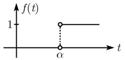</td></tr><tr><td> $\frac{1 - e^{-\alpha s}}{s}$ </td><td> $\left\{ \begin{array}{ll}1, & 0 < t < \alpha \\ 0, & \alpha < t \end{array} \right.$ </td><td>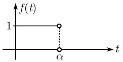</td></tr><tr><td> $\frac{e^{-\alpha s} - e^{-\beta s}}{s}$ </td><td> $\left\{ \begin{array}{ll}0, & 0 < t < \alpha \\ 1, & \alpha < t < \beta \\ 0, & \beta < t \end{array} \right.$ </td><td>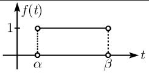</td></tr><tr><td> $\frac{(1 - e^{-\alpha s})^2}{s}$ </td><td> $\left\{ \begin{array}{ll}1, & 0 < t < \alpha \\ -1, & \alpha < t < 2\alpha \\ 0, & 2\alpha < t \end{array} \right.$ </td><td>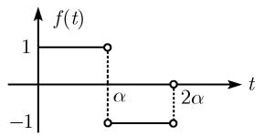</td></tr></table>

续表

$$
\frac {(\mathrm{e} ^ {- \alpha s} - \mathrm{e} ^ {- \beta s}) ^ {2}}{s} \left\{ \begin{array}{l l} 0, & 0 <   t <   2 \alpha \\ 1, & 2 \alpha <   t <   \alpha + \beta \\ - 1, & \alpha + \beta <   t <   2 \beta \\ 0, & 2 \beta <   t \end{array} \right.
$$

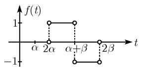

$$
\frac {(1 - \mathrm{e} ^ {- \alpha s}) ^ {2}}{s ^ {2}} \qquad \left\{ \begin{array}{l l} t, & 0 <   t <   \alpha \\ 2 \alpha - t, & \alpha <   t <   2 \alpha \\ 0, & 2 \alpha <   t \end{array} \right.
$$

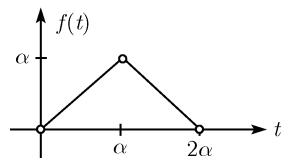

$$
\frac {(\mathrm{e} ^ {- \alpha s} - \mathrm{e} ^ {- \beta s}) ^ {2}}{s ^ {2}} \left\{ \begin{array}{l l} 0, & 0 <   t <   2 \alpha \\ t - 2 \alpha , & 2 \alpha <   t <   \alpha + \beta \\ 2 \beta - t, & \alpha + \beta <   t <   2 \beta \\ 0, & 2 \beta <   t \end{array} \right.
$$

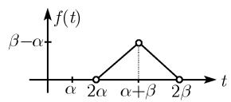

$$
\frac {\beta \mathrm{e} ^ {- \alpha s}}{s (s + \beta)} \qquad \qquad \left\{ \begin{array}{l l} 0, & 0 <   t <   \alpha \\ 1 - \mathrm{e} ^ {- \beta (t - \alpha)}, & \alpha <   t \end{array} \right.
$$

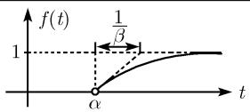

$$
\frac {\mathrm{e} ^ {- \alpha s}}{s + \beta} \qquad \qquad \left\{ \begin{array}{l l} 0, & 0 <   t <   \alpha \\ \mathrm{e} ^ {- \beta (t - \alpha)}, & \alpha <   t \end{array} \right.
$$

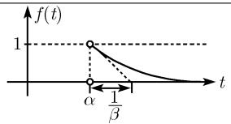

$$
\frac {1 - \mathrm{e} ^ {- \alpha s}}{s ^ {2}} \qquad \left\{ \begin{array}{l l} t, & 0 <   t <   \alpha \\ \alpha , & \alpha <   t \end{array} \right.
$$

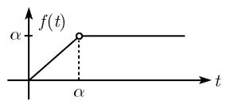

$$
\frac {\mathrm{e} ^ {- \alpha s} - \mathrm{e} ^ {- \beta s}}{s ^ {2}} \quad \left\{ \begin{array}{l l} 0, & 0 <   t <   \alpha \\ t - \alpha , & \alpha <   t <   \beta \\ \beta - \alpha , & \beta <   t \end{array} \right.
$$

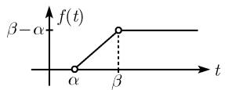

$$
\frac {s}{s (1 + \mathrm{e} ^ {- \alpha s})} \qquad \left\{ \begin{array}{l l} 1, & 2 n \alpha <   t <   (2 n + 1) \alpha \\ 0, & (2 n + 1) \alpha <   t <   (2 n + 2) \alpha \\ n = 0, 1, 2, \dots \end{array} \right.
$$

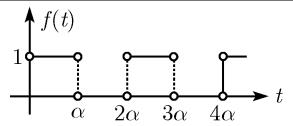

续表

<table><tr><td> $\mathcal{L}\{f(t)\}$ </td><td> $f(t)$ </td><td></td></tr><tr><td> $\frac{1}{s(1 + e^{\alpha s})}$ </td><td> $\left\{\begin{array}{ll}0, & 2n\alpha < t < (2n+1)\alpha \\1, & (2n+1)\alpha < t < (2n+2)\alpha\\n=0,1,2,\cdots\end{array}\right.$ </td><td>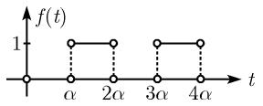</td></tr><tr><td> $\frac{1 - e^{-\alpha s}}{s(1 + e^{-\alpha s})}$ </td><td> $\left\{\begin{array}{ll}1, & 2n\alpha < t < (2n+1)\alpha \\-1, & (2n+1)\alpha < t < (2n+2)\alpha\\n=0,1,2,\cdots\end{array}\right.$ </td><td>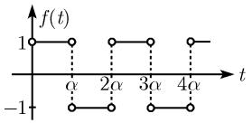</td></tr><tr><td> $\frac{e^{-\alpha s} - 1}{s(1 + e^{-\alpha s})}$ </td><td> $\left\{\begin{array}{ll} -1, & 2n\alpha < t < (2n+1)\alpha \\1, & (2n+1)\alpha < t < (2n+2)\alpha\\n=0,1,2,\cdots\end{array}\right.$ </td><td>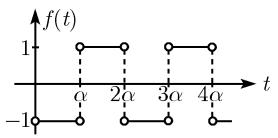</td></tr><tr><td> $\frac{1 - e^{-\alpha s}}{s(1 + e^{\alpha s})}$ </td><td> $\left\{\begin{array}{ll}0, & 0 < t < \alpha \\1, & (2n+1)\alpha < t < (2n+2)\alpha \\-1, & (2n+2)\alpha < t < (2n+3)\alpha\\n=0,1,2,\cdots\end{array}\right.$ </td><td>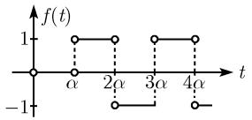</td></tr><tr><td> $\frac{1 - e^{-\alpha s}}{s(e^{\alpha s} + e^{-\alpha s})}$ </td><td> $\left\{\begin{array}{ll}0, & 2n\alpha < t < (2n+1)\alpha \\1, & (4n+1)\alpha < t < (4n+2)\alpha \\-1, & (4n+3)\alpha < t < (4n+4)\alpha\\n=0,1,2,\cdots\end{array}\right.$ </td><td>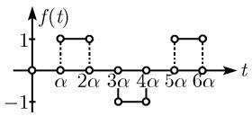</td></tr><tr><td> $\frac{1 - e^{-\frac{\alpha}{\nu}s}}{s(1 - e^{-\alpha s})}$ </td><td> $\left\{\begin{array}{ll}1, & n\alpha < t < \left(n+\frac{1}{\nu}\right)\alpha \\0, & \left(n+\frac{1}{\nu}\right)\alpha < t < (n+1)\alpha\\ \nu >1; & n=0,1,2,\cdots\end{array}\right.$ </td><td>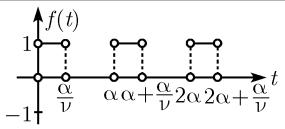</td></tr><tr><td> $\frac{1 - e^{-\alpha s}}{s^{2}(1 + e^{-\alpha s})}$ </td><td> $\left\{\begin{array}{ll} \frac{t}{\alpha} - 2n, & 2n\alpha < t < (2n+1)\alpha \\-\frac{t}{\alpha} + 2(n+1), & (2n+1)\alpha < t < (2n+2)\alpha \\n=0,1,2,\cdots\end{array}\right.$ </td><td>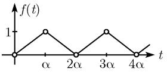</td></tr><tr><td> $\frac{(1 - e^{-\alpha s})^{2}}{\alpha s^{2}(1 - e^{-4\alpha s})}$ </td><td> $\left\{\begin{array}{ll} \frac{t}{\alpha} - 4n, & 4n\alpha < t < (4n+1)\alpha \\-\frac{t}{\alpha} + 4n+2, & (4n+1)\alpha < t < (4n+2)\alpha \\0, & (4n+2)\alpha < t < (4n+4)\alpha \\n=0,1,2,\cdots\end{array}\right.$ </td><td>[IMAGE]</td></tr></table>

续表

$$
\begin{array}{c} \frac {t}{\alpha} - n, \quad n \alpha <   t <   (n + 1) \alpha \\ n = 0, 1, 2, \dots \end{array}
$$

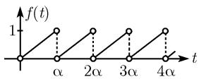

$$
\frac {1 - (1 + \alpha s) \mathrm{e} ^ {- \alpha s}}{\alpha s ^ {2} (1 - \mathrm{e} ^ {- 2 \alpha s})}
$$

$$
\left\{ \begin{array}{l} \frac {t}{\alpha} - 2 n, \\ \qquad \qquad \qquad 2 n \alpha <   t <   (2 n + 1) \alpha \\ 0, \alpha <   t \\ \qquad \qquad \qquad (2 n + 1) <   (2 n + 2) \alpha \end{array} \right.
$$

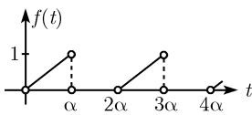

$$
\frac {2 - \alpha s - (2 + \alpha s) \mathrm{e} ^ {- \alpha s}}{\alpha s ^ {2} (1 - \mathrm{e} ^ {- \alpha s})}
$$

$$
\begin{array}{c} \frac {2 t}{\alpha} - (2 n + 1), \quad n \alpha <   t <   (n + 1) \\ n = 0, 1, 2, \dots \end{array}
$$

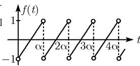

$$
\frac {2 (1 - \mathrm{e} ^ {- \alpha s})}{\alpha s ^ {2} (1 + \mathrm{e} ^ {- \alpha s})} - \frac {1}{s}
$$

$$
\left\{ \begin{array}{l} \frac {2 t}{\alpha} - (4 n + 1), \\ \qquad \qquad \qquad 2 n \alpha <   t <   (2 n + 1) \alpha \\ - \frac {2 t}{\alpha} + 4 n + 3, \\ \qquad \qquad \qquad (2 n + 1) \alpha <   t <   (2 n + 2) \alpha \\ n = 0, 1, 2, \dots \end{array} \right.
$$

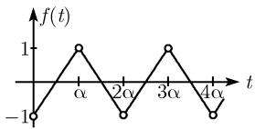

$$
\begin{array}{l} \hline \frac {\nu (\nu - 1) + \nu \mathrm{e} ^ {- \alpha s} - \nu^ {2} \mathrm{e} ^ {- \frac {\alpha s}{\nu}}}{(\nu - 1) \alpha s ^ {2} (1 - \mathrm{e} ^ {- \alpha s})} \left\{ \begin{array}{l} \frac {\nu t}{\alpha} - n, \\ n \alpha <   t <   \left(n + \frac {1}{\nu}\right) \alpha \\ - \frac {\nu}{\alpha (\nu - 1)} t + \frac {\nu (n + 1)}{\nu - 1}, \\ \left(n + \frac {1}{\nu}\right) \alpha <   t <   (n + 1) \alpha \\ \nu > 1; \quad n = 0, 1, 2, \dots \end{array} \right. \\ \hline \end{array}
$$

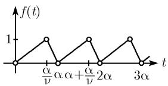

$$
\left\{ \begin{array}{l} \frac {\nu}{\alpha} t - \nu n, \\ \qquad \qquad \qquad n \alpha <   t <   \left(n + \frac {1}{\nu}\right) \alpha \\ 0, \quad \left(n + \frac {1}{\nu}\right) \alpha <   t \\ \qquad \qquad \qquad <   (n + 1) \alpha \\ \nu > 1; \quad n = 0, 1, 2, \dots \end{array} \right.
$$

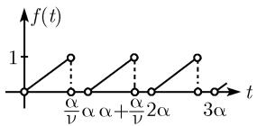

0.10.3 Z 变换

<table><tr><td> $f_n$ </td><td> $\mathcal{L}\{f_n\} = F(z)$ </td></tr><tr><td>1</td><td> $\frac{z}{z-1}$ </td></tr><tr><td> $(-1)^n$ </td><td> $\frac{z}{z+1}$ </td></tr><tr><td>n</td><td> $\frac{z}{(z-1)^2}$ </td></tr><tr><td> $n^2$ </td><td> $\frac{z(z+1)}{(z-1)^3}$ </td></tr><tr><td> $n^k$ </td><td> $\frac{N_k(z)}{(z-1)^{k+1}}^{1)}$ </td></tr><tr><td> $(-1)^n n^k$ </td><td> $\frac{(-1)^{k+1} N_k(-z)}{(z+1)^{k+1}}$ </td></tr><tr><td> $\binom{n}{m}; \quad n \geqslant m-1$ </td><td> $\frac{z}{(z-1)^{m+1}}$ </td></tr><tr><td> $(-1)^n \binom{n}{m}; \quad n \geqslant m-1$ </td><td> $\frac{(-1)^m z}{(z+1)^{m+1}}$ </td></tr><tr><td> $\binom{n+k}{m}; \quad k \leqslant m$ </td><td> $\frac{z^{k+1}}{(z+1)^{m+1}}$ </td></tr><tr><td> $a^n$ </td><td> $\frac{z}{z-a}$ </td></tr><tr><td> $a^{n-1}; \quad n \geqslant 1$ </td><td> $\frac{1}{z-a}$ </td></tr><tr><td> $(-1)^n a^n$ </td><td> $\frac{z}{z+a}$ </td></tr><tr><td> $1-a^n$ </td><td> $\frac{z(1-a)}{(z-1)(z-a)}$ </td></tr><tr><td> $na^n$ </td><td> $\frac{za}{(z-a)^2}$ </td></tr><tr><td> $n^ka^n$ </td><td> $\frac{a^{k+1} N_k\left(\frac{z}{a}\right)}{(z-a)^{k+1}}$ </td></tr><tr><td> $\binom{n}{m} a^n; \quad n \geqslant m-1$ </td><td> $\frac{a^m z}{(z-a)^{m+1}}$ </td></tr><tr><td> $\frac{1}{n}; \quad n \geqslant 1$ </td><td> $\ln \frac{z}{z-1}$ </td></tr></table>

1) 多项式 $N_{k}(z)$ 如下递归计算得出:

$$
N _ {1} (z) = z; N _ {R + 1} (z) = (k + 1) z N _ {k} (z) - (z ^ {2} - z) \frac {\mathrm{d}}{\mathrm{d} z} N _ {k} (z).
$$

续表

<table><tr><td> $f_n$ </td><td> $\mathcal{L}\{f_n\} = F(z)$ </td></tr><tr><td> $\frac{(-1)^{n-1}}{n}; \quad n \geqslant 1$ </td><td> $\ln\left(1+\frac{1}{z}\right)$ </td></tr><tr><td> $\frac{a^{n-1}}{n}; \quad n \geqslant 1$ </td><td> $\frac{1}{a} \ln \frac{z}{z-a}$ </td></tr><tr><td> $\frac{a^n}{n!}$ </td><td> $\exp\left(\frac{a}{z}\right)$ </td></tr><tr><td> $\frac{n+1}{n!} a^n$ </td><td> $\left(1+\frac{a}{z}\right) \exp\left(\frac{a}{z}\right)$ </td></tr><tr><td> $\frac{(-1)^n}{(2n+1)!}$ </td><td> $\sqrt{z} \sin \frac{1}{\sqrt{z}}$ </td></tr><tr><td> $\frac{(-1)^n}{(2n)!}$ </td><td> $\cos \frac{1}{\sqrt{z}}$ </td></tr><tr><td> $\frac{1}{(2n+1)!}$ </td><td> $\sqrt{z} \sinh \frac{1}{\sqrt{z}}$ </td></tr><tr><td> $\frac{1}{(2n)!}$ </td><td> $\cosh \frac{1}{\sqrt{z}}$ </td></tr><tr><td> $\frac{a^n}{(2n+1)!}$ </td><td> $\sqrt{\frac{z}{a}} \sinh \sqrt{\frac{a}{z}}$ </td></tr><tr><td> $\frac{a^n}{(2n)!}$ </td><td> $\cosh \sqrt{\frac{a}{z}}$ </td></tr><tr><td> $e^{\alpha n}$ </td><td> $\frac{z}{z-e^\alpha}$ </td></tr><tr><td> $\sinh \alpha n$ </td><td> $\frac{z \sinh \alpha}{z^2 - 2z \cosh \alpha + 1}$ </td></tr><tr><td> $\cosh \alpha n$ </td><td> $\frac{z(z - \cosh \alpha)}{z^2 - 2z \cosh \alpha + 1}$ </td></tr><tr><td> $\sinh (\alpha n + \varphi)$ </td><td> $\frac{z(z \sinh \varphi + \sinh (\alpha - \varphi))}{z^2 - 2z \cosh \alpha + 1}$ </td></tr><tr><td> $\cosh (\alpha n + \varphi)$ </td><td> $\frac{z(z \cosh \varphi - \cosh (\alpha - \varphi))}{z^2 - 2z \cosh \alpha + 1}$ </td></tr><tr><td> $a^n \sinh \alpha n$ </td><td> $\frac{z \sinh \alpha}{z^2 - 2za \cosh \alpha + a^2}$ </td></tr><tr><td> $a^n \cosh \alpha n$ </td><td> $\frac{z(z - a \cosh \alpha)}{z^2 - 2za \cosh \alpha + a^2}$ </td></tr><tr><td> $nsinh \alpha n$ </td><td> $\frac{z(z^2 - 1)\sinh \alpha}{(z^2 - 2z \cosh \alpha + 1)^2}$ </td></tr><tr><td> $f_n$ </td><td> $\mathcal{Z}\{f_n\} = F(z)$ </td></tr><tr><td> $n \cosh \alpha n$ </td><td> $\frac{z((z^2 + 1)\cosh \alpha - 2z)}{(z^2 - 2z\cosh \alpha + 1)^2}$ </td></tr><tr><td> $\sin \beta n$ </td><td> $\frac{z\sin \beta}{z^2 - 2z\cos \beta + 1}$ </td></tr><tr><td> $\cos \beta n$ </td><td> $\frac{z(z - \cos \beta)}{z^2 - 2z\cos \beta + 1}$ </td></tr><tr><td> $\sin(\beta n + \varphi)$ </td><td> $\frac{z(z\sin \varphi + \sin(\beta - \varphi))}{z^2 - 2z\cos \beta + 1}$ </td></tr><tr><td> $\cos(\beta n + \varphi)$ </td><td> $\frac{z(z\cos \varphi - \cos(\beta - \varphi))}{z^2 - 2z\cos \beta + 1}$ </td></tr><tr><td> $e^{\alpha n}\sin \beta n$ </td><td> $\frac{ze^\alpha\sin \beta}{z^2 - 2ze^\alpha\cos \beta + e^{2\alpha}}$ </td></tr><tr><td> $e^{\alpha n}\cos \beta n$ </td><td> $\frac{z(z - e^\alpha\cos \beta)}{z^2 - 2ze^\alpha\cos \beta + e^{2\alpha}}$ </td></tr><tr><td> $(-1)^n e^{\alpha n}\sin \beta n$ </td><td> $\frac{-ze^\alpha\sin \beta}{z^2 + 2e^\alpha\cos \beta + e^{2\alpha}}$ </td></tr><tr><td> $(-1)^n e^{\alpha n}\cos \beta n$ </td><td> $\frac{z(z + e^\alpha\cos \beta)}{z^2 + 2e^\alpha\cos \beta + e^2\alpha}$ </td></tr><tr><td> $n\sin \beta n$ </td><td> $\frac{z(z^2 - 1)\sin \beta}{(z^2 - 2z\cos \beta + 1)^2}$ </td></tr><tr><td> $n\cos \beta n$ </td><td> $\frac{z((z^2 + 1)\cos \beta - 2z)}{(z^2 - 2z\cos \beta + 1)^2}$ </td></tr><tr><td> $\frac{\cos \beta n}{n}; n \geqslant 1$ </td><td> $\ln\left(\frac{z}{\sqrt{z^2 - 2z\cos \beta + 1}}\right)$ </td></tr><tr><td> $\frac{\sin \beta n}{n}; n \geqslant 1$ </td><td> $\arctan\left(\frac{\sin \beta}{z - \cos \beta}\right)$ </td></tr><tr><td> $(-1)^{n-1}\frac{\cos \beta n}{n}; n \geqslant 1$ </td><td> $\ln\left(\frac{\sqrt{z^2 + 2z\cos \beta + 1}}{z}\right)$ </td></tr><tr><td> $(-1)^{n-1}\frac{\sin \beta n}{n}; n \geqslant 1$ </td><td> $\arctan\left(\frac{\sin \beta}{z + \cos \beta}\right)$ </td></tr><tr><td> $\frac{\cos \beta n}{n!}$ </td><td> $\cos\frac{\sin \beta}{z}\exp\left(\frac{\cos \beta}{z}\right)$ </td></tr><tr><td> $f_n$ </td><td> $\mathcal{L}\{f_n\} = F(z)$ </td></tr><tr><td> $\frac{\sin \beta n}{n!}$ </td><td> $\sin \frac{\sin \beta}{z} \exp \left( \frac{\cos \beta}{z} \right)$ </td></tr></table>

注：表左边的不等式 $n \geqslant \nu$ 表示在构造的 $Z$ 变换中, 和式是从 $\nu$ 开始的, 如 $\mathcal{L}\{a^{n-1}\} = \sum_{n=1}^{\infty} a^{n-1} z^{-n}$ .
