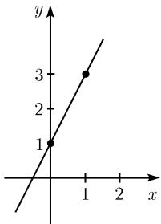
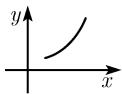
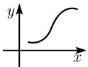
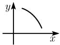
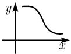
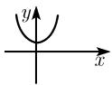
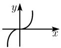
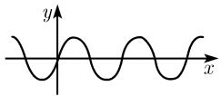
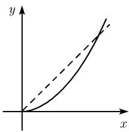
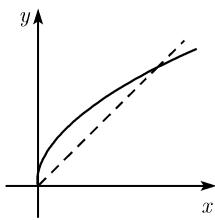

#### 0.2 初等函数及其图示

基本思想 实值函数 $^{2)}$

$$
\boxed {y = f (x)}
$$

对每个实数 $x$ 都指定唯一一个实数 $y$ . 我们必须要知道, 函数 $f$ 表示一个指定或分配, 而 $f(x)$ 表示函数在实数 $x$ 处的取值.

(i) 在其上定义该指定或分配的所有 x 的集合称为函数 f 的定义域 $D(f)$ .

(ii) 对所有 $x \in D(f)^{1)}$ ，象点 y 的集合称为函数 f 的值域 $R(f)$ .

(iii) 所有点对 $(x, f(x))$ 的集合, 称为函数 f 的图像 $G(f)$ .
可以用数表或图示来定义函数.
例：对函数 $y = 2x + 1$ ，数表是

<table><tr><td>x</td><td>0</td><td>1</td><td>2</td><td>3</td><td>4</td></tr><tr><td>y</td><td>1</td><td>3</td><td>5</td><td>7</td><td>9</td></tr></table>

$y = 2x + 1$ 的图示 (图 0.22), 即 $f$ 的图像, 是点 $(x, y)$ 的集合, 也就是过点 $(0, 1)$ 和 $(1, 3)$ 的直线.

图0.22

增函数和减函数 函数 f 称为 (严格) 增函数, 若

$$
\boxed {x <   u \Rightarrow f (x) <   f (u).}\tag{0.27}
$$

若把 (0.27) 中的符号“ $f(x) < f(u)$ ”依次用

$$
f (x) \leqslant f (u), \quad f (x) > f (u), \quad f (x) \geqslant f (u)
$$

代替, 则函数 f 分别称为非减函数、减函数和非增函数(参看表 0.14).

表 0.14 函数的性质

<table><tr><td>增函数</td><td>非减函数</td><td>减函数</td><td>非增函数</td></tr><tr><td></td><td></td><td></td><td></td></tr><tr><td>偶函数</td><td>奇函数</td><td colspan="2">周期函数</td></tr><tr><td></td><td></td><td colspan="2"></td></tr></table>

反函数的基本思想 考虑函数

$$
\boxed {y = x ^ {2}, x \geqslant 0.}\tag{0.28}
$$

对任意 $y \geqslant 0$ ，方程 (0.28) 恰好有一个解 $x \geqslant 0$ ，它可以用 $\sqrt{y}$ 表示：

1) 符号 $x \in D(f)$ 表示 x 是集合 $D(f)$ 中的元素.

$$
\boxed {x = \sqrt {y}.}
$$

在形式上互换 x 和 y, 我们得到平方根函数

$$
\boxed {y = \sqrt {x}.}\tag{0.29}
$$

把原函数 (0.28) 的图像沿对角线反射就得到反函数 (0.29) 的图像 (图 0.23). 对任意连续的增函数, 都可以这样作出它们的反函数 (参看 1.4.4). 正如我们在随后几节看到的, 按这种方法能够得到许多重要的函数 (如 $y = \ln x$ , $y = \arcsin x$ , $y = \arccos x$ 等).

  
(a) $y = x^{2}$

  
图0.23 幂函数  
(b) $y=\sqrt{x}$

具有 Mathematica 的函数图示 软件包 Mathematica 中包含一系列固定的重要数学函数, 它们可以通过数表或图示表示出来.

##### 本节包含的小节

- [0.2.1 函数的变换](<0.2.1 函数的变换.md>)
- [0.2.2 线性函数](<0.2.2 线性函数.md>)
- [0.2.3 二次函数](<0.2.3 二次函数.md>)
- [0.2.4 幂函数](<0.2.4 幂函数.md>)
- [0.2.5 欧拉 e 函数](<0.2.5 欧拉 e 函数.md>)
- [0.2.6 对数](<0.2.6 对数.md>)
- [0.2.7 一般指数函数](<0.2.7 一般指数函数.md>)
- [0.2.8 正弦与余弦](<0.2.8 正弦与余弦.md>)
- [0.2.9 正切与余切](<0.2.9 正切与余切.md>)
- [0.2.10 双曲函数 $\sinh x$ 和 $\cosh x$](<0.2.10 双曲函数 $ sinh x$ 和 $ cosh x$.md>)
- [0.2.11 双曲函数 $\tanh x$ 和 $\coth x$](<0.2.11 双曲函数 $ tanh x$ 和 $ coth x$.md>)
- [0.2.12 反三角函数](<0.2.12 反三角函数.md>)
- [0.2.13 反双曲函数](<0.2.13 反双曲函数.md>)
- [0.2.14 多项式](<0.2.14 多项式.md>)
- [0.2.15 有理函数](<0.2.15 有理函数.md>)
