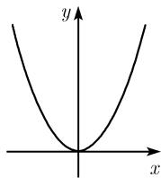
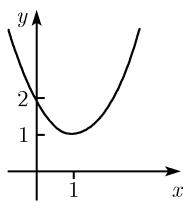
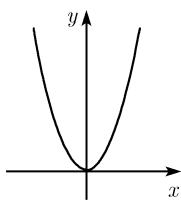
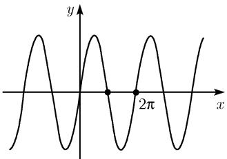
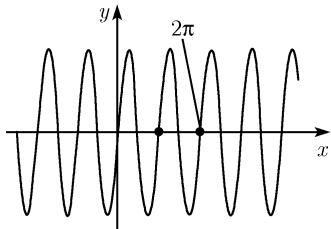
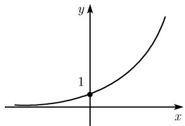
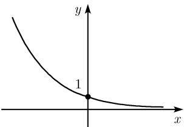

##### 0.2.1 函数的变换

实际上, 我们只需知道某些函数的标准形式就够了. 由这些标准形式, 通过平移、伸缩和镜射, 能够得到其他有趣的函数图示.

平移 函数

$$
\boxed {y = f (x - a) + b}
$$

的图像可以通过把 $y = f(x)$ 图像上的每个点 $(x, y)$ 平移到点 $(x + a, y + b)$ 得到.
例 1: $y = (x - 1)^{2} + 1$ 的图像可通过平移 $y = x^{2}$ 的图像得到, 其中点 $(0, 0)$ 平移到了点 $(1, 1)$ (图 0.24).

  
(a) $y = x^{2}$

  
(c) $y=(x-1)^{2}+1$

  
图 0.24 图像的平移与伸缩  
(b) $y=2x^{2}$

沿 x 轴伸缩 对于固定的 a > 0, b > 0, 函数

$$
\boxed {y = b f \left(\frac {x}{a}\right)}
$$

的图像可由 $y = f(x)$ 的图像沿 x 轴拉伸 a 倍, 沿 y 轴拉伸 b 倍得到.

例 2: 把 $y = x^{2}$ 的图像沿 y 轴拉伸 2 倍, 就得到 $y = 2x^{2}$ 的图像 (图 0.24).

例 3: 把 $y = \sin x$ 的图像沿 x 缩短 1/2, 就得到 $y = \sin 2x$ 的图像 (图 0.25).

  
(a) $y=\sin x$

  
图 0.25 正弦曲线波  
(b) $y=\sin2x$

镜射

$$
\boxed {y = f (- x)} \text {和} \boxed {y = - f (x)}
$$

的图像可由 $y = f(x)$ 的图像分别经 y 轴和 x 轴镜射得到.

例 4: $y = e^{-x}$ 的图像由 $y = e^{x}$ 的图像经 y 轴镜射得到 (图 0.26).

  
(a) $y=e^{x}$

  
(b) $y=e^{-x}$  
图 0.26 指数函数

偶函数和奇函数 对所有 $x \in D(f)$ , 函数 $y = f(x)$ 称为偶函数(奇函数), 若

$$
f (- x) = f (x) \quad (f (- x) = - f (x))
$$

(表 0.14).

偶函数的图像关于 y 轴对称; 奇函数的图像关于原点对称.

例 5: 函数 $y = x^{2}$ 是偶函数, 而 $y = x^{3}$ 是奇函数.

周期函数 函数 $f$ 的周期为 $p$ , 若

$$
\boxed {f (x + p) = f (x), \quad x \in \mathbb {R},}
$$

即若对所有实数 $x$ , 该关系成立, 则函数 $f$ 的周期为 $p$ . 当沿 $x$ 轴平移 $p$ 个单位时, 周期函数的图像不变.

例 6: 函数 $y = \sin x$ 的周期为 $2\pi$ (图 0.25).
