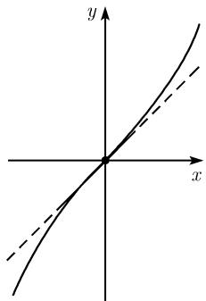
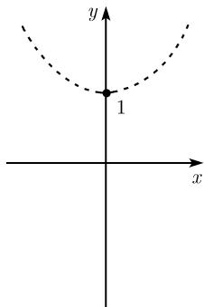

##### 0.2.10 双曲函数 $\sinh x$ 和 $\cosh x$

双曲正弦和双曲余弦 对所有复数 x, 定义函数

$$
\boxed {\sinh x := \frac {\mathrm{e} ^ {x} - \mathrm{e} ^ {- x}}{2}, \quad \cosh x := \frac {\mathrm{e} ^ {x} + \mathrm{e} ^ {- x}}{2}.}
$$

函数 “sinh” 读作 “sinch”，“cosh” 读作 “cosh”。对实变量 x，其图像如图 0.34 所示。

  
(a) $y=\sinh x$

  
(b) $y=\cosh x$  
图0.34 双曲函数

与三角函数之间的关系 对所有复数 $x$ ，有

$$
\boxed {\sinh \mathrm{i} x = \mathrm{i} \sin x, \quad \cosh \mathrm{i} x = \cos x.}
$$

因此, 关于双曲正弦和双曲余弦的每个公式都能由正弦和余弦函数得到. 例如, 由对任意复数 $x$ , 有 $\cos^2\mathrm{i}x + \sin^2\mathrm{i}x = 1$ , 能得到下面公式:

$$
\boxed {\cosh^ {2} x - \sinh^ {2} x = 1.}
$$

双曲函数这个术语来自于函数 $x = a\cosh t,y = b\sinh t,t\in \mathbb{R}$ 是双曲线的参数方程(参看0.1.7.4).

对所有复数 x 和 y, 下面公式均成立.

偶性与奇性

$$
\sinh (- x) = - \sinh x, \quad \cosh (- x) = \cosh x.
$$

复数域中的周期性:

$$
\sinh (x + 2 \pi \mathrm{i}) = \sinh x, \quad \cosh (x + 2 \pi \mathrm{i}) = \cosh x.
$$

幂级数

$$
\boxed {\sinh x = x + \frac {x ^ {3}}{3 !} + \frac {x ^ {5}}{5 !} + \frac {x ^ {7}}{7 !} + \dots , \quad \cosh x = 1 + \frac {x ^ {2}}{2 !} + \frac {x ^ {4}}{4 !} + \frac {x ^ {6}}{6 !} + \dots .}
$$

导数

$$
\left| \frac {\mathrm{d} \sinh x}{\mathrm{d} x} = \cosh x, \quad \frac {\mathrm{d} \cosh x}{\mathrm{d} x} = \sinh x. \right.
$$

加法定理

$$
\begin{array}{l} \sinh (x \pm y) = \sinh x \cosh y \pm \cosh x \sinh y, \\ \cosh (x \pm y) = \cosh x \cosh y \pm \sinh x \sinh y. \end{array}
$$

倍角公式

$\sinh 2x = 2 \sinh x \cosh x, \cosh 2x = \sinh^{2} x + \cosh^{2} x.$

半角

$$
\sinh {\frac {x}{2}} = \left\{ \begin{array}{l l} \sqrt {\frac {1}{2} (\cosh x - 1)}, & x \geqslant 0, \\ - \sqrt {\frac {1}{2} (\cosh x - 1)}, & x <   0, \end{array} \right.
$$

棣莫弗公式

$$
\cosh {\frac {x}{2}} = \sqrt {\frac {1}{2} (\cosh x + 1)}, \qquad x \in \mathbb {R}.
$$

$$
(\cosh x \pm \sinh x) ^ {n} = \cosh n x \pm \sinh n x, \quad n = 1, 2, \dots .
$$

和

$$
\sinh x \pm \sinh y = 2 \sinh {\frac {1}{2}} (x \pm y) \cosh {\frac {1}{2}} (x \mp y),
$$

$$
\cosh x + \cosh y = 2 \cosh {\frac {1}{2}} (x + y) \cosh {\frac {1}{2}} (x - y),
$$

$$
\cosh x - \cosh y = 2 \sinh {\frac {1}{2}} (x + y) \sinh {\frac {1}{2}} (x - y).
$$
