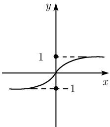

##### 0.2.11 双曲函数 $\tanh x$ 和 $\coth x$

双曲正切和双曲余切 对所有复数 $x \neq \left(k\pi + \frac{\pi}{2}\right)\mathrm{i}, k \in \mathbb{Z}$ , 定义函数

$$
\boxed {\tanh x := \frac {\sinh x}{\cosh x}.}
$$

对所有复数 $x \neq k\pi i, k \in Z$ ，定义函数

$$
\boxed {\coth x := \frac {\cosh x}{\sinh x}.}
$$

对实变量 x, 图 0.35 给出了这两个函数的图像. 对于所有使函数没有极点的复变量 x 和 y, 下面公式都成立 $^{1)}$ .

  
(a) $y=\tanh x$

  
(b) $y=\coth x$  
图0.35 双曲函数

与三角函数的关系 (参见表 0.20)

$$
\tanh x = - \mathrm{i} \tan \mathrm{i} x, \quad \coth x = \mathrm{i} \cot \mathrm{i} x.
$$

导数

$$
\boxed {\frac {\mathrm{d} \tanh x}{\mathrm{d} x} = \frac {1}{\cosh^ {2} x}, \quad \frac {\mathrm{d} \coth x}{\mathrm{d} x} = - \frac {1}{\sinh^ {2} x}.}
$$

加法定理

$$
\tanh (x \pm y) = \frac {\tanh x \pm \tanh y}{1 \pm \tanh x \tanh y}, \quad \coth (x \pm y) = \frac {1 \pm \coth x \coth y}{\coth x \pm \coth y}.
$$

倍角公式

$$
\tanh 2 x = \frac {2 \tanh x}{1 + \tanh ^ {2} x}, \quad \coth 2 x = \frac {1 + \coth^ {2} x}{2 \coth x}.
$$

1) 以前文献中也使用下面的函数 (双曲正割和双曲余割):

$$
\operatorname{cosech} x {,} := \frac {1}{\sinh x} \quad (\text {双曲余割}),
$$

$$
\operatorname{sech} x {,} := \frac {1}{\cosh x} \quad (\text {双曲正割}).
$$

表 0.20 双曲函数与三角函数的零点与极点 (所有零点和极点都是单的)

<table><tr><td>函数</td><td>周期</td><td>零点 (k ∈ Z)</td><td>极点 (k ∈ Z)</td><td>奇偶性</td></tr><tr><td>sinh x</td><td>2πi</td><td>πki</td><td>—</td><td>奇</td></tr><tr><td>cosh x</td><td>2πi</td><td>(πk + π/2)i</td><td>—</td><td>偶</td></tr><tr><td>tanh x</td><td>πi</td><td>πki</td><td>(πk + π/2)i</td><td>奇</td></tr><tr><td>coth x</td><td>πi</td><td>(πk + π/2)i</td><td>πki</td><td>奇</td></tr><tr><td>sin x</td><td>2π</td><td>πk</td><td>—</td><td>奇</td></tr><tr><td>cos x</td><td>2π</td><td>πk + π/2</td><td>—</td><td>偶</td></tr><tr><td>tan x</td><td>π</td><td>πk</td><td>πk + π/2</td><td>奇</td></tr><tr><td>cot x</td><td>π</td><td>πk + π/2</td><td>πk</td><td>奇</td></tr></table>

半角公式

$$
\tanh \frac {x}{2} = \frac {\cosh x - 1}{\sinh x} = \frac {\sinh x}{\cosh x + 1},
$$

$$
\coth {\frac {x}{2}} = \frac {\sinh x}{\cosh x - 1} = \frac {\cosh x + 1}{\sinh x}.
$$

和

$$
\tanh x \pm \tanh y = \frac {\sinh (x \pm y)}{\cosh x \cosh y}.
$$

平方

<table><tr><td> $\sinh^2 x$ </td><td>—</td><td> $\cosh^2 x - 1$ </td><td> $\frac{\tanh^2 x}{1 - \tanh^2 x}$ </td><td> $\frac{1}{\coth^2 x - 1}$ </td></tr><tr><td> $\cosh^2 x$ </td><td> $\sinh^2 x + 1$ </td><td>—</td><td> $\frac{1}{1 - \tanh^2 x}$ </td><td> $\frac{\coth^2 x}{\coth^2 x - 1}$ </td></tr><tr><td> $\tanh^2 x$ </td><td> $\frac{\sinh^2 x}{\sinh^2 x + 1}$ </td><td> $\frac{\cosh^2 x - 1}{\cosh^2 x}$ </td><td>—</td><td> $\frac{1}{\coth^2 x}$ </td></tr><tr><td> $\coth^2 x$ </td><td> $\frac{\sinh^2 x + 1}{\sinh^2 x}$ </td><td> $\frac{\cosh^2 x}{\cosh^2 x - 1}$ </td><td> $\frac{1}{\tanh^2 x}$ </td><td>—</td></tr></table>

幂级数展开 参看 0.7.2.
