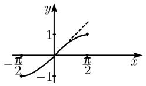
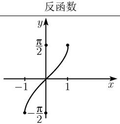
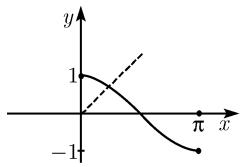
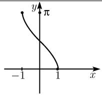
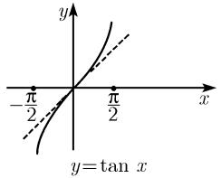
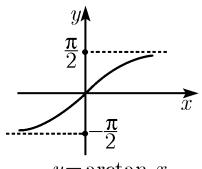
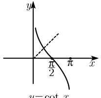
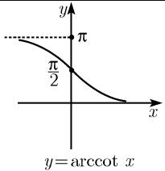

##### 0.2.12 反三角函数

反正弦函数 对任意实数 $y, -1 \leqslant y \leqslant 1$ , 方程

$$
y = \sin x, - \frac {\pi}{2} \leqslant x \leqslant \frac {\pi}{2}
$$

有且仅有一个解, 记为 $x = \arcsin y$ . 从形式上互换 x 和 y, 得到

$$
y = \arcsin x, - 1 \leqslant x \leqslant 1.
$$

该函数的图像可通过函数 $y = \sin x$ 的图像沿对角线反射得到 ${}^{1)}$ (参看表 0.21).

表 0.21 反三角函数图像

<table><tr><td colspan="2">原函数</td></tr><tr><td></td><td></td></tr><tr><td>y=sin x</td><td>y=arcsin x</td></tr><tr><td></td><td></td></tr><tr><td>y=cos x</td><td>y=arccos x</td></tr><tr><td></td><td></td></tr><tr><td></td><td>y=arctan x</td></tr><tr><td></td><td></td></tr><tr><td>y=cos x</td><td></td></tr></table>

表 0.22 反三角函数公式

<table><tr><td>方程</td><td>y 的边界</td><td>解 x(k ∈ Z)</td></tr><tr><td>y = sin x</td><td>-1 ≤ y ≤ 1</td><td>x = arcsin y + 2kπ, x = π - arcsin y + 2πk</td></tr><tr><td>y = cos x</td><td>-1 ≤ y ≤ 1</td><td>x = ± arccos y + 2kπ</td></tr><tr><td>y = tan x</td><td>-∞ &lt; y &lt; ∞</td><td>x = arctan y + kπ</td></tr><tr><td>y = cot x</td><td>-∞ &lt; y &lt; ∞</td><td>x = arccot y + kπ</td></tr></table>

1) 以前文献中也使用函数 $y = \arcsin x$ 的主枝和旁枝, 然而这样可能会导致对 (多值) 公式的误解. 为此, 本书只使用一对一的反函数, 它对应于以前文献中的主枝 (参看表 0.21 和表 0.22). 记号 $y = \arcsin x$ 的意思是说: $y$ 表示角的大小 (弧度), 其正弦值为 $x$ (拉丁文为: arcus cuius sinus est $x$ ). 我们并不说 $\arcsin x$ , $\arccos x$ , $\arctan x$ , $\operatorname{arccot} x$ , 而是说 ( $x$ 的) 反正弦函数、反余弦函数、反正切函数和反余切函数.

变换公式 对所有实数 x, -1 < x < 1, 有

$$
\arcsin x = - \arcsin (- x) = \frac {\pi}{2} - \arccos x = \arctan \frac {x}{\sqrt {1 - x ^ {2}}}.
$$

对所有实数 $x$ ，有

$$
\arctan x = - \arctan (- x) = \frac {\pi}{2} - \operatorname{arccot} x = \arcsin \frac {x}{\sqrt {1 + x ^ {2}}}.
$$

导数 对所有实数 x, -1 < x < 1, 有

$$
\boxed \frac {\mathrm{d} \arcsin x}{\mathrm{d} x} = \frac {1}{\sqrt {1 - x ^ {2}}}, \quad \frac {\mathrm{d} \arccos x}{\mathrm{d} x} = - \frac {1}{\sqrt {1 - x ^ {2}}}.
$$

对所有实数 $x$ ，有

$$
\boxed {\frac {\mathrm{d} \arctan x}{\mathrm{d} x} = \frac {1}{1 + x ^ {2}}, \quad \frac {\mathrm{d} \operatorname{arccot} x}{\mathrm{d} x} = - \frac {1}{1 + x ^ {2}}.}
$$

幂级数 参看 0.7.2.
