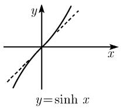
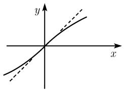
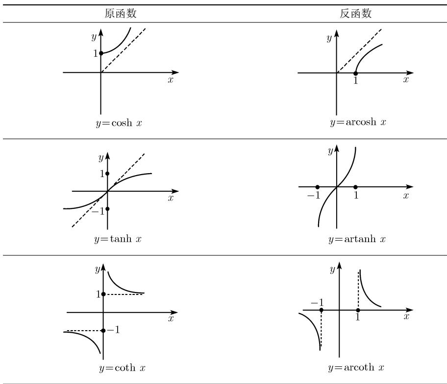

##### 0.2.13 反双曲函数

反双曲正弦函数 对任意实数 y, 方程

$$
y = \sinh x, - \infty <   x <   + \infty
$$

有且仅有一个解, 记为 $x = \operatorname{arsinh} y$ . 从形式上互换 $x$ 和 $y$ , 得到

$$
y = \operatorname{arsinh} x, - \infty <   x <   + \infty .
$$

该函数的图像能通过函数 $y = \sinh x$ 的图像沿对角线反射得到 ${}^{1)}$ (参看表 0.23).

表 0.23 反双曲函数图像

<table><tr><td>原函数</td><td>反函数</td></tr><tr><td></td><td> $y = \operatorname{arsinh} x$ </td></tr></table>

1) 反双曲函数的拉丁文名称是 $(x$ 的) area sinus hyperbolicus(反双曲正弦函数)、area cosinus hyperbolicus(反双曲余弦函数)、area tangens hyperbdicus(反双曲正切函数) 和 area cotangens hyperbelicus(反双曲余切函数). 这里所使用的记号源于这些函数给出了双曲函数的变量值.

续表

导数

$$
\frac {\mathrm{d} \operatorname{arsinh} x}{\mathrm{d} x} = \frac {1}{\sqrt {1 + x ^ {2}}}, - \infty <   x <   \infty ,
$$

$$
{\frac {\operatorname{d} \operatorname{arcosh} x}{\operatorname{d} x}} = {\frac {1}{\sqrt {1 - x ^ {2}}}}, \quad x > 1,
$$

$$
\frac {\mathrm{d} \operatorname{artanh} x}{\mathrm{d} x} = \frac {1}{1 - x ^ {2}}, \quad | x | > 1,
$$

$$
{\frac {\operatorname{darcoth} x}{\operatorname{d} x}} = {\frac {1}{1 - x ^ {2}}}, \quad | x | <   1.
$$

幂级数 参看 0.7.2.

表 0.24 反双曲函数公式

<table><tr><td>方程</td><td>y的取值范围</td><td>解x</td></tr><tr><td>y=sinh x</td><td>-∞&lt;y&lt;∞</td><td>x=arsinh y=ln(y+√y2+1)</td></tr><tr><td>y=cosh x</td><td>y≥1</td><td>x=±arcosh y=±ln(y+√y2-1)</td></tr><tr><td>y=tanh x</td><td>-1&lt;x=artanh y=1/2ln(1+y/1-y)</td><td>x=artanh y=1/2ln(1+y/1-y)</td></tr><tr><td>y=coth x</td><td>y&gt;1,y&lt;-1</td><td>x=arcoth y=1/2ln(y+1/y-1)</td></tr></table>

变换公式

$$
\operatorname{arsinh} x = (\operatorname{sgn} x) \operatorname{arcosh} \sqrt {1 + x ^ {2}} = \operatorname{artanh} \frac {x}{\sqrt {1 + x ^ {2}}}, - \infty <   x <   \infty ,
$$

$$
\operatorname{arcosh} x = \operatorname{arsinh} \sqrt {x ^ {2} - 1}, \quad x \geqslant 1,
$$

$$
\operatorname{arcoth} x = \operatorname{artanh} \frac {1}{x}, - 1 <   x <   1.
$$
