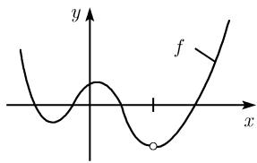
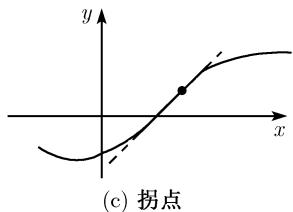

##### 0.2.14 多项式

n次(实)多项式是如下形式的函数:

$$
\boxed {y = a _ {n} x ^ {n} + a _ {n - 1} x ^ {n - 1} + \dots + a _ {1} x + a _ {0},}\tag{0.43}
$$

其中, n 为任意非负整数 $0,1,2,\cdots$ , 所有系数 $a_{k}$ 均为实数, 且 $a_{n} \neq 0$ .

光滑性 对任意一点 $x \in \mathbb{R}$ , (0.43) 中的函数 $y = f(x)$ 连续且无限可微, 其一阶导数是

$$
f ^ {\prime} (x) = n a _ {n} x ^ {n - 1} + (n - 1) a _ {n - 1} x ^ {n - 2} + \dots + a _ {1}.
$$

在无穷远点的性状 当 $x \to \pm \infty$ 时, (0.43) 中的函数 $y = f(x)$ 的性状与函数 $y = ax^n$ 的相同. 也就是说, 当 $n \geqslant 1$ 时, 有 1)

$$
\lim _ {x \to + \infty} f (x) = \left\{ \begin{array}{l l} + \infty , & a _ {n} > 0, \\ - \infty , & a _ {n} <   0, \end{array} \right.
$$

$\lim_{x\to -\infty}f(x) = \left\{ \begin{array}{ll} + \infty , & a_n > 0\text{且} n\text{为偶数},\text{或} a_n <   0\text{且} n\text{为奇数},\\ -\infty , & a_n > 0\text{且} n\text{为奇数},\text{或} a_n <   0\text{且} n\text{为偶数}. \end{array} \right.$

零点 若 $n$ 为奇数, 则 $y = f(x)$ 的图像与 $x$ 轴至少有一个交点 (图0.36(a)). 交点对应方程 $f(x) = 0$ 的解.

全局极小值 若 $n$ 为偶数且 $a_{n} > 0$ , 则 $y = f(x)$ 存在全局极小值, 即存在一点 $a$ , 满足对所有 $x \in \mathbb{R}$ , 有 $f(a) \leqslant f(x)$ (图 0.36(b)).

若 n 为偶数且 $a_{n} < 0$ ，则 $y = f(x)$ 存在一个全局极大值.

  
(b) 全局极小值

(a) 零点与局部极值  
  
图 0.36 多项式的局部性质

局部极值 令 $n \geqslant 2$ , 则函数 $y = f(x)$ 至多有 $n - 1$ 个局部极值, 其中局部极小值和局部极大值交替出现.

拐点 令 $n \geqslant 3$ , 则 $y = f(x)$ 的图像至多有 $n - 2$ 个拐点 (图 0.36(c)).
