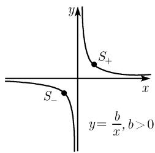
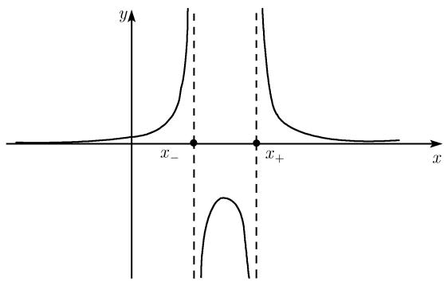

##### 0.2.15 有理函数

0.2.15.1 特殊有理函数

令 b > 0 是一个固定的实数. 函数

$$
\boxed {y = \frac {b}{x}, \quad x \in \mathbb {R},   x \neq 0}
$$

表示以 x 轴和 y 轴为渐近线的等轴双曲线, 其顶点为 $S_{\pm} = (\pm \sqrt{b}, \pm \sqrt{b})$ (图 0.37).
在无穷远点的性状 $\lim_{x\to\pm\infty}\frac{b}{x}=0.$ 在点 x=0 的极点 $\lim_{x\to\pm0}\frac{b}{x}=\pm\infty.$

0.2.15.2 具有线性分子和分母的有理函数

令 a, b, c, d 是已知的实数, 且 $c \neq 0$ , $\Delta := ad - bc \neq 0$ , 则函数

$$
\boxed {y = \frac {a x + b}{c x + d}, \quad x \in \mathbb {R} \text {且} x \neq - \frac {d}{c}}\tag{0.44}
$$

通过坐标变换 $x = u - \frac{d}{c}, y = w + \frac{a}{c}$ 可以化简成

$$
w = - \frac {\varDelta}{c ^ {2} u}.
$$

因此, 一般方程 (0.44) 经过简单的坐标变换之后就得到了标准形式 $y = -\frac{\Delta}{c^2x}$ , 该坐标变换把点 (0,0) 变成点 $P\left(-\frac{d}{c}, \frac{a}{c}\right)$ (图 0.38).

  
图0.37

  
(a) $\Delta < 0$  
图0.38

  
(b) $\Delta > 0$

0.2.15.3 具有 $n$ 次分母的特殊有理函数

已知 b > 0, $n = 1, 2, \cdots$ ，则函数

$$
\boxed {y = \frac {b}{x ^ {n}}, x \in \mathbb {R} \text {且} x \neq 0}
$$

如图 0.39 所示.

(a) $y = \frac{b}{x^n}$ , $n$ 为偶数

(b) $y = \frac{b}{x^n}, n$ 为奇数

图0.39

0.2.15.4 具有二次分母的有理函数

特例 1 已知 d > 0, 则函数

$$
\boxed {y = \frac {1}{x ^ {2} + d ^ {2}}, \quad x \in \mathbb {R}}
$$

和

$$
\boxed {y = \frac {x}{x ^ {2} + d ^ {2}}, \quad x \in \mathbb {R},}
$$

如图 0.40 所示.

(b) $y = \frac{x}{x^{2} + d^{2}}$  
(a) $y=\frac{1}{x^{2}+d^{2}}$  

  
图0.40

特例 2 已知两个实数 $x_{\pm}$ ，其中 $x_{-}<x_{+}$ ，则由

$$
\boxed {y = \frac {1}{(x - x _ {+}) (x - x _ {-})}}\tag{0.45}
$$

给出的函数 $y = f(x)$ 可以变成

$$
y = \frac {1}{x _ {+} - x _ {-}} \left(\frac {1}{x - x _ {+}} - \frac {1}{x - x _ {-}}\right).
$$

这是所谓的部分分式分解的一个特例 (参看 2.1.7). 我们有

$$
\begin{array}{c} \lim _ {x \to x _ {+} \pm 0} f (x) = \pm \infty , \quad \lim _ {x \to x _ {-} \pm 0} f (x) = \mp \infty , \\ \lim _ {x \to \pm \infty} f (x) = 0. \end{array}
$$

因此函数的极点在点 $x_{+}$ 和 $x_{-}$ (图 0.41).

  
图0.41

特例3 尽管函数

$$
\boxed {y = \frac {x - 1}{x ^ {2} - 1}}\tag{0.46}
$$

在 $x = 1$ 处没有定义, 但是我们利用分解 $x^{2} - 1 = (x - 1)(x + 1)$ , 就有

$$
y = \frac {1}{x + 1}, \quad x \in \mathbb {R}, x \neq - 1.
$$

我们说函数 (0.46) 在点 $x = 1$ 处有一个表观奇点.

一般情况 已知实数 $a, b, c, d$ , 其中 $a^2 + b^2 \neq 0$ . 由

$$
\boxed {y = \frac {a x + b}{x ^ {2} + 2 c x + d}}\tag{0.47}
$$

所定义的函数 $y = f(x)$ 的趋向取决于判别式 $D := c^{2} - d$ 的符号. 另外, 我们有

$$
\boxed {\lim _ {x \to \pm \infty} f (x) = 0.}
$$

下面就 D 的符号逐一进行分析:

情形 1: D > 0. 有

$$
x ^ {2} + 2 c x + d = (x - x _ {+}) (x - x _ {-}),
$$

其中 $x_{\pm} = -c \pm \sqrt{D}$ . 这就得到了部分分式分解

$$
f (x) = \frac {A}{x - x _ {+}} + \frac {B}{x - x _ {-}}.
$$

常数 A 和 B 可通过计算如下极限求得:

$$
A = \lim _ {x \to x _ {+}} (x - x _ {+}) f (x) = \frac {a x _ {+} + b}{x _ {+} - x _ {-}}, \quad B = \lim _ {x \to x _ {-}} (x - x _ {-}) f (x) = \frac {a x _ {-} + b}{x _ {-} - x _ {+}}.
$$

这些函数的极点在 $x_{\pm}$ .

情形 2: D = 0. 在这种情况下有 $x_{+} = x_{-}$ ，因此有

$$
f (x) = \frac {a x + b}{(x - x _ {+}) ^ {2}}.
$$

这就得到

$$
\lim _ {x \to x _ {+} \pm 0} f (x) = \left\{ \begin{array}{l l} + \infty , & a x _ {+} + b > 0, \\ - \infty , & a x _ {+} + b <   0, \end{array} \right.
$$

即点 $x_{+}$ 是极点.

情形 3: D < 0. 此时对所有 $x \in R$ , 有 $x^{2} + 2cx + d > 0$ . 因此对任意点 $x \in R$ , (0.47) 中的函数 $y = f(x)$ 都连续且无穷可微, 即 f 光滑.

0.2.15.5 一般有理函数

(实)有理函数是形如

$$
\boxed {y = \frac {a _ {n} x ^ {n} + \cdots + a _ {1} x + a _ {0}}{b _ {m} x ^ {m} + \cdots + b _ {1} x + b _ {0}}}
$$

的函数 $y = f(x)$ ，其中分子和分母上都是多项式 (参看 0.2.14).

在无穷远点的性状 令 $c := a_{n} / b_{m}$ , 有

$$
\boxed {\lim _ {x \to \pm \infty} f (x) = \lim _ {x \to \pm \infty} c x ^ {n - m}.}
$$

由此, 我们讨论所有可能情况.

情形 1: c > 0.

$$
\begin{array}{r} {{ \lim _ {x \to + \infty} f (x) = \left\{ \begin{array}{l l} {{c,}} & {{n = m,}} \\ {{+ \infty ,}} & {{n > m,}} \\ {{0,}} & {{n <   m,}} \end{array} \right.}} \\ {{ \lim _ {x \to - \infty} f (x) = \left\{ \begin{array}{l l} {{c,}} & {{n = m,}} \\ {{+ \infty ,}} & {{n > m \text {且} n - m \text {为偶数},}} \\ {{- \infty ,}} & {{n > m \text {且} n - m \text {为奇数},}} \\ {{0,}} & {{n <   m.}} \end{array} \right.}} \end{array}
$$

情形 2: c < 0. 此时我们必须用 $\mp\infty$ 代替 $\pm\infty$ .

部分分式分解 由部分分式分解能够得到有理函数的清晰结构 (参看 2.1.7).
