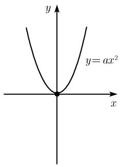
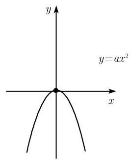
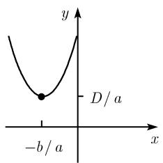
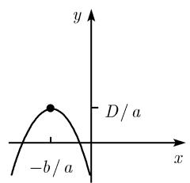
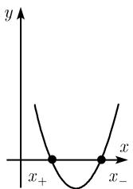
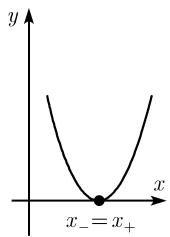
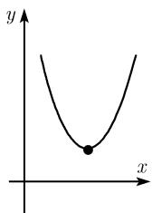

##### 0.2.3 二次函数

最简单的二次函数

$$
\boxed {y = a x ^ {2}}\tag{0.30}
$$

$(a \neq 0)$ 的图像是一条抛物线 (图 0.27). 由二次配方, 可以把一般二次函数

$$
\boxed {y = a x ^ {2} + 2 b x + c}
$$

(0.31)

(a) $a > 0$  
  
(c) a > 0

(b) a < 0  
  
图0.27  
(d) a < 0

写成

$$
y = a \left(x + \frac {b}{a}\right) ^ {2} - \frac {D}{a},\tag{0.32}
$$

其中判别式 $D := b^{2} - ac$ . 因此 (0.31) 的图像可以通过把 (0.30) 的图像的顶点 (0,0) 平移到 $\left(-\frac{b}{a}, -\frac{D}{a}\right)$ 得到.

二次方程 方程

$$
\boxed {a x ^ {2} + 2 b x + c = 0}
$$

(系数 a, b, c 为实数, a > 0) 的解为

$$
\boxed {x _ {\pm} = \frac {- b \pm \sqrt {D}}{a} = \frac {- b \pm \sqrt {b ^ {2} - a c}}{a}.}
$$

情形 1: D > 0. 存在两个不同的实零点 $x_{+}$ 和 $x_{-}$ ，它们分别对应抛物线 (0.31) 与 x 轴的两个不同交点 (图 0.28(a)).

情形 2: D = 0. 存在一个实零点 $x_{+} = x_{-}$ ，抛物线 (0.31) 与 x 轴相切 (图 0.28(b)).

  
(a) D > 0

  
(b) D=0

  
(b) D < 0  
图0.28

情形 3: D < 0 存在两个复零点

$$
x _ {\pm} = \frac {- b \pm \mathrm{i} \sqrt {- D}}{a} = \frac {- b \pm \mathrm{i} \sqrt {a c - b ^ {2}}}{a},
$$

其中 i 是虚数单位, 满足 $i^{2} = -1$ (参看 1.1.2). 在这种情况下, (实) 抛物线 (0.31) 与 x 轴不相交 (图 0.28(c)).

例 1: 方程 $x^{2}-6x+8=0$ 有两个零点

$$
x _ {\pm} = 3 \pm \sqrt {3 ^ {2} - 8} = 3 \pm 1,
$$

即 $x_{+}=4, x_{-}=2.$

例 2: 方程 $x^{2}-2x+1=0$ 的零点为

$$
x _ {\pm} = 1 \pm \sqrt {1 - 1} = 1.
$$

例 3: 方程 $x^{2} + 2x + 2 = 0$ 的零点为

$$
x _ {\pm} = - 1 \pm \sqrt {1 - 2} = - 1 \pm \mathrm{i}.
$$
