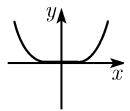
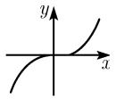
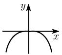
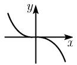

##### 0.2.4 幂函数

令 $n=2,3,\cdots$ ，函数

$$
\boxed {y = a x ^ {n}.}
$$

当 n 为偶数时, 它与 $y = ax^{2}$ 的图像类似, 当 n 为奇数时, 它与 $y = ax^{3}$ 的图像类似 (表 0.15).

表 0.15 幂函数 $y = ax^n$

<table><tr><td>n≥2</td><td>偶</td><td>奇</td></tr><tr><td>a&gt;0</td><td></td><td></td></tr><tr><td>a&lt;0</td><td></td><td></td></tr></table>
