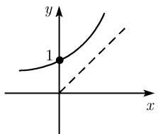
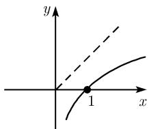

##### 0.2.5 欧拉 e 函数

连接实数域中两个点的最短路径是通过复数域.

J. 阿达马 (1865—1963)

为了深入理解数学各个组成部分之间的关系, 考虑复变量 x 的函数 $e^{x}$ , $\sin x$ 以及 $\cos x$ 非常重要.

1.1.2 中详细讨论了形如 $x = a + b\mathrm{i}$ 的复数, 其中 $a, b$ 为实数. 只需注意虚数单位 i 满足

$$
\boxed {\mathrm{i} ^ {2} = - 1.}
$$

每个实数同时也是一个复数.

定义 对所有复数 x, 下面无穷级数 $^{1)}$ 收敛:

$$
\boxed {\mathrm{e} ^ {x} := 1 + x + \frac {x ^ {2}}{2 !} + \frac {x ^ {3}}{3 !} + \dots = \sum_ {k = 0} ^ {\infty} \frac {x ^ {k}}{k !}.}\tag{0.33}
$$

这样, 对所有的复变量 $x$ , 就定义了指数函数 $y = \mathrm{e}^{x}$ , 事实证明, 它是所有数学学科中最重要的函数. 关于实变量 $x$ , 牛顿早在 1676 年自己 34 岁时就引入了这个函数 (图 0.29(a)).

加法定理 对所有复数 x 和 z, 有基本公式

$$
\boxed {\mathrm{e} ^ {x + z} = \mathrm{e} ^ {x} \mathrm{e} ^ {z}.}
$$

  
(a) $y=e^{x}$

  
(b) $y=\ln x$  
图0.29

继牛顿的工作约 75 年之后, 欧拉作出了惊人的发现: 他认识到 (复变量的) e 函数与三角函数密切相关 (参看 0.2.8 中的欧拉公式 (0.35)). 因此, 称指数函数 $y = \mathrm{e}^{x}$ 为欧拉 e 函数. 当 $x = 1$ 时, 有

$$
\mathrm{e} := 1 + 1 + \frac {1}{2 !} + \frac {1}{3 !} + \dots .
$$

此外, 对所有实数 x, 欧拉极限公式成立 $^{1)}$ :

$$
\boxed {\mathrm{e} ^ {x} = \lim _ {x \to \infty} \left(1 + \frac {x}{n}\right) ^ {n}.}
$$

我们有 $\mathrm{e} = 2.71828183.$

递增性质 对所有实变量, 函数 $y = e^{x}$ 严格递增且连续.

在无穷远点的性状 $^{2)}$

$$
\boxed {\lim _ {x \to + \infty} \mathrm{e} ^ {x} = + \infty , \quad \lim _ {x \to - \infty} \mathrm{e} ^ {x} = 0.}
$$

对绝对值很大的负的变量, $y = e^{x}$ 的图像渐近趋向 x 轴 (图 0.29(a)). 极限关系

$$
\boxed {\lim _ {x \to + \infty} \frac {\mathrm{e} ^ {x}}{x ^ {n}} = + \infty , \quad n = 1, 2, \dots}
$$

表明随着变量的增大, 指数函数的增长速度远远大于任何幂函数.

计算机算法的复杂性 如果计算机算法依赖于自然数 $N$ (例如 $N$ 是方程的数目), 而且计算时间的图像形如 $\mathrm{e}^N$ , 那么随着 $N$ 的增加, 计算时间将会激增, 导致该算法无计可施. 此项研究是在现代复杂性理论的背景下进行的. 特别地, 计算机代数中使用的许多算法都具有高度复杂性.

导数 对所有实数或复数 x, 函数 $y = e^{x}$ 一般无穷可微, 其导数 $^{3)}$ 为

$$
\boxed {\frac {\mathrm{de} ^ {x}}{\mathrm{dx}} = \mathrm{e} ^ {x}.}
$$

复数域中的周期性 欧拉 e 函数有复周期 $2\pi i$ ，即对所有复数 x，有

$$
\boxed {\mathrm{e} ^ {x + 2 \pi \mathrm{i}} = \mathrm{e} ^ {x}.}
$$

如果我们限制在实变量 x 上, 就看不到这种周期性 (参看图 0.29(a)).

e 函数的非零性 对所有复数 x, 都有 $e^{x} \neq 0.^{1)}$
