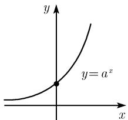
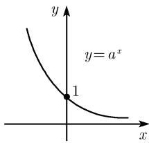

##### 0.2.7 一般指数函数

定义 对每个正实数 $a$ 和实数 $x$ , 令

$$
\boxed {a ^ {x} := \mathrm{e} ^ {x \ln a}.}
$$

由此, 一般指数函数能够化简成 e 函数 (图 0.30).

(a) a > 1  
(b) 0 < a < 1  

  
图 0.30 一般指数函数

幂法则 参看 0.1.9.

一般对数 令 a 是一个固定的正实数, 且 $a \neq 1$ , 则对每个正实数 y, 方程

$$
y = a ^ {x}
$$

有唯一实数解 $x$ , 记为 $x = \log_a y$ . 在形式上互换 $x$ 和 $y$ , 就得到 $y = a^x$ 的反函数:

$$
y = \log_ {a} x.
$$

由此, 如下关系成立:

$$
\boxed {\log_ {a} y = \frac {\ln y}{\ln a}}
$$

(参看 0.1.9). 当 a > 1 时, 有 $\ln a > 0$ ; 当 0 < a < 1, 有 $\ln a < 0$ .

两个重要的函数方程 令 a > 0.

(i) 连续函数 $^{1)}f:\mathbb{R}\to\mathbb{R}$ 若满足

$$
\boxed {f (x + y) = f (x) f (y), \quad x, y \in \mathbb {R}}
$$

和 $f(1)=a$ ，则它是唯一的，即为指数函数 $f(x)=a^{x}$ .

(ii) 连续函数 $g: ]0, \infty[ \to \mathbb{R}$ 若满足

$$
\boxed {g (x y) = g (x) + g (y), \quad x, y \in ] 0, \infty [}
$$

且 $g(a)=1$ ，则它是唯一的，即为对数函数 $g(x)=\log_{a}x$ .

这两个命题说明了指数函数和对数函数都是非常自然的、有用的函数, 因此以前的数学家迟早会遇到它们.
