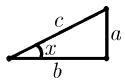
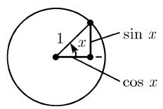
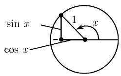
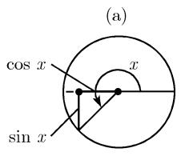
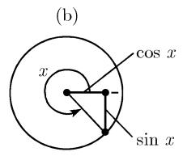
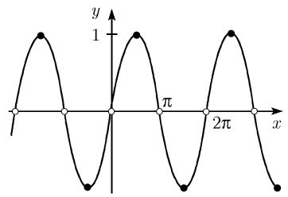
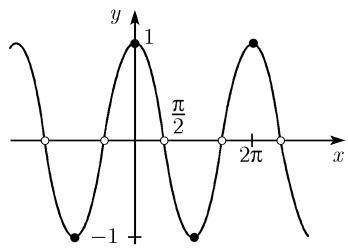
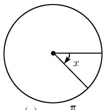
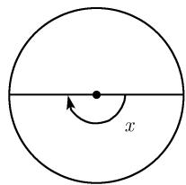

##### 0.2.8 正弦与余弦

分析的定义 从现代观念来看, 利用无穷级数展开, 很容易定义函数 $y = \sin x$ 和 $y = \cos x$ .

$$
\boxed { \begin{array}{c} \sin x = x - \frac {x ^ {3}}{3 !} + \frac {x ^ {5}}{5 !} - \dots = \sum_ {k = 0} ^ {\infty} (- 1) ^ {k} \frac {x ^ {2 k + 1}}{(2 k + 1) !}, \\ \cos x = 1 - \frac {x ^ {2}}{2 !} + \frac {x ^ {4}}{4 !} - \dots = \sum_ {k = 0} ^ {\infty} (- 1) ^ {k} \frac {x ^ {2 k}}{(2 k) !}. \end{array} }\tag{0.34}
$$

对所有复数 x, 这两个级数都收敛 $^{1)}$ .

欧拉公式 (1749) 对所有复数 $x$ , 下面的基本公式成立:

$$
\boxed {\mathrm{e} ^ {\pm \mathrm{i} x} = \cos x \pm \mathrm{i} \sin x.}\tag{0.35}
$$

这个公式支配着三角函数的整个理论. 由 $\mathrm{e}^{\mathrm{i}x}, \cos x, \sin x$ 的幂级数展开 (0.33) 和 (0.34), 马上就能得到关系 (0.35), 注意, 这时 $\mathrm{i}^2 = -1$ . 我们可以在振动理论中找到它的重要应用. 由 (0.35), 有

$$
\boxed {\sin x = \frac {\mathrm{e} ^ {\mathrm{i} x} - \mathrm{e} ^ {- \mathrm{i} x}}{2 \mathrm{i}}, \quad \cos x = \frac {\mathrm{e} ^ {\mathrm{i} x} + \mathrm{e} ^ {- \mathrm{i} x}}{2}.}\tag{0.36}
$$

由这个公式和加法定理 $e^{u+v}=e^{u}e^{v}$ ，很容易得到下面关于正弦和余弦的重要加法定理.

加法定理 对所有复数 $x$ 和 $y$ , 有

$$
\boxed { \begin{array}{c} \sin (x \pm y) = \sin x \cos y \pm \cos x \sin y, \\ \cos (x \pm y) = \cos x \cos y \mp \sin x \sin y. \end{array} }\tag{0.37}
$$

偶性与奇性 对所有复数 x, 有

$$
\boxed {\sin (- x) = - \sin x, \quad \cos (- x) = \cos x.}
$$

在直角三角形上的几何解释 考虑一个直角三角形, 其中角 $x$ 的单位为弧度 (参看 0.1.2), 那么 $\sin x$ 和 $\cos x$ 能表示成边的比, 如表 0.16 所示.

符号“ $\sin x$ ”读作“ $x$ 的正弦”，符号“ $\cos x$ ”读作“ $x$ 的余弦”。拉丁语 $sinus$ 表示凸出。以前文献中也使用函数

$$
\text {正割}: \sec x := {\frac {1}{\cos x}}, \quad \text {余割}: \csc x := {\frac {1}{\sin x}}.
$$

表 0.16 根据直角三角形对三角函数的解释

<table><tr><td>直角三角形</td><td>正弦</td><td>余弦</td></tr><tr><td></td><td> $\sin x = \frac{a}{c}$ </td><td> $\cos x = \frac{b}{c}$ </td></tr><tr><td> $0 < x < \frac{\pi}{2}$ </td><td>(对边  $a$  与斜边  $c$  的比)</td><td>(邻边  $b$  与斜边  $c$  的比)</td></tr></table>

在单位圆上的几何解释 利用单位圆, 量 $\sin x$ 和 $\cos x$ 就变成了图 $0.31(a) \sim (d)$ 中所示的线段长. 由此我们立即可知当旋转 $2\pi$ 时, $\sin x$ 和 $\cos x$ 的取值不变. 这是对这两个函数的周期为 $2\pi$ 的几何解释:

$$
\boxed {\sin (x + 2 \pi) = \sin x, \quad \cos (x + 2 \pi) = \cos x.}\tag{0.38}
$$

对所有复变量 $x$ , 这些关系都成立. 重新看一下单位圆, 对 $0 \leqslant x \leqslant \pi / 2$ , 我们会发现如下对称性:

(0.39)

  
(e) $y=\sin x$

  
图 0.31 三角函数与单位圆  
(f) $y = \cos x$

事实上, 对所有复数 $x$ , 这些关系都成立. 最后, 由图 0.31(a) 和毕达哥拉斯定理, 有

$$
\boxed {\cos^ {2} x + \sin^ {2} x = 1.}\tag{0.40}
$$

该关系不仅对实变量 $x$ 成立, 对所有复变量 $x$ 也成立. 同样地, 我们由毕达哥拉斯定理可以得出表0.17表示的 $\sin x$ 与 $\cos x$ 的值(参看3.2.1.2).

由加法定理 (0.37), $\sin 0 = \sin 2\pi = 0$ 和 $\cos 0 = \cos 2\pi = 1$ , 很容易得到 (0.38), (0.39) 和 (0.40) 对所有复数都成立.

表 0.17 一些重要角的正弦与余弦函数的精确值

<table><tr><td rowspan="2">x</td><td>0</td><td> $\frac{\pi}{6}$ </td><td> $\frac{\pi}{4}$ </td><td> $\frac{\pi}{3}$ </td><td> $\frac{\pi}{2}$ </td><td> $\frac{2\pi}{3}$ </td><td> $\frac{3\pi}{4}$ </td><td> $\frac{5\pi}{6}$ </td><td> $\pi$ </td><td>(弧度)</td></tr><tr><td>0</td><td> $30^{\circ}$ </td><td> $45^{\circ}$ </td><td> $60^{\circ}$ </td><td> $90^{\circ}$ </td><td> $120^{\circ}$ </td><td> $135^{\circ}$ </td><td> $150^{\circ}$ </td><td> $180^{\circ}$ </td><td>(角度)</td></tr><tr><td>sin x</td><td>0</td><td> $\frac{1}{2}$ </td><td> $\frac{\sqrt{2}}{2}$ </td><td> $\frac{\sqrt{3}}{2}$ </td><td>1</td><td> $\frac{\sqrt{3}}{2}$ </td><td> $\frac{\sqrt{2}}{2}$ </td><td> $\frac{1}{2}$ </td><td>0</td><td></td></tr><tr><td>cos x</td><td>1</td><td> $\frac{\sqrt{3}}{2}$ </td><td> $\frac{\sqrt{2}}{2}$ </td><td> $\frac{1}{2}$ </td><td>0</td><td> $-\frac{1}{2}$ </td><td> $-\frac{\sqrt{2}}{2}$ </td><td> $-\frac{\sqrt{3}}{2}$ </td><td>-1</td><td></td></tr></table>

负角 利用在单位圆上的几何解释, 我们得到函数 $y = \sin x$ 和 $y = \cos x$ 的图像如图 0.31(e) 和 (f). 根据正角是逆时针方向 (数学上的正方向), 负角是顺时针方向(数学上的负方向), 图 0.32 引入了负角 $x < 0$ .

  
(a) $x = -\frac{\pi}{4}$

  
(b) $x = -\pi$  
图0.32 负角

零点 由图 0.31(e) 和 (f), 有

(i) 函数 $y = \sin x$ 的零点为 $x = k\pi$ ，其中 k 为任意整数，换句话说，零点集合由 $x = 0, \pm\pi, \pm2\pi, \cdots$ 给出.

(ii) 函数 $y = \cos x$ 的零点为 $x = k\pi + \frac{\pi}{2}$ ，其中 $k$ 为任意整数.

(iii) 函数 $y = \sin x$ 和 $y = \cos x$ 在复平面上都仅有实零点。它们已由 (i) 和 (ii) 给出.

平移法则 我们只要对 $0 \leqslant x \leqslant \pi / 2$ 知道所有角 $x$ 的正弦值, 就可以按下面公式得到所有其他值, 这反过来又是加法定理的推论:

$$
\boxed { \begin{array}{c} \sin \left(\frac {\pi}{2} + x\right) = \cos x, \quad \sin (\pi + x) = - \sin x, \quad \sin \left(\frac {3 \pi}{2} + x\right) = - \cos x, \\ \cos \left(\frac {\pi}{2} + x\right) = - \sin x, \quad \cos (\pi + x) = - \cos x, \quad \cos \left(\frac {3 \pi}{2} + x\right) = \sin x. \end{array} }
$$

倍角的棣莫弗公式 $^{1)}$ 令 $n=2,3,\cdots$ ，则对所有复数 x，有

$$
\boxed {\cos n x + \mathrm{i} \sin n x =  \sum_ {k = 0} ^ {n} \mathrm{i} ^ {k} \binom{n}{k} \cos^ {n - k} x \sin^ {k} x.}\tag{0.41}
$$

把这些复数的实部和虚部分离开来, 有

$$
\begin{array}{l} \cos n x = \cos^ {n} x - \binom {n} {2} \cos^ {n - 2} x \sin^ {2} x + \binom {n} {4} \cos^ {n - 4} x \sin^ {4} x - \dots , \\ \sin n x = \binom {n} {1} \cos^ {n - 1} x \sin x - \binom {n} {3} \cos^ {n - 3} x \sin^ {3} x + \binom {n} {5} \cos^ {n - 5} x \sin^ {5} x - \dots . \end{array} \tag {0.42}
$$

特别地, 当 n = 2, 3, 4 时, 有

$\sin 2x = 2\sin x\cos x,$ $\cos 2x = \cos^2 x - \sin^2 x,$ $\sin 3x = 3\sin x - 4\sin^3 x,$ $\cos 3x = 4\cos^3 x - 3\cos x,$ $\sin 4x = 8\cos^3 x\sin x - 4\cos x\sin x,$ $\cos 4x = 8\cos^4 x - 8\cos^2 x + 1.$

半角公式 对所有复数 x, 有

$$
\sin^ {2} {\frac {x}{2}} = \frac {1}{2} (1 - \cos x), \quad \cos^ {2} {\frac {x}{2}} = \frac {1}{2} (1 + \cos x),
$$

$$
\sin {\frac {x}{2}} = \left\{ \begin{array}{l l} \sqrt {\frac {1}{2} (1 - \cos x)}, & 0 \leqslant x \leqslant \pi , \\ - \sqrt {\frac {1}{2} (1 - \cos x)}, & \pi \leqslant x \leqslant 2 \pi , \end{array} \right.
$$

$$
\cos \frac {x}{2} = \left\{ \begin{array}{l l} \sqrt {\frac {1}{2} (1 + \cos x)}, & - \pi \leqslant x \leqslant \pi , \\ - \sqrt {\frac {1}{2} (1 + \cos x)}, & \pi \leqslant x \leqslant 3 \pi . \end{array} \right.
$$

求和公式 对所有复数 $x, y$ , 有

1) A. 棣莫弗 (de Moivre, 1667—1754) 得到的这个公式, 受此启发, 欧拉发现著名公式

$$
\mathrm{e} ^ {\mathrm{i} x} = \cos x + \mathrm{i} \sin x.
$$

如今，反过来说更方便利用

$$
\cos n x + \mathrm{i} \sin n x = \mathrm{e} ^ {\mathrm{i} n x} = (\mathrm{e} ^ {\mathrm{i} x}) ^ {n} = (\cos x + \mathrm{i} \sin x) ^ {n}
$$

和二项式公式 (参看 0.1.10.3), 棣莫弗公式 (0.41) 便是欧拉公式的推论.

$$
\sin x \pm \sin y = 2 \sin {\frac {x \pm y}{2}} \cos {\frac {x \mp y}{2}},
$$

$$
\cos x + \cos y = 2 \cos {\frac {x + y}{2}} \cos {\frac {x - y}{2}},
$$

$$
\cos x - \cos y = 2 \sin {\frac {x + y}{2}} \sin {\frac {y - x}{2}},
$$

$$
\cos x \pm \sin x = \sqrt {2} \sin \left(\frac {\pi}{4} \pm x\right).
$$

两个因子之积的公式

$$
\sin x \sin y = \frac {1}{2} (\cos (x - y) - \cos (x + y)),
$$

$$
\cos x \cos y = \frac {1}{2} (\cos (x - y) + \cos (x + y)),
$$

$$
\sin x \cos y = \frac {1}{2} (\sin (x - y) + \sin (x + y)).
$$

三个因子之积的公式

$$
\begin{array}{c} \sin x \sin y \sin z = \frac {1}{4} (\sin (x + y - z) + \sin (y + z - x) \\ \qquad + \sin (z + x - y) - \sin (x + y + z)), \end{array}
$$

$$
\begin{array}{r l} \sin x \cos y \cos z & = \frac {1}{4} (\sin (x + y - z) - \sin (y + z - x) \\ & \quad + \sin (z + x - y) + \sin (x + y + z)), \end{array}
$$

$$
\begin{array}{r l} \sin x \sin y \cos z & = \frac {1}{4} (- \cos (x + y - z) + \cos (y + z - x) \\ & + \cos (z + x - y) - \cos (x + y + z)), \end{array}
$$

$$
\begin{array}{c} \cos x \cos y \cos z = \frac {1}{4} (\cos (x + y - z) + \cos (y + z - x) \\ + \cos (z + x - y) + \cos (x + y + z)). \end{array}
$$

方幂公式

$$
\sin^ {2} x = \frac {1}{2} (1 - \cos 2 x), \qquad \qquad \cos^ {2} x = \frac {1}{2} (1 + \cos 2 x),
$$

$$
\sin^ {3} x = \frac {1}{4} (3 \sin x - \sin 3 x), \qquad \cos^ {3} x = \frac {1}{4} (3 \cos x + \cos 3 x),
$$

$$
\sin^ {4} x = \frac {1}{8} (\cos 4 x - 4 \cos 2 x + 3), \quad \cos^ {4} x = \frac {1}{4} (\cos 4 x + 4 \cos 2 x + 3).
$$

利用棣莫弗公式 (0.42), 我们可以得到关于 $\sin^{n}x$ 和 $\cos^{n}x$ 的更一般的公式.

三个被加数的加法定理

$$
\begin{array}{l} \sin (x + y + z) = \sin x \cos y \cos z + \cos x \sin y \cos z + \cos x \cos y \sin z - \sin x \sin y \sin z, \\ \cos (x + y + z) = \cos x \cos y \cos z - \sin x \sin y \cos z - \sin x \cos y \sin z - \cos x \sin y \sin z. \end{array}
$$

根据 (0.36), 把 $\cos x$ 和 $\sin x$ 表示成 $\mathrm{e}^{\pm \mathrm{i}x}$ 的线性组合, 便能证明上述所有公式. 接下来只需证明一些初等的代数恒等式. 我们也可利用加法定理 (0.37).

欧拉乘积公式 $^{1)}$ 对所有复数, 有

$$
\boxed {\sin \pi x = \pi x \prod_ {k = 1} ^ {\infty} \left(1 - \frac {x ^ {2}}{k ^ {2}}\right).}
$$

在这个正弦函数的零点处, 即当 $x = 0, \pm1, \pm2, \cdots$ 时, 我们能立即验证这个公式. 另外, 这些零点为单零点(参看 1.14.6.3).

部分分式分解 对所有复数 $x, x \neq 0, \pm1, \pm2, \cdots$ ，有

$$
\boxed {\frac {\cos \pi x}{\sin \pi x} = \frac {1}{x} + \sum_ {k = 1} ^ {\infty} \left(\frac {1}{x - k} + \frac {1}{x + k}\right).}
$$

导数 对所有复数 x, 有

$$
\boxed { \begin{array}{l l} \frac {\mathrm{d} \sin x}{\mathrm{d} x} = \cos x, & \frac {\mathrm{d} \cos x}{\mathrm{d} x} = - \sin x. \end{array} }
$$

借助三角函数表示的单位圆的参数方程 参看 0.1.7.2.

三角函数在平面三角学（土地测量）与球面三角学（航海与空中运输）中的应用参看 3.2.

历史评论 自古时起, 三角学的发展就与测量技术、航海、建筑、历法的使用以及天文学密不可分地联系在一起, 公元 8 世纪, 阿拉伯人将其推向顶峰. 1260 年, 三角学领域最著名的伊斯兰数学家图西 (at-Tusi) 写成《论完全四边形》(Treatise on the complete quadrilateral), 它使三角学逐渐成为一门独立数学分支的开端. 15 世纪, 欧洲最重要的数学家是雷乔蒙塔努斯 (1436—1476), 他的本名是 J. 缪勒 (Müller), 其著作《论各种三角形》(De triangulis omnimodis libri quinque) $^{2)}$ 直到他去世很长时间之后, 也就是在 1533 年才发表, 其中全面讲述了平面与球面三角学, 使三角学成为现代数学的一个分支. 遗憾的是, 这部著作中所有的公式都是用蹩脚的文字表示的. $^{3)}$ 因为雷乔蒙塔努斯并没有使用十进制数 $^{4)}$ , 所以他在表 0.16 的意义下使用了公式

$$
a = c \sin x, \text { 其中 } c = 1 0 0 0 0 0 0 0.
$$

其 $a$ 的值相当于把 $\sin x$ 精确到小数点后第7位. 欧拉首次使用了 $c = 1$ . 16世纪末, F. 韦达(1540—1603)在其专著《应用于三角形的数学定律》(Canon mathematicus seu ad triangula)中从角分和角秒出发计算了一个三角函数表. 在如今的计算机时代, 三角函数表就好像对数表一样, 已经化成了历史的尘埃.
