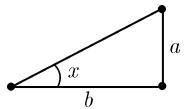
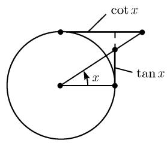
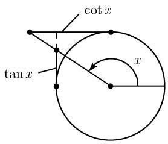
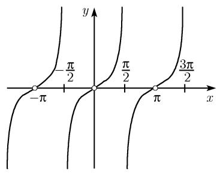
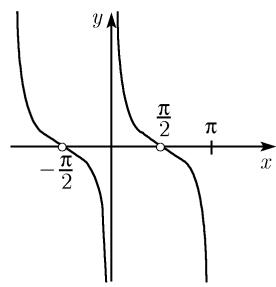

##### 0.2.9 正切与余切

分析的定义 对所有复数 $x, x \neq \frac{\pi}{2} + k\pi, k \in \mathbb{Z}$ , 令 1)

$$
\boxed {\tan x := \frac {\sin x}{\cos x}.}
$$

进一步地, 对所有复数 $x, x \neq k\pi, k \in \mathbb{Z}$ , 定义函数

$$
\boxed {\cot x := \frac {\cos x}{\sin x}.}
$$

平移性质 对所有复数 $x, x \neq k\pi, k \in \mathbb{Z}$ , 有

$$
\boxed {\cot x = \tan \left(\frac {\pi}{2} - x\right).}
$$

因此, 余切函数的所有性质都能从正切函数直接得出.

直角三角形中的几何解释 我们考虑一个直角三角形, 其中角 $x$ 的单位为弧度 (参看 0.1.2), 那么 $\tan x$ 和 $\cot x$ 能表示成已知边的比, 如表 0.18 所示.

表 0.18 根据直角三角形对三角函数的解释

<table><tr><td>直角三角形</td><td>正切</td><td>余切</td></tr><tr><td></td><td> $\tan x = \frac{a}{b}$ </td><td> $\cot x = \frac{b}{a}$ </td></tr><tr><td> $0 < x < \frac{\pi}{2}$ </td><td>(对边  $a$  与邻边  $b$  的比)</td><td>(邻边  $b$  与对边  $a$  的比)</td></tr></table>

单位圆上的几何解释 利用单位圆, $\tan x$ 和 $\cot x$ 就变成了图 $0.33(a) \sim (b)$ 中所示的线段长, 由此我们得到表 0.19 所列的特殊值.

零点与极点 对所有复变量 $x$ , 函数 $y = \tan x$ 的零点为 $k\pi, k \in \mathbb{Z}$ , 极点为 $k\pi + \frac{\pi}{2}, k \in \mathbb{Z}$ . 所有的零点与极点都是单的 (图 0.33(c)).

对所有复变量 $x$ , 函数 $\cot x$ 的零点为 $k\pi + \frac{\pi}{2}, k \in \mathbb{Z}$ , 极点为 $k\pi, k \in \mathbb{Z}$ . 所有的零点与极点也都是单的 2)(图 0.33(d)).

部分分式分解 对所有复数 $x, x \notin Z$ ，有

$$
\boxed {\cot \pi x = \frac {1}{x} + \sum_ {k = 1} ^ {\infty} \left(\frac {1}{x - k} + \frac {1}{x + k}\right).}
$$

  
(b) $x > \frac{\pi}{2}$

(a) $x < \frac{\pi}{2}$  
  
(c) $y = \tan x$ (周期为 $\pi$ )

  
(d) $y = \cot x$ (周期为 $\pi$ )

图0.33 正切与余切函数的几何解释  
表 0.19 一些重要角的正切与余切函数的精确值

<table><tr><td rowspan="2">x</td><td>0</td><td> $\frac{\pi}{6}$ </td><td> $\frac{\pi}{4}$ </td><td> $\frac{\pi}{3}$ </td><td> $\frac{\pi}{2}$ </td><td> $\frac{2\pi}{3}$ </td><td> $\frac{3\pi}{4}$ </td><td> $\frac{5\pi}{6}$ </td><td> $\pi$ </td><td>(弧度)</td></tr><tr><td>0</td><td> $30^{\circ}$ </td><td> $45^{\circ}$ </td><td> $60^{\circ}$ </td><td> $90^{\circ}$ </td><td> $120^{\circ}$ </td><td> $135^{\circ}$ </td><td> $150^{\circ}$ </td><td> $180^{\circ}$ </td><td>(角度)</td></tr><tr><td> $\tan x$ </td><td>0</td><td> $\frac{\sqrt{3}}{3}$ </td><td>1</td><td> $\sqrt{3}$ </td><td>—</td><td> $-\sqrt{3}$ </td><td>-1</td><td> $-\frac{\sqrt{3}}{3}$ </td><td>0</td><td></td></tr><tr><td> $\cot x$ </td><td>—</td><td> $\sqrt{3}$ </td><td>1</td><td> $\frac{\sqrt{3}}{3}$ </td><td>0</td><td> $-\frac{\sqrt{3}}{3}$ </td><td>-1</td><td> $-\sqrt{3}$ </td><td>—</td><td></td></tr></table>

导数 对所有复数 $x, x \neq \frac{\pi}{2} + k\pi, k \in \mathbb{Z}$ , 有

$$
\boxed {\frac {\mathrm{d} \tan x}{\mathrm{d} x} = \frac {1}{\cos^ {2} x}.}
$$

对所有复数 $x, x \neq k\pi, k \in \mathbb{Z}$ , 有

$$
\boxed {\frac {\mathrm{d} \cot x}{\mathrm{d} x} = - \frac {1}{\sin^ {2} x}.}
$$

幂级数 对所有复数 $x, |x| < \pi / 2$ , 有

$$
\tan x = x + \frac {x ^ {3}}{3} + \frac {2 x ^ {5}}{1 5} + \frac {1 7 x ^ {7}}{3 1 5} + \dots = \sum_ {k = 1} ^ {\infty} 4 ^ {k} (4 ^ {k} - 1) \frac {| B _ {2 k} | x ^ {2 k - 1}}{(2 k) !}.
$$

对所有复数 $x, 0 < |x| < \pi$ , 有

$$
\begin{array}{c} \cot x = \frac {1}{x} - \frac {x}{3} - \frac {x ^ {3}}{4 5} - \frac {2 x ^ {5}}{9 4 5} - \dots \\ = \frac {1}{x} - \sum_ {k = 1} ^ {\infty} \frac {4 ^ {k} | B _ {2 k} | x ^ {2 k - 1}}{(2 k) !}, \end{array}
$$

其中 $B_{2k}$ 表示伯努利数.

约定 下面公式对所有复变量 $x$ 和 $y$ 都成立, 除非它们使函数有一个极点. 周期性

$$
\boxed {\tan (x + \pi) = \tan x, \quad \cot (x + \pi) = \cot x.}
$$

奇性

$$
\left| \tan (- x) = - \tan x, \quad \cot (- x) = - \cot x. \right|
$$

加法定理

$$
\tan (x \pm y) = \frac {\tan x \pm \tan y}{1 \mp \tan x \tan y}, \quad \cot (x \pm y) = \frac {\cot x \cot y \mp 1}{\cot y \pm \cot x}.
$$

$$
\tan \left(\frac {\pi}{2} \pm x\right) = \mp \cot x, \quad \tan (\pi \pm x) = \pm \tan x, \quad \tan \left(\frac {3 \pi}{2} \pm x\right) = \mp \cot x,
$$

$$
\cot \left(\frac {\pi}{2} \pm x\right) = \mp \tan x, \quad \cot (\pi \pm x) = \pm \cot x, \quad \cot \left(\frac {3 \pi}{2} \pm x\right) = \mp \tan x.
$$

倍角公式

$$
\tan 2 x = \frac {2 \tan x}{1 - \tan^ {2} x} = \frac {2}{\cot x - \tan x}, \quad \cot 2 x = \frac {\cot^ {2} x - 1}{2 \cot x} = \frac {\cot x - \tan x}{2},
$$

$$
\tan 3 x = \frac {3 \tan x - \tan^ {3} x}{1 - 3 \tan^ {2} x}, \qquad \cot 3 x = \frac {\cot^ {3} x - 3 \cot x}{3 \cot^ {2} x - 1},
$$

$$
\tan 4 x = \frac {4 \tan x - 4 \tan^ {3} x}{1 - 6 \tan^ {2} x + \tan^ {4} x}, \qquad \cot 4 x = \frac {\cot^ {4} x - 6 \cot^ {2} x + 1}{4 \cot^ {3} x - 4 \cot x}.
$$

半角公式

$$
\tan {\frac {x}{2}} = \frac {\sin x}{1 + \cos x} = \frac {1 - \cos x}{\sin x},
$$

$$
\cot {\frac {x}{2}} = \frac {\sin x}{1 - \cos x} = \frac {1 + \cos x}{\sin x}.
$$

和

$$
\tan x \pm \tan y = \frac {\sin (x \pm y)}{\cos x \cos y}, \quad \cot x \pm \cot y = \pm \frac {\sin (x + y)}{\sin x \sin y},
$$

$$
\tan x + \cot y = \frac {\cos (x - y)}{\cos x \sin y}, \quad \cot x - \tan y = \frac {\cos (x + y)}{\sin x \cos y}.
$$

积

$$
\tan x \tan y = \frac {\tan x + \tan y}{\cot x + \cot y} = - \frac {\tan x - \tan y}{\cot x - \cot y},
$$

$$
\cot x \cot y = \frac {\cot x + \cot y}{\tan x + \tan y} = - \frac {\cot x - \cot y}{\tan x - \tan y},
$$

平方

$$
\tan x \cot y = \frac {\tan x + \cot y}{\cot x + \tan y} = - \frac {\tan x - \cot y}{\cot x - \tan y}.
$$

<table><tr><td> $\sin^2 x$ </td><td>—</td><td> $1 - \cos^2 x$ </td><td> $\frac{\tan^2 x}{1 + \tan^2 x}$ </td><td> $\frac{1}{1 + \cot^2 x}$ </td></tr><tr><td> $\cos^2 x$ </td><td> $1 - \sin^2 x$ </td><td>—</td><td> $\frac{1}{1 + \tan^2 x}$ </td><td> $\frac{\cot^2 x}{1 + \cot^2 x}$ </td></tr><tr><td> $\tan^2 x$ </td><td> $\frac{\sin^2 x}{1 - \sin^2 x}$ </td><td> $\frac{1 - \cos^2 x}{\cos^2 x}$ </td><td>—</td><td> $\frac{1}{\cot^2 x}$ </td></tr><tr><td> $\cot^2 x$ </td><td> $\frac{1 - \sin^2 x}{\sin^2 x}$ </td><td> $\frac{\cos^2 x}{1 - \cos^2 x}$ </td><td> $\frac{1}{\tan^2 x}$ </td><td>—</td></tr></table>
