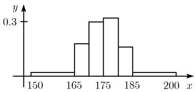

##### 0.4.1 测量（试验）序列的最重要的试验数据

工艺、科学和医药中的许多测量值都具有一个特征, 那就是每次与每次的测量结果都不同. 我们说测量具有随机性成分, 想要测量的量 X, 称为随机变量.

例 1: 一个人的身高 X 是随机的, 即 X 是随机变量.

测量序列 当我们测量随机量 X 时, 就得到测量值

$$
\boxed {x _ {1}, \dots , x _ {n}.}
$$

例 2: 表 0.25 和表 0.26 是测得的 8 个人的身高 (单位: cm).

表0.25

<table><tr><td> $x_{1}$ </td><td> $x_{2}$ </td><td> $x_{3}$ </td><td> $x_{4}$ </td><td> $x_{5}$ </td><td> $x_{6}$ </td><td> $x_{7}$ </td><td> $x_{8}$ </td><td> $\bar{x}$ </td><td> $\Delta x$ </td></tr><tr><td>168</td><td>170</td><td>172</td><td>175</td><td>176</td><td>177</td><td>180</td><td>182</td><td>175</td><td>4.8</td></tr></table>

表0.26

<table><tr><td> $x_{1}$ </td><td> $x_{2}$ </td><td> $x_{3}$ </td><td> $x_{4}$ </td><td> $x_{5}$ </td><td> $x_{6}$ </td><td> $x_{7}$ </td><td> $x_{8}$ </td><td> $\bar{x}$ </td><td> $\Delta x$ </td></tr><tr><td>174</td><td>174</td><td>174</td><td>174</td><td>176</td><td>176</td><td>176</td><td>176</td><td>175</td><td>1.07</td></tr></table>

经验均值与经验标准差 测量序列 $x_{1}, \cdots, x_{n}$ 的两个基本特征量是经验均值

$$
\bar {x} := \frac {1}{n} (x _ {1} + x _ {2} + \dots + x _ {n})
$$

和经验标准差 $\Delta x$ ，后者的平方为 $^{1)}$

$$
\boxed {(\Delta x) ^ {2} := \frac {1}{n - 1} [ (x _ {1} - \bar {x}) ^ {2} + (x _ {2} - \bar {x}) ^ {2} + \dots + (x _ {n} - \bar {x}) ^ {2} ].}
$$

例 3: 由表 0.25 中的值, 有

$$
\bar {x} = \frac {1}{8} (1 6 8 + 1 7 0 + 1 7 2 + 1 7 5 + 1 7 6 + 1 7 7 + 1 8 0 + 1 8 2) = 1 7 5.
$$

由此, 这些人的平均身高为 175cm. 同样, 表 0.26 中人的平均身高也是 175cm. 但比较一下, 我们会发现表 0.25 中各个值的变化程度要比表 0.26 中的大得多. 由表 0.26, 有

$$
\begin{array}{c} (\Delta x) ^ {2} = \frac {1}{7} [ (1 7 4 - 1 7 5) ^ {2} + (1 7 4 - 1 7 5) ^ {2} + \dots + (1 7 6 - 1 7 5) ^ {2} ] \\ = \frac {1}{7} [ 1 + 1 + 1 + 1 + 1 + 1 + 1 + 1 ] = \frac {8}{7}, \end{array}
$$

即 $\Delta x = 1.07$ . 表0.25的标准差的平方为

$$
\begin{array}{c} (\Delta x) ^ {2} = \frac {1}{7} [ (1 6 8 - 1 7 5) ^ {2} + (1 7 0 - 1 7 5) ^ {2} + \dots + (1 8 2 - 1 7 5) ^ {2} ] \\ = \frac {1}{7} [ 4 9 + 2 5 + 9 + 1 + 4 + 2 5 + 4 9 ] = 2 3, \end{array}
$$

即 $\Delta x = 4.8$ .

拇指法则

经验标准差越小, 测量值相对平均值 $\bar{x}$ 的变化幅度越小.

其极限情形是 $\Delta x = 0$ ，也就是所有的测量值都等于 $\bar{x}$ .

测量分布——直方图 为了得到测量分布的一般思想, 特别是当测量组很大时, 我们用图示表示, 称为直方图.

(i) 把测量值分成几类 $K_{1}, K_{2}, \cdots, K_{s}$ ，它们是邻区间.

(ii) 令 $m_{r}$ 表示类 $K_{r}$ 中测量值的数目.

  
图0.42

(iii) 若记 n 个测量值为 $x_{1}, \cdots, x_{n}$ ，则量 $\frac{m_{r}}{n}$ 称为类 $K_{r}$ 的相对测量频率.

(iv) 画出类 $K_{j}$ , 其中第 $K_{r}$ 类所在的矩形的高度 $\frac{m_r}{n}$ . 例4: 表0.27给出了100个人的身高(单位: cm), 根据这些数据画出的直方图如图0.42所示.

表 0.27

<table><tr><td>类  $K_r$ </td><td>测量值</td><td>频率  $m_r$ </td><td>相对频率  $\frac{m_r}{100}$ </td></tr><tr><td> $K_1$ </td><td>150 ≤ x &lt; 165</td><td>2</td><td>0.02</td></tr><tr><td> $K_2$ </td><td>165 ≤ x &lt; 170</td><td>18</td><td>0.18</td></tr><tr><td> $K_3$ </td><td>170 ≤ x &lt; 175</td><td>30</td><td>0.30</td></tr><tr><td> $K_4$ </td><td>175 ≤ x &lt; 180</td><td>32</td><td>0.32</td></tr><tr><td> $K_5$ </td><td>180 ≤ x &lt; 185</td><td>16</td><td>0.16</td></tr><tr><td> $K_6$ </td><td>185 ≤ x &lt; 200</td><td>2</td><td>0.02</td></tr></table>
