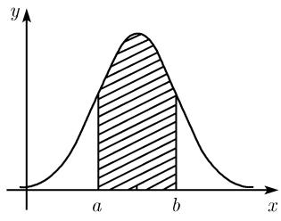
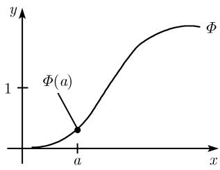

##### 0.4.2 理论分布函数

随机变量 $X$ 的试验序列往往随着试验的不同而不同. 例如, 测量一个家族、一个城市或一个国家的人时, 人的身高往往各不相同. 为了建立随机变量理论, 理论分布函数的概念必不可少.

定义 随机变量 X 的理论分布函数 $\Phi$ 定义如下:

$$
\boxed {\Phi (x) := P (X <   x).}
$$

也就是说, $\Phi(x)$ 的值等于随机变量小于已知数 x 的概率.

正态分布 许多测量值都服从正态分布. 为了对此加以说明, 考虑一条高斯钟形曲线

$$
\boxed {\varphi (x) := \frac {1}{\sigma \sqrt {2 \pi}} \mathrm{e} ^ {- (x - \mu) ^ {2} / 2 \sigma^ {2}}.}\tag{0.48}
$$

这样一条曲线在 $x = \mu$ 处有极大值. 正数 $\sigma$ 越小, 曲线就越向点 $x = \mu$ 处集中. 我们称 $\mu$ 和 $\sigma$ 分别为正态分布的均值和标准差 (图 0.43(a)).

图 0.43(b) 中阴影部分的面积等于随机变量属于区间 $[a, b]$ 的概率.

图 0.43(d) 给出了正态分布 (0.48) 的分布函数 $\Phi$ . 图 0.43(d) 中的值 $\Phi(a)$ 等于 a 左边钟形线下的曲边图形的面积. 差

$$
\Phi (b) - \Phi (a)
$$

等于图 0.43(b) 中阴影部分的面积.

  
(a) 概率密度

  
(b) 用面积表示的概率

  
(c) 置信区间

  
(d) 分布函数  
图 0.43 高斯正态分布的性质

置信区间 置信区间的概念在数理统计中异常重要, 随机变量 X 的 $\alpha$ 置信区间 $[x_{\alpha}^{-}, x_{\alpha}^{+}]$ 定义如下: X 的所有测量值中属于这个区间的概率为 $1 - \alpha$ , 即 x 满足不等式

$$
x _ {\alpha} ^ {-} \leqslant x \leqslant x _ {\alpha} ^ {+}
$$

的概率是 $1 - \alpha$ 。图0.43(c)中区间终点 $x_{\alpha}^{-}$ 和 $x_{\alpha}^{+}$ 满足：关于均值 $\mu$ 对称，且阴影部分的面积等于 $1 - \alpha$ 。我们有

$$
x _ {\alpha} ^ {+} = \mu + \sigma z _ {\alpha}, x _ {\alpha} ^ {-} = \mu - \sigma z _ {\alpha}.
$$

对实际应用中的许多重要情况, 即 $\alpha = 0.01, 0.05$ 和 0.1 时, 表 0.28 给出了 $z_{\alpha}$ 的值.

表0.28

<table><tr><td> $\alpha$ </td><td>0.01</td><td>0.05</td><td>0.1</td></tr><tr><td> $z_{\alpha}$ </td><td>2.6</td><td>2.0</td><td>1.6</td></tr></table>

$$
\alpha
$$

$$
1 - \alpha .
$$

例：令 $\mu = 10, \sigma = 2$ ，则当 $\alpha = 0.01$ ，有

$$
x _ {\alpha} ^ {+} = 1 0 + 2 \cdot 2. 6 = 1 5. 2, x _ {\alpha} ^ {-} = 1 0 - 2 \cdot 2. 6 = 4. 8.
$$

因此, 测量值 $x$ 在 4.8 到 15.2 之间的概率为 $1 - \alpha = 0.99$ . 直观上来看, 就是:

(a) 如果 $n$ 是一个很大的数, 我们选取 $X$ 的 $n$ 个测量值, 那么在 4.8 到 15.2 之间大约有 $(1 - \alpha)n = 0.99n$ 个测量值.

(b) 如果我们对 X 测量 1000 次, 那么在 4.8 和 15.2 之间大约有 990 个值.
