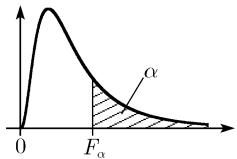

0.4.6.5 费希尔 (Fisher) Z 分布

关于表的注释 这个表包含 $z_{0}$ 的值. 满足具有两个自由度 $(r_{1}, r_{2})$ 的费希尔随机变量 Z 不小于 $z_{0}$ 的概率为 0.01. 换言之,

$$
P (Z \geqslant z _ {0}) = \int_ {z _ {0}} ^ {\infty} f (z) \mathrm{d} z = 0. 0 1,
$$

其中， $f(z)$ 由下列公式给出：

$$
f (z) = \frac {2 r _ {1} ^ {\frac {r _ {1}}{2}} r _ {2} ^ {\frac {r _ {2}}{2}}}{\mathrm{B} \left(\frac {r _ {1}}{2} , \frac {r _ {2}}{2}\right)} \frac {\mathrm{e} ^ {r _ {1} z}}{\left(r _ {1} \mathrm{e} ^ {2 z} + r _ {2}\right) ^ {\frac {r _ {1} + r _ {2}}{2}}}.
$$

<table><tr><td rowspan="2"> $r_2$ </td><td colspan="10"> $r_1$ </td></tr><tr><td>1</td><td>2</td><td>3</td><td>4</td><td>5</td><td>6</td><td>8</td><td>12</td><td>24</td><td>∞</td></tr><tr><td>1</td><td>4.153 5</td><td>4.258 5</td><td>4.297 4</td><td>4.317 5</td><td>4.329 7</td><td>4.337 9</td><td>4.348 2</td><td>4.358 5</td><td>4.368 9</td><td>4.379 4</td></tr><tr><td>2</td><td>2.295 0</td><td>2.297 6</td><td>2.298 4</td><td>2.298 8</td><td>2.299 1</td><td>2.299 2</td><td>2.299 4</td><td>2.299 7</td><td>2.299 9</td><td>2.300 1</td></tr><tr><td>3</td><td>1.764 9</td><td>1.714 0</td><td>1.691 5</td><td>1.678 6</td><td>1.670 3</td><td>1.664 5</td><td>1.656 9</td><td>1.648 9</td><td>1.640 4</td><td>1.631 4</td></tr><tr><td>4</td><td>1.527 0</td><td>1.445 2</td><td>1.407 5</td><td>1.385 6</td><td>1.371 1</td><td>1.360 9</td><td>1.347 3</td><td>1.332 7</td><td>1.317 0</td><td>1.300 0</td></tr><tr><td>5</td><td>1.394 3</td><td>1.292 9</td><td>1.244 9</td><td>1.216 4</td><td>1.197 4</td><td>1.183 8</td><td>1.165 6</td><td>1.145 7</td><td>1.123 9</td><td>1.099 7</td></tr><tr><td>6</td><td>1.310 3</td><td>1.195 5</td><td>1.140 1</td><td>1.106 8</td><td>1.084 3</td><td>1.068 0</td><td>1.046 0</td><td>1.021 8</td><td>0.994 8</td><td>0.964 3</td></tr><tr><td>7</td><td>1.252 6</td><td>1.128 1</td><td>1.068 2</td><td>1.030 0</td><td>1.004 8</td><td>0.986 4</td><td>0.961 4</td><td>0.933 5</td><td>0.902 0</td><td>0.865 8</td></tr><tr><td>8</td><td>1.210 6</td><td>1.078 7</td><td>1.013 5</td><td>0.973 4</td><td>0.945 9</td><td>0.925 9</td><td>0.898 3</td><td>0.867 3</td><td>0.831 9</td><td>0.790 4</td></tr><tr><td>9</td><td>1.178 6</td><td>1.041 1</td><td>0.972 4</td><td>0.929 9</td><td>0.900 6</td><td>0.879 1</td><td>0.849 4</td><td>0.815 7</td><td>0.776 9</td><td>0.730 5</td></tr><tr><td>10</td><td>1.153 5</td><td>1.011 4</td><td>0.939 9</td><td>0.895 4</td><td>0.864 6</td><td>0.841 9</td><td>0.810 4</td><td>0.774 4</td><td>0.732 4</td><td>0.681 6</td></tr><tr><td>11</td><td>1.133 3</td><td>0.987 4</td><td>0.913 6</td><td>0.867 4</td><td>0.835 4</td><td>0.811 6</td><td>0.778 5</td><td>0.740 5</td><td>0.695 8</td><td>0.640 8</td></tr><tr><td>12</td><td>1.116 6</td><td>0.967 7</td><td>0.891 9</td><td>0.844 3</td><td>0.811 1</td><td>0.786 4</td><td>0.752 0</td><td>0.712 2</td><td>0.664 9</td><td>0.606 1</td></tr><tr><td>13</td><td>1.102 7</td><td>0.951 1</td><td>0.873 7</td><td>0.824 8</td><td>0.790 7</td><td>0.765 2</td><td>0.729 5</td><td>0.688 2</td><td>0.638 6</td><td>0.576 1</td></tr><tr><td>14</td><td>1.090 9</td><td>0.937 0</td><td>0.858 1</td><td>0.808 2</td><td>0.773 2</td><td>0.747 1</td><td>0.710 3</td><td>0.667 5</td><td>0.615 9</td><td>0.550 0</td></tr><tr><td>15</td><td>1.080 7</td><td>0.924 9</td><td>0.844 8</td><td>0.793 9</td><td>0.758 2</td><td>0.731 4</td><td>0.693 7</td><td>0.649 6</td><td>0.596 1</td><td>0.526 9</td></tr><tr><td>16</td><td>1.071 9</td><td>0.914 4</td><td>0.833 1</td><td>0.781 4</td><td>0.745 0</td><td>0.717 7</td><td>0.679 1</td><td>0.633 9</td><td>0.578 6</td><td>0.506 4</td></tr><tr><td>17</td><td>1.064 1</td><td>0.905 1</td><td>0.822 9</td><td>0.770 5</td><td>0.733 5</td><td>0.705 7</td><td>0.666 3</td><td>0.619 9</td><td>0.563 0</td><td>0.487 9</td></tr><tr><td>18</td><td>1.057 2</td><td>0.897 0</td><td>0.813 8</td><td>0.760 7</td><td>0.723 2</td><td>0.695 0</td><td>0.654 9</td><td>0.607 5</td><td>0.549 1</td><td>0.471 2</td></tr><tr><td>19</td><td>1.051 1</td><td>0.889 7</td><td>0.805 7</td><td>0.752 1</td><td>0.714 0</td><td>0.685 4</td><td>0.644 7</td><td>0.596 4</td><td>0.536 6</td><td>0.456 0</td></tr><tr><td>20</td><td>1.045 7</td><td>0.883 1</td><td>0.798 5</td><td>0.744 3</td><td>0.705 8</td><td>0.676 8</td><td>0.635 5</td><td>0.586 4</td><td>0.525 3</td><td>0.442 1</td></tr><tr><td>21</td><td>1.040 8</td><td>0.877 2</td><td>0.792 0</td><td>0.737 2</td><td>0.698 4</td><td>0.669 0</td><td>0.627 2</td><td>0.577 3</td><td>0.515 0</td><td>0.429 4</td></tr><tr><td>22</td><td>1.036 3</td><td>0.871 9</td><td>0.786 0</td><td>0.730 9</td><td>0.691 6</td><td>0.662 0</td><td>0.619 6</td><td>0.569 1</td><td>0.505 6</td><td>0.417 6</td></tr><tr><td>23</td><td>1.032 2</td><td>0.867 0</td><td>0.780 6</td><td>0.725 1</td><td>0.685 5</td><td>0.655 5</td><td>0.612 7</td><td>0.561 5</td><td>0.496 9</td><td>0.406 8</td></tr><tr><td>24</td><td>1.028 5</td><td>0.862 6</td><td>0.775 7</td><td>0.719 7</td><td>0.679 9</td><td>0.649 6</td><td>0.606 4</td><td>0.554 5</td><td>0.489 0</td><td>0.396 7</td></tr><tr><td>25</td><td>1.025 1</td><td>0.858 5</td><td>0.771 2</td><td>0.714 8</td><td>0.674 7</td><td>0.644 2</td><td>0.600 6</td><td>0.548 1</td><td>0.481 6</td><td>0.387 2</td></tr><tr><td>26</td><td>1.022 0</td><td>0.854 8</td><td>0.767 0</td><td>0.710 3</td><td>0.669 9</td><td>0.639 2</td><td>0.595 2</td><td>0.542 2</td><td>0.474 8</td><td>0.378 4</td></tr><tr><td>27</td><td>1.019 1</td><td>0.851 3</td><td>0.763 1</td><td>0.706 2</td><td>0.665 5</td><td>0.634 6</td><td>0.590 2</td><td>0.536 7</td><td>0.468 5</td><td>0.370 1</td></tr><tr><td>28</td><td>1.016 4</td><td>0.848 1</td><td>0.759 5</td><td>0.702 3</td><td>0.661 4</td><td>0.630 3</td><td>0.585 6</td><td>0.531 6</td><td>0.462 6</td><td>0.362 4</td></tr><tr><td>29</td><td>1.013 9</td><td>0.845 1</td><td>0.756 2</td><td>0.698 7</td><td>0.657 6</td><td>0.626 3</td><td>0.581 3</td><td>0.526 9</td><td>0.457 0</td><td>0.355 0</td></tr><tr><td>30</td><td>1.011 6</td><td>0.842 3</td><td>0.753 1</td><td>0.695 4</td><td>0.654 0</td><td>0.622 6</td><td>0.577 3</td><td>0.522 4</td><td>0.451 9</td><td>0.348 1</td></tr><tr><td>40</td><td>0.994 9</td><td>0.822 3</td><td>0.730 7</td><td>0.671 2</td><td>0.628 3</td><td>0.595 6</td><td>0.548 1</td><td>0.490 1</td><td>0.413 8</td><td>0.292 2</td></tr><tr><td>60</td><td>0.978 4</td><td>0.802 5</td><td>0.708 6</td><td>0.647 2</td><td>0.602 8</td><td>0.568 7</td><td>0.518 9</td><td>0.457 4</td><td>0.374 6</td><td>0.235 2</td></tr><tr><td>120</td><td>0.962 2</td><td>0.782 9</td><td>0.686 7</td><td>0.623 4</td><td>0.577 4</td><td>0.541 9</td><td>0.489 7</td><td>0.424 3</td><td>0.333 9</td><td>0.161 2</td></tr><tr><td>∞</td><td>0.946 2</td><td>0.763 6</td><td>0.665 1</td><td>0.599 9</td><td>0.552 2</td><td>0.515 2</td><td>0.460 4</td><td>0.390 8</td><td>0.291 3</td><td>0.000 0</td></tr></table>

0.4.6.6 $F$ 分布的值 $F_{0.05;m_1,m_2}$ 与 $F_{0.01,m_1,m_2}$ (粗体)

  
图0.51
