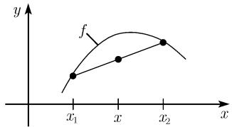
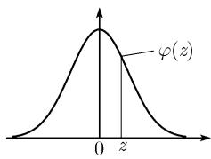
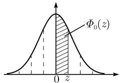
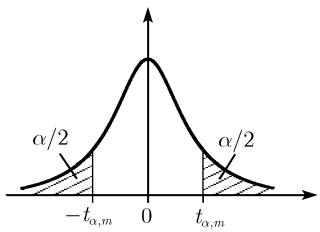
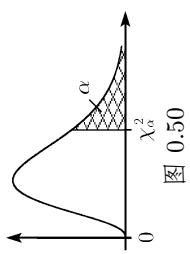

##### 0.4.6 数理统计中的表

0.4.6.1 表的插值

线性插值 每个表都由一些表值构成. 表 0.32 中的表值包括 x 的值和 $f(x)$ 的值两部分.

表0.32

<table><tr><td>x</td><td>f(x)</td></tr><tr><td>1</td><td>0.52</td></tr><tr><td>2</td><td>0.60</td></tr><tr><td>3</td><td>0.64</td></tr></table>

  
图0.46

第一个基本问题：对已知的表值 $x$ ，求 $f(x)$ 的插值 若 $x$ 不在这个表中，可以使用线性插值，如图0.46所示。这里点对 $(x_{1}, f(x_{1}))$ 和 $(x_{2}, f(x_{2}))$ 之间的割线取代了 $y = f(x)$ 的图像。 $f(x)$ 的近似值 $f_{*}(x)$ 由如下线性插值公式得到：

$$
\boxed {f _ {*} (x) = f (x _ {1}) + \frac {f (x _ {2}) - f (x _ {1})}{x _ {2} - x _ {1}} (x - x _ {1}).}\tag{0.51}
$$

例 1: 令 x = 1.5, 我们在表 0.32 中找到最邻近的表值

$$
x _ {1} = 1 \text {和} x _ {2} = 2,
$$

它们分别对应 $f(x_{1})=0.52$ 和 $f(x_{2})=0.60$ . 由插值公式 (0.51), 有

$$
f _ {*} (x) = 0. 5 2 + \frac {0 . 6 0 - 0 . 5 2}{1} (1. 5 - 1) = 0. 5 2 + 0. 0 8 \cdot 0. 5 = 0. 5 6.
$$

第二个基本问题：对已知的值 $f(x)$ ，求表值 $x$ 的插值 为了由 $f(x)$ 计算 $x$ ，利用公式：

$$
\boxed {x = x _ {1} + \frac {f (x) - f (x _ {1})}{f (x _ {2}) - f (x _ {1})} (x _ {2} - x _ {1}).}\tag{0.52}
$$

例 2: 令 $f(x)=0.62$ , 我们在表 0.32 中找到最邻近的表值

$$
f (x _ {1}) = 0. 6 0 \text {和} f (x _ {2}) = 0. 6 4,
$$

它们分别对应 $x_{1}=2$ 和 $x_{2}=3$ . 由 (0.52), 有

$$
x = 2 + \frac {0 . 6 2 - 0 . 6 0}{0 . 6 4 - 0 . 6 0} (3 - 2) = 2 + \frac {0 . 0 2}{0 . 0 4} = 2. 5.
$$

由 Mathematica 获得的更高的精确度 线性插值是用来求近似解的一种方法, 对数理统计而言, 这种方法就足够了. 我们并不认为像统计这种在本质上就不很精确的学科能够靠小数点后面位数的增加来提高其精确性.

然而, 在物理学与工艺学中, 往往需要更高的精确度. 于是, 二次插值的方法应运而生了. 在广泛应用计算机的今天, 可以利用计算机软件程序 (例如 Mathematcia) 获得某些特殊函数的精确值.

0.4.6.2 正态分布

表 0.33 标准中心正态分布的密度函数:

$$
\varphi (z) = \frac {1}{\sqrt {2 \pi}} \exp \left(- \frac {1}{2} z ^ {2}\right)
$$

  
图0.47

<table><tr><td>z</td><td>0</td><td>1</td><td>2</td><td>3</td><td>4</td><td>5</td><td>6</td><td>7</td><td>8</td><td>9</td></tr><tr><td>0.0</td><td> $3\ 989^{-4}$ </td><td>3 989</td><td>3 989</td><td>3 988</td><td>3 986</td><td>3 984</td><td>3 982</td><td>3 980</td><td>3 977</td><td>3 973</td></tr><tr><td>0.1</td><td> $3\ 970^{-4}$ </td><td>3 965</td><td>3 961</td><td>3 956</td><td>3 951</td><td>3 945</td><td>3 939</td><td>3 932</td><td>3 925</td><td>3 918</td></tr><tr><td>0.2</td><td> $3\ 910^{-4}$ </td><td>3 902</td><td>3 894</td><td>3 885</td><td>3 876</td><td>3 867</td><td>3 857</td><td>3 847</td><td>3 836</td><td>3 825</td></tr><tr><td>0.3</td><td> $3\ 814^{-4}$ </td><td>3 802</td><td>3 790</td><td>3 778</td><td>3 765</td><td>3 752</td><td>3 739</td><td>3 725</td><td>3 712</td><td>3 697</td></tr><tr><td>0.4</td><td> $3\ 683^{-4}$ </td><td>3 668</td><td>3 653</td><td>3 637</td><td>3 621</td><td>3 605</td><td>3 589</td><td>3 572</td><td>3 555</td><td>3 538</td></tr><tr><td>0.5</td><td> $3\ 521^{-4}$ </td><td>3 503</td><td>3 485</td><td>3 467</td><td>3 448</td><td>3 429</td><td>3 410</td><td>3 391</td><td>3 372</td><td>3 352</td></tr><tr><td>0.6</td><td> $3\ 332^{-4}$ </td><td>3 312</td><td>3 292</td><td>3 271</td><td>3 251</td><td>3 230</td><td>3 209</td><td>3 187</td><td>3 166</td><td>3 144</td></tr><tr><td>0.7</td><td> $3\ 123^{-4}$ </td><td>3 101</td><td>3 079</td><td>3 056</td><td>3 034</td><td>3 011</td><td>2 989</td><td>2 966</td><td>2 943</td><td>2 920</td></tr><tr><td>0.8</td><td> $2\ 897^{-4}$ </td><td>2 874</td><td>2 850</td><td>2 827</td><td>2 803</td><td>2 780</td><td>2 756</td><td>2 732</td><td>2 709</td><td>2 685</td></tr><tr><td>0.9</td><td> $2\ 661^{-4}$ </td><td>2 637</td><td>2 613</td><td>2 589</td><td>2 565</td><td>2 541</td><td>2 516</td><td>2 492</td><td>2 468</td><td>2 444</td></tr><tr><td>1.0</td><td> $2\ 420^{-4}$ </td><td>2 396</td><td>2 371</td><td>2 347</td><td>2 323</td><td>2 299</td><td>2 275</td><td>2 251</td><td>2 227</td><td>2 203</td></tr><tr><td>1.1</td><td> $2\ 179^{-4}$ </td><td>2 155</td><td>2 131</td><td>2 107</td><td>2 083</td><td>2 059</td><td>2 036</td><td>2 012</td><td>1 989</td><td>1 965</td></tr><tr><td>1.2</td><td> $1\ 942^{-4}$ </td><td>1 919</td><td>1 895</td><td>1 872</td><td>1 849</td><td>1 826</td><td>1 804</td><td>1 781</td><td>1 758</td><td>1 736</td></tr><tr><td>1.3</td><td> $1\ 714^{-4}$ </td><td>1 691</td><td>1 669</td><td>1 647</td><td>1 626</td><td>1 604</td><td>1 582</td><td>1 561</td><td>1 539</td><td>1 518</td></tr><tr><td>1.4</td><td> $1\ 497^{-4}$ </td><td>1 476</td><td>1 456</td><td>1 435</td><td>1 415</td><td>1 394</td><td>1 374</td><td>1 354</td><td>1 334</td><td>1 315</td></tr><tr><td>1.5</td><td> $1\ 295^{-4}$ </td><td>1 276</td><td>1 257</td><td>1 238</td><td>1 219</td><td>1 200</td><td>1 182</td><td>1 163</td><td>1 145</td><td>1 127</td></tr><tr><td>1.6</td><td> $1\ 109^{-4}$ </td><td>1 092</td><td>1 074</td><td>1 057</td><td>1 040</td><td>1 023</td><td>1 006</td><td> $9\ 893^{-5}$ </td><td>9 728</td><td>9 566</td></tr><tr><td>1.7</td><td> $9\ 405^{-5}$ </td><td>9 246</td><td>9 089</td><td>8 933</td><td>8 780</td><td>8 628</td><td>8 478</td><td>8 329</td><td>8 183</td><td>8 038</td></tr><tr><td>1.8</td><td> $7\ 895^{-5}$ </td><td>7 754</td><td>7 614</td><td>7 477</td><td>7 341</td><td>7 206</td><td>7 074</td><td>6 943</td><td>6 814</td><td>6 687</td></tr><tr><td>1.9</td><td> $6\ 562^{-5}$ </td><td>6 438</td><td>6 316</td><td>6 195</td><td>6 077</td><td>5 960</td><td>5 844</td><td>5 730</td><td>5 618</td><td>5 508</td></tr><tr><td>2.0</td><td> $5\ 399^{-5}$ </td><td>5 292</td><td>5 186</td><td>5 082</td><td>4 980</td><td>4 879</td><td>4 780</td><td>4 682</td><td>4 586</td><td>4 491</td></tr><tr><td>2.1</td><td> $4\ 398^{-5}$ </td><td>4 307</td><td>4 217</td><td>4 128</td><td>4 041</td><td>3 955</td><td>3 871</td><td>3 788</td><td>3 706</td><td>3 626</td></tr><tr><td>2.2</td><td> $3\ 547^{-5}$ </td><td>3 470</td><td>3 394</td><td>3 319</td><td>3 246</td><td>3 174</td><td>3 103</td><td>3 034</td><td>2 965</td><td>2 898</td></tr><tr><td>2.3</td><td> $2\ 833^{-5}$ </td><td>2 768</td><td>2 705</td><td>2 643</td><td>2 582</td><td>2 522</td><td>2 463</td><td>2 406</td><td>2 349</td><td>2 294</td></tr><tr><td>2.4</td><td> $2\ 239^{-5}$ </td><td>2 186</td><td>2 134</td><td>2 083</td><td>2 033</td><td>1 984</td><td>1 936</td><td>1 888</td><td>1 842</td><td>1 797</td></tr><tr><td>2.5</td><td> $1\ 753^{-5}$ </td><td>1 709</td><td>1 667</td><td>1 625</td><td>1 585</td><td>1 545</td><td>1 506</td><td>1 468</td><td>1 431</td><td>1 394</td></tr><tr><td>2.6</td><td> $1\ 358^{-5}$ </td><td>1 323</td><td>1 289</td><td>1 256</td><td>1 223</td><td>1 191</td><td>1 160</td><td>1 130</td><td>1 100</td><td>1 071</td></tr><tr><td>2.7</td><td> $1\ 042^{-5}$ </td><td>1 014</td><td> $9\ 871^{-6}$ </td><td>9 606</td><td>9 347</td><td>9 094</td><td>8 846</td><td>8 605</td><td>8 370</td><td>8 140</td></tr><tr><td>2.8</td><td> $7\ 915^{-6}$ </td><td>7 697</td><td>7 483</td><td>7 274</td><td>7 071</td><td>6 873</td><td>6 679</td><td>6 491</td><td>6 307</td><td>6 127</td></tr><tr><td>2.9</td><td> $5\ 953^{-6}$ </td><td>5 782</td><td>5 616</td><td>5 454</td><td>5 296</td><td>5 143</td><td>4 993</td><td>4 847</td><td>4 705</td><td>4 567</td></tr><tr><td>3.0</td><td> $4\ 432^{-6}$ </td><td>4 301</td><td>4 173</td><td>4 049</td><td>3 928</td><td>3 810</td><td>3 695</td><td>3 584</td><td>3 475</td><td>3 370</td></tr><tr><td>3.1</td><td> $3\ 267^{-6}$ </td><td>3 167</td><td>3 070</td><td>2 975</td><td>2 884</td><td>2 794</td><td>2 707</td><td>2 623</td><td>2 541</td><td>2 461</td></tr><tr><td>3.2</td><td> $2\ 384^{-6}$ </td><td>2 309</td><td>2 236</td><td>2 165</td><td>2 096</td><td>2 029</td><td>1 964</td><td>1 901</td><td>1 840</td><td>1 780</td></tr><tr><td>3.3</td><td> $1\ 723^{-6}$ </td><td>1 667</td><td>1 612</td><td>1 560</td><td>1 508</td><td>1 459</td><td>1 411</td><td>1 364</td><td>1 319</td><td>1 275</td></tr><tr><td>3.4</td><td> $1\ 232^{-6}$ </td><td>1 191</td><td>1 151</td><td>1 112</td><td>1 075</td><td>1 038</td><td>1 003</td><td> $9\ 689^{-7}$ </td><td>9 358</td><td>9 037</td></tr><tr><td>3.5</td><td> $8\ 727^{-7}$ </td><td>8 426</td><td>8 135</td><td>7 853</td><td>7 581</td><td>7 317</td><td>7 061</td><td>6 814</td><td>6 575</td><td>6 343</td></tr><tr><td>3.6</td><td> $6\ 119^{-7}$ </td><td>5 902</td><td>5 693</td><td>5 490</td><td>5 294</td><td>5 105</td><td>4 921</td><td>4 744</td><td>4 573</td><td>4 408</td></tr><tr><td>3.7</td><td> $4\ 248^{-7}$ </td><td>4 093</td><td>3 944</td><td>3 800</td><td>3 661</td><td>3 526</td><td>3 396</td><td>3 271</td><td>3 149</td><td>3 032</td></tr><tr><td>3.8</td><td> $2\ 919^{-7}$ </td><td>2 810</td><td>2 705</td><td>2 604</td><td>2 506</td><td>2 411</td><td>2 320</td><td>2 232</td><td>2 147</td><td>2 065</td></tr><tr><td>3.9</td><td> $1\ 987^{-7}$ </td><td>1 910</td><td>1 837</td><td>1 766</td><td>1 698</td><td>1 633</td><td>1 569</td><td>1 508</td><td>1 449</td><td>1 393</td></tr><tr><td>4.0</td><td> $1\ 338^{-7}$ </td><td>1 286</td><td>1 235</td><td>1 186</td><td>1 140</td><td>1 094</td><td>1 051</td><td>1 009</td><td> $9\ 687^{-8}$ </td><td>9 299</td></tr><tr><td>4.1</td><td> $8\ 926^{-8}$ </td><td>8 567</td><td>8 222</td><td>7 890</td><td>7 570</td><td>7 263</td><td>6 967</td><td>6 683</td><td>6 410</td><td>6 147</td></tr><tr><td>4.2</td><td> $5\ 894^{-8}$ </td><td>5 652</td><td>5 418</td><td>5 194</td><td>4 979</td><td>4 772</td><td>4 573</td><td>4 382</td><td>4 199</td><td>4 023</td></tr><tr><td>4.3</td><td> $3\ 854^{-8}$ </td><td>3 691</td><td>3 535</td><td>3 386</td><td>3 242</td><td>3 104</td><td>2 972</td><td>2 845</td><td>2 723</td><td>2 606</td></tr><tr><td>4.4</td><td> $2\ 494^{-8}$ </td><td>2 387</td><td>2 284</td><td>2 185</td><td>2 090</td><td>1 999</td><td>1 912</td><td>1 829</td><td>1 749</td><td>1 672</td></tr><tr><td>4.5</td><td> $1\ 598^{-8}$ </td><td>1 528</td><td>1 461</td><td>1 396</td><td>1 334</td><td>1 275</td><td>1 218</td><td>1 164</td><td>1 112</td><td>1 062</td></tr><tr><td>4.6</td><td> $1\ 014^{-8}$ </td><td> $9\ 684^{-9}$ </td><td>9 248</td><td>8 830</td><td>8 430</td><td>8 047</td><td>7 681</td><td>7 331</td><td>6 996</td><td>6 676</td></tr><tr><td>4.7</td><td> $6\ 370^{-9}$ </td><td>6 077</td><td>5 797</td><td>5 530</td><td>5 274</td><td>5 030</td><td>4 796</td><td>4 573</td><td>4 360</td><td>4 156</td></tr><tr><td>4.8</td><td> $3\ 961^{-9}$ </td><td>3 775</td><td>3 598</td><td>3 428</td><td>3 267</td><td>3 112</td><td>2 965</td><td>2 824</td><td>2 960</td><td>2 561</td></tr><tr><td>4.9</td><td> $2\ 439^{-9}$ </td><td>2 322</td><td>2 211</td><td>2 105</td><td>2 003</td><td>1 907</td><td>1 814</td><td>1 727</td><td>1 643</td><td>1 563</td></tr></table>

注： $3989^{-4}$ 表示 $3989 \cdot 10^{-4}$ .

$$
\Phi_ {0} (z) = \int_ {0} ^ {z} \varphi (x) \mathrm{d} x = \frac {1}{2 \pi} \int_ {0} ^ {z} \exp \left(- \frac {1}{2} x ^ {2}\right) \mathrm{d} x
$$

分布函数 $\Phi(z) = \frac{1}{\sqrt{2\pi}}\int_{-\infty}^{z}\exp \left(-\frac{1}{2} x^2\right)\mathrm{d}x$ 通过 $\Phi(z) = \frac{1}{2} +\Phi_0(z)$ 与 $\Phi_0(z)$ 联系起来，另外， $\Phi_0(-z) =$ $-\Phi_0(z).$

表 0.34 标准中心正态分布的概率积分  
  
图0.48

<table><tr><td>z</td><td>0</td><td>1</td><td>2</td><td>3</td><td>4</td><td>5</td><td>6</td><td>7</td><td>8</td><td>9</td></tr><tr><td>0.0</td><td>0.0 000</td><td>040</td><td>080</td><td>120</td><td>160</td><td>199</td><td>239</td><td>279</td><td>319</td><td>359</td></tr><tr><td>0.1</td><td>398</td><td>438</td><td>478</td><td>517</td><td>557</td><td>596</td><td>636</td><td>675</td><td>714</td><td>753</td></tr><tr><td>0.2</td><td>793</td><td>832</td><td>871</td><td>910</td><td>948</td><td>987</td><td>·026</td><td>·064</td><td>·103</td><td>·141</td></tr><tr><td>0.3</td><td>0.1 179</td><td>217</td><td>255</td><td>293</td><td>331</td><td>368</td><td>406</td><td>443</td><td>480</td><td>517</td></tr><tr><td>0.4</td><td>554</td><td>591</td><td>628</td><td>664</td><td>700</td><td>736</td><td>772</td><td>808</td><td>844</td><td>879</td></tr><tr><td>0.5</td><td>915</td><td>950</td><td>985</td><td>·019</td><td>·054</td><td>·088</td><td>·123</td><td>·157</td><td>·190</td><td>·224</td></tr><tr><td>0.6</td><td>0.2 257</td><td>291</td><td>324</td><td>357</td><td>389</td><td>422</td><td>454</td><td>486</td><td>517</td><td>549</td></tr><tr><td>0.7</td><td>580</td><td>611</td><td>642</td><td>673</td><td>703</td><td>734</td><td>764</td><td>794</td><td>823</td><td>852</td></tr><tr><td>0.8</td><td>881</td><td>910</td><td>939</td><td>967</td><td>995</td><td>·023</td><td>·051</td><td>·078</td><td>·106</td><td>·133</td></tr><tr><td>0.9</td><td>0.3 159</td><td>186</td><td>212</td><td>238</td><td>264</td><td>289</td><td>315</td><td>340</td><td>365</td><td>389</td></tr><tr><td>1.0</td><td>413</td><td>438</td><td>461</td><td>485</td><td>508</td><td>531</td><td>554</td><td>577</td><td>599</td><td>621</td></tr><tr><td>1.1</td><td>643</td><td>665</td><td>686</td><td>708</td><td>729</td><td>749</td><td>770</td><td>790</td><td>810</td><td>830</td></tr><tr><td>1.2</td><td>849</td><td>869</td><td>888</td><td>907</td><td>925</td><td>944</td><td>962</td><td>980</td><td>997</td><td>·015</td></tr><tr><td>1.3</td><td>0.4 032</td><td>049</td><td>066</td><td>082</td><td>099</td><td>115</td><td>131</td><td>147</td><td>162</td><td>177</td></tr><tr><td>1.4</td><td>192</td><td>207</td><td>222</td><td>236</td><td>251</td><td>265</td><td>279</td><td>292</td><td>306</td><td>319</td></tr><tr><td>1.5</td><td>332</td><td>345</td><td>357</td><td>370</td><td>382</td><td>394</td><td>406</td><td>418</td><td>429</td><td>441</td></tr><tr><td>1.6</td><td>452</td><td>463</td><td>474</td><td>484</td><td>495</td><td>505</td><td>515</td><td>525</td><td>535</td><td>545</td></tr><tr><td>1.7</td><td>554</td><td>564</td><td>573</td><td>582</td><td>591</td><td>599</td><td>608</td><td>616</td><td>625</td><td>633</td></tr><tr><td>1.8</td><td>641</td><td>649</td><td>656</td><td>664</td><td>671</td><td>678</td><td>686</td><td>693</td><td>699</td><td>706</td></tr><tr><td>1.9</td><td>713</td><td>719</td><td>726</td><td>732</td><td>738</td><td>744</td><td>750</td><td>756</td><td>761</td><td>767</td></tr><tr><td>2.0</td><td>772</td><td>778</td><td>783</td><td>788</td><td>793</td><td>798</td><td>803</td><td>808</td><td>812</td><td>817</td></tr><tr><td>2.1</td><td>821</td><td>826</td><td>830</td><td>834</td><td>838</td><td>842</td><td>846</td><td>850</td><td>854</td><td>857</td></tr><tr><td>2.2</td><td>860</td><td>864</td><td>867</td><td>871</td><td>874</td><td>877</td><td>880</td><td>883</td><td>886</td><td>889</td></tr><tr><td></td><td>966</td><td>474</td><td>906</td><td>263</td><td>545</td><td>755</td><td>894</td><td>962</td><td>962</td><td>893</td></tr><tr><td>2.3</td><td>892</td><td>895</td><td>898</td><td>900</td><td>903</td><td>906</td><td>908</td><td>911</td><td>913</td><td>915</td></tr><tr><td></td><td>759</td><td>559</td><td>296</td><td>969</td><td>581</td><td>133</td><td>625</td><td>060</td><td>437</td><td>758</td></tr><tr><td>2.4</td><td>918</td><td>920</td><td>922</td><td>924</td><td>926</td><td>928</td><td>930</td><td>932</td><td>934</td><td>936</td></tr><tr><td></td><td>025</td><td>237</td><td>397</td><td>506</td><td>564</td><td>572</td><td>531</td><td>443</td><td>309</td><td>128</td></tr><tr><td>2.5</td><td>937</td><td>939</td><td>941</td><td>942</td><td>944</td><td>946</td><td>947</td><td>949</td><td>950</td><td>952</td></tr><tr><td></td><td>903</td><td>634</td><td>323</td><td>969</td><td>574</td><td>139</td><td>664</td><td>151</td><td>600</td><td>012</td></tr><tr><td>2.6</td><td>953</td><td>954</td><td>956</td><td>957</td><td>958</td><td>959</td><td>960</td><td>962</td><td>963</td><td>964</td></tr><tr><td></td><td>388</td><td>729</td><td>035</td><td>308</td><td>547</td><td>754</td><td>930</td><td>074</td><td>189</td><td>274</td></tr><tr><td>2.7</td><td>965</td><td>966</td><td>967</td><td>968</td><td>969</td><td>970</td><td>971</td><td>971</td><td>972</td><td>973</td></tr><tr><td></td><td>330</td><td>358</td><td>359</td><td>333</td><td>280</td><td>202</td><td>099</td><td>972</td><td>821</td><td>646</td></tr><tr><td>2.8</td><td>974</td><td>975</td><td>975</td><td>976</td><td>977</td><td>978</td><td>978</td><td>979</td><td>980</td><td>980</td></tr><tr><td></td><td>449</td><td>229</td><td>988</td><td>726</td><td>443</td><td>140</td><td>818</td><td>476</td><td>116</td><td>738</td></tr><tr><td>2.9</td><td>981</td><td>981</td><td>982</td><td>983</td><td>983</td><td>984</td><td>984</td><td>985</td><td>985</td><td>986</td></tr><tr><td></td><td>342</td><td>929</td><td>498</td><td>052</td><td>589</td><td>111</td><td>618</td><td>11</td><td>588</td><td>051</td></tr><tr><td>3.0</td><td>0.4 986</td><td>986</td><td>987</td><td>987</td><td>988</td><td>988</td><td>988</td><td>989</td><td>989</td><td>989</td></tr><tr><td></td><td>501</td><td>938</td><td>361</td><td>772</td><td>171</td><td>558</td><td>933</td><td>297</td><td>650</td><td>992</td></tr><tr><td>3.1</td><td>990</td><td>990</td><td>990</td><td>991</td><td>991</td><td>991</td><td>992</td><td>992</td><td>992</td><td>992</td></tr><tr><td></td><td>324</td><td>646</td><td>957</td><td>260</td><td>553</td><td>836</td><td>112</td><td>378</td><td>636</td><td>886</td></tr><tr><td>3.2</td><td>993</td><td>993</td><td>993</td><td>993</td><td>994</td><td>994</td><td>994</td><td>994</td><td>994</td><td>994</td></tr><tr><td></td><td>129</td><td>363</td><td>590</td><td>810</td><td>024</td><td>230</td><td>429</td><td>623</td><td>810</td><td>991</td></tr><tr><td>3.3</td><td>995</td><td>995</td><td>995</td><td>995</td><td>995</td><td>995</td><td>996</td><td>996</td><td>996</td><td>996</td></tr><tr><td></td><td>166</td><td>335</td><td>499</td><td>658</td><td>811</td><td>959</td><td>103</td><td>242</td><td>376</td><td>505</td></tr><tr><td>3.4</td><td>996</td><td>996</td><td>996</td><td>996</td><td>997</td><td>997</td><td>997</td><td>997</td><td>997</td><td>997</td></tr><tr><td></td><td>631</td><td>752</td><td>869</td><td>982</td><td>091</td><td>197</td><td>299</td><td>398</td><td>493</td><td>585</td></tr><tr><td>3.5</td><td>997</td><td>997</td><td>997</td><td>997</td><td>997</td><td>998</td><td>998</td><td>998</td><td>998</td><td>998</td></tr><tr><td></td><td>674</td><td>759</td><td>842</td><td>922</td><td>999</td><td>074</td><td>146</td><td>215</td><td>282</td><td>347</td></tr><tr><td>3.6</td><td>998</td><td>998</td><td>998</td><td>998</td><td>998</td><td>998</td><td>998</td><td>998</td><td>998</td><td>998</td></tr><tr><td></td><td>409</td><td>469</td><td>527</td><td>583</td><td>637</td><td>689</td><td>739</td><td>787</td><td>834</td><td>879</td></tr><tr><td>3.7</td><td>998</td><td>998</td><td>999</td><td>999</td><td>999</td><td>999</td><td>999</td><td>999</td><td>999</td><td>999</td></tr><tr><td></td><td>922</td><td>964</td><td>004</td><td>043</td><td>080</td><td>116</td><td>150</td><td>184</td><td>216</td><td>247</td></tr><tr><td>3.8</td><td>999</td><td>999</td><td>999</td><td>999</td><td>999</td><td>999</td><td>999</td><td>999</td><td>999</td><td>999</td></tr><tr><td></td><td>276</td><td>305</td><td>333</td><td>359</td><td>385</td><td>409</td><td>433</td><td>456</td><td>478</td><td>499</td></tr><tr><td>3.9</td><td>999</td><td>999</td><td>999</td><td>999</td><td>999</td><td>999</td><td>999</td><td>999</td><td>999</td><td>999</td></tr><tr><td></td><td>519</td><td>539</td><td>557</td><td>575</td><td>593</td><td>609</td><td>625</td><td>641</td><td>655</td><td>670</td></tr><tr><td>4.0</td><td>999</td><td>999</td><td>999</td><td>999</td><td>999</td><td>999</td><td>999</td><td>999</td><td>999</td><td>999</td></tr><tr><td></td><td>683</td><td>696</td><td>709</td><td>721</td><td>733</td><td>744</td><td>755</td><td>765</td><td>775</td><td>784</td></tr><tr><td>4.1</td><td>999</td><td>999</td><td>999</td><td>999</td><td>999</td><td>999</td><td>999</td><td>999</td><td>999</td><td>999</td></tr><tr><td></td><td>793</td><td>802</td><td>811</td><td>819</td><td>826</td><td>834</td><td>841</td><td>848</td><td>854</td><td>861</td></tr><tr><td>4.2</td><td>999</td><td>999</td><td>999</td><td>999</td><td>999</td><td>999</td><td>999</td><td>999</td><td>999</td><td>999</td></tr><tr><td></td><td>867</td><td>872</td><td>878</td><td>883</td><td>888</td><td>893</td><td>898</td><td>902</td><td>907</td><td>911</td></tr><tr><td>4.3</td><td>999</td><td>999</td><td>999</td><td>999</td><td>999</td><td>999</td><td>999</td><td>999</td><td>999</td><td>999</td></tr><tr><td></td><td>915</td><td>918</td><td>922</td><td>925</td><td>929</td><td>932</td><td>935</td><td>938</td><td>941</td><td>943</td></tr><tr><td>4.4</td><td>999</td><td>999</td><td>999</td><td>999</td><td>999</td><td>999</td><td>999</td><td>999</td><td>999</td><td>999</td></tr><tr><td></td><td>946</td><td>948</td><td>951</td><td>953</td><td>955</td><td>957</td><td>959</td><td>961</td><td>963</td><td>964</td></tr><tr><td>4.5</td><td>999</td><td>999</td><td>999</td><td>999</td><td>999</td><td>999</td><td>999</td><td>999</td><td>999</td><td>999</td></tr><tr><td></td><td>966</td><td>968</td><td>969</td><td>971</td><td>972</td><td>973</td><td>974</td><td>976</td><td>977</td><td>978</td></tr><tr><td>5.0</td><td>999</td><td></td><td></td><td></td><td></td><td></td><td></td><td></td><td></td><td></td></tr><tr><td></td><td>997</td><td></td><td></td><td></td><td></td><td></td><td></td><td></td><td></td><td></td></tr></table>

注： $\frac{0.4860}{966}$ 表示 0.486 096 6. 表值前面的小数点表示在十分位上加 1. 例如在 z = 0.5 这一行中，.019 表示.2019.

0.4.6.3 学生 $t$ 分布的值 $t_{\alpha ,m}$

  
图0.49

<table><tr><td>m\α</td><td>0.10</td><td>0.05</td><td>0.025</td><td>0.020</td><td>0.010</td><td>0.005</td><td>0.003</td><td>0.002</td><td>0.001</td></tr><tr><td>1</td><td>6.314</td><td>12.706</td><td>25.452</td><td>31.821</td><td>63.657</td><td>127.3</td><td>212.2</td><td>318.3</td><td>636.6</td></tr><tr><td>2</td><td>2.920</td><td>4.303</td><td>6.205</td><td>6.965</td><td>9.925</td><td>14.089</td><td>18.216</td><td>22.327</td><td>31.600</td></tr><tr><td>3</td><td>2.353</td><td>3.182</td><td>4.177</td><td>4.541</td><td>5.841</td><td>7.453</td><td>8.891</td><td>10.214</td><td>12.922</td></tr><tr><td>4</td><td>2.132</td><td>2.776</td><td>3.495</td><td>3.747</td><td>4.604</td><td>5.597</td><td>6.435</td><td>7.173</td><td>8.610</td></tr><tr><td>5</td><td>2.015</td><td>2.571</td><td>3.163</td><td>3.365</td><td>4.032</td><td>4.773</td><td>5.376</td><td>5.893</td><td>6.869</td></tr><tr><td>6</td><td>1.943</td><td>2.447</td><td>2.969</td><td>3.143</td><td>3.707</td><td>4.317</td><td>4.800</td><td>5.208</td><td>5.959</td></tr><tr><td>7</td><td>1.895</td><td>2.365</td><td>2.841</td><td>2.998</td><td>3.499</td><td>4.029</td><td>4.442</td><td>4.785</td><td>5.408</td></tr><tr><td>8</td><td>1.860</td><td>2.306</td><td>2.752</td><td>2.896</td><td>3.355</td><td>3.833</td><td>4.199</td><td>4.501</td><td>5.041</td></tr><tr><td>9</td><td>1.833</td><td>2.262</td><td>2.685</td><td>2.821</td><td>3.250</td><td>3.690</td><td>4.024</td><td>4.297</td><td>4.781</td></tr><tr><td>10</td><td>1.812</td><td>2.228</td><td>2.634</td><td>2.764</td><td>3.169</td><td>3.581</td><td>3.892</td><td>4.144</td><td>4.587</td></tr><tr><td>12</td><td>1.782</td><td>2.179</td><td>2.560</td><td>2.681</td><td>3.055</td><td>3.428</td><td>3.706</td><td>3.930</td><td>4.318</td></tr><tr><td>14</td><td>1.761</td><td>2.145</td><td>2.510</td><td>2.624</td><td>2.977</td><td>3.326</td><td>3.583</td><td>3.787</td><td>4.140</td></tr><tr><td>16</td><td>1.746</td><td>2.120</td><td>2.473</td><td>2.583</td><td>2.921</td><td>3.252</td><td>3.494</td><td>3.686</td><td>4.015</td></tr><tr><td>18</td><td>1.734</td><td>2.101</td><td>2.445</td><td>2.552</td><td>2.878</td><td>3.193</td><td>3.428</td><td>3.610</td><td>3.922</td></tr><tr><td>20</td><td>1.725</td><td>2.086</td><td>2.423</td><td>2.528</td><td>2.845</td><td>3.153</td><td>3.376</td><td>3.552</td><td>3.849</td></tr><tr><td>22</td><td>1.717</td><td>2.074</td><td>2.405</td><td>2.508</td><td>2.819</td><td>3.119</td><td>3.335</td><td>3.505</td><td>3.792</td></tr><tr><td>24</td><td>1.711</td><td>2.064</td><td>2.391</td><td>2.492</td><td>2.797</td><td>3.092</td><td>3.302</td><td>3.467</td><td>3.745</td></tr><tr><td>26</td><td>1.706</td><td>2.056</td><td>2.379</td><td>2.479</td><td>2.779</td><td>3.067</td><td>3.274</td><td>3.435</td><td>3.704</td></tr><tr><td>28</td><td>1.701</td><td>2.048</td><td>2.369</td><td>2.467</td><td>2.763</td><td>3.047</td><td>3.250</td><td>3.408</td><td>3.674</td></tr><tr><td>30</td><td>1.697</td><td>2.042</td><td>2.360</td><td>2.457</td><td>2.750</td><td>3.030</td><td>3.230</td><td>3.386</td><td>3.646</td></tr><tr><td>∞</td><td>1.645</td><td>1.960</td><td>2.241</td><td>2.326</td><td>2.576</td><td>2.807</td><td>2.968</td><td>3.090</td><td>3.291</td></tr></table>

0.4.6.4 $\chi^{2}$ 分布的值 $\chi_{\alpha}^{2}$

<table><tr><td rowspan="2">自由度m</td><td colspan="16">概率α</td></tr><tr><td>0.99</td><td>0.98</td><td>0.95</td><td>0.90</td><td>0.80</td><td>0.70</td><td>0.50</td><td>0.30</td><td>0.20</td><td>0.10</td><td>0.05</td><td>0.02</td><td>0.01</td><td>0.005</td><td>0.002</td><td>0.001</td></tr><tr><td>1</td><td>0.000 16</td><td>0.000 6</td><td>0.003 9</td><td>0.016</td><td>0.064</td><td>0.148</td><td>0.455</td><td>1.07</td><td>1.64</td><td>2.7</td><td>3.8</td><td>5.4</td><td>6.6</td><td>7.9</td><td>9.5</td><td>10.83</td></tr><tr><td>2</td><td>0.020</td><td>0.040</td><td>0.103</td><td>0.211</td><td>0.446</td><td>0.713</td><td>1.386</td><td>2.41</td><td>3.22</td><td>4.6</td><td>6.0</td><td>7.8</td><td>9.2</td><td>10.6</td><td>12.4</td><td>13.8</td></tr><tr><td>3</td><td>0.115</td><td>0.185</td><td>0.352</td><td>0.584</td><td>1.005</td><td>1.424</td><td>2.366</td><td>3.67</td><td>4.64</td><td>6.3</td><td>7.8</td><td>9.8</td><td>11.3</td><td>12.8</td><td>14.8</td><td>16.3</td></tr><tr><td>4</td><td>0.30</td><td>0.43</td><td>0.71</td><td>1.06</td><td>1.65</td><td>2.19</td><td>3.36</td><td>4.9</td><td>6.0</td><td>7.8</td><td>9.5</td><td>11.7</td><td>13.3</td><td>14.9</td><td>16.9</td><td>18.5</td></tr><tr><td>5</td><td>0.55</td><td>0.75</td><td>1.14</td><td>1.61</td><td>2.34</td><td>3.00</td><td>4.35</td><td>6.1</td><td>7.3</td><td>9.2</td><td>11.1</td><td>13.4</td><td>15.1</td><td>16.8</td><td>18.9</td><td>20.5</td></tr><tr><td>6</td><td>0.87</td><td>1.13</td><td>1.63</td><td>2.20</td><td>3.07</td><td>3.83</td><td>5.35</td><td>7.2</td><td>8.6</td><td>10.6</td><td>12.6</td><td>15.0</td><td>16.8</td><td>18.5</td><td>20.7</td><td>22.5</td></tr><tr><td>7</td><td>1.24</td><td>1.56</td><td>2.17</td><td>2.83</td><td>3.82</td><td>4.67</td><td>6.35</td><td>8.4</td><td>9.8</td><td>12.0</td><td>14.1</td><td>16.6</td><td>18.5</td><td>20.3</td><td>22.6</td><td>24.3</td></tr><tr><td>8</td><td>1.65</td><td>2.03</td><td>2.73</td><td>3.49</td><td>4.59</td><td>5.53</td><td>7.34</td><td>9.5</td><td>11.0</td><td>13.4</td><td>15.5</td><td>18.2</td><td>20.1</td><td>22.0</td><td>24.3</td><td>26.1</td></tr><tr><td>9</td><td>2.09</td><td>2.53</td><td>3.32</td><td>4.17</td><td>5.38</td><td>6.39</td><td>8.34</td><td>10.7</td><td>12.2</td><td>14.7</td><td>16.9</td><td>19.7</td><td>21.7</td><td>23.6</td><td>26.1</td><td>27.9</td></tr><tr><td>10</td><td>2.56</td><td>3.06</td><td>3.94</td><td>4.86</td><td>6.18</td><td>7.27</td><td>9.34</td><td>11.8</td><td>13.4</td><td>16.0</td><td>18.3</td><td>21.2</td><td>23.2</td><td>25.2</td><td>27.7</td><td>29.6</td></tr><tr><td>11</td><td>3.1</td><td>3.6</td><td>4.6</td><td>5.6</td><td>7.0</td><td>8.1</td><td>10.3</td><td>12.9</td><td>14.6</td><td>17.3</td><td>19.7</td><td>22.6</td><td>24.7</td><td>26.8</td><td>29.4</td><td>31.3</td></tr><tr><td>12</td><td>3.6</td><td>4.2</td><td>5.2</td><td>6.3</td><td>7.8</td><td>9.0</td><td>11.3</td><td>14.0</td><td>15.8</td><td>18.5</td><td>21.0</td><td>24.1</td><td>26.2</td><td>28.3</td><td>30.9</td><td>32.9</td></tr><tr><td>13</td><td>4.1</td><td>4.8</td><td>5.9</td><td>7.0</td><td>8.6</td><td>9.9</td><td>12.3</td><td>15.1</td><td>17.0</td><td>19.8</td><td>22.4</td><td>25.5</td><td>27.7</td><td>29.8</td><td>32.5</td><td>34.5</td></tr><tr><td>14</td><td>4.7</td><td>5.4</td><td>6.6</td><td>7.8</td><td>9.5</td><td>10.8</td><td>13.3</td><td>16.2</td><td>18.2</td><td>21.1</td><td>23.7</td><td>26.9</td><td>29.1</td><td>31.3</td><td>34.0</td><td>36.1</td></tr><tr><td>15</td><td>5.2</td><td>6.0</td><td>7.3</td><td>8.5</td><td>11.3</td><td>11.7</td><td>14.3</td><td>17.3</td><td>19.3</td><td>22.3</td><td>25.0</td><td>28.3</td><td>30.6</td><td>32.8</td><td>35.6</td><td>37.7</td></tr><tr><td>16</td><td>5.8</td><td>6.6</td><td>8.0</td><td>9.3</td><td>11.2</td><td>12.6</td><td>15.3</td><td>18.4</td><td>20.5</td><td>23.5</td><td>26.3</td><td>29.6</td><td>32.0</td><td>34.3</td><td>37.1</td><td>39.3</td></tr><tr><td>17</td><td>6.4</td><td>7.3</td><td>8.7</td><td>10.1</td><td>12.0</td><td>13.5</td><td>16.3</td><td>19.5</td><td>21.6</td><td>24.8</td><td>27.6</td><td>31.0</td><td>33.4</td><td>35.7</td><td>38.6</td><td>40.8</td></tr><tr><td>18</td><td>7.0</td><td>7.9</td><td>9.4</td><td>10.9</td><td>12.9</td><td>14.4</td><td>17.3</td><td>20.6</td><td>22.8</td><td>26.0</td><td>28.9</td><td>32.3</td><td>34.8</td><td>37.2</td><td>40.1</td><td>42.3</td></tr><tr><td>19</td><td>7.6</td><td>8.6</td><td>10.1</td><td>11.7</td><td>13.7</td><td>15.4</td><td>18.3</td><td>21.7</td><td>23.9</td><td>27.2</td><td>30.1</td><td>33.7</td><td>36.2</td><td>38.6</td><td>41.6</td><td>43.8</td></tr><tr><td>20</td><td>8.3</td><td>9.2</td><td>10.9</td><td>12.4</td><td>14.6</td><td>16.3</td><td>19.3</td><td>22.8</td><td>25.0</td><td>28.4</td><td>31.4</td><td>35.0</td><td>37.6</td><td>40.0</td><td>43.0</td><td>45.3</td></tr><tr><td>21</td><td>8.9</td><td>9.9</td><td>11.6</td><td>13.2</td><td>15.4</td><td>17.2</td><td>20.3</td><td>23.9</td><td>26.2</td><td>29.6</td><td>32.7</td><td>36.3</td><td>38.9</td><td>41.4</td><td>44.5</td><td>46.8</td></tr><tr><td>22</td><td>9.5</td><td>11.6</td><td>12.3</td><td>14.0</td><td>16.3</td><td>18.1</td><td>21.3</td><td>24.9</td><td>27.3</td><td>30.8</td><td>33.9</td><td>37.7</td><td>40.3</td><td>42.8</td><td>45.9</td><td>48.3</td></tr><tr><td>23</td><td>10.2</td><td>11.3</td><td>13.1</td><td>14.8</td><td>17.2</td><td>19.0</td><td>22.3</td><td>26.0</td><td>28.4</td><td>32.0</td><td>35.2</td><td>39.0</td><td>41.6</td><td>44.2</td><td>47.3</td><td>49.7</td></tr><tr><td>24</td><td>10.9</td><td>12.0</td><td>13.8</td><td>15.7</td><td>18.1</td><td>19.9</td><td>23.3</td><td>27.1</td><td>29.6</td><td>33.2</td><td>36.4</td><td>40.3</td><td>43.0</td><td>45.6</td><td>48.7</td><td>51.2</td></tr><tr><td>25</td><td>11.5</td><td>12.7</td><td>14.6</td><td>16.5</td><td>18.9</td><td>20.9</td><td>24.3</td><td>28.2</td><td>30.7</td><td>34.4</td><td>37.7</td><td>41.6</td><td>44.3</td><td>46.9</td><td>50.1</td><td>52.6</td></tr><tr><td>26</td><td>12.2</td><td>13.4</td><td>15.4</td><td>17.3</td><td>19.8</td><td>21.8</td><td>25.3</td><td>29.2</td><td>31.8</td><td>35.6</td><td>38.9</td><td>42.9</td><td>45.6</td><td>48.3</td><td>51.6</td><td>54.1</td></tr><tr><td>27</td><td>12.9</td><td>14.1</td><td>16.2</td><td>18.1</td><td>20.7</td><td>22.7</td><td>26.3</td><td>30.3</td><td>32.9</td><td>36.7</td><td>40.1</td><td>44.1</td><td>47.0</td><td>49.6</td><td>52.9</td><td>55.5</td></tr><tr><td>28</td><td>13.6</td><td>14.8</td><td>16.9</td><td>18.9</td><td>21.6</td><td>23.6</td><td>27.3</td><td>31.4</td><td>34.0</td><td>37.9</td><td>41.3</td><td>45.4</td><td>48.3</td><td>51.0</td><td>54.4</td><td>56.9</td></tr><tr><td>29</td><td>14.3</td><td>15.6</td><td>17.7</td><td>19.8</td><td>22.5</td><td>24.6</td><td>28.3</td><td>32.5</td><td>35.1</td><td>39.1</td><td>42.6</td><td>46.7</td><td>49.6</td><td>52.3</td><td>55.7</td><td>58.3</td></tr><tr><td>31</td><td>15.0</td><td>16.3</td><td>18.5</td><td>20.6</td><td>23.4</td><td>25.5</td><td>29.3</td><td>33.5</td><td>36.3</td><td>40.3</td><td>43.8</td><td>48.0</td><td>50.9</td><td>53.7</td><td>57.1</td><td>59.7</td></tr></table>

###### 本节续页

- [（续2）](<0.4.6 数理统计中的表-2.md>)
- [（续3）](<0.4.6 数理统计中的表-3.md>)
- [（续4）](<0.4.6 数理统计中的表-4.md>)
