##### 0.7.4 傅里叶级数

注 参看 1.11.2.

$$
1. y = x, - \pi <   x <   \pi ; \quad y = 2 \left(\frac {\sin x}{1} - \frac {\sin 2 x}{2} + \frac {\sin 3 x}{3} - \dots\right)
$$

当变量取 $\pm k\pi$ 时，由狄利克雷定理，级数为零.

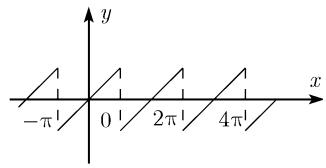

$$
2. y = | x |, - \pi \leqslant x \leqslant \pi ; \quad y = \frac {\pi}{2} - \frac {4}{\pi} \left(\cos x + \frac {\cos 3 x}{3 ^ {2}} + \frac {\cos 5 x}{5 ^ {2}} + \frac {\cos 7 x}{7 ^ {2}} + \dots\right)
$$

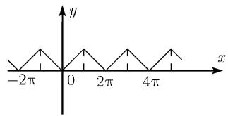

$$
y = x, 0 <   x <   2 \pi ; \quad y = \pi - 2 \left(\frac {\sin x}{1} + \frac {\sin 2 x}{2} + \frac {\sin 3 x}{3} + \dots\right)
$$

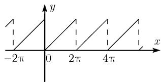

$$
y = \left\{ \begin{array}{l l} x, & - \frac {\pi}{2} \leqslant x \leqslant \frac {\pi}{2}, \\ \pi - x, & \frac {\pi}{2} \leqslant x \leqslant \pi , \\ - (\pi + x), & - \pi \leqslant x \leqslant - \frac {\pi}{2}; \end{array} \right.
$$

$$
y = \frac {4}{\pi} \left(\sin x - \frac {\sin 3 x}{3 ^ {2}} + \frac {\sin 5 x}{5 ^ {2}} - \dots\right)
$$

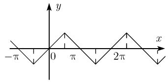

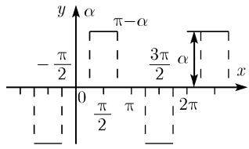

续表

$$
5. y = \left\{ \begin{array}{l l} - a, & - \pi <   x <   0, \\ a, & 0 <   x <   \pi ; \end{array} \right. \quad y = \frac {4 a}{\pi} \left(\sin x + \frac {\sin 3 x}{3} + \frac {\sin 5 x}{5} + \dots\right)
$$

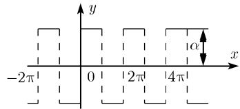

$$
6. y = \left\{ \begin{array}{l l} c _ {1}, & - \pi <   x <   0, \\ c _ {2}, & 0 <   x <   \pi ; \end{array} \right.
$$

$$
y = \frac {c _ {1} + c _ {2}}{2} - 2 \frac {c _ {1} - c _ {2}}{\pi} \left(\sin x + \frac {\sin 3 x}{3} + \frac {\sin 5 x}{5} + \dots\right)
$$

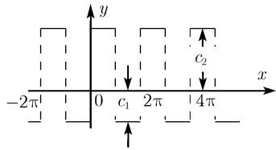

$$
7. y = \left\{ \begin{array}{l l} 0, & - \pi <   x <   - \pi + \alpha , \quad - \alpha <   x <   \alpha , \quad \pi - \alpha <   x <   \pi , \\ a, & \alpha <   x <   \pi - \alpha , \\ - a, & - \pi + \alpha <   x <   - \alpha ; \end{array} \right.
$$

$$
y = \frac {4 a}{\pi} \left(\cos \alpha \sin x + \frac {1}{3} \cos 3 \alpha \sin 3 x + \frac {1}{5} \cos 5 \alpha \sin 5 x + \dots\right)
$$

$$
y = \left\{ \begin{array}{l l} \frac {a x}{\alpha}, & - \alpha \leqslant x \leqslant \alpha , \\ a, & \alpha \leqslant x \leqslant \pi - \alpha , \\ - a, & - \pi + a \leqslant x \leqslant - \alpha , \\ \frac {a (\pi - x)}{\alpha}, & \pi - \alpha \leqslant x \leqslant \pi , \\ - \frac {a (x + \pi)}{\alpha}, & - \pi \leqslant x \leqslant - \pi + \alpha ; \end{array} \right.
$$

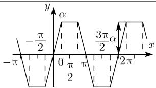

$$
y = \frac {4 a}{\pi \alpha} \left(\sin \alpha \sin x + \frac {1}{3 ^ {2}} \sin 3 \alpha \sin 3 x + \frac {1}{5 ^ {2}} \sin 5 \alpha \sin 5 x + \dots\right)
$$

特别地, 当 $\alpha = \frac{\pi}{3}$ 时,

$$
y = \frac {6 a \sqrt {3}}{\pi^ {2}} \left(\sin x - \frac {1}{5 ^ {2}} \sin 5 x + \frac {1}{7 ^ {2}} \sin 7 x - \frac {1}{1 1 ^ {2}} \sin 1 1 x + \dots\right)
$$

续表

9. $y = x^{2}, -\pi \leqslant x \leqslant \pi;$ $y = \frac{\pi^{2}}{3} - 4 \left( \cos x - \frac{\cos 2x}{2^{2}} + \frac{\cos 3x}{3^{2}} - \cdots \right)$

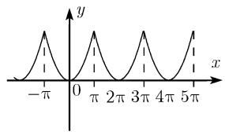

10. $y = \left\{ \begin{array}{ll} - x^{2}, & -\pi <  x\leqslant 0,\\ x^{2}, & 0\leqslant x <   \pi ; \end{array} \right.$

$$
\begin{array}{c} y = 2 \pi \left(\sin x - \frac {\sin 2 x}{2} + \frac {\sin 3 x}{3} - \dots\right) \\ - \frac {8}{\pi} \left(\frac {\sin x}{1 ^ {3}} + \frac {\sin 3 x}{3 ^ {3}} + \frac {\sin 5 x}{5 ^ {3}} + \dots\right) \end{array}
$$

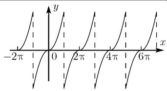

11. $y = x(\pi - x)$ , $0 \leqslant x \leqslant \pi$ ,

$(-π,0)$ 上的一个偶扩张;

$$
y = \frac {\pi^ {2}}{6} - \left(\frac {\cos 2 x}{1 ^ {2}} + \frac {\cos 4 x}{2 ^ {2}} + \frac {\cos 6 x}{3 ^ {2}} + \dots\right)
$$

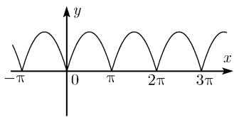

12. $y = x(\pi - x)$ , $0 \leqslant x \leqslant \pi$ ,

$(-π,0)$ 上的一个奇扩张;

$$
y = \frac {8}{\pi} \left(\sin x + \frac {\sin 3 x}{3 ^ {3}} + \frac {\sin 5 x}{5 ^ {3}} + \dots\right)
$$

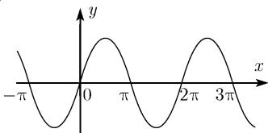

13. $y = Ax^{2} + Bx + C,\quad -\pi < x < \pi;$

$$
y = \frac {A \pi^ {2}}{3} + C + 4 A \sum_ {k = 1} ^ {\infty} (- 1) ^ {k} \frac {\cos k x}{k ^ {2}} - 2 B \sum_ {k = 1} ^ {\infty} (- 1) ^ {k} \frac {\sin k x}{k}
$$

14. $y = |\sin x|, -\pi \leqslant x\leqslant \pi ;$

$$
y = \frac {2}{\pi} - \frac {4}{\pi} \left(\frac {\cos 2 x}{1 \cdot 3} + \frac {\cos 4 x}{3 \cdot 5} + \frac {\cos 6 x}{5 \cdot 7} + \dots\right)
$$

15. $y = \cos x,\quad 0 < x < \pi,$

$(-π,0)$ 上的一个奇扩张;

$$
y = \frac {4}{\pi} \left(\frac {2 \sin 2 x}{1 \cdot 3} + \frac {4 \sin 4 x}{3 \cdot 5} + \frac {6 \sin 6 x}{5 \cdot 7} + \dots\right)
$$

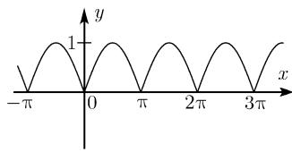

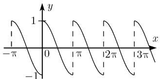

续表

$$
\begin{array}{l} 1 6. y = \left\{ \begin{array}{l l} 0, & - \pi \leqslant x \leqslant 0, \\ \sin x, & 0 \leqslant x \leqslant \pi ; \end{array} \right. \\ y = \frac {1}{\pi} + \frac {1}{2} \sin x - \frac {2}{\pi} \left(\frac {\cos 2 x}{1 \cdot 3} + \frac {\cos 4 x}{3 \cdot 5} + \frac {\cos 6 x}{5 \cdot 7} + \dots\right) \end{array}
$$

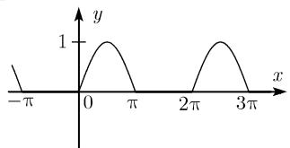

17. $y = \cos ux, -\pi \leqslant x \leqslant \pi, u$ 为任意实但非整数；

$$
y = \frac {2 u \sin u \pi}{\pi} \left(\frac {1}{2 u ^ {2}} - \frac {\cos x}{u ^ {2} - 1} + \frac {\cos 2 x}{u ^ {2} - 4} - \frac {\cos 3 x}{u ^ {2} - 9} + \dots\right)
$$

18. $y = \sin ux,\quad -\pi < x < \pi,\quad u$ 为任意实但非整数;

$$
y = \frac {2 \sin u \pi}{\pi} \left(- \frac {\sin x}{u ^ {2} - 1} + \frac {2 \sin 2 x}{u ^ {2} - 4} - \frac {3 \sin 3 x}{u ^ {2} - 9} + \dots\right)
$$

19. $y = x\cos x, - \pi <  x <   \pi ;$

$$
y = - \frac {1}{2} \sin x + \frac {4 \sin 2 x}{2 ^ {2} - 1} - \frac {6 \sin 3 x}{3 ^ {2} - 1} + \frac {8 \sin 4 x}{4 ^ {2} - 1} - \dots
$$

$$
2 0. y = x \sin x, - \pi \leqslant x \leqslant \pi ;
$$

$$
y = 1 - \frac {1}{2} \cos x - 2 \left(\frac {\cos 2 x}{2 ^ {2} - 1} - \frac {\cos 3 x}{3 ^ {2} - 1} + \frac {\cos 4 x}{4 ^ {2} - 1} - \dots\right)
$$

21. $y = \cosh ux, -\pi \leqslant x \leqslant \pi;$

$$
y = \frac {2 u \sinh u \pi}{\pi} \left(\frac {1}{2 u ^ {2}} - \frac {\cos x}{u ^ {2} + 1 ^ {2}} + \frac {\cos 2 x}{u ^ {2} + 2 ^ {2}} - \frac {\cos 3 x}{u ^ {2} + 3 ^ {2}} + \dots\right)
$$

$$
2 2. y = \sinh u x, - \pi <   x <   \pi ;
$$

$$
y = \frac {2 \sinh u \pi}{\pi} \left(\frac {\sin x}{u ^ {2} + 1 ^ {2}} - \frac {2 \sin 2 x}{u ^ {2} + 2 ^ {2}} + \frac {3 \sin 3 x}{u ^ {2} + 3 ^ {2}} - \dots\right)
$$

$$
2 3. y = \mathrm{e} ^ {a x}, - \pi <   x <   \pi , a \neq 0;
$$

$$
y = \frac {2}{\pi} \sinh a \pi \left(\frac {1}{2 a} + \sum_ {k = 1} ^ {\infty} \frac {(- 1) ^ {k}}{a ^ {2} + k ^ {2}} (a \cos k x - k \sin k x)\right)
$$

在下面的例子中, 问题并不是如何把一个已知函数变成傅里叶级数, 而是考虑某些简单的三角级数收敛到哪些函数.

$$
2 4. \sum_ {k = 1} ^ {\infty} \frac {\cos k x}{k} = - \ln \left(2 \sin \frac {x}{2}\right), \quad 0 <   x <   2 \pi .
$$

$$
2 5. \sum_ {k = 1} ^ {\infty} \frac {\sin k x}{k} = \frac {\pi - x}{2}, \quad 0 <   x <   2 \pi .
$$

26. $\sum_{k=1}^{\infty} \frac{\cos kx}{k^2} = \frac{3x^2 - 6\pi x + 2\pi^2}{12}, \quad 0 \leqslant x \leqslant 2\pi.$

27. $\sum_{k=1}^{\infty}\frac{\sin kx}{k^{2}}=-\int_{0}^{x}\ln\left(2\sin\frac{z}{2}\right)\mathrm{d}z,\quad0\leqslant x\leqslant2\pi.$

28. $\sum_{k=1}^{\infty} \frac{\cos kx}{k^3} = \int_0^x \mathrm{d}z \int_0^z \ln \left(2 \sin \frac{t}{2}\right) \mathrm{d}t + \sum_{k=1}^{\infty} \frac{1}{k^3}, \quad 0 \leqslant x \leqslant 2\pi$

$$
\left(\sum_ {k = 1} ^ {\infty} \frac {1}{k ^ {3}} = \frac {\pi^ {3}}{2 5 . 7 9 4 3 6 \cdots} = 1. 2 0 2 0 6 \dots\right).
$$

29. $\sum_{k=1}^{\infty} \frac{\sin kx}{k^3} = \frac{x^3 - 3\pi x^2 + 2\pi^2x}{12}, \quad 0 \leqslant x \leqslant 2\pi.$

30. $\sum_{k=1}^{\infty}(-1)^{k+1}\frac{\cos kx}{k}=\ln\left(2\cos\frac{x}{2}\right),\quad-\pi<x<\pi.$

31. $\sum_{k=1}^{\infty}(-1)^{k+1}\frac{\sin kx}{k}=\frac{x}{2},\quad-\pi<x<\pi.$

32. $\sum_{k=1}^{\infty} (-1)^{k+1} \frac{\cos kx}{k^2} = \frac{\pi^2 - 3x^2}{12}, \quad -\pi \leqslant x \leqslant \pi.$

33. $\sum_{k=1}^{\infty}(-1)^{k+1}\frac{\sin kx}{k^{2}}=\int_{0}^{x}\ln\left(2\cos\frac{z}{2}\right)\mathrm{d}z,\quad-\pi\leqslant x\leqslant\pi.$

$$
\sum_ {k = 1} ^ {\infty} (- 1) ^ {k + 1} \frac {\cos k x}{k ^ {3}} = \sum_ {k = 1} ^ {\infty} (- 1) ^ {k + 1} \cdot \frac {1}{k ^ {3}} - \int_ {0} ^ {x} d z \int_ {0} ^ {z} \ln \left(2 \cos \frac {t}{2}\right) d t,
$$

$$
- \pi \leqslant x \leqslant \pi .
$$

35. $\sum_{k=1}^{\infty} (-1)^{k+1} \frac{\sin kx}{k^3} = \frac{\pi^2 x - x^3}{12}, \quad -\pi \leqslant x \leqslant \pi.$

36. $\sum_{k=0}^{\infty}\frac{\cos(2k+1)x}{2k+1}=-\frac{1}{2}\ln\left(\tan\frac{x}{2}\right)$ , $0<x<\pi.$

37. $\sum_{k=0}^{\infty}\frac{\sin(2k+1)x}{2k+1}=\frac{\pi}{4},\quad0<x<\pi.$

38. $\sum_{k=0}^{\infty}\frac{\cos(2k+1)x}{(2k+1)^{2}}=\frac{\pi^{2}-2\pi x}{8},\quad0\leqslant x\leqslant\pi.$

$$
\sum_ {k = 0} ^ {\infty} \frac {\sin (2 k + 1) x}{(2 k + 1) ^ {2}} = - \frac {1}{2} \int_ {0} ^ {x} \ln \left(\tan \frac {z}{2}\right) \mathrm{d} z, \quad 0 \leqslant x \leqslant \pi .
$$

40. $\sum_{k=0}^{\infty} \frac{\cos(2k+1)x}{(2k+1)^3} = \frac{1}{2} \int_0^x \mathrm{d}z \int_0^z \ln \left(\tan \frac{t}{2}\right) \mathrm{d}t + \sum_{k=0}^{\infty} \frac{1}{(2k+1)^3},$

$$
0 \leqslant x \leqslant \pi .
$$

$$
\sum_ {k = 0} ^ {\infty} \frac {\sin (2 k + 1) x}{(2 k + 1) ^ {3}} = \frac {\pi^ {2} x - \pi x ^ {2}}{8}, \quad 0 \leqslant x \leqslant \pi .
$$

$$
4 2. \sum_ {k = 0} ^ {\infty} (- 1) ^ {k} \frac {\cos (2 k + 1) x}{2 k + 1} = \frac {\pi}{4}, - \frac {\pi}{2} <   x <   \frac {\pi}{2}.
$$

$$
4 3. \sum_ {k = 0} ^ {\infty} (- 1) ^ {k} \frac {\sin (2 k + 1) x}{2 k + 1} = - \frac {1}{2} \ln \left[ \tan \left(\frac {\pi}{4} - \frac {x}{2}\right) \right], \quad - \frac {\pi}{2} <   x <   \frac {\pi}{2}.
$$

$$
4 4. \sum_ {k = 0} ^ {\infty} (- 1) ^ {k} \frac {\cos (2 k + 1) x}{(2 k + 1) ^ {2}} = - \frac {1}{2} \int_ {0} ^ {\frac {\pi}{2} - x} \ln \left(\tan \frac {z}{2}\right) \mathrm{d} z, - \frac {\pi}{2} \leqslant x \leqslant \frac {\pi}{2}.
$$

$$
4 5. \sum_ {k = 0} ^ {\infty} (- 1) ^ {k} \frac {\sin (2 k + 1) x}{(2 k + 1) ^ {2}} = \frac {\pi x}{4}, - \frac {\pi}{2} \leqslant x \leqslant \frac {\pi}{2}.
$$

$$
4 6. \sum_ {k = 0} ^ {\infty} (- 1) ^ {k} \frac {\cos (2 k + 1) x}{(2 k + 1) ^ {3}} = \frac {\pi^ {3} - 4 \pi x ^ {2}}{3 2}, \quad - \frac {\pi}{2} \leqslant x \leqslant \frac {\pi}{2}.
$$

$$
\begin{array}{c} 4 7. \sum_ {k = 0} ^ {\infty} (- 1) ^ {k} \frac {\sin (2 k + 1) x}{(2 k + 1) ^ {3}} = \frac {1}{2} \int_ {0} ^ {\frac {\pi}{2} - x} \mathrm{d} z \int_ {0} ^ {z} \ln \left(\tan \frac {t}{2}\right) \mathrm{d} t + \sum_ {k = 0} ^ {\infty} \frac {1}{(2 k + 1) ^ {3}}, \\ - \frac {\pi}{2} \leqslant x \leqslant \frac {\pi}{2} \end{array}
$$
