#### 1.1 初等分析

没有直觉的概念是空洞的, 没有概念的直觉是盲目的.

I. 康德 (1724—1804)

##### 1.1.1 实数

实数的直觉介绍 $^{2)}$ 设一条直线 G 上有两个点, 分别为 0, 1, 如图 1.2(a) 所示. G

这表示, 字母 “a” 出来了 6 次, 等. 牛顿的词 “fluentes” 和 “fluxiones” 对应于现代词汇 “函数” 和 “导数”. 看来, 解出这个字谜与发现微积分一样, 都是伟大的智力成果.

2) 实数的严格定义及涉及的实数史上对无理数的争议, 可参看 1.2.2. 正是诸如 “无理数”、“虚数” 和 “超越数” 这些术语表明了几个世纪以来必须要克服的认识论上的困难.

上每个点 $a$ 对应一个实数, 这样就得到了实数直线. 为简单起见, 我们可以用同样的符号表示直线 $G$ 的点 $a$ 及和它对应的实数. 从 0 到 1 的线段称为 $G$ 中的单位线段 $E$ .

(b)  

  
(c)

  
(d)  
图1.2 实数直线

序 对任意两个实数 a, b, 当且仅当点 a 严格位于点 b 的左边, 记为

$$
\boxed {a <   b,}
$$

这时称 $a$ 小于 $b$ (图1.2(b)). 如果 $a < b$ 或 $a = b$ , 则记作 $a \leqslant b$ , 这时称 $a$ 小于或等于 $b$ .

实数 a 是正的 (负的, 非负), 当且仅当 $0 < a (a < 0, 0 \leqslant a)$ .

数的概念的演化 实际上, 数的概念是人类迄今所作的抽象概念中最伟大成就之一. 当有了 “两个” 的抽象概念时, 人们就不用说 “两棵树”, “两块石头” 诸如此类来指代两个. 这大概发生在 10 000 年前的新石器时代, 那时在亚洲和欧洲, 冰河时代刚结束, 猿人开始定居. 大约 15 000 年前在法国和西班牙的壁画证实, 这个时期的猿人已经对形状有了敏锐的感觉.

大约公元前 3000 年在底格里斯河和幼发拉底河附近 (现在的伊拉克), 第一个苏美尔人居住区在美索不达米亚建立. 巴比伦人和亚述人的数学成就的水平可以追溯到这些苏美尔人. 这个数系以 60 为基础 (称为六十进制, 60 对应我们现在的 10). 巴比伦人修改了这个体系, 大约在公元前 600 年的时候加了一个空位, 这相当于我们现在的数 0.

1.1.1.1 自然数和整数

数字

$$
0, 1, 2, 3, \dots
$$

对应着相继的单位长度线段, 它们被称为自然数 $^{1)}$ (图 1.2(c)). 另外, 我们称诸数

$$
\dots , - 3, - 2, - 1, 0, 1, 2, 3, \dots
$$

为整数(图 1.2(d)). 假设直线 G 是温度计, 这时负数对应于零下温度. 两个整数之和对应于温度之和.

例 1: 等式

$$
\boxed {- 3 + 5 = 2}
$$

可以如下解释：如果早上的温度是 $-3^{\circ}C$ ，到中午的时候温度上升了 $5^{\circ}C$ ，那么温度就是 $2^{\circ}C$ .

整数的乘法规则是

$$
\begin{array}{r l} & {\text {“正数乘以正数} = \text {负数乘以负数} = \text {正数}}, \\ & {\text {“正数乘以负数} = \text {负数乘以正数} = \text {负数}}. \end{array}\tag{1.1}
$$

整数的除法规则是

$$
\begin{array}{r l} & {\text {“正数除以正数} = \text {负数除以负数} = \text {正数”,}} \\ & {\text {“正数除以负数} = \text {负数除以正数} = \text {负数”.}} \end{array}\tag{1.2}
$$

我们用 +12 代替 12, 等等.

例 2:

$$
\begin{array}{c} 3 \cdot 4 = (+ 3) (+ 4) = + 1 2 = 1 2, \\ (- 3) (+ 4) = - 1 2, \quad (+ 3) (- 4) = - 1 2, \quad (- 3) (- 4) = 1 2, \\ (- 1 2) \div (+ 4) = - 3, \quad (- 1 2) \div (- 4) = 3, \quad 1 2 \div (- 4) = - 3. \end{array}
$$

从 $3 \cdot 4 = 12$ 可得 $12 \div 4 = 3$ . 和预期的一样, 比较上面的第 2 行和第 3 行, 我们发现乘法的逆对整数仍然成立.

1.1.1.2 有理数

基本思想 如果把单位线段分成部分, 就会碰到有理数 (分数).

例 1: 令 n 为一个正常的自然数. 如果我们把单位线段 E 分成 n 等份, 将得到 n 个点, 记作

$$
\frac {1}{n}, \frac {2}{n}, \frac {3}{n}, \dots , \frac {n - 1}{n}, \frac {n}{n} = 1.
$$

特别地, 当 $n = 2$ (或 $n = 4$ ) 时有

$$
\frac {1}{2}, \frac {2}{2} = 1, \quad \text {或} \quad \frac {1}{4}, \frac {2}{4}, \frac {3}{4}, \frac {4}{4} = 1.
$$

(图 1.3(a)). 在分数 m/n 中, $m(n)$ 称为分子(分母).

约分和扩分 由图1.3(a)可得

$$
\frac {2}{4} = \frac {1}{2}.
$$

这个关系式是如下一般规则的特例：

分子、分母乘以 (除以) 相同的自然数 n, 分数值不变.

这个过程称为“扩分”（“约分”）.

  
(a)

  
(b)  
图 1.3 实数直线上的分数

例 2: 分数 $\frac{2}{3}$ 用 4 扩分得

$$
\frac {2}{3} = \frac {2 \cdot 4}{3 \cdot 4} = \frac {8}{1 2}.
$$

通过除以 4 来简化 $\frac{8}{12}$ ，得到 $\frac{8}{12} = \frac{8 \div 4}{12 \div 4} = \frac{2}{3}$ .

分数的乘法 分数的乘法法则如下:

“分子乘以分子, 分母乘以分母”.

例 3: $\frac{2}{3} \cdot \frac{3}{4} = \frac{2 \cdot 3}{3 \cdot 4} = \frac{6}{12}.$

分数的除法 把分数的分子和分母互换位置就得到它的倒数. 除法法则是:

两个分数相除, 就是第 1 个分数乘以第 2 个分数的倒数.

例 4: $\frac{3}{5}$ 的倒数是 $\frac{5}{3}$ . 因此

$$
\frac {2}{7} \div \frac {3}{5} = \frac {2}{7} \cdot \frac {5}{3} = \frac {2 \cdot 5}{7 \cdot 3} = \frac {1 0}{2 1}.
$$

分数的加法 两个分数相加, 需先通分, 使分母相同, 然后分子相加.

例 5: $\frac{1}{2} + \frac{3}{4} = \frac{2}{4} + \frac{3}{4} = \frac{5}{4}$ .

这个程序和一般的“十字相乘法”一样：

$$
\boxed {\frac {a}{b} + \frac {c}{d} = \frac {a d + b c}{b d}.}
$$

例 6: $\frac{1}{2} + \frac{3}{4} = \frac{1 \cdot 4 + 2 \cdot 3}{2 \cdot 4} = \frac{4 + 6}{8} = \frac{10}{8}$ . 约分得 $\frac{5}{4}$ .

负分数 如果 m, n 是正常的自然数, 那么把点 $\frac{m}{n}$ 过原点 (点 O) 反射可得点 $-\frac{m}{n}$ . 整数构成的分数的符号由法则 (1.2) 决定.

例 7: $\frac{(-3)}{(-4)} = +\frac{3}{4} = \frac{3}{4}, \quad \frac{(-3)}{4} = -\frac{3}{4}, \quad \frac{3}{(-4)} = -\frac{3}{4}.$

法则 (1.1)、(1.2) 中符号似乎是任意选择的, 实际上需要保证满足实数的 “简单” 计算法则. 例如, 要求结合律成立

$$
a (b + c) = a b + a c,
$$

当 $a = 4, b = 3, c = -3$ 时, 有

$$
4 (3 + (- 3)) = 4 \cdot 0 = 0,
$$

且

$$
4 (3 + (- 3)) = 4 \cdot 3 + 4 \cdot (- 3) = 1 2 + 4 \cdot (- 3) = 0,
$$

或者换句话说 $4(-3) = -12$ ，与法则 (1.1) 给出的值相符.

定义 所有形式为 $\frac{a}{b}$ 的实数 (其中 a, b 是整数) 称为有理数.

不是有理数的实数称为无理数. 例如, $\sqrt{2}$ 是无理数; 古代就有了对这一事实的经典证明, 见4.2.1.

在现代的著作中, 下列符号都是常用的:

$\begin{array}{r}\mathbb{N}:= \text{自然数集},\\ \mathbb{Z}:= \text{整数集},\\ \mathbb{Q}:= \text{有理数集},\\ \mathbb{R}:= \text{实数集},\\ \mathbb{C}:= \text{复数集}. \end{array}$

幂 对于实数 $a \neq 0$ , 令

$$
\boxed { \begin{array}{c} a ^ {0} := 1, \quad a ^ {1} := a, \quad a ^ {2} := a \cdot a, \quad a ^ {3} := a \cdot a \cdot a, \quad \dots , \\ a ^ {- 1} := \frac {1}{a}, \quad a ^ {- 2} := \frac {1}{a ^ {2}}, \quad a ^ {- 3} := \frac {1}{a ^ {3}}, \quad \dots . \end{array} }
$$

例 8: $2^{0}=1,\quad2^{2}=4,\quad2^{3}=8,\quad2^{-1}=\frac{1}{2},\quad2^{-2}=\frac{1}{4}.$

1.1.1.3 十进制小数

基本思想 我们在日常生活中使用十进制系统 $^{1)}$ . 数的符号 123 实际是数

$$
1 \cdot \mathbf {1 0} ^ {2} + 2 \cdot \mathbf {1 0} ^ {1} + 3 \cdot \mathbf {1 0} ^ {0}
$$

的缩写.

同样, 数的符号 2.43 代表和:

$$
2 \cdot \mathbf {1 0} ^ {0} + 4 \cdot \mathbf {1 0} ^ {- 1} + 3 \cdot \mathbf {1 0} ^ {- 2}.\tag{1.3}
$$

最后, 像 2.43567… 这样的符号表示 (唯一) 实数 x, 它满足下列无穷不等式组:

$$
\begin{array}{c} 2. 4 \leqslant x <   2. 4 + \mathbf {1 0} ^ {- 1}, \\ 2. 4 3 \leqslant x <   2. 4 3 + \mathbf {1 0} ^ {- 2}, \\ 2. 4 3 5 \leqslant x <   2. 4 3 5 + \mathbf {1 0} ^ {- 3}, \\ \dots \dots \end{array}\tag{1.4}
$$

展开成十进制小数 下面所有的 $a_{j}$ 假定为整数, $a_{j}=0,1,\cdots,9$ , 且 $a_{n}\neq0$ . 而且, 设 $n=0,1,2,\cdots$ 为自然数, m 是某一正常自然数.

(i) 同 (1.3) 一样, 符号

$$
\boxed {a _ {n} a _ {n - 1} \dots a _ {0}. a _ {- 1} a _ {- 2} \dots a _ {- m}}
$$

表示如下和:

$$
a _ {n} \cdot \mathbf {1 0} ^ {n} + a _ {n - 1} \cdot \mathbf {1 0} ^ {n - 1} + \dots + a _ {0} \cdot \mathbf {1 0} ^ {0} + a _ {- 1} \cdot \mathbf {1 0} ^ {- 1} + a _ {- 2} \cdot \mathbf {1 0} ^ {- 2} + \dots + a _ {- m} \cdot \mathbf {1 0} ^ {- m}.
$$

(ii) 符号 $a_{n}a_{n-1}\cdots a_{0}.a_{-1}a_{-2}\cdots$ 表示 (唯一) 实数 x, 和 (1.4) 一样, 它满足下列不等式链:

$$
\left| a _ {n} \dots a _ {0}. a _ {- 1} a _ {- 2} \dots a _ {- m} \leqslant x <   a _ {n} \dots a _ {0}. a _ {- 1} a _ {- 2} \dots a _ {- m} + \mathbf {1 0} ^ {- m}, \quad m = 1, 2, \dots . \right|
$$

每个实数都可以唯一展开成这样的十进制小数.

定理 一个实数是有理数, 当且仅当它的十进制小数展开式是有限的或周期的.
例 1: $\frac{1}{4}=0.25$ 和 $\frac{1}{3}=0.333333\cdots$ 是有理数. 另一方面, $\sqrt{2}$ 的十进制展开

$$
\sqrt {2} = 1. 4 1 4 2 1 3 5 6 2 \dots\tag{1.5}
$$

没有周期.

实数的舍入规则 舍入目标是把无限的十进制展开变成有限的, 且使误差尽可能小.
例 2:

(i) 2.3456\$\cdots\$ 入为 2.346.

(ii) 2.3454\$\cdots\$ 舍为 2.345.

(iii) 2.3455… 入为 2.346.

(iv) 2.3465\$\cdots\$ 舍为 2.346.

每种情况的误差都小于 0.0005.

这是应用了下面的法则：如果最后一个数字是 0\~4(或 6\~9)，则舍 (或入). 如果最后一个数字是 5，那么可以舍或入，根据舍入后，最后一位数字是否为偶数来决定. $^{1)}$ 然而，一般的程序是把 5 入上去.

实数的整数部分 对于实数 $a$ , 符号 [a](称为高斯括号) 表示 $a$ 的整数部分, 它定义为使得 $g \leqslant a$ 的最大整数 $g$ .

例 3: [2]=2, [1.99]=1, [-2.5]=-3.

1.1.1.4 二进制数

把上述展开式中的10替换成2, $a_{j}$ 取 0 或 1, 就得到了二进制数系. 一个任意实数可以唯一展开成二进制数, 展开式中系数只出现 0 或 1. 由于这一性质, 二进制数被用于计算机.

例：在二进制数系中，符号 1010.01 表示：

$$
1 \cdot \mathbf {2} ^ {3} + 0 \cdot \mathbf {2} ^ {2} + 1 \cdot \mathbf {2} ^ {1} + 0 \cdot \mathbf {2} ^ {0} + 0 \cdot \mathbf {2} ^ {- 1} + 1 \cdot \mathbf {2} ^ {- 2},
$$

它是十进制数系中的 $8 + 2 + \frac{1}{4} = 10.25$ .

其他数系 把 1.1.1.3 中的数 10 换成任一固定的自然数 $\beta \geqslant 2$ ，就得到了基数为 $\beta$ 的数系。比如，大约公元 2000 年前，美索不达米亚的苏美尔人使用了基为 60 的六十进制数系。我们把 1 小时分成 60 分钟，把圆分成 360 度，都可追溯到苏美尔人。

墨西哥的玛雅人和欧洲的凯尔特人使用的是基数 $\beta=20$ 的数系. 古埃及人使用的是十进制数系, 每个十进制单位都有特殊的符号. 罗马人的数系使用相同的原理. 罗马数字

$$
\mathrm{M}, \mathrm{D}, \mathrm{C}, \mathrm{L}, \mathrm{X}, \mathrm{V}, \mathrm{I}
$$

分别表示 1000, 500, 100, 50, 10, 5, 1. 例如符号 MDCLXVII 对应着数 1667. 人们没有采用这样的数系进行复杂的计算.

1.1.1.5 区间

设 a, b 是实数, 且 a < b. 定义一个紧区间(有端点 a 和 b) 是集合 (图 1.4(a)):

$$
[ a, b ] := \{x \in \mathbb {R} | a \leqslant x \leqslant b \}.
$$

总之, 区间 $[a, b]$ 由 $\mathbb{R}$ 中使 $a \leqslant x \leqslant b$ 的所有实数 $x$ 构成. 而且, 我们定义2)(图

1.4(b)\~(d)):

$$
\begin{array}{l l} {{] a, b [ := \{x \in \mathbb {R} | a <   x <   b \};}} & {{(\text {开区间})}} \\ {{[ a, b [ := \{x \in \mathbb {R} | a \leqslant x <   b \};}} & {{(\text {右半开区间})}} \\ {{] a, b ] := \{x \in \mathbb {R} | a <   x \leqslant b \}.}} & {{(\text {左半开区间})}} \end{array}
$$

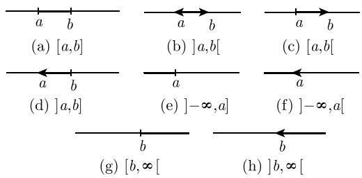  
图1.4 实数直线上的区间

通常使用下面的无限区间 (图 1.4(e)\~(h)):

$$
\begin{array}{l} ] - \infty , a ] := \{x \in \mathbb {R} | x \leqslant a \}, \quad ] - \infty , a [ := \{x \in \mathbb {R} | x <   a \}, \\ [ b, \infty [ := \{x \in \mathbb {R} | b \leqslant x \}, \quad ] b, \infty [ := \{x \in \mathbb {R} | b <   x \}. \end{array}
$$

实数集合 $\mathbb{R}$ 也可记作 $]-\infty, \infty[$ .

##### 1.1.2 复数

复数的形式引入 $^{1)}$ 没有一个实数 x 满足方程:

$$
x ^ {2} = - 1.
$$

这是在 16 世纪中叶意大利数学家 R. 邦贝利(Raphael Bombelli) 引进符号 $\sqrt{-1}$ 的途径. L. 欧拉(Leonhard Euler, 1707—1783) 在这种情况下使用符号 i. 这个所谓的虚数单位满足方程:

$$
\boxed {\mathrm{i} ^ {2} = - 1.}\tag{1.6}
$$

欧拉发现, 对所有实数 x, y 都满足下面的基本关系式:

$$
\boxed {\mathrm{e} ^ {x + \mathrm{i} y} = \mathrm{e} ^ {x} (\cos y + \mathrm{i} \cdot \sin y).}\tag{1.7}
$$

这得到了指数函数与三角函数之间一个意想不到的关系 $^{2)}$ . 这个公式通常应用到振动理论 (比较 1.1.3).

笛卡儿 (Descartes) 表示 一个复数是形为

$$
\boxed {x + \mathrm{i} y}
$$

的符号, 其中 $x, y$ 是实数. 实数对应着特殊情况 $y = 0$ . 长期以来, 复数显得十分神秘. 高斯(Gauss) 把 $x + \mathrm{i}y$ 看成笛卡儿平面上的点, 从而使它们在数学中获得了恰当的位置; 他证明, 可以赋予复数计算以几何解释 (图1.5). 现在, 复数在数学、物理学和技术的许多方面普遍存在.

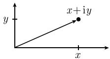  
(a)

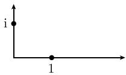  
(b)  
图1.5 复数的图示

在对复数 $x + \mathrm{i}y$ 进行运算时可应用通常的公式, 但是要考虑到 $\mathrm{i}^2 = -1$ . 特别地, 人们称数

$$
\boxed {\overline {{x + \mathrm{i} y}} := x - \mathrm{i} y}
$$

为 $x + iy$ 的共轭复数 $^{1)}$ .

例 1 (加法): $(2 + 3\mathrm{i}) + (1 + 2\mathrm{i}) = 3 + 5\mathrm{i}$ .

例 2 (乘法): $(2 + 3\mathrm{i})(1 + 2\mathrm{i}) = 2 + 3\mathrm{i} + 4\mathrm{i} + 6\mathrm{i}^{2} = 2 + 7\mathrm{i} - 6 = -4 + 7\mathrm{i}.$

对所有实数 $x, y$ , 等式:

$$
\boxed {(x + \mathrm{i} y) (x - \mathrm{i} y) = x ^ {2} + y ^ {2}}\tag{1.8}
$$

成立.

例 3 (除法): 由 (1.8) 可得

$$
\frac {1 + 2 \mathrm{i}}{3 + 2 \mathrm{i}} = \frac {(1 + 2 \mathrm{i}) (3 - 2 \mathrm{i})}{(3 + 2 \mathrm{i}) (3 - 2 \mathrm{i})} = \frac {3 + 6 \mathrm{i} - 2 \mathrm{i} - 4 \mathrm{i} ^ {2}}{9 + 4} = \frac {1}{1 3} (7 + 4 \mathrm{i}).
$$

用分母的共轭复数通分的方法一般是适用的.

1.1.2.1 绝对值

复数 $z = x + \mathrm{i}y$ 的绝对值定义为

$$
\boxed {| z | := \sqrt {x ^ {2} + y ^ {2}}.}
$$

从几何上看, 它是由 z 定义的向量的长度 (图 1.6(a)).

例 1: 对实数 x, 有

$$
| x | := \left\{ \begin{array}{l l} x, & x \geqslant 0, \\ - x, & x <   0. \end{array} \right.
$$

而且， $|\mathrm{i}| = 1$ ， $|1 + \mathrm{i}| = \sqrt{1^2 + 1^2} = \sqrt{2}$

距离 两个复数 $z$ 和 $w$ 之间的距离是

$$
| z - w |
$$

(图 1.6(b), (c)). 特别地, $|z|$ 是原点到 z 的距离.

(a)

  
(b)

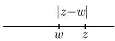

(c)

图 1.6 两个复数之间距离的图示

三角不等式 对任意复数 z, w, 我们有重要的三角不等式:

$$
\boxed {| | z | - | w | | \leqslant | z \pm w | \leqslant | z | + | w |.}\tag{1.9}
$$

特别地, 有 $|z + w| \leqslant |z| + |w|$ , 这表示向量 $z + w$ 的长度至多是向量 $z$ , $w$ 的长度之和 (图1.8(b)). 而且

$$
| z w | = | z | | w |, \quad \left| \frac {z}{w} \right| = \frac {| z |}{| w |}, \quad | z | = | \bar {z} |,
$$

其中当 w 为分母时, $w \neq 0$ .

极坐标下的复数 如果我们使用极坐标, 那么对复数 $z = x + iy$ 有如下表达式:

$$
\boxed {z = r (\cos \varphi + \mathrm{i} \cdot \sin \varphi), \quad - \pi <   \varphi \leqslant \pi , \quad r = | z |.}
$$

这里, $\varphi$ 表示这个向量与 $x$ 轴的夹角 (图1.7). 从欧拉公式(1.7)得到如下漂亮的表达式:

$$
\boxed {z = r \mathrm{e} ^ {\mathrm{i} \varphi}, \quad - \pi <   \varphi \leqslant \pi , \quad r = | z |.}
$$

称角 $\arg z := \varphi$ 为 $z$ 的辐角的主值. 假定 $-\pi < \varphi \leqslant \pi$ ,

这样通过 $z$ 就能唯一决定 $\varphi$ . 满足 $z = r\mathrm{e}^{\mathrm{i}\psi}$ 的所有角

$\psi$ 称为 z 的辐角. 我们有

$$
\psi = \varphi + 2 \pi k, \quad k = 0, \pm 1, \pm 2, \dots .
$$

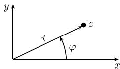

例 2: $i = e^{i\pi/2}$ , $-1 = e^{i\pi}$ , $|i| = |-1| = 1$ , $\arg i = \frac{\pi}{2}$ , $\arg(-1) = \pi$ .

图1.7

<table><tr><td> $a + (b + c) = (a + b) + c,\quad a(bc) = (ab)c$ </td><td>(结合律),</td></tr><tr><td> $a + b = b + a,\quad ab = ba$ </td><td>(交换律),</td></tr><tr><td> $a(b + c) = ab + ac$ </td><td>(分配律).</td></tr></table>

  
(a)

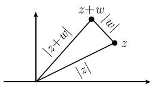  
(b)  
图1.8 复数的加法

1.1.2.2 复数运算的几何表示

我们有：

(i) 复数 z, w 的加法对应着它们表示的向量的加法 (图 1.8(a)).

(ii) 两个复数的乘法

$$
\boxed {r \mathrm{e} ^ {\mathrm{i} \varphi} \cdot \rho \mathrm{e} ^ {\mathrm{i} \psi} = r \rho \mathrm{e} ^ {\mathrm{i} (\varphi + \psi)}}
$$

对应着一个伸缩旋转, 即, 向量的长度相乘、角度相加.

(iii) 两个复数的除法

$$
\boxed {\frac {r \mathrm{e} ^ {\mathrm{i} \varphi}}{\rho \mathrm{e} ^ {\mathrm{i} \psi}} = \frac {r}{\rho} \mathrm{e} ^ {\mathrm{i} (\varphi - \psi)}}
$$

对应着相应向量的长度相除、角度相减.

(iv) 反射. 从复数 $z = x + \mathrm{i}y$ 到其共轭复数 $\bar{z} = x - \mathrm{i}y$ 的转变是把 $z$ 关于实轴反射的几何操作 (图1.9(a)). 从 $z$ 到 $-z$ 的转变是关于原点的反射 (图1.9(b)). 从 $z$ 到共轭复数的倒数 $(\bar{z})^{-1}$ 的转变对应着关于单位圆的反射, 即, 象点和逆象点位于过原点的同一条直线上, 它们与原点距离的积等于1(图1.9(c)).

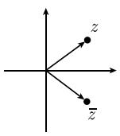  
(a)

  
(b)

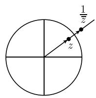  
(c)  
图1.9 复数的共轭及逆的图示

1.1.2.3 算术法则

加法和乘法 对所有的复数 $a, b, c$ , 有

例 1: $(a+b)^{2}=(a+b)(a+b)=a^{2}+ab+ba+b^{2}=a^{2}+2ab+b^{2}$ .

正负号法则 对所有的复数 a, b, 有

$$
\boxed { \begin{array}{c} (- a) (- b) = a b, \quad (- a) b = - a b, \quad a (- b) = - a b, \\ - (- a) = a, \quad (- 1) a = - a. \end{array} }
$$

例 2: $(a - b)^{2} = (a - b)(a - b) = a^{2} - ab - ba + b^{2} = a^{2} - 2ab + b^{2}$ .

例 3: $(a+b)(a-b)=a^{2}+ab-ba-b^{2}=a^{2}-b^{2}$ .

分数的算术 下面我们都将假设分母中出现的复数都不为 0. 对所有复数 $a, b, c, d$ , 有

$$
\left| \begin{array}{l l} \frac {a}{b} = \frac {c}{d} \Leftrightarrow a d = b c & (\text {等式}) ^ {1)}, \\ \frac {a}{b} \cdot \frac {c}{d} = \frac {a c}{b d} & (\text {乘法}), \\ \frac {a}{b} \pm \frac {c}{d} = \frac {a d \pm b c}{b d} & (\text {加法和减法}), \\ \frac {\left(\frac {a}{b}\right)}{\left(\frac {c}{d}\right)} = \frac {a d}{b c} & (\text {除法}). \end{array} \right.
$$

化为共轭复数 如果 $a, b, c, d$ 是任意复数, 其中 $d \neq 0$ , 则有

$$
\overline {{a \pm b}} = \bar {a} \pm \bar {b}, \quad \overline {{a b}} = \bar {a} \cdot \bar {b}, \quad \overline {{\left(\frac {c}{d}\right)}} = \frac {\bar {c}}{\bar {d}}.
$$

设 $z = x + \mathrm{i}y$ .分量 $x(y)$ 叫做 $z$ 的实部(虚部).记作 $x = \operatorname {Re}z(y = \operatorname {Im}z)$ ，则有

$$
\operatorname{Re} z = \frac {1}{2} (z + \bar {z}), \quad \operatorname{Im} z = \frac {1}{2 \mathrm{i}} (z - \bar {z}).
$$

1.1.2.4 复数的根

设复数 $a = |a|\mathrm{e}^{\mathrm{i}\varphi}$ ，其中 $-\pi <  \varphi \leqslant \pi$ ，且 $a\neq 0$

定理 对于固定的 $n=2,3,\cdots$ , 分割圆方程

$$
\boxed {x ^ {n} = a}
$$

的解为

$$
\boxed {x = \sqrt [ n ]{| a |} \left(\cos \left(\frac {2 \pi k + \varphi}{n}\right) + \mathrm{i} \cdot \sin \left(\frac {2 \pi k + \varphi}{n}\right)\right), \quad k = 0, 1, \dots , n - 1.}
$$

1) 简言之: $\frac{a}{b} = \frac{c}{d}$ 蕴涵 $ad = cb$ , 反之亦然.

也可以把这些数记作 $x = \sqrt[n]{|a|} e^{i(2\pi k + \varphi)/n}, k = 0, \cdots, n - 1,$ 它们称为复数 a 的 n 个根. 这 n 个根把半径为 $\sqrt[n]{|a|}$ 的圆周分成 n 等份.

例 1: 当 a = 1, n = 2, 3, 4, a = 1 的 n 个根 (被称为单位根) 如图 1.10 所示.

  
(a) n=2

  
(b) n=3

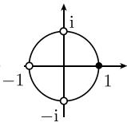  
(c) n=4  
图 1.10 单位根

例 2: $2i = 2e^{i\pi/2}$ 的两个根是

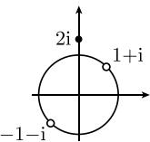  
图1.11  
(图 1.11).

$$
x = \sqrt {2} \left(\cos {\frac {\pi}{4}} + \mathrm{i} \cdot \sin {\frac {\pi}{4}}\right) = 1 + \mathrm{i},
$$

$$
x = \sqrt {2} \left(\cos \left(\pi + \frac {\pi}{4}\right) + \mathrm{i} \cdot \sin \left(\pi + \frac {\pi}{4}\right)\right) = - (1 + \mathrm{i})
$$

##### 1.1.3 在振荡上的应用

给定周期为 T > 0 的函数 f, 即有

$$
\boxed {f (t + T) = f (t), \quad \text {对所有} t \in \mathbb {R}.}
$$

我们还可以定义

$$
\nu := \frac {1}{T} \quad (\text { 频率 }), \quad \omega := 2 \pi \nu \quad (\text { 角频率 }).
$$

例 1 (正弦): 函数

$$
\left| y := A \cdot \sin (\omega t + \alpha) \right|
$$

描述了角频率为 $\omega$ ，振幅为 $A$ 的一个振动(图1.12(a))．数 $\alpha$ 叫做相移.例2(正弦式波)：设 $A > 0,\omega >0$ .函数

$$
\boxed {y (x, t) = A \cdot \sin (\omega t + \alpha - k x)}\tag{1.10}
$$

描述了振幅为 A, 波长为 $\lambda := 2\pi/k$ 的一个波, 它以所谓的波相速度

$$
\boxed {c := \frac {\omega}{k}}
$$

从左向右传播 (图 1.12(b)). 数 $k$ 叫做波数. 根据规则 $kx = \omega t + \alpha - \frac{\pi}{2}$ 随时间移动的点 $(x, y(x, t))$ , 对应着以速度 $c$ 从左向右移动的高度为 $A$ 的波峰.

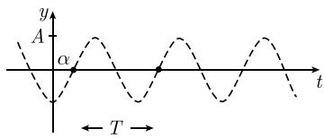

(a)  
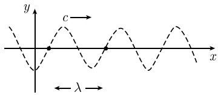  
(b)  
图 1.12 波函数 (振动)

在物理学和应用科学中, 通常用复函数

$$
\boxed {Y (x, t) := C \cdot \mathrm{e} ^ {\mathrm{i} (\omega t - k x)}}
$$

表示这样的波, 其中复振幅 $C = A e^{i\alpha}$ . $Y(x,t)$ 的虚部对应着 (1.10) 中的 $y(x,t)$ .

##### 1.1.4 对等式的运算

对等式的运算 设 $a, b, c$ 为任意实 (或复) 数. 对等式的运算符合下列规则:

$$
a = b \Rightarrow a + c = b + c
$$

(加法),

$$
a = b \Rightarrow a - c = b - c
$$

(减法),

$$
a = b \Rightarrow a c = b c
$$

(乘法),

$$
a = b, c \neq 0 \Rightarrow \frac {a}{c} = \frac {b}{c}
$$

(除法),

$$
a = b, a \neq 0 \Rightarrow \frac {1}{a} = \frac {1}{b}
$$

(倒数).

用语言叙述就是:

(i) 可以在一个等式两边加相同的数, 其结果仍是一个等式.

(ii) 可以在等式两边乘以同一个数.

(iii) 可以在等式两边除以同一个 (不为零的) 数.

(iv) 可以得到等式的倒数.

在情况 (iii) 和 (iv), 必须注意

不允许 0 作除数!

直观上, 一个等式就像衡量平衡的尺度. 对于其两端, 在相同的时间作同样的事就不会打破平衡.

两个等式的运算 对所有实 (或复) 数 a, b, c, d, 有

$$
\begin{array}{l l} {a = b, c = d \Rightarrow a + c = b + d} & {(\text {两个等式的加法}),} \\ {a = b, c = d \Rightarrow a - c = b - d} & {(\text {两个等式的减法}),} \\ {a = b, c = d \Rightarrow a c = b d} & {(\text {两个等式的乘法}),} \\ {a = b, c = d, c \neq 0, \Rightarrow \frac {a}{c} = \frac {b}{d}} & {(\text {两个等式的除法}).} \end{array}
$$

解方程 方程

$$
\boxed {2 x + 3 = 7}\tag{1.11}
$$

的解是一个数, 当我们把 $x$ 替换成这个数时满足 (1.11). 称 $x$ 为变量或未定元. 例 1: 方程 (1.11) 有唯一解 $x = 2$ .

证明：第一步：假设数 $x$ 是(1.11)的解.在(1.11)的左右两边同时减去3,得

$$
2 x = 4.
$$

然后两边同时除以 2, 得

$$
x = 2.
$$

这表明, 如果(1.11)有解, 那么一定是 2.

第二步：现在我们证明，2 确实是 (1.11) 的解。由初等式 $2 \cdot 2 + 3 = 7$ 可得。☐

第二步也称为“检验”。通常，数学错误的出现是因为混淆了第一步与一个完整的证明(参看4.2.6.2).

例 2 (线性方程组): 设 $a, b, c, d, \alpha, \beta$ 为实 (或复) 数, 且 $ad - bc \neq 0$ . 那么方程组

$$
\boxed {\left\{ \begin{array}{l} a x + b y = \alpha , \\ c x + d y = \beta \end{array} \right.}\tag{1.12}
$$

有唯一解

$$
x = \frac {\alpha d - \beta b}{a d - b c}, y = \frac {a \beta - c \alpha}{a d - b c}.\tag{1.13}
$$

证明：第一步：假设数 $x, y$ 满足方程组 (1.12). 用 $d$ (或 $(-b)$ ) 乘 (1.12) 的第一个 (或第二个) 方程, 得

$$
\left\{ \begin{array}{l} a d x + b d y = \alpha d, \\ - b c x - b d y = - b \beta . \end{array} \right.
$$

把这些方程加起来, 则得到

$$
(a d - b c) x = \alpha d - \beta b.
$$

两边同除以 ad - bc 后, 就得到了 (1.13) 中 x 的表达式.

现在 (1.12) 的第一个 (第二个) 方程两边同乘以 $(-c)$ (或 $a$ ), 得

$$
\left\{ \begin{array}{l l} - c a x - c b y = - c \alpha , \\ a c x + a d y = a \beta . \end{array} \right.
$$

两个方程相加, 得

$$
(a d - b c) y = a \beta - c \alpha .
$$

两边同除以 $ad - bc$ 后, 就得到了 (1.13) 中 $y$ 的表达式. 这表明, 如果 (1.12) 的解存在, 那么一定为 (1.13). 特别地, 存在唯一解.

第二步 (检验): 把 (1.13) 的 $x, y$ 值代入方程 (1.12), 简单计算后发现, 事实上它们是方程的解. $\square$

例 3 (二次方程): 设实数 b, c 满足 $b^{2} - c > 0$ . 那么二次方程

$$
x ^ {2} + 2 b x + c = 0\tag{1.14}
$$

恰有两个解：

$$
x = - b \pm \sqrt {b ^ {2} - c}.\tag{1.15}
$$

证明：第一步：如果 $x$ 是(1.14)的解，那么(1.14)的两边同时加 $b^{2} - c,$ 得

$$
x ^ {2} + 2 b x + b ^ {2} = b ^ {2} - c.
$$

即 $(x + b)^2 = b^2 - c,$ 由此可得： $x + b = \pm \sqrt{b^2 - c}$ .在这个方程两边同时加上 $(-b)$ 则得(1.15).这说明如果(1.14)的解存在的话，它的所有解都具有形式(1.15).

第二步 (检验): 把 $x$ 的表达式 (1.15) 代入方程 (1.14). 简单计算表明, 这些 $x$ 的值确实是解.

##### 1.1.5 对不等式的运算

对不等式的运算 对任意实数 $a, b, c,$ 下列法则成立：

$$
a \leqslant b \Rightarrow a + c \leqslant b + c
$$

(加法),

$$
a \leqslant b \Rightarrow a - c \leqslant b - c
$$

(减法),

$$
a \leqslant b, c \geqslant 0 \Rightarrow a c \leqslant b c
$$

(乘法),

$$
a \leqslant b, c <   0 \Rightarrow a c \geqslant b c
$$

$$
a \leqslant b, c > 0 \Rightarrow \frac {a}{c} \leqslant \frac {b}{c}
$$

(除法),

$$
a \leqslant b, c <   0 \Rightarrow \frac {a}{c} \geqslant \frac {b}{c}
$$

$$
0 <   a \leqslant b \Rightarrow \frac {1}{b} \leqslant \frac {1}{a}
$$

(倒数).

这表示：一个不等式的两边可以同时加或减同一个数，或同时乘以或除以一个正数，而不改变不等号。两边都乘以或除以一个负数，不等号改变方向。

两个不等式的运算 对任意实数 $a, b, c, d$ , 有

$$
\begin{array}{l l} \hline a \leqslant b, c \leqslant d \Rightarrow a + c \leqslant b + d & (\text {加法}), \\ a \leqslant b, 0 \leqslant c \leqslant d \Rightarrow a c \leqslant b d & (\text {乘法}), \end{array}
$$

当不等号 $\leqslant$ 都用严格不等号 < 代替时, 上述所有不等式的运算法则仍成立.

例 1: 对任意实数 a, b, 有不等式:

$$
a b \leqslant \frac {1}{2} (a ^ {2} + b ^ {2}).
$$

证明：由 $0 \leqslant (a - b)^2$ 及二项式公式可得

$$
0 \leqslant a ^ {2} - 2 a b + b ^ {2}.
$$

在两边加上 $2ab$ , 得 $2ab \leqslant a^2 + b^2$ . 两边同除以 2, 则得上述结果. 例 2: 对所有实数 $a$ , 下列不等式成立:

$$
\frac {a ^ {4}}{1 + a ^ {2}} \leqslant a ^ {4}.
$$

证明：由 $1 \leqslant 1 + a^2$ 及倒数法则, 可得 $\frac{1}{1 + a^2} \leqslant 1$ . 两边同乘以 $a^4$ , 即为所证. □例3: 设 $a, b$ 为实数, 且 $a \neq 0$ . 对实数 $x$ , 我们希望检验线性不等式:

$$
\boxed {a x - b \geqslant 0.}\tag{1.16}
$$

(i) a > 0 时, (1.16) 成立, 当且仅当 $x \geqslant \frac{b}{a}$ .

(ii) a < 0 时, (1.16) 成立, 当且仅当 $x \leqslant \frac{b}{a}$ .

例 4: 给定实数 a, b, c, 且 a > 0, 考虑下列二次不等式:

$$
\boxed {a x ^ {2} + 2 b x + c \geqslant 0,}\tag{1.17}
$$

其所谓的判别式为 $D := b^{2} - ac$ .

(i) $D \leqslant 0$ 时, 任一实数 x 是 (1.17) 的解.

(ii) D > 0 时, (1.17) 的解集由所有满足

$$
x \leqslant {\frac {- b - {\sqrt {D}}}{a}} \quad {\text {或}} \quad x \geqslant {\frac {- b + {\sqrt {D}}}{a}}
$$

的实数 x 构成.

在 0.1.11 中可见到一些重要的不等式.
