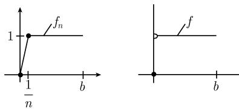
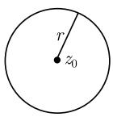
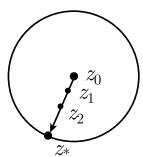
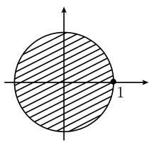
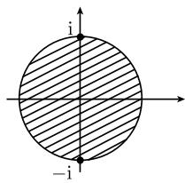
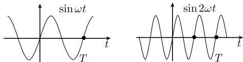
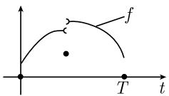
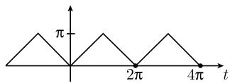

#### 1.10 无穷级数

详细的无穷级数表可见0.7.

特别重要的无穷级数是幂级数与傅里叶级数.

定义 设 $a_{0}, a_{1}, \cdots$ 是复数列. 符号 $\sum_{n=0}^{\infty} a_{n}$ 称为无穷级数, 表示当 $k \to \infty$ 时, 部分和

$$
s _ {k} := \sum_ {n = 0} ^ {k} a _ {n}.
$$

序列 $(s_{k})$ 的极限. 数 $a_{n}$ 称为级数的项. 记

$$
\boxed {\sum_ {n = 0} ^ {\infty} a _ {n} = a}
$$

当且仅当, 存在一个复数 $a$ , 使得 $\lim_{k \to \infty} s_k = a$ . 我们称无穷级数收敛到 $a$ . 否则, 称级数发散. 1)

收敛的必要条件 对于收敛级数, 有

$$
\boxed {\lim _ {n \to \infty} a _ {n} = 0.}
$$

如果不满足这个条件, 则级数 $\sum_{n=0}^{\infty} a_n$ 发散.

例：级数 $\sum_{n=1}^{\infty}\left(1 - \frac{1}{n}\right)$ 发散, 因为 $\lim_{n\to\infty}\left(1 - \frac{1}{n}\right)=1.$

几何级数 对每个复数 $z$ , 若 $|z| < 1$ , 则有下列公式:

$$
\boxed {\sum_ {n = 0} ^ {\infty} z ^ {n} = 1 + z + z ^ {2} + \dots = \frac {1}{1 - 8}.}
$$

如果 $|z| > 1$ ，则级数发散.

证明：当 $|z| < 1$ 时，有 $\lim_{k\to \infty}|z|^{k + 1} = 0.$ 可推出

$$
\lim _ {k \to \infty} \sum_ {n = 0} ^ {k} z ^ {n} = \lim _ {k \to \infty} \frac {1 - z ^ {k + 1}}{1 - z} = \frac {1}{1 - z}.
$$

当 $|z| > 1$ 时, 有 $\lim_{n\to \infty}|z|^n = \infty$ . 因此部分和序列 $(s_n)$ 不收敛到零, 级数 $\sum_{n=0}^{\infty}z^n$ 发散.

1) 1.14.2 将考虑复数列的收敛性. 使用复数对更深刻地理解幂级数的收敛性是绝对必要的.

收敛性的柯西准则 级数 $\sum_{n=0}^{\infty}a_{n}$ 收敛, 当且仅当, 对每个实数 $\varepsilon > 0$ , 存在一个自然数 $n_{0}(\varepsilon)$ (这里, 括号里的 $\varepsilon$ 表示数 $n_{0}$ 与 $\varepsilon$ 有关), 使得对所有的 $n \geqslant n_{0}(\varepsilon)$ 和 $m = 1, 2, \cdots$ 有

$$
\left| a _ {n} + a _ {n + 1} + \dots + a _ {n + m} \right| <   \varepsilon .
$$

有限的改变 当无穷级数的有限项改变时 (不论以何种 (有限) 方式), 级数的收敛性不变.

绝对收敛 级数 $\sum_{n=0}^{\infty}a_{n}$ 称为绝对收敛的, 如果无穷级数 $\sum_{n=0}^{\infty}|a_{n}|$ 收敛.

定理 级数绝对收敛性蕴涵它的收敛性.

1.10.1 收敛准则

有界性准则 级数 $\sum_{n=0}^{\infty} a_n$ 绝对收敛, 当且仅当

$$
\boxed {\sup _ {k} \sum_ {n = 0} ^ {k} | a _ {n} | <   \infty .}
$$

特别地, 每一项为非负数的级数 $\sum_{n=0}^{\infty} a_n$ 收敛, 当且仅当, 其部分和序列有界. 比较检验法 假设对所有 $n$ , 有

$$
\boxed {| a _ {n} | \leqslant b _ {n}.}
$$

那么级数 $\sum_{n=0}^{\infty} b_n$ 的收敛性蕴涵级数 $\sum_{n=0}^{\infty} a_n$ 的绝对收敛性.

比值检验法 如果极限

$$
\boxed {q := \lim _ {n \to \infty} \left| \frac {a _ {n + 1}}{a _ {n}} \right|}
$$

存在, 那么有

(i) 如果 $q < 1$ , 则级数 $\sum_{n=0}^{\infty} a_n$ 绝对收敛.

(ii) 如果 $q > 1$ , 则级数 $\sum_{n=0}^{\infty} a_n$ 发散.

q = 1 时, 级数既可能收敛, 也可能发散, 这与序列有关 (本检验法无法判断).

例 1(指数函数): 对于 $a_{n} := \frac{z^{n}}{n!}$ ，有

$$
\lim _ {n \to \infty} \left| \frac {a _ {n + 1}}{a _ {n}} \right| = \lim _ {n \to \infty} \frac {| z |}{n + 1} = 0.
$$

因此, 对所有复数 z, 级数

$$
\mathrm{e} ^ {z} = \sum_ {n = 0} ^ {\infty} \frac {z ^ {n}}{n !} = 1 + z + \frac {z ^ {2}}{2 !} + \frac {z ^ {3}}{3 !} + \dots
$$

绝对收敛.

根检验法令

$$
\boxed {q := \varlimsup_ {n \to \infty} \sqrt [ n ]{| a _ {n} |}.}
$$

(i) 如果 $q < 1$ , 则级数 $\sum_{n=0}^{\infty} a_n$ 绝对收敛.

(ii) 如果 $q > 1$ , 则级数 $\sum_{n=0}^{\infty} a_n$ 发散.

当 $q = 1$ 时, 级数既可能收敛, 也可能发散, 这与序列有关 (本检验法无法判断).

例 2: 令 $a_{n} := nz^{n}$ . 由 $\lim_{n \to \infty} \sqrt[n]{|a_{n}|} = |z| \lim_{n \to \infty} \sqrt[n]{n} = |z|$ , 可得, 对所有满足 $|z| < 1$ 的 $z \in C$ , 级数

$$
\sum_ {n = 1} ^ {\infty} n z ^ {n} = z + 2 z ^ {2} + 3 z ^ {3} + \dots
$$

收敛, 当 $|z| > 1$ 时这个级数发散.

积分检验法 令 $f: [1, \infty[ \to \mathbb{R}$ 是递减的正连续函数. 级数

$$
\boxed {\sum_ {n = 1} ^ {\infty} f (n)}
$$

收敛, 当且仅当积分 $\int_{1}^{\infty} f(x) dx$ 收敛.

例 3: 当 $\alpha > 1$ 时, 级数

$$
\boxed {\sum_ {n = 1} ^ {\infty} \frac {1}{n ^ {\alpha}}}
$$

收敛, 当 $\alpha \leqslant 1$ 时, 级数发散.

证明：我们有

$$
\int_ {1} ^ {\infty} \frac {\mathrm{d} x}{x ^ {\alpha}} = \lim _ {b \to \infty} \int_ {1} ^ {b} \frac {\mathrm{d} x}{x ^ {\alpha}} = \lim _ {b \to \infty} \left. \frac {1}{(1 - \alpha) x ^ {\alpha - 1}} \right| _ {1} ^ {b} = \left\{ \begin{array}{l l} \frac {1}{\alpha - 1}, & \alpha > 1, \\ + \infty , & \alpha <   1, \end{array} \right.
$$

并且

$$
\int_ {1} ^ {\infty} \frac {\mathrm{d} x}{x} = \lim _ {b \rightarrow \infty} \ln x | _ {1} ^ {b} = \lim _ {b \rightarrow \infty} \ln b = \infty .
$$

交错级数的莱布尼茨判别法 无穷级数

$$
\boxed {a _ {0} - a _ {1} + a _ {2} - a _ {3} + \dots = \sum_ {n = 0} ^ {\infty} (- 1) ^ {n} a _ {n}}
$$

收敛, 如果 $a_{0} \geqslant a_{1} \geqslant a_{2} \geqslant \cdots \geqslant 0$ , 且 $\lim_{n \to \infty} a_{n} = 0$ .

对于误差 $d_{k} := \sum_{n=0}^{\infty} (-1)^{n} a_{n} - \sum_{n=0}^{k} (-1)^{n} a_{n}$ ，有

$$
\boxed {0 \leqslant (- 1) ^ {k + 1} d _ {k} \leqslant a _ {k + 1}, \quad k = 1, 2, \dots .}
$$

例 4: 著名的莱布尼茨级数

$$
1 - \frac {1}{3} + \frac {1}{5} - \frac {1}{7} + \frac {1}{9} - \frac {1}{1 1} + \dots
$$

收敛. 根据 1.10.3 的例 2, 它的极限等于 $\pi / 4$ . 比如, 误差估计为

$$
0 <   \frac {\pi}{4} - \left(1 - \frac {1}{3} + \frac {1}{5} - \frac {1}{7}\right) <   \frac {1}{9}
$$

且

$$
0 <   \left(1 - \frac {1}{3} + \frac {1}{5} - \frac {1}{7} + \frac {1}{9}\right) - \frac {\pi}{4} <   \frac {1}{1 1}.
$$

##### 1.10.1 收敛准则

##### 1.10.2 无穷级数的运算

绝对收敛的重要性 对绝对收敛的级数的运算与处理有限和一样.

1.10.2.1 代数运算

加法 两个收敛级数可以相加, 收敛级数可以乘以复数 $\alpha$ :

$$
\boxed { \begin{array}{c} \sum_ {n = 0} ^ {\infty} a _ {n} + \sum_ {n = 0} ^ {\infty} b _ {n} = \sum_ {n = 0} ^ {\infty} (a _ {n} + b _ {n}), \\ \alpha \sum_ {n = 0} ^ {\infty} a _ {n} = \sum_ {n = 0} ^ {\infty} \alpha a _ {n}. \end{array} }
$$

括号 在一个收敛级数里, 可以给任意项加括号而不改变级数的收敛性与级数的和.

置换 在一个绝对收敛的级数里, 改变项的位置并不改变级数的收敛性与和.

乘法 两个绝对收敛的级数可以相乘.

乘积得到的级数仍然是绝对收敛的, 并且它的项可以置换. 特别地, 有柯西乘法法则:

$$
\boxed {\sum_ {n = 0} ^ {\infty} a _ {n} \sum_ {n = 0} ^ {\infty} b _ {n} = \sum_ {n = 0} ^ {\infty} \sum_ {r = 0} ^ {n} a _ {r} b _ {n - r}.}
$$

二重求和 如果下列条件之一被满足:

(i) $\sup_{r}\sum_{n+m\leqslant r}|a_{nm}|<\infty,$

(ii) $\sum_{n=0}^{\infty}\left(\sum_{m=0}^{\infty}|a_{nm}|\right)$ 收敛,

则有

$$
\boxed {\sum_ {n, m = 0} ^ {\infty} a _ {n m} = \sum_ {n = 0} ^ {\infty} \left(\sum_ {m = 0} ^ {\infty} a _ {n m}\right).}
$$

可以对 $a_{nm}$ 任意求和来计算 $\sum_{n,m=0}^{\infty} a_{nm}$ , 并且其和与求和顺序无关.

1.10.2.2 函数列

一致收敛对交换极限的重要性 \* 当下述极限是一致收敛时, 可以对极限关系式

$$
\boxed {f (x) := \lim _ {n \to \infty} f _ {n} (x), \quad a \leqslant x \leqslant b}\tag{1.174}
$$

逐项积分与求导, 即有

$$
\boxed {\int_ {a} ^ {b} f (x) \mathrm{d} x = \lim _ {n \rightarrow \infty} \int_ {a} ^ {b} f _ {n} (x) \mathrm{d} x}\tag{1.175}
$$

及

$$
\boxed {f ^ {\prime} (x) = \lim _ {n \to \infty} f _ {n} ^ {\prime} (x), \quad a \leqslant x \leqslant b.}\tag{1.176}
$$

定义 令 $-\infty < a < b < \infty$ . 极限 (1.174) 是一致的, 如果

$$
\lim _ {n \to \infty} \sup _ {a \leqslant x \leqslant b} | f (x) - f _ {n} (x) | = 0.
$$

极限函数的连续性 如果所有的函数 $f_{n}:[a,b]\to \mathbb{C}$ 在点 $x\in [a,b]$ 处是连续的，且极限(1.174)是一致的，那么极限函数 $f$ 在点 $x$ 处连续.

极限函数的可积性 如果所有的函数 $f_{n}:[a,b]\to \mathbb{C}$ 几乎处处连续且有界，且极限(1.174)是一致的，那么(1.175)成立

极限函数的可微性 如果所有的函数 $f_{n}:[a,b]\to \mathbb{C}$ 在区间 $[a,b]$ 上是连续的，且序列 $(f_n)$ 与 $(f_n^{\prime})$ 在区间 $[a,b]$ 上一致收敛到函数 $f$ 与 $g$ ，那么极限函数 $f$ 在区间 $[a,b]$ 上是可微的，且(1.176)成立.1)

下面的例子表明了一致收敛的重要性.
例: 图 1.108 中的函数 $f_{n}$ 都是连续的. 而极限函数 $f(x) = \lim_{n \to \infty} f_{n}(x)$ 在点 x = 0 处不连续.

这个收敛性在区间 $[0, b]$ 上不一致，其中 b > 0.

图1.108

1.10.2.3 微分与积分

比较准则的作用 无穷级数是特殊的函数列 (函数的部分和序列). 通常, 很容易根据比较准则推导出一致收敛性.

令 $-\infty < a < b < \infty$ 。考虑级数

$$
\boxed {f (x) := \sum_ {n = 0} ^ {\infty} f _ {n} (x), \quad a \leqslant x \leqslant b,}\tag{1.177}
$$

其中对所有 $x \in [a, b]$ ，有 $f_{n}(x) \in \mathbb{C}$ ，阐述两条比较准则：

(M1) 假设对所有 $n$ , 在 $[a, b]$ 上有 $|f_n(x)| \leqslant a_n$ , 且级数 $\sum_{n=0}^{\infty} a_n$ 收敛.

(M2) 假设对所有 $n$ , 在 $[a, b]$ 上有 $|f_n'(x)| \leqslant b_n$ , 且级数 $\sum_{n=0} b_n$ 收敛.

由 (M1) 即得极限 (1.177) 在 $[a, b]$ 上是一致的.

极限函数的连续性 如果所有的函数 $f_{n}:[a,b]\to \mathbb{C}$ 在点 $x$ 处连续，且 (M1) 成立, 那么极限函数在点 $x$ 处连续.

极限函数的可积性 如果所有的函数 $f_{n}:[a,b]\to \mathbb{C}$ 几乎处处连续，且(M1)成立，那么极限函数是可积的，且

$$
\boxed {\int_ {a} ^ {b} f (x) \mathrm{d} x = \sum_ {n = 0} ^ {\infty} \int_ {a} ^ {b} f _ {n} (x) \mathrm{d} x.}
$$

极限函数的可微性 如果所有的函数 $f_{n}:[a,b]\to \mathbb{C}$ 在 $[a,b]$ 上是可微的，且满足两个条件(M1)和(M2)，那么极限函数 $f$ 在 $[a,b]$ 上是可微的，且

$$
\boxed {f ^ {\prime} (x) = \sum_ {n = 0} ^ {\infty} f _ {n} ^ {\prime} (x), \quad a \leqslant x \leqslant b.}
$$

##### 1.10.3 幂级数

详细的幂级数表可见 0.7.2.

幂级数是研究函数的一个非常得力且优美的工具. 定义 中心在点 $z_0$ 处的幂级数是形如

$$
\boxed {f (z) = \sum_ {n = 0} ^ {\infty} a _ {n} (z - z _ {0}) ^ {n}}\tag{1.178}
$$

的无穷级数, 其中所有的 $a_{n}$ 和 $z_{0}$ 是固定的复数, $z$ 是复变量. 幂级数的运算是显而易见的. 1)

幂级数恒等定理 如果中心在 $z_0$ 处的两个幂级数在复平面的一个无穷点集上相等, 其中这些点收敛到点 $z_0$ , 那么这两个级数系数相同, 因此级数相等.

收敛半径 令 $\varrho := \varlimsup_{n \to \infty} \sqrt[n]{|a_n|}$ , 且 $^{2)}$

$$
\boxed {r := \frac {1}{\varrho}.}
$$

另外, 我们考虑圆盘 $K_{r} := \{ z \in C : |z - z_{0}| < r \}$ , 其中 $0 < r \leqslant \infty$ .

当 $r = 0$ 时, $K_{0}$ 只有一个点 $z_{0}^{*}$ . 那么我们有

(i) 对所谓的收敛域(圆盘) $K_{r}$ 中的所有点 z, 幂级数 (1.178) 绝对收敛, 对收敛域的闭包 $\overline{K}_{r}$ 外的所有点 z, 幂级数发散 (图 1.109(a)).

(ii) 在圆盘的边界点处, 幂级数可能收敛, 亦可能发散.

阿贝尔定理 如果幂级数 (1.178) 在收敛域的边界点 $z_{*}$ 处收敛, 则

$$
\boxed {\lim _ {k \to \infty} \sum_ {n = 0} ^ {\infty} a _ {n} (z _ {k} - z _ {0}) ^ {n} = \sum_ {n = 0} ^ {\infty} a _ {n} (z _ {*} - z _ {0}) ^ {n},}
$$

其中复数列 $(z_{k})$ 从 $K_{r}$ 中趋向于点 $z_{*}$ (图1.109(b)).

  
(a)

  
(b)  
图1.109

幂级数的性质

幂级数在收敛域内可以相加、相乘、换项, 也可以逐项求导、积分. 求导、积分后, 收敛域不变.

全纯性原理 如果函数 $f: U(z_0) \subseteq \mathbb{C} \to \mathbb{C}$ 在点 $z_0$ 的一个开邻域中是全纯的 (参看1.14.3), 那么它可以展开成中心在点 $z_0$ 的幂级数. 收敛域是包含在 $U(z_0)$ 中的最大圆盘.

这时的幂级数就是函数的泰勒级数

$$
\boxed {f (z) = f \left(z _ {0}\right) + f ^ {\prime} \left(z _ {0}\right) \left(z - z _ {0}\right) + \frac {f ^ {\prime \prime} \left(z _ {0}\right)}{2 !} \left(z - z _ {0}\right) ^ {2} + \dots .}
$$

每个幂级数表示一个函数, 这个函数在收敛域中是全纯的.

例 1: 令

$$
\boxed {f (z) := \frac {1}{1 - z}.}
$$

这个函数在点 $z = 1$ 处有一个奇点, 但是在圆盘 $K_{1}$ 中全纯. 因此可以以点 $z = 0$ 为中心, $r = 1$ 为收敛半径, 把函数展开成幂级数 (图1.110(a)). 因为

$$
f ^ {\prime} (z) = \frac {1}{(1 - z) ^ {2}}, \quad f ^ {\prime \prime} (z) = \frac {2}{(1 - z) ^ {3}}, \quad \dots ,
$$

有 $f'(0)=1, f''(0)=2!, f'''(0)=3!, \cdots$ 因此对满足 $|z|<1$ 的所有 $z \in C$ ，有

$$
f (z) = 1 + z + z ^ {2} + z ^ {3} + \dots = \frac {1}{1 - z}.\tag{1.179}
$$

  
(a)

  
(b)  
图 1.110

(i) 对 (1.179) 逐项求导, 得到对满足 $|z| < 1$ 的所有 $z \in \mathbb{C}$ , 有

$$
f ^ {\prime} (z) = 1 + 2 z + 3 z ^ {2} + \dots = \frac {1}{(1 - z) ^ {2}}.
$$

(ii) 令 $t \in \mathbb{R}$ 且 $|t| < 1$ . 对 (1.179) 逐项积分, 得

$$
\int_ {0} ^ {t} f (z) \mathrm{d} z = t + \frac {t ^ {2}}{2} + \frac {t ^ {3}}{3} + \dots = - \ln (1 - t).\tag{1.180}
$$

(iii) 在边界点 $t = -1$ 处应用阿贝尔定理告诉我们, 根据交错级数的莱布尼茨准则, (1.180) 在 $t = -1$ 收敛. 则由 (1.180) 中的极限过程 $t \to -1 + 0$ , 有

$$
\boxed {1 - \frac {1}{2} + \frac {1}{3} - \frac {1}{4} + \dots = \ln 2.}
$$

(iv) 由于 (ii), 我们对所有满足 $|t| < 1$ 的复变量 $t$ , 由关系式 (1.180) 定义 $\ln(1 - t)$ . 这相应于解析延拓原理 (参看 1.14.15).

例 2: 方程 $1 + z^{2} = 0$ 在点 $z = \pm i$ 处有两个零点. 令

$$
\boxed {f (z) := \frac {1}{1 + z ^ {2}}.}
$$

这个函数 (只) 在点 $z = \pm \mathrm{i}$ 处有奇点. 因此可以以 $z = 0$ 为中心, $r = 1$ 为收敛半径, 把它展开成幂级数 (图1.110(b)). 由几何级数, 对于满足 $|z| < 1$ 的所有 $z \in \mathbb{C}$ 有

$$
f (z) = \frac {1}{1 - (- z ^ {2})} = 1 - z ^ {2} + z ^ {4} - z ^ {6} + \dots .\tag{1.181}
$$

(i) 对 (1.181) 逐项求导, 得到对于满足 $|z| < 1$ 的所有 $z \in \mathbb{C}$ , 有

$$
f ^ {\prime} (z) = - \frac {2 z}{(1 + z ^ {2}) ^ {2}} = - 2 z + 4 z ^ {3} - 6 z ^ {5} + \dots .
$$

(ii) 令 $t \in \mathbb{R}$ 且 $|t| < 1$ . 对 (1.181) 逐项积分, 得

$$
\int_ {0} ^ {t} \frac {\mathrm{d} z}{1 + z ^ {2}} = \arctan t = t - \frac {t ^ {3}}{3} + \frac {t ^ {5}}{5} - \dots .\tag{1.182}
$$

(iii) 在边界点 $t = 1$ 处应用阿贝尔定理表明, 当 $t = 1$ 时根据交错级数的莱布尼茨准则, 级数 (1.182) 收敛. 由 (1.182) 中的极限 $t \to 1 - 0$ , 及 $\arctan 1 = \frac{\pi}{4}$ , 可得著名的莱布尼茨级数

$$
\boxed {1 - \frac {1}{3} + \frac {1}{5} - \frac {1}{7} + \dots = \frac {\pi}{4}.}
$$

(iv) 公式 (1.182) 使得对所有 $|t| < 1$ 的复变量可以定义 $\arctan t$ . 这相应于解析延拓原理 (参看 1.14.15).

##### 1.10.4 傅里叶级数

重要傅里叶级数一份完全的列表可见 0.7.4.

基本思想 从著名的经典公式

$$
\boxed {f (t) = \frac {a _ {0}}{2} + \sum_ {k = 1} ^ {\infty} (a _ {k} \cos k \omega t + b _ {k} \sin k \omega t)}\tag{1.183}
$$

开始, 其中角频率 $\omega = 2\pi/T$ , 周期 T > 0, 所谓的傅里叶系数 $^{1)}$ 为

$$
\boxed { \begin{array}{c} a _ {k} := \frac {2}{T} \int_ {0} ^ {T} f (t) \cos k \omega t \mathrm{d} t, \\ b _ {k} := \frac {2}{T} \int_ {0} ^ {T} f (t) \sin k \omega t \mathrm{d} t, \end{array} }
$$

这里, 我们假设函数 $f: \mathbb{R} \to \mathbb{C}$ 有一个周期 $T > 0$ , 即, 对所有的时间 $t$ , 有

$$
\boxed {f (t + T) = f (t).}
$$

对称性 如果 $f$ 是偶函数 (或奇函数), 则对所有的 $k$ , 有 $b_{k} = 0$ (或 $a_{k} = 0$ ). 叠加原理 可以把 $f$ 看成是周期为 $T$ 的一个振动. 则公式 (1.183) 把这个函数 $f$ 描述成周期为

$$
T, \frac {T}{2}, \frac {T}{3}, \dots
$$

的正弦、余弦函数的叠加, 即周期越来越小的振动(图 1.111).

  
图 1.111 傅里叶级数的系数函数

傅里叶系数大的正弦、余弦函数控制着这个级数. 欧拉(Euler, 1707—1783)并不认为, 周期为 $T$ 的一般函数可以写成形如 (1.183) 的叠加. 实际上 (1.183) 是通用的, 这一思想是由法国数学家傅里叶(Fourier, 1768—1830)在他的宏篇论文“热的解析理论”中提出的. 类似地, (1.183) 的连续情形为

$$
f (t) = \int_ {- \infty} ^ {\infty} (a (\nu) \cos \nu t + b (\nu) \sin \nu t) \mathrm{d} \nu .
$$

1) 用 $\cos k\omega t$ 或 $\sin k\omega t$ 乘以 (1.183), 然后在区间 $[0, T]$ 上积分, 就能从形式上得到 $a_k$ 与 $b_k$ 的公式. 这里, 对两个不同的正弦、余弦函数, 以一种重要的方式利用了它们的正交关系式

$$
\int_ {0} ^ {T} f g \mathrm{d} t = 0.
$$

这个公式等价于傅里叶积分, 它把一个任意的 (即, 非周期) 函数分解成正弦、余弦函数的叠加形式 (参看 1.11.2).

$$
\begin{array}{l} \text {傅里叶级数、傅里叶积分以及它们的推广} ^ {1)} \text {是数学物理和概率论} \\ (\text {谱分析}) \text {中的基本技术工具.} \end{array}
$$

收敛性问题 从数学观点看, 公式 (1.183) 的收敛性应该能在尽可能不太严格的假设下被证明. 这在 19 世纪是个难题, 直到 20 世纪借助勒贝格积分与泛函分析才得以完全解决它. [212] 中有所描述. 这里, 我们只给出经典准则, 它在实际应用中有帮助.

狄利克雷 (Dirichlet, 1805—1859) 准则 假设 (图 1.112):

(i) 函数 $f: R \rightarrow C$ 的周期为 T > 0.

(ii) 存在点 $t_{0} := 0 < t_{1} < \cdots < t_{m} := T$ ，使得在每个开区间 $t_{j}, t_{j+1}$ [上 f 的实部与虚部都是连续的，并且递增或递减.

(iii) 在点 $t_{j}$ 处, 存在单边极限:

$$
f (t _ {j} \pm 0) := \lim _ {\varepsilon \rightarrow + 0} f (t _ {j} \pm \varepsilon),
$$

则在每个点 $t \in \mathbb{R}$ , $f$ 的傅里叶级数收敛到均值

$$
\boxed {\frac {f (t + 0) + f (t - 0)}{2}.}
$$

对于 f 的所有连续点 $t \in R$ ，均值等于 $f(t)$ .

例：假设函数 $f: \mathbb{R} \to \mathbb{R}$ 的周期 $T = 2\pi$ ，且在区间 $[- \pi, \pi]$ 上 $f(t) := |t|$ (图1.113). 则对所有 $t \in \mathbb{R}$ ，傅里叶级数收敛：

$$
f (t) = \frac {\pi}{2} - \frac {4}{\pi} \left(\cos t + \frac {\cos 3 t}{3 ^ {2}} + \frac {\cos 5 t}{5 ^ {2}} + \dots\right).
$$

  
图1.112

  
图1.113

光滑性准则 如果周期为 T 的函数 $f: R \to C$ 是 $C^{m}$ 类的, 其中 $m \geqslant 2$ , 那么有

$$
\boxed {| a _ {k} | + | b _ {k} | \leqslant \frac {\text {常量}}{k ^ {m}}, \quad k = 1, 2, \dots ,}
$$

此时, 对每个 $t \in R$ , 展开式 (1.183) 绝对且一致收敛, 因而可逐项求积.

令 $r := m - 2 > 0$ , 则在每个点 $t \in R$ 处, 可以对 (1.183) 逐项求导 r 次.

傅里叶方法 在解偏微分方程的傅里叶方法中使用过前面的结果 —— 例如在振动弦的研究中 (参看 [212]).

高斯最小二乘法 令 $f: \mathbb{R} \to \mathbb{C}$ 为有界函数, 几乎处处连续, 且有周期 $T > 0$ . 那么极小化问题

$$
\begin{array}{l} \int_ {0} ^ {T} \left| f (t) - \frac {\alpha_ {0}}{2} - \sum_ {k = 1} ^ {m} (\alpha_ {k} \cos k \omega t + \beta_ {k} \sin k \omega t) \right| ^ {2} \mathrm{d} t \stackrel {!} {=} \min. \\ \alpha_ {0}, \dots , \alpha_ {m}, \beta_ {1}, \dots , \beta_ {m} \in \mathbb {C} \end{array}
$$

的唯一解是傅里叶系数. 而且有均方收敛:

$$
\boxed {\lim _ {m \to \infty} \int_ {0} ^ {T} \left| f (t) - \frac {a _ {0}}{2} - \sum_ {k = 1} ^ {m} (a _ {k} \cos k \omega t + b _ {k} \sin k \omega t) \right| ^ {2} \mathrm{d} t = 0.}
$$

这是用现代泛函分析处理傅里叶级数的关键.

傅里叶级数的复数形式 可以把傅里叶级数理论做得更优美, 如果使用

$$
\boxed {f (t) = \sum_ {k = - \infty} ^ {\infty} c _ {k} \mathrm{e} ^ {\mathrm{i} k \omega t},}\tag{1.184}
$$

其中 $\omega := 2\pi/T.^{1)}$ 此时傅里叶系数为

$$
\boxed {c _ {k} := \frac {1}{T} \int_ {0} ^ {T} f (t) \mathrm{e} ^ {- \mathrm{i} k \omega t} \mathrm{d} t.}\tag{1.185}
$$

动机 令

$$
\int_ {0} ^ {T} \mathrm{e} ^ {\mathrm{i} r \omega t} \mathrm{d} t = \left\{ \begin{array}{l l} T, & r = 0, \\ 0, & r = \pm 1, \pm 2, \dots . \end{array} \right.
$$

用 $e^{-is\omega t}$ 形式地乘以 (1.184)，并在 [0, T] 上积分，则得 (1.185).

实值函数 如果对所有 $t, f(t)$ 都是实的, 则对所有的 k, 有 $c_{-k} = \bar{c}_k$ .

收敛性 狄利克雷准则及光滑性准则对 (1.184) 也成立.

如果 $f: R \rightarrow C$ 几乎处处连续且有界, 那么有均方收敛:

$$
\boxed {\lim _ {m \to \infty} \int_ {0} ^ {T} \left| f (t) - \sum_ {k = - m} ^ {m} c _ {k} \mathrm{e} ^ {\mathrm{i} k \omega t} \right| ^ {2} \mathrm{d} t = 0.}
$$

##### 1.10.5 发散级数求和

求和的思想是, 即使发散级数 (如发散的傅里叶级数) 也包含一些由某种推广的收敛性 (求和) 所提供的信息.

不变性原理 对无穷级数求和的过程称为容许的(或不变的), 如果求和过程应用到所有收敛级数都能得到经典极限.

下面, 令 $a_0, a_1, \cdots$ 为复数, $s_k := \sum_{n=0}^{k} a_n$ 为前 $k+1$ 项的部分和.

算术平均法令

$$
\boxed {\sum_ {n = 0} ^ {\infty} \mathcal {M} a _ {n} := \lim _ {k \to \infty} \frac {s _ {0} + s _ {1} + \cdots + s _ {k - 1}}{k},}
$$

如果这个极限存在. 此求和过程是容许的.

例 1(费耶定理 (1904)): 1871 年杜布瓦雷蒙(Du Bois-Reymond) 构造了一个周期为 $2\pi$ 的连续函数, 它的傅里叶级数在一个点处发散. 然而, 如果应用算术平均求和过程, 就可以从傅里叶级数完全构造出连续的周期函数.

如果 $f: R \rightarrow C$ 连续, 周期为 T > 0, 那么对所有的 $t \in R$ 有

$$
f (t) = \frac {a _ {0}}{2} + \sum_ {n = 0} ^ {\infty} \mathcal {M} (a _ {n} \cos n \omega t + b _ {n} \sin n \omega t).
$$

这个收敛性在 $[0, T]$ 上是一致的.

阿贝尔求和过程 我们定义

$$
\boxed {\sum_ {n = 0} ^ {\infty} \mathscr {A} a _ {n} = \lim _ {x \to 1 - 0} \sum_ {n = 0} ^ {\infty} a _ {n} x ^ {n}.}
$$

这个求和过程是容许的.

例 2: 沃利斯 (Wallis) 公式

$$
\sum_ {n = 0} ^ {\infty} \mathcal {A} (- 1) ^ {n} = (1 - 1 + 1 - \dots) ^ {\mathcal {A}} = \frac {1}{2}.
$$

证明： $\lim_{x\to1-0}(1-x+x^{2}-\cdots)=\lim_{x\to1-0}\frac{1}{1+x}=\frac{1}{2}.$

在数学史上, 级数 $1 - 1 + 1 - \cdots$ 曾多次导致争论及哲学上的反思. 在 17 世纪, 这个级数被赋予了值 1/2, 因为它是这个级数的部分和序列 1, 0, 1, 0, 1, … 的算术平均值 (的极限).

渐近级数 见 0.7.3.

##### 1.10.6 无穷乘积

无穷乘积表可见 0.7.5.

定义 令 $b_{0}, b_{1}, \cdots$ 为复数. 符号 $\prod_{n=0}^{\infty} b_{n}$ 表示部分积

$$
p _ {k} := \prod_ {n = 0} ^ {k} b _ {n}.
$$

序列 $(p_{k})$ 的极限.

这称为无穷乘积. 记

$$
\boxed {\prod_ {n = 0} ^ {\infty} b _ {n} = b,}\tag{1.186}
$$

当且仅当, 存在一个复数 $b$ 满足 $\lim_{k\to \infty}p_k = b$ . 这时称它为收敛的无穷乘积.

收敛性 一个无穷乘积称为是收敛的, 如果 (1.186) 成立, 其中 $b \neq 0$ , 或者如果去掉有限个为 0 的因子 $b_{n}$ 后满足这个条件. 在其他的所有情况下, 称乘积是发散的.

收敛的无穷乘积为零, 当且仅当, 它的一个因子 $b_{k}$ 为零.

例 1: $\prod_{n=2}^{\infty}\left(1-\frac{1}{n^{2}}\right)=\frac{1}{2}.$

证明：由 $n^2 - 1 = (n + 1)(n - 1)$ ，有

$$
p _ {k} = \left(1 - \frac {1}{2 ^ {2}}\right)\left(1 - \frac {1}{3 ^ {2}}\right) \dots \left(1 - \frac {1}{k ^ {2}}\right) = \frac {k + 1}{2 k} \rightarrow \frac {1}{2}, \quad k \rightarrow \infty .
$$

例 2(沃尔积):

$$
\boxed {\frac {\pi}{2} = \prod_ {n = 1} ^ {\infty} \frac {(2 n) ^ {2}}{4 n ^ {2} - 1}.}
$$

改变原理 改变无穷乘积的有限个因子, 不改变其收敛性.

收敛的必要性准则 如果 $\prod_{n=0}^{\infty} b_n$ 收敛, 则

$$
\boxed {\lim _ {n \to \infty} b _ {n} = 1.}
$$

绝对收敛 按定义, 如果乘积 $\prod_{n=0}^{\infty}(1 + |a_n|)$ 收敛, 则称 $\prod_{n=0}^{\infty}(1 + a_n)$ 绝对收敛. 定理 绝对收敛的无穷乘积是收敛的.

主定理 乘积 $\prod_{n=0}^{\infty}(1 + a_n)$ 绝对收敛, 当且仅当, 级数 $\sum_{n=0}^{\infty}a_n$ 绝对收敛.

例 3: 对所有复数 z, 下面著名的欧拉公式成立:

$$
\boxed {\sin z = z \prod_ {n = 1} ^ {\infty} \left(1 - \frac {z ^ {2}}{n ^ {2} \pi^ {2}}\right).}
$$

对于所有 $z \in \mathbb{C}$ 由级数

$$
\sum_ {n = 1} ^ {\infty} \frac {| z | ^ {2}}{n ^ {2} \pi^ {2}}
$$

的收敛性即得上面乘积的绝对收敛性.

定理 (i) 乘积 $\prod_{n=0}^{\infty}(1 + a_n)$ 收敛, 如果两个级数 $\sum_{n=0}^{\infty} a_n$ 与 $\sum_{n=0}^{\infty} a_n^2$ 都收敛.

(ii) 如果对所有的 $n, a_n \geqslant 0$ , 那么乘积 $\prod_{n=0}^{\infty}(1 - a_n)$ 收敛, 当且仅当级数 $\sum_{n=0}^{\infty} a_n$ 收敛.
