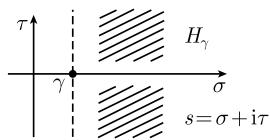
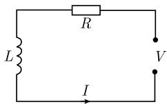
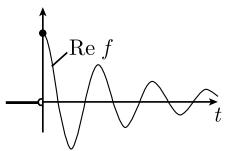
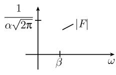
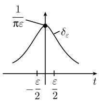
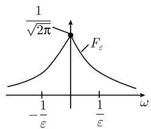
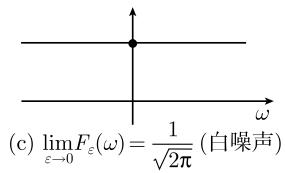

#### 1.11 积分变换

数学运算的简化 如果根据运算的难度来对它们排序的话, 有如下排列:

(i) 加法和减法;

(ii) 乘法和除法;

(iii) 微分和积分.

数学中一个重要的策略是, 用简单的运算替换较复杂的运算. 例如, 通过关系式

$$
\ln (a b) = \ln a + \ln b,
$$

就可以把乘法归结为加法. 17 世纪初的这个简化是开普勒(Kepler, 1571—1630) 在制作行星轨道表时克服极其烦琐而困难的计算时发现的.

积分变换把微分归结为乘法.

最重要的积分变换是傅里叶变换, 这可追溯到傅里叶(Fourier, 1768—1830). 控制工程师经常使用的拉普拉斯变换, 是傅里叶变换的特例.

解微分方程的策略

(S1) 对微分方程 (D) 应用积分变换, 得到一个线性方程 (A), 它可以用线性代数的方法解出 (参看 2.3).

(S2) 对线性方程 (A) 的解应用上面的逆变换, 得原始微分方程 (D) 的一个解. 为了用 (S1), (S2) 的方法解差分方程, 可以使用 Z 变换.

傅里叶变换是现代线性偏微分方程理论中最重要的解析工具. 这里的一些关键词是：分布 (广义函数)、伪微分算子、傅里叶积分算子. 更多内容可见 [212].

谱分析 傅里叶变换的基本物理思想是, 把电磁波 (比如从外空来的光或无线电波) 分解成单独的频率, 并研究它们的强度. 这样, 天文学家和天体物理学家就获得了对恒星、银河及宇宙其他部分结构的新见解.

地震探测中心利用傅里叶变换把极不规则的地震波分解成不同频率的周期振荡. 借助于优势振荡的频率和振幅, 可以确定地震的位置和强度.

赫维赛德 (Heaviside) 运算 为了解微分方程, 如

$$
y - \frac {\mathrm{d} y}{\mathrm{d} t} = f (t),
$$

19 世纪末, 英国电机工程师赫维赛德使用了如下巧妙的方法:

(i) 由

$$
\left(1 - \frac {\mathrm{d}}{\mathrm{d} t}\right) y = f
$$

及除法, 可得

$$
y = \frac {f}{1 - \frac {\mathrm{d}}{\mathrm{d} t}}.
$$

(ii) 由几何级数 $\frac{1}{1 - q} = 1 + q + q^2 + \cdots$ 及 $q = \frac{\mathrm{d}}{\mathrm{d}t}$ 可得

$$
y = \left(1 + \frac {\mathrm{d}}{\mathrm{d} t} + \frac {\mathrm{d} ^ {2}}{\mathrm{d} t ^ {2}} + \dots\right) f.
$$

这就给出了解的公式:

$$
\boxed {y = f (t) + f ^ {\prime} (t) + f ^ {\prime \prime} (t) + \dots .}\tag{1.187}
$$

对每个多项式 $f$ , 刚得到的公式 (1.187) 确实是原方程的一个解. 例: 当 $f(t) := t$ , 有 $y = t + 1$ . 检验:

$$
y - y ^ {\prime} = t + 1 - 1 = t.
$$

赫维赛德的思想是, 人们可以像使用代数量一样来使用微分算子. 在伪微分算子理论中, 以数学上严格的方式实现了这一思想. 现代泛函分析中包含了任意算子的这类运算的甚至更为一般的框架, 现代泛函分析是量子力学理论等的数学基础 (参看 [212]).

##### 1.11.1 拉普拉斯变换

各种函数的拉普拉斯变换的一份完全的列表可见 0.10.2.

在赫维赛德之后几十年中, 数学家德奇 (Doetsch) 注意到, 借助于可追溯到拉普拉斯 (Laplace) 的一个变换可以证实赫维赛德运算的合理性. 基本公式是

$$
\boxed {F (s) := \int_ {0} ^ {\infty} \mathrm{e} ^ {- s t} f (t) \mathrm{d} t, \quad s \in H _ {\gamma}.}
$$

这里， $H_{\gamma}:=\{s\in\mathbb{C}|\mathrm{Res}> \gamma\}$ 表示复平面中的半平面(图1.114).称 $F$ 为 $f$ 的拉普拉斯变换，并且也记作 $F=\mathcal{L}\{f\}$ .

  
图1.114

容许函数类 $K_{\gamma}$ 令 $\gamma$ 为一实数. 由定义, $K_{\gamma}$ 由满足弱增长性条件

$$
\boxed {| f (t) | \leqslant \text {常数} \mathrm{e} ^ {\gamma t}, \quad \text {对所有} t \geqslant 0}
$$

的所有函数 $f:[0,\infty[\rightarrow\mathbb{C}$ 组成.

存在性定理 对于 $f \in K_{\gamma}$ , $f$ 的拉普拉斯变换 $F$ 存在且是全纯的, 即, 在半平面 $H_{\gamma}$ 上无穷多次可微. 在积分号下求导得到导数. 例如,

$$
F ^ {\prime} (s) = \int_ {0} ^ {\infty} \mathrm{e} ^ {- s t} (- t f (t)) \mathrm{d} t, \quad \text {对所有} s \in H _ {\gamma}.
$$

唯一性定理 如果两个函数 $f, g \in K_{\gamma}$ 在 $H_{\gamma}$ 上有相同的拉普拉斯变换, 那么 $f = g$ .

卷积 用 $R$ 表示所有连续函数 $f: [0, \infty[ \to \mathbb{C}$ 的全体. 对于 $f, g \in R$ , 用下述公式定义它们的卷积 $f * g \in R$ 为

$$
(f * g) (t) := \int_ {0} ^ {t} f (\tau) g (t - \tau) \mathrm{d} \tau , \quad {\text {对所有}} t \geqslant 0.
$$

对所有的 $f, g, h \in R,$ 有 $^{1)}$

(i) $f * g = g * f$ (交换律),

(ii) $f * (g * h) = (f * g) * h$ (结合律),

(iii) $f * (g + h) = f * g + g * h$ (分配律),

(iv) 由 $f*g=0$ 即得 $f=0$ 或 $g=0$ .

1.11.1.1 基本定律

定律 1 (指数函数)

$$
\boxed {\mathscr {L} \left\{\frac {t ^ {n}}{n !} \mathrm{e} ^ {\alpha t} \right\} = \frac {1}{(s - \alpha) ^ {n + 1}}, \quad n = 0, 1, \dots ; s \in H _ {\sigma}.}
$$

这里, $\alpha$ 表示一个任意复数, 它的实部为 $\sigma$ .

例 1: $\mathcal{L}\{\mathrm{e}^{\alpha t}\} = \frac{1}{s - \alpha}, \mathcal{L}\{t\mathrm{e}^{\alpha t}\} = \frac{1}{(s - \alpha)^2}$ .

定律 2 (线性性) 当 $f, g \in K_{\gamma}, a, b \in C$ 时, 有

$$
\boxed {\mathcal {L} \{a f + b g \} = a \mathcal {L} \{f \} + b \mathcal {L} \{g \}.}
$$

定律 3 (微分) 假设函数 $f \in K_{\gamma}$ 是 $C^{n}$ 类的, $n \geqslant 1$ . 令 $F := \mathcal{L}\{f\}$ , 则对所有 $s \in H_{\gamma}$ , 有

1) 性质 (i) 到 (iv) 表明, 对于 “乘法”\* 及普通函数加法, R 构成了一个没有零除子的交换环 (整环), 参看 2.5.2.

$$
\left| \mathscr {L} \{f ^ {(n)} \} (s) := s ^ {n} F (s) - s ^ {n - 1} f (0) - s ^ {n - 2} f ^ {\prime} (0) - \dots - f ^ {(n - 1)} (0). \right.
$$

例 2: $\mathcal{L}\{f'\}=sF(s)-f(0),\mathcal{L}\{f''\}=s^2F(s)-sf(0)-f'(0)$ .

定律 4(卷积) 对于 $f, g \in K_{\gamma}$ ，有

$$
\boxed {\mathcal {L} \{f * g \} = \mathcal {L} \{f \} \mathcal {L} \{g \}.}
$$

1.11.1.2 对微分方程的应用

通用方法 现在知道, 拉普拉斯变换是以优美的方式解

$$
\mathrm{常系数的任意阶常微分方程及方程组}
$$

的一种通用方法, 这类方程经常出现在控制工程中.

解法步骤如下:

(i) 利用拉普拉斯变换的线性性及微分律 (定律 2 和定律 3), 把给定的微分方程 (D) 变换成代数方程 (A).

(ii) 方程 (A) 是一个线性方程或线性方程组, 可以用线性代数的方法解出. 这个解是有理函数, 因而可以得到它的部分分式分解 (参看 2.1.7).

(iii) 利用定律 1(指数函数), 可以把这些部分分式各自变换回去.

(iv) 微分方程的非齐次项在象空间生成乘积项, 利用卷积 (定律 4) 可以把它们变换回去.

为了得到部分分式分解, 需要确定分母的零点, 这在逆变换下对应着系统的特征振荡的频率.

例 1(谐振子): 弹簧在外力 $f = f(t)$ 的作用下, 在时刻 t 的振荡 $x = f(t)$ 由下面的微分方程所描述:

$$
\boxed { \begin{array}{l} f ^ {\prime \prime} + \omega^ {2} f = \boldsymbol {f}, \\ f (0) = a, \quad f ^ {\prime} (0) = b, \end{array} }\tag{1.188}
$$

其中 $\omega > 0$ (参看 1.9.1).

令 $F := \mathcal{L}\{f\}$ , $F := \mathcal{L}\{f\}$ . 由于拉普拉斯变换的线性性 (定律 2), 由 (1.188) 的第一行即得

$$
\mathcal {L} \{f ^ {\prime \prime} \} + \omega^ {2} \mathcal {L} \{f \} = \mathcal {L} \{\pmb {f} \}.
$$

再由微分定律 (定律 3) 得到

$$
s ^ {2} F - a s - b + \omega^ {2} F = \boldsymbol {F},
$$

它的解是

$$
F = \frac {a s + b}{s ^ {2} + \omega^ {2}} + \frac {\pmb {F}}{s ^ {2} + \omega^ {2}}.
$$

该解的部分分式分解是

$$
F = \frac {a}{2} \left(\frac {1}{s - \mathrm{i} \omega} + \frac {1}{s + \mathrm{i} \omega}\right) + \frac {b}{2 \mathrm{i} \omega} \left(\frac {1}{s - \mathrm{i} \omega} - \frac {1}{s + \mathrm{i} \omega}\right) + \frac {\boldsymbol {F}}{2 \mathrm{i} \omega} \left(\frac {1}{s - \mathrm{i} \omega} - \frac {1}{s + \mathrm{i} \omega}\right).
$$

现在应用指数律 (定律 1) 和卷积 (定律 4), 得到

$$
f (t) = a \left(\frac {\mathrm{e} ^ {\mathrm{i} \omega t} + \mathrm{e} ^ {- \mathrm{i} \omega t}}{2}\right) + b \left(\frac {\mathrm{e} ^ {\mathrm{i} \omega t} - \mathrm{e} ^ {- \mathrm{i} \omega t}}{2 \mathrm{i} \omega}\right) + \boldsymbol {F} * \left(\frac {\mathrm{e} ^ {\mathrm{i} \omega t} - \mathrm{e} ^ {- \mathrm{i} \omega t}}{2 \mathrm{i} \omega}\right).
$$

由欧拉公式 $e^{\pm i\omega t}=\cos\omega t\pm i\sin\omega t$ 得解:

$$
\boxed {f (t) = f (0) \cos \omega t + \frac {f ^ {\prime} (0)}{\omega} \sin \omega t + \frac {1}{\omega} \int_ {0} ^ {t} (\sin \omega (t - \tau)) \boldsymbol {f} (\tau) \mathrm{d} \tau .}
$$

对工程师或物理学家而言, 这个解呈现了每个量是如何影响系统的. 例如, 当 $f'(0) = 0$ , $\pmb{f} \equiv \mathbf{0}$ 时, 即, 在 $t = 0$ 时系统静止且没有外力, 就得到角频率为 $\omega$ 的余弦波.

当 $f(0)=f'(0)=0$ (这表示除了在 t=0 时系统是静止的, 并且弹簧的起点在原点) 时, 系统只受外力影响, 我们有

$$
\boxed {f (t) = \int_ {0} ^ {t} G (t, \tau) \boldsymbol {f} (\tau) \mathrm{d} \tau .}
$$

函数 $G(t,\tau):=\frac{1}{\omega}\sin\omega(t-\tau)$ 称为谐振子的格林函数.
例 2 (有阻力的谐振子):

$$
\boxed { \begin{array}{l} f ^ {\prime \prime} + 2 f ^ {\prime} + f = 0, \\ f (0) = 0, \quad f ^ {\prime} (0) = b. \end{array} }
$$

对它应用拉普拉斯变换, 得

$$
s ^ {2} F - b + 2 s F + F = 0,
$$

这表示

$$
F = \frac {b}{s ^ {2} + 2 s + 1} = \frac {b}{(s + 1) ^ {2}}.
$$

由逆变换 (定律 1) 得到解:

$$
\boxed {f (t) = f ^ {\prime} (0) t \mathrm{e} ^ {- t}.}
$$

我们有 $\lim_{t\to+\infty}f(t)=0$ 。这表示经过足够长的时间后，系统在某个位置停止。

例 3(电路): 考虑一个有电阻 R 的电路, 线圈的电感为 L, 电位差为 $V = V(t)$ (图 1.115). 时刻 t 时的电流 $I(t)$ 的微分方程为

$$
\boxed { \begin{array}{c} L I ^ {\prime} + R I = V, \\ I (0) = a. \end{array} }
$$

令 $F:\mathcal{L}\{I\} ,K:=\mathcal{L}\{V\}$ .为了简单起见，令 $L = 1$ 和例1一样，有

$$
s F - I (0) + R F = K,
$$

其解为

$$
F = \frac {I (0)}{s + R} + K \left(\frac {1}{s + R}\right).
$$

由定律 3 和定律 4, 得到解

$$
\boxed {I (t) = I (0) \mathrm{e} ^ {- R t} + \int_ {0} ^ {t} \mathrm{e} ^ {- R (t - \tau)} V (\tau) \mathrm{d} \tau .}
$$

  
图1.115

由此看出, 电阻 R > 0 有阻尼效应.

例 4: 考虑微分方程

$$
\boxed { \begin{array}{l} f ^ {(n)} = g, \\ f (0) = f ^ {\prime} (0) = \dots = f ^ {(n - 1)} (0) = 0, \quad n = 1, 2, \dots . \end{array} }
$$

应用拉普拉斯变换得

$$
s ^ {n} F = G,
$$

这表示 $F = G\left(\frac{1}{s^n}\right)$ . 指数化 (定律 1) 后有 $\mathcal{L}\left\{\frac{t^{n-1}}{(n-1)!}\right\} = \frac{1}{s^n}$ . 然后由卷积得到解

$$
\boxed {f (t) = \int_ {0} ^ {t} \frac {(t - \tau) ^ {n - 1}}{(n - 1) !} g (\tau) \mathrm{d} \tau .}
$$

当 n=1 时即为 $f(t)=\int_{0}^{t}g(\tau)\mathrm{d}\tau.$

例 5 (微分方程组):

$$
\boxed { \begin{array}{l} f ^ {\prime} + g ^ {\prime} = 2 k, \quad f ^ {\prime} - g ^ {\prime} = 2 h, \\ f (0) = g (0) = 0. \end{array} }
$$

这里通过拉普拉斯变换得到线性方程组(参看 2.1.4)

$$
s F + s G = 2 K, \quad s F - s G = 2 H,
$$

其解为

$$
F = (K + H) \frac {1}{s}, \quad G = (K - H) \frac {1}{s}.
$$

根据定律 1, 我们有 $\mathcal{L}\{1\} = \frac{1}{s}$ . 利用卷积的逆变换得到 $f = (k + h) * 1$ 和 $g = (k - h) * 1$ . 这表示

$$
\boxed {f (t) = \int_ {0} ^ {t} (k (\tau) + h (\tau)) \mathrm{d} \tau , \quad g (t) = \int_ {0} ^ {t} (k (\tau) - h (\tau)) \mathrm{d} \tau .}
$$

1.11.1.3 更多的法则

平移 $\mathcal{L}\{f(t-b)\}=\mathrm{e}^{-bs}\mathcal{L}\{f(t)\},b\in\mathbb{R}.$

阻尼 $\mathcal{L}\{\mathrm{e}^{-\alpha t}f(t)\} = F(s + \alpha),\alpha \in \mathbb{C}.$

相似性 $\mathcal{L}\{f(at)\} = \frac{1}{a} F\left(\frac{s}{a}\right), a > 0.$

乘法 $\mathcal{L}\{t^{n}f(t)\}=(-1)^{n}F^{(n)}(s), n=1,2,\cdots.$

逆变换 如果 $f \in K_{\gamma}$ , 则有

$$
\boxed {f (t) = \frac {1}{2 \pi} \int_ {- \infty} ^ {\infty} \mathrm{e} ^ {(\sigma + \mathrm{i} \tau) t} F (\sigma + \mathrm{i} \tau) \mathrm{d} \tau , \quad \text {对所有} t \geqslant 0,}
$$

其中 $\sigma$ 表示某一固定常数, 且 $\sigma > \gamma$ , F 表示 f 的拉普拉斯变换.

##### 1.11.2 傅里叶变换

$$
\mathrm{函数的傅里叶变换的一份完全的列表可见} 0. 1 0. 1.
$$

基本思想 基本公式是

$$
\boxed {f (t) = \frac {1}{\sqrt {2 \pi}} \int_ {- \infty} ^ {\infty} F (\omega) \mathrm{e} ^ {\mathrm{i} \omega t} \mathrm{d} \omega ,}\tag{1.189}
$$

其中

$$
F (\omega) = \frac {1}{\sqrt {2 \pi}} \int_ {- \infty} ^ {\infty} f (t) \mathrm{e} ^ {- \mathrm{i} \omega t} \mathrm{d} t\tag{1.190}
$$

是振幅. 我们令 $\mathcal{F}\{f\} := F$ , 并称 $F$ 为 $f$ 的傅里叶变换. 而且, 所有傅里叶变换组成的集合构成一个空间, 称为傅里叶空间. (1.189) 对 $t$ 求导就得到傅里叶变换的基本性质:

$$
\boxed {f ^ {\prime} (t) = \frac {1}{\sqrt {2 \pi}} \int_ {- \infty} ^ {\infty} \mathrm{i} \omega F (\omega) \mathrm{e} ^ {\mathrm{i} \omega t} \mathrm{d} \omega .}\tag{1.191}
$$

因而, 导数 $f'$ 即相应于傅里叶空间中关于 $i\omega F$ 的乘法.

物理解释 令 t 为时间. 公式 (1.189) 表明, 时间相关过程 $f = f(t)$ 是振荡

$$
\boxed {F (\omega) \mathrm{e} ^ {\mathrm{i} \omega t}}
$$

的连续叠加, 其中 $\omega$ 是振荡的角频率, $F(\omega)$ 是振幅.

角频率对函数 f 的影响随绝对值 $|F(\omega)|$ 而增加.

例 1 (矩形动量): 函数

$$
f (t) := \left\{ \begin{array}{l l} {1,} & {- a \leqslant t \leqslant a,} \\ {0,} & {t <   - a \text {或} t > a} \end{array} \right.
$$

的傅里叶变换是

$$
F (\omega) = \frac {1}{\sqrt {2 \pi}} \int_ {- a} ^ {a} \mathrm{e} ^ {- \mathrm{i} \omega t} \mathrm{d} t = \left\{ \begin{array}{l l} \frac {2 \sin a \omega}{\omega \sqrt {2 \pi}}, & \omega \neq 0, \\ \frac {2 a}{\sqrt {2 \pi}}, & \omega = 0. \end{array} \right.
$$

例 2(阻尼振荡): 令 $\alpha, \beta$ 为正数. 函数

$$
f (t) := \left\{ \begin{array}{l l} \mathrm{e} ^ {- \alpha t} \mathrm{e} ^ {\mathrm{i} \beta t}, & t \geqslant 0, \\ 0, & t <   0 \end{array} \right.
$$

的傅里叶变换是

$$
F (\omega) = \frac {1}{\sqrt {2 \pi}} \frac {1}{\alpha + \mathrm{i} (\omega - \beta)},
$$

因而

$$
| F (\omega) | = \frac {1}{\sqrt {2 \pi} (\alpha^ {2} + (\omega - \beta) ^ {2}) ^ {1 / 2}}.
$$

根据图 1.116, 振幅的绝对值 $|F|$ 在主频率 $\omega = \beta$ 处有最大值. 当阻力变小, 即当 $\alpha$ 变小时, 最大值陡增.

  
(a)

  
(b)  
图 1.116 阻尼振荡

例 3(高斯正态分布): 非正态高斯分布 $f(t) := \mathrm{e}^{-\frac{t^{2}}{2}}$ 具有和它的傅里叶变换一样的好性质.

狄拉克“ $\delta$ 函数”、白噪声及广义函数 令 $\varepsilon > 0$ . 函数

$$
\delta_ {\varepsilon} (t) := \frac {\varepsilon}{\pi (\varepsilon^ {2} + t ^ {2})}
$$

的傅里叶变换是

$$
F _ {\varepsilon} (\omega) = \frac {1}{\sqrt {2 \pi}} \mathrm{e} ^ {- \varepsilon | \omega |}
$$

(图 1.117). 下面的考虑对于现代物理著作的理解是基本的.

(i) 傅里叶空间中的极限过程 $\varepsilon \rightarrow 0$ . 我们有

$$
\boxed {\lim _ {\varepsilon \to + 0} F _ {\varepsilon} (\omega) = \frac {1}{\sqrt {2 \pi}}, \quad \text {对所有} \omega \in \mathbb {R}.}
$$

因而对所有频率 $\omega$ ，振幅是常量。称为“白噪声”。

  
(a)

(b)  
  
图 1.117 狄拉克 $\delta$ 函数及白噪声

(ii) 区域中的形式极限过程 $\varepsilon \rightarrow 0$ . 物理学家对实过程

$$
\delta (t) := \lim _ {\varepsilon \rightarrow 0} \delta_ {\varepsilon} (t)
$$

是否对应着白噪声尤为感兴趣. 形式上, 我们有

$$
\delta (t) := \left\{ \begin{array}{l l} + \infty , & t = 0, \\ 0, & t \neq 0, \end{array} \right.\tag{1.192}
$$

以及

$$
\delta (t) = \frac {1}{2 \pi} \int_ {- \infty} ^ {\infty} \mathrm{e} ^ {\mathrm{i} \omega t} \mathrm{d} \omega .\tag{1.193}
$$

而且, 由 $\int_{-\infty}^{\infty} \delta_{\varepsilon}(t) \mathrm{d}t = 1$ 形式上得到关系式

$$
\int_ {- \infty} ^ {\infty} \delta (t) \mathrm{d} t = 1.\tag{1.194}
$$

(iii) 严格证明. 不存在具有性质 (1.192) 和 (1.194) 的经典函数 $y = \delta(t)$ . 积分 (1.193) 也发散. 尽管如此, 物理学家曾使用狄拉克 $\delta$ 函数, 这是由著名的物理学家 P. 狄拉克 (Paul Dirac) 大约在 1930 年引进的, 并获得巨大成功.

数学史表明, 成功的形式计算总是可以用恰当的阐述严格证明. 现在的例子, 约1950年由L. 施瓦兹在他的分布理论 (广义函数) 框架中证明为正当的. 这些数学对象无限可微, 且比函数更方便处理. 施瓦兹 $\delta$ 分布代替了狄拉克 $\delta$ 函数.

傅里叶余弦变换与傅里叶正弦变换 对于 $\omega \in \mathbb{R}$ , 定义傅里叶余弦变换为

$$
\boxed {F _ {c} (\omega) := \sqrt {\frac {2}{\pi}} \int_ {0} ^ {\infty} f (t) \cos \omega t \mathrm{d} t.}
$$

类似地, 傅里叶正弦变换为

$$
\boxed {F _ {s} (\omega) := \sqrt {\frac {2}{\pi}} \int_ {0} ^ {\infty} f (t) \sin \omega t \mathrm{d} t.}
$$

也可把 $F_{c}, F_{s}$ 分别记为 $\mathcal{F}_{c}\{f\}, \mathcal{F}_{s}\{f\}$ .

存在性定理 令 $f: R \rightarrow C$ 几乎处处连续, 并假定对某个固定的 $n = 0, 1, \cdots$ , 有

$$
\int_ {- \infty} ^ {\infty} | f (t) t ^ {n} | \mathrm{d} t <   \infty .
$$

那么, 我们有

(i) 当 $n = 0$ 时, $\mathcal{F}\{f\}$ , $\mathcal{F}_c\{f\}$ , $\mathcal{F}_s\{f\}$ 在 $\mathbb{R}$ 上连续, 且

$$
\boxed {2 \mathscr {F} \{f \} = \mathscr {F} _ {c} \{f (t) + f (- t) \} - \mathrm{i} \mathscr {F} _ {s} \{f (t) - f (- t) \}.}
$$

(ii) 如果 $n \geqslant 1$ , 则 $\mathcal{F}\{f\}, \mathcal{F}_c\{f\}, \mathcal{F}_s\{f\}$ 在 $\mathbb{R}$ 上是 $C^n$ 类的. 在积分号下求导可得导数. 例如, 对所有 $\omega \in \mathbb{R}$ , 有

$$
F (\omega) = \frac {1}{\sqrt {2 \pi}} \int_ {- \infty} ^ {\infty} f (t) \mathrm{e} ^ {- \mathrm{i} \omega t} \mathrm{d} t,
$$

$$
F ^ {\prime} (\omega) = \frac {1}{\sqrt {2 \pi}} \int_ {- \infty} ^ {\infty} f (t) (- \mathrm{i} t) \mathrm{e} ^ {- \mathrm{i} \omega t} \mathrm{d} t.
$$

1.11.2.1 主定理

$\mathcal{L}_p$ 空间 函数 $f:\mathbb{R}\to \mathbb{C}$ 几乎处处连续, 其绝对值的 $p$ 次幂可积, 即

$$
\int_ {- \infty} ^ {\infty} | f (t) | ^ {p} \mathrm{d} t <   \infty ,
$$

由定义, 所有这样的函数构成 $L_{p}$ 空间.

施瓦兹空间 S 按定义, 函数 $f: R \rightarrow C$ 属于空间 S, 当且仅当 f 无限次可微, 且对所有的 $k, n = 0, 1, \cdots$ , 有

$$
\sup _ {t \in \mathbb {R}} | t ^ {k} f ^ {(n)} (t) | <   \infty ,
$$

即当 $t \rightarrow \pm\infty$ 时, 函数 f 及其所有导数快速趋于 0.

狄利克雷－若尔当经典定理 假设函数 $f \in L_{1}$ 还有如下性质：

(i) 存在有限个点 $t_{0} < t_{1} < \cdots < t_{m}$ ，使得在每个区间 $t_{j}, t_{j+1}$ [中 f 的实部和虚部递增或递减，并且连续.

(ii) 在每个点 $t_{j}$ 处, f 的左极限与右极限存在, $f(t_{j} \pm 0) := \lim_{\varepsilon \to +0} f(t_{j} \pm \varepsilon)$ , 那么 f 的傅里叶变换存在, 记作 F, 并且对所有 $t \in R$ , 有

$$
\boxed {\frac {f (t + 0) + f (t - 0)}{2} = \frac {1}{\sqrt {2 \pi}} \int_ {- \infty} ^ {\infty} F (\omega) \mathrm{e} ^ {\mathrm{i} \omega t} \mathrm{d} \omega .}
$$

在 f 连续的地方, 上述式子的左边等于 $f(t)$ .

推论 (i) 傅里叶变换 (1.190) 确定了一个一一映射 $\mathcal{F}:\mathcal{S}\to\mathcal{S}$ , 对于函数 $f$ , 它映为其傅里叶变换. 经典公式 (1.189) 给出了逆变换.

(ii) 这个变换把微分变为乘法, 反之亦真. 更准确地说, 对所有 $f \in S$ 及所有 $n = 1, 2, \cdots$ , 有关系式

$$
\boxed {\mathcal {F} \{f ^ {(n)} \} (\omega) = (\mathrm{i} \omega) ^ {n} F (\omega), \quad \text {对所有} \omega \in \mathbb {R}}\tag{1.195}
$$

以及

$$
\boxed {\mathcal {F} \{(- \mathrm{i} t) ^ {n} f \} (\omega) = F ^ {(n)} (\omega), \quad \text {对所有} \omega \in \mathbb {R}.}\tag{1.196}
$$

更一般地, 对每个满足 $f, f', \cdots, f^{(n)} \in \mathcal{L}_{1}$ 的 $C^{n}$ 类函数 $f : R \to C$ , 公式 (1.195) 成立. 而且, 在函数 f 与 $t^{n}f(t)$ 属于 $L_{1}$ 这样较弱的假设下, (1.196) 成立.

1.11.2.2 运算法则

微分和乘法法则 见 (1.195) 及 (1.196).

线性性 对所有 $f, g \in \mathcal{L}_1, a, b \in \mathbb{C}$ , 有

$$
\boxed {\mathcal {F} \{a f + b g \} = a \mathcal {F} \{f \} + b \mathcal {F} \{g \}.}
$$

平移 设 $a, b, c$ 为实数, 且 $a \neq 0$ . 对每个函数 $f \in \mathcal{L}_1$ , 有

$$
\boxed {\mathcal {F} \{\mathrm{e} ^ {\mathrm{i} c t} f (a t + b) \} (\omega) = \frac {1}{a} \mathrm{e} ^ {\mathrm{i} b (\omega - c) / a} F \left(\frac {\omega - c}{a}\right), \quad \text {对所有} \omega \in \mathbb {R}.}
$$

卷积 如果 $f$ 和 $g$ 都属于 $\mathcal{L}_1$ 及 $\mathcal{L}_2$ , 那么有

$$
\boxed {\mathcal {F} \{f * g \} = \mathcal {F} \{f \} \mathcal {F} \{g \}.}
$$

其中卷积为

$$
(f * g) (t) := \int_ {- \infty} ^ {\infty} f (\tau) g (t - \tau) \mathrm{d} \tau .
$$

帕塞瓦尔 (Parseval) 等式 对所有函数 $f \in \mathcal{S}$ , 有

$$
\boxed {\int_ {- \infty} ^ {\infty} | f (t) | ^ {2} \mathrm{d} t = \int_ {- \infty} ^ {\infty} | F (\omega) | ^ {2} \mathrm{d} \omega .}
$$

这里, F 表示 f 的傅里叶变换.

傅里叶变换与拉普拉斯变换之间的联系 令 $\sigma$ 为一个实数. 令

$$
f (t) := \left\{ \begin{array}{l l} \mathrm{e} ^ {- \sigma t} \sqrt {2 \pi} g (t), & t \geqslant 0, \\ 0, & t <   0, \end{array} \right.
$$

并令 $s := \sigma + i\omega$ . 这个特殊形式的函数的傅里叶变换为

$$
F (s) = \int_ {0} ^ {\infty} \mathrm{e} ^ {- \mathrm{i} \omega t} \mathrm{e} ^ {- \sigma t} g (t) \mathrm{d} t = \int_ {0} ^ {\infty} \mathrm{e} ^ {- s t} g (t) \mathrm{d} t.
$$

这是 g 的拉普拉斯变换.

##### 1.11.3 Z 变换

各种函数的 Z 变换一份完全的列表见 0.10.3.

Z 变换可以看成拉普拉斯变换的离散形式. 它用来解常系数差分方程.

考虑复数列

$$
f = (f _ {0}, f _ {1}, \dots),
$$

则基本公式是

$$
\boxed {F (z) := \sum_ {n = 0} ^ {\infty} \frac {f _ {n}}{z ^ {n}}.}
$$

称 F 为 f 的 Z 变换, 记作 $F = \mathcal{L}\{f\}$ .

例：令 $f = (1, 1, \cdots)$ . 对满足 $|z| > 1$ 的所有的 $z \in C$ , 由几何级数得

$$
F (z) = 1 + \frac {1}{z} + \frac {1}{z ^ {2}} + \dots = \frac {z}{z - 1}.
$$

容许序列的类 $K_{\gamma}$ 令 $\gamma \geqslant 0$ . 由定义, 类 $K_{\gamma}$ 由所有满足性质

$$
\boxed {| f _ {n} | \leqslant \text {常数} \mathrm{e} ^ {\gamma n}, \quad n = 0, 1, 2, \dots}
$$

的序列 f 的集合构成. 我们用 $R_{\gamma} := \{z \in C : |z| > \gamma\}$ 表示以原点为中心, $\gamma$ 为半径的圆盘的外部.

存在性定理 对于 $f \in K_{\gamma}$ , f 的 Z 变换存在, 且在 $R_{\gamma}$ 上是全纯的.

唯一性定理 如果两个序列 $f, g \in \mathcal{K}_{\gamma}$ 的 $Z$ 变换在 $R_{\gamma}$ 上一致, 则 $f = g$ .

逆变换 如果 $f \in \mathcal{K}_r$ 则由 $Z$ 变换 $F$ 从下述公式得到 $f$ :

$$
f _ {n} = \frac {1}{2 \pi \mathrm{i}} \int_ {C} F (z) z ^ {n - 1} \mathrm{d} z, \quad n = 0, 1, 2, \dots ,
$$

这里, 在半径为 $r > \gamma$ 的圆周 $C : \{ z \in \mathbb{C} : |z| = r \}$ 上求积分.

卷积 对两个序列, 定义卷积 $f * g$ 为

$$
(f * g) _ {n} := \sum_ {k = 0} ^ {n} f _ {k} g _ {n - k}, \quad n = 0, 1, 2, \dots ,
$$

我们有 $f * g = g * f$ .

平移算子 定义 Tf 为

$$
(T f) _ {n} := f _ {n + 1}, \quad n = 0, 1, 2, \dots ,
$$

则有 $(T^{k}f)=f_{n+k}$ ，其中 $n=0,1,2,\cdots,k=0,\pm1,\pm2,\cdots$

1.11.3.1 基本定律

令 F 为 f 的 Z 变换.

第一定律(线性性) 对于 $f, g \in K_{\gamma}$ 和 $a, b \in C$ ，有

$$
\boxed {\mathscr {L} \{a f + b g \} = a \mathscr {L} \{f \} + b \mathscr {L} \{g \}.}
$$

第二定律(平移) 对于 $k = 1, 2, \cdots$ ，有

$$
\boxed {\mathscr {Z} \{T ^ {k} f \} = z ^ {k} F (z) - \sum_ {j = 0} ^ {k - 1} f _ {j} z ^ {k - j}}
$$

以及

$$
\mathcal {L} \{T ^ {- k} f \} = z ^ {- k} F (z).
$$

例：

$$
\begin{array}{r l} & {\mathcal {Z} \{T f \} = z F (z) - f _ {0} z,} \\ & {\mathcal {Z} \{T ^ {2} f \} = z ^ {2} F (z) - f _ {0} z ^ {2} - f _ {1} z.} \end{array}
$$

第三定律(卷积) 对于 $f, g \in K_{\gamma}$ ，有

$$
\boxed {\mathscr {L} \{f * g \} = \mathscr {L} \{f \} \mathscr {L} \{g \}.}
$$

第四定律(泰勒展开) 如果令 $G(\zeta):=F(1/\zeta)$ ，则有

$$
\boxed {f _ {n} = \frac {G ^ {(n)} (0)}{n !}, \quad n = 0, 1, 2, \dots .}
$$

第五定律(部分分式分解) 对于 $a \in C$ ，有

$$
F (z) = \frac {1}{z - a}, \qquad f = (0, 1, a, a ^ {2}, a ^ {3}, \dots),
$$

$$
F (z) = \frac {1}{(z - a) ^ {2}}, f = (0, 0, 1, 2 a, 3 a ^ {2}, 4 a ^ {3}, \dots),
$$

$$
F (z) = \frac {1}{(z - a) ^ {3}}, \quad f = \left(0, 0, 0, 1, \binom{3}{2} a, \binom{4}{2} a ^ {2}, \dots\right),\tag{1.197}
$$

$$
F (z) = \frac {1}{(z - a) ^ {4}}, \quad f = \left(0, 0, 0, 0, 1, \binom{4}{3} a, \binom{5}{3} a ^ {2}, \dots\right).
$$

应用同样的定律, 可得 $\frac{1}{(z-a)^{5}}$ , $\frac{1}{(z-a)^{6}}$ , $\cdots$ 的逆变换. 由部分分式分解:

$$
F (z) = \frac {z}{(z - a) ^ {n}} = \frac {a}{(z - a) ^ {n}} + \frac {1}{(z - a) ^ {n - 1}}, \quad n = 2, 3, \dots
$$

可得 $\frac{z}{(z - a)^n}$ 的逆变换.

第五定律的证明：由几何级数得

$$
{\frac {1}{z - a}} = {\frac {1}{z}} \left({\frac {1}{1 - {\frac {a}{z}}}}\right) = {\frac {1}{z}} + {\frac {a}{z ^ {2}}} + {\frac {a ^ {2}}{z ^ {3}}} + \dots ,\tag{1.198}
$$

由此即得 $f = (0, 1, a, a^{2}, \cdots)$ 的 Z 变换的表达式 (1.197). (1.198) 对 z 求导, 得

$$
{\frac {1}{(z - a) ^ {2}}} = {\frac {1}{z ^ {2}}} + {\frac {2 a}{z ^ {3}}} + {\frac {3 a ^ {2}}{z ^ {4}}} + \dots ,
$$

等等.

1.11.3.2 在差分方程上的应用

通用的方法 在解形为

$$
\begin{array}{l} \hline f _ {n + k} + a _ {k - 1} f _ {n + k - 1} + \dots + a _ {0} f _ {n} = h _ {n}, \quad n = 0, 1, \dots , \\ f _ {r} = \beta_ {r}, \quad r = 0, 1, \dots , k - 1 (\text {初始值}) \end{array}\tag{1.199}
$$

的方程时, Z 变换是通用工具. 这里, 复数 $\beta_{0}, \cdots, \beta_{k-1}$ 及 $h_{0}, h_{1}, \cdots$ 是给定的. 要对复数 $f_{k}, f_{k+1}, \cdots$ 求解. 如果令

$$
\boxed {\Delta f _ {n} := f _ {n + 1} - f _ {n},}
$$

则有

$$
\Delta^ {2} f _ {n} = \Delta (\Delta f _ {n}) = \Delta (f _ {n + 1} - f _ {n}) = f _ {n + 2} - f _ {n + 1} - (f _ {n + 1} - f _ {n}) = f _ {n + 2} - 2 f _ {n + 1} + f _ {n},
$$

等等．因此 (1.199) 可表示为 $f_{n}, \Delta f_{n}, \cdots, \Delta^{k} f_{n}$ 的线性组合. 这就是为什么称 (1.199) 为有复系数 $a_{0}, \cdots, a_{k-1}$ 的 k 阶差分方程的原因.

我们应用下列解的步骤:

(i) 应用线性性和平移 (定律 1 和定律 2), 得到 $Z$ 变换 $F$ 的一个方程, 可以直接解出它, 并得到有理函数 $F$ .

(ii) 应用部分分式分解及定律 5, 得到原始问题 (1.199) 的解 f.
例：二阶差分方程

$$
\boxed { \begin{array}{l} f _ {n + 2} - 2 f _ {n + 1} + f _ {n} = h _ {n}, \quad n = 0, 1, \dots , \\ f _ {0} = 0, \quad f _ {1} = \beta \end{array} }\tag{1.200}
$$

的解是

$$
\boxed {f _ {n} = n \beta + \sum_ {k = 2} ^ {n} (k - 1) h _ {n - k}, \quad n = 2, 3, \dots .}\tag{1.201}
$$

为了得到这个表达式, 先把 (1.200) 记作如下形式:

$$
T ^ {2} f - 2 T f + f = h,
$$

则平移定律 (定律 2) 给出

$$
\mathcal {L} \{T f \} = z F (z), \quad \mathcal {L} \{T ^ {2} f \} = z ^ {2} F (z) - \beta z.
$$

由此可得

$$
(z ^ {2} - 2 z + 1) F = \beta z + H,
$$

它蕴涵着

$$
F (z) = \frac {\beta z}{(z - 1) ^ {2}} + \frac {H}{(z - 1) ^ {2}}.
$$

由它得出的部分分式分解为

$$
F (z) = \frac {\beta}{(z - 1) ^ {2}} + \frac {\beta}{z - 1} + \frac {H}{(z - 1) ^ {2}}.
$$

然后由定律 5 得到逆变换

$$
\frac {1}{z - 1} \Rightarrow \varphi := (0, 1, 1, 1, \dots), \quad \frac {1}{(z - 1) ^ {2}} \Rightarrow \psi := (0, 0, 1, 2, \dots).
$$

最后应用定律 3, 得到

$$
f = \beta \psi + \beta \varphi + \psi * h.
$$

这就是 (1.200) 中给出的解.

1.11.3.3 更多的运算法则

乘法 $\mathcal{L}\{nf_{n}\}=-zF'(z).$

相似性 对每个复数 $\alpha \neq 0$ , 有

$$
\boxed {\mathcal {Z} \{\alpha^ {n} f _ {n} \} = F \left(\frac {z}{\alpha}\right).}
$$

差分法则 对 $k=1,2,\cdots$ 及 $F:=\mathcal{L}\{f\}$ ，有

$$
\boxed {\mathcal {Z} \{\Delta^ {k} f \} = (z - 1) ^ {k} F (z) - z \sum_ {r = 0} ^ {k - 1} (z - 1) ^ {k - r - 1} \Delta^ {r} f _ {0},}
$$

其中, 当 r = 0 时 $\Delta^{r}f_{0} := f_{0}$ .

求和法则 $\mathcal{L}\left\{\sum_{k=0}^{n-1}f_{k}\right\}=\frac{F(z)}{z-1}.$

留数计算法则 如果 F 是具有极点 $a_{1}, \cdots, a_{J}$ 的有理函数 f 的 Z 变换, 那么有

$$
\boxed {f _ {n} = \sum_ {j = 1} ^ {J} \operatorname{Res} (F (z) z ^ {n - 1}), \quad n = 0, 1, \dots}
$$

在点 a 处有 m 阶极点的函数 g 在点 a 处的留数由下面的公式计算:

$$
\underset {a} {\operatorname{Res}} g (z) = \frac {1}{(m - 1) !} \lim _ {z \rightarrow a} \frac {\mathrm{d} ^ {m - 1}}{\mathrm{d} z ^ {m - 1}} (g (z) (z - a) ^ {m}).
$$
