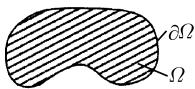

#### 1.12 常微分方程

微分方程是科学世界观的基础.

V. I. 阿诺尔德

用 Mathematica 软件包解微分方程 这个软件包能够数值地解微分方程, 并且当可能时, 也能给出解的闭形式.

已知其解可用闭形式表示的常微分方程和偏微分方程的一个相对完全的列表可在关于此主题的经典著作中找到 $^{[113]}$ .

光滑性 我们说一个函数是光滑的, 如果它在 $C^\infty$ 函数类中, 即, 它是无穷多次可微的.

一个域 $\Omega \subset \mathbb{R}^N$ 称为一个具有光滑边界的域, 如果其边界 $\partial \Omega$ 是光滑的, 即, 域 $\Omega$ 局部地位于其边界 $\partial \Omega$ 的一侧, 并且边界 $\partial \Omega$ 局部地可以用一个光滑函数来描述 (图1.118(a)). 具有光滑边界的域没有角点.

  
(a)

  
(b)  
图1.118 $C_0^\infty (\Omega)$ 类的函数

用 $C_0^\infty (\Omega)$ 表示在 $\Omega$ 中光滑的、并且其支集包含在 $\Omega$ 的一紧子集中（即在一紧子集之外为零）的函数的类.

例: 在图 1.118(b) 中表示的函数属于类 $C_0^\infty(0, l)$ . 这个函数是光滑的, 在区间 $[0, l]$ 外为零, 在 $x = 0$ 和 $x = l$ 的邻域中也为零.

##### 本节包含的小节

- [1.12.1 引导性的例子](<1.12.1 引导性的例子.md>)
- [1.12.2 基本概念](<1.12.2 基本概念.md>)
- [1.12.3 微分方程的分类](<1.12.3 微分方程的分类.md>)
- [1.12.4 初等解法](<1.12.4 初等解法.md>)
- [1.12.5 应用](<1.12.5 应用.md>)
- [1.12.6 线性微分方程组和传播子](<1.12.6 线性微分方程组和传播子.md>)
- [1.12.7 稳定性](<1.12.7 稳定性.md>)
- [1.12.8 边值问题和格林函数](<1.12.8 边值问题和格林函数.md>)
- [1.12.9 一般理论](<1.12.9 一般理论.md>)
