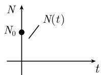
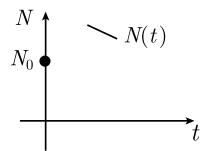
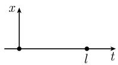
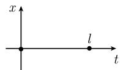

##### 1.12.1 引导性的例子

1.12.1.1 放射性衰减

考虑一放射性物质 (如镭, 1898 年由居里夫妇发现). 这样的物质有下述性质: 它的原子在连续地衰减.

令 $N(t)$ 表示在时刻 t 时尚未衰减的原子数. 那么下述定律成立:

$$
\boxed { \begin{array}{l} N ^ {\prime} (t) = - \alpha N (t), \\ N (0) = N _ {0} \quad (\text {初值}). \end{array} }\tag{1.202}
$$

这个方程包含未知函数的一个导数, 因而称其为微分方程. 初值描述了这样的事实: 在开始的时刻 $t = 0$ , 尚未衰减的原子数等于 $N_{0}$ . 正常数 $\alpha$ 是衰减常数. 存在性和唯一性结果 问题 (1.202) 有一个唯一解 (图 1.119(a)):

$$
\boxed {N (t) = N _ {0} \mathrm{e} ^ {- \alpha t}, \quad t \in \mathbb {R}.}\tag{1.203}
$$

  
(a) 放射性衰减

  
(b) 增长

  
(c) 缓慢增长  
图 1.119 微分方程 $N'(t) = -\alpha N(t), N'(t) = \alpha N(t)$ ,  
$N'(t)=\alpha N(t)-\beta N(t)^{2}$ 的解

证明: (i) (存在性). 对 (1.203) 求导数, 得到

$$
N ^ {\prime} (t) = - \alpha N _ {0} \mathrm{e} ^ {- \alpha t} = - \alpha N (t).
$$

此外, $N(0)=N_{0}$ .

(ii) (唯一性). 微分方程 $N' = -\alpha N$ 的右端关于 $N$ 是 $C^1$ 类的, 则 1.12.4.2 中的整体唯一性定理给出了问题 (1.202) 的解的唯一性.

通解 通过任意选取 $N_{0}$ 可以得到微分方程 (1.202) 的通解. 用常数 $N_{0}$ 确保了 (1.203) 是通解.

可以用类似的方法来处理下面一些例子.

微分方程的目的 不需知道有关放射性衰减的确切过程的任何事情, 而能够推导出微分方程 (1.202), 这是很有意义的. 为此, 考虑泰勒 (Taylor) 级数

$$
N (t + \Delta t) - N (t) = A \Delta t + B (\Delta t) ^ {2} + \dots .\tag{1.204}
$$

我们的假设是 A 正比于量 $N(t)$ . 由于衰减, 对 $\Delta t > 0$ , 我们有 $N(t + \Delta t) - N(t) < 0$ . 所以 A 必定是负的, 因而可令

$$
A = - \alpha N (t).\tag{1.205}
$$

从 (1.204) 可以得到

$$
N ^ {\prime} (t) = \lim _ {\Delta t \to 0} \frac {N (t + \Delta t) - N (t)}{\Delta t} = A = - \alpha N (t).
$$

问题的适定性 初始量 $N_{0}$ 的小变动导致解的小变动.

为了更细致地描述这个现象, 引进范数

$$
\| N \| := \max _ {0 \leqslant t \leqslant \mathcal {T}} | N (t) |.
$$

因而, 对于微分方程 (1.202) 的两个解 $N$ 和 $N_{*}$ , 有

$$
\boxed {\| N - N _ {*} \| \leqslant | N (0) - N _ {*} (0) |.}
$$

稳定性 解是渐近稳定的, 意味着对大的时刻它趋于平衡解. 更明确一些, 有

$$
\boxed {\lim _ {t \to + \infty} N (t) = 0.}
$$

这意味着在足够长时间后所有原子都衰减了.

1.12.1.2 增长方程

现在令 $N(t)$ 表示一种特别类型的病原体在时刻 t 时的数目. 假设这种病原体的再生服从 (1.204), 其中 $A = \alpha N(t)$ . 由此得到增长方程

$$
\boxed { \begin{array}{l} N ^ {\prime} (t) = \alpha N (t), \\ N (0) = N _ {0} \quad (\text {初值}). \end{array} }\tag{1.206}
$$

存在性和唯一性 问题 (1.206) 有一个唯一解 (图 1.119(b)):

$$
\boxed {N (t) = N _ {0} \mathrm{e} ^ {\alpha t}, \quad t \in \mathbb {R}.}\tag{1.207}
$$

问题是不适定的 初始条件 $N_{0}$ 的微小变化随时间而引起解的差大的增长:

$$
\boxed {\| N - N _ {*} \| = \mathrm{e} ^ {\alpha \mathcal {T}} | N (0) - N _ {*} (0) |.}
$$

不稳定性

$$
\lim _ {t \to + \infty} N (t) = + \infty .
$$

具有常数增长速度的过程随时间而增长至任何界之外, 并在一个相对短时间后导致突变.

1.12.1.3 阻抗增长 (逻辑斯谛方程)

具有正常数 $\alpha$ 和 $\beta$ 的方程

$$
\boxed { \begin{array}{l} N ^ {\prime} (t) = \alpha N (t) - \beta N (t) ^ {2}, \\ N (0) = N _ {0} \quad (\text {初值}) \end{array} }\tag{1.208}
$$

是从增长方程 (1.206) 添加阻抗项而得, 阻抗项描述了种群寻找食物的困难性. 方程 (1.208) 是所谓的里卡蒂 (Riccati) 微分方程的特殊情形 (见 1.12.4.7). $^{1)}$

重标度 改变度量粒子数的单位和时间的单位, 即引进新的变量 N 和 $\tau$ 如下:

$$
\boxed {N (t) = \gamma \mathcal {N}, \quad t = \delta \tau .}
$$

这样, 从 (1.208) 得到方程

$$
\begin{array}{r} \frac {\mathrm{d} N}{\mathrm{d} t} = \frac {\mathrm{d} (\gamma \mathcal {N})}{\mathrm{d} \tau} \frac {\mathrm{d} \tau}{\mathrm{d} t} = \gamma \mathcal {N} ^ {\prime} (\tau) \frac {1}{\delta} \\ = \alpha \gamma \mathcal {N} (\tau) - \beta \gamma^ {2} \mathcal {N} (\tau) ^ {2}. \end{array}
$$

如果选取 $\delta := 1/\alpha$ 和 $\gamma := \alpha/\beta$ ，那么可以得到新方程

$$
\boxed { \begin{array}{l} {\mathcal {N} ^ {\prime} (\tau) = \mathcal {N} (\tau) - \mathcal {N} (\tau) ^ {2},} \\ {\mathcal {N} (0) = \mathcal {N} _ {0} \quad (\text {初始条件}).} \end{array} }\tag{1.209}
$$

平衡态的确定 (1.209) 的时间无关解 (平衡态) 由

$$
\mathcal {N} \equiv 0 \quad {\text {和}} \quad \mathcal {N} \equiv 1
$$

给出.

证明：从 $\mathcal{N} =$ 常数和(1.209)即得 $\mathcal{N}^2 -\mathcal{N} = 0,$ 这蕴涵着 $\mathcal{N} = 0$ 或 $\mathcal{N} = 1$ □存在性和唯一性令 $0 <   \mathcal{N}_0\leqslant 1$ ，那么问题(1.209)对所有的时刻 $\tau$ 有解（图1.119(c))

$$
\boxed {\mathcal {N} (\tau) = \frac {1}{1 + C \mathrm{e} ^ {- \tau}},}
$$

其中 $C := (1 - \mathcal{N}_{0}) / \mathcal{N}_{0}$ .

对于 $N_{0}=0$ ，问题 (1.209) 对于所有时刻 $\tau$ 有唯一解 $\mathcal{N}(\tau)\equiv0$ .

稳定性 如果 $0 < N_{0} \leqslant 1$ , 那么对于大的时间, 该系统发展为平衡态 $N \equiv 1$ , 即

$$
\boxed {\lim _ {\tau \to + \infty} \mathcal {N} (\tau) = 1.}\tag{1.210}
$$

平衡态 $N \equiv 1$ 是稳定的, 即由 (1.210), 粒子数在时刻 $\tau = 0$ 时的小改变在足够大的时间后趋向这个平衡解.

另一方面, 平衡态 $\mathcal{N} \equiv 0$ 是不稳定的. 由 (1.210), 粒子数在时刻 $\tau = 0$ 时的小改变在一个相对小的时间后导致一个强烈的改变.

1.12.1.4 在有限时间的爆炸 (破裂)

在区间] $-\pi /2,\pi /2[$ 中，微分方程

$$
\boxed {N ^ {\prime} (t) = 1 + N (t) ^ {2}, \quad N (0) = 0}\tag{1.211}
$$

有一个唯一解 (图 1.120)

$$
N (t) = \tan t.
$$

有

$$
\boxed {\lim _ {t \to \frac {\pi}{2} - 0} N (t) = + \infty .}
$$

  
图1.120

这里, 一件不寻常的事是, 解在有限时间变为无限. 这是某个自感应过程的一个模型, 它为化工厂的工程师所担忧.

1.12.1.5 谐振子和特征振荡

单簧 我们考虑一个质量为 $m$ 的质点, 它在一个弹簧的影响 (它形成一个正比于离 $x = 0$ 处距离的力 $\mathbf{F}_0 := -kx\mathbf{i}$ ) 下, 以及一个附加外力 $\mathbf{F}_1 := \mathcal{F}(t)\mathbf{i}$ 作用下沿着 $x$ 轴运动. 牛顿 (Newton, 1643—1727) 关于力的定律说明力等于质量乘以加速度, $mx'' = F_0 + F_1$ , 其中 $\mathbf{x} = x\mathbf{i}$ . 这就导致了微分方程

$$
\boxed { \begin{array}{c} x ^ {\prime \prime} (t) + \omega^ {2} x (t) = F (t), \\ x (0) = x _ {0} \quad (\text {初始位置}), \\ x ^ {\prime} (0) = v \quad (\text {初始速度}), \end{array} }\tag{1.212}
$$

这里 $\omega := \sqrt{k / m}$ , $F := \mathcal{F} / m$ . 力函数 $F: [0, +\infty [\to \mathbb{R}$ 被假定为连续的.

存在性和唯一性 此问题对于所有时刻有一个唯一解 $^{1)}$

$$
\boxed {x (t) = x _ {0} \cos \omega t + \frac {v}{\omega} \sin \omega t + \int_ {0} ^ {t} G (t, \tau) F (\tau) \mathrm{d} \tau ,}\tag{1.213}
$$

其中格林 (Green) 函数 $G(t, \tau) := \frac{1}{\omega} \sin \omega(t - \tau)$ .

特征振荡 如果外力等于零, 即 $F \equiv 0$ , 则称 (1.213) 的一个解为谐振子的一个特征振荡. 这是一个正弦波和一个频率为 $\omega$ 、周期为

$$
\boxed {T = \frac {2 \pi}{\omega}}
$$

的余弦波的叠加.

例：图 1.121(b) 展示了特征振动 $x = x(t)$ ，当在 x 轴上的质点在 t = 0 时不在中心，并且此时它不在运动状态，即， $x_{0} \neq 0, v = 0$ 时，这样的特征振动就发生了。

  
图 1.121 振动的初值问题

问题的适定性 初始位置 $x_{0}$ ，初始速度 v 和外力 F 的小变动导致运动的小变动。更明确些，对于 (1.212) 的两个解 x 和 $x_{*}$ ，有不等式

$$
\| x - x _ {*} \| \leqslant | x (0) - x _ {*} (0) | + \frac {1}{\omega} | x ^ {\prime} (0) - x _ {*} ^ {\prime} (0) | + \frac {\mathcal {F}}{\omega} \max _ {0 \leqslant t \leqslant \mathcal {T}} | F (t) - F _ {*} (t) |,
$$

其中

$$
\| x - x _ {*} \| := \max _ {0 \leqslant t \leqslant \mathcal {T}} | x (t) - x _ {*} (t) |,
$$

这里 $[0, T]$ 是一个任意的时间区间.

本征值问题 问题

$$
\boxed { \begin{array}{l} {- x ^ {\prime \prime} (t) = \lambda x (t),} \\ {x (0) = x (l) = 0 \quad (\text { 边界条件 })} \end{array} }
$$

称为本征值问题. 数 $l > 0$ 是给定的. 一个非平凡解 $x \neq 0$ 将被称为本征解 $(x, \lambda)$ . 此时相应的数 $\lambda$ 被称为本征值.

定理 所有本征解由

$$
\boxed {x (t) = C \sin (n \omega_ {0} t), \quad \lambda = n ^ {2} \omega_ {0} ^ {2}, \quad \omega_ {0} = \frac {\pi}{l}, \quad n = 1, 2, \dots}
$$

给出. 这里 C 是一个任意非零常数.

证明：利用 (1.213) 当 $x_{0}=0, F\equiv0$ 时的解 $x(t)=\frac{v}{\omega}\sin\omega t,$ 并确定频率 $\omega,$ 使得质点在时刻 t=l 位于 x=0 (图 1.122). 从 $\sin(\omega l)=0,$ 我们得到 $\omega l=n\pi, n=1,2,\cdots$ . 这导致 $\omega=n\frac{\pi}{l}=n\omega_{0}$ . 因而对 $x(t)=C\sin(n\omega_{0}t)$ 求导数给出

$$
x ^ {\prime \prime} (t) = - \lambda x (t),
$$

其中 $\lambda = n^2\omega_0^2$

  
(a) n=1

  
(b) n=2  
图1.122

1.12.1.6 危险的共振效应

在周期外力

$$
\boxed {F (t) := \sin \alpha t}
$$

的情形考虑谐振子 (1.212).

定义 当 $\alpha = \omega$ ，即外力的频率与特征振动的频率一样时，此外力处于与谐振子的振动共振状态.

在此情形, 外力实际上增强了特征振动. 例如, 在过桥时, 人们必须注意由交通所产生的振动不要与桥的特征振动产生共振. 抗地震高楼的建造基于下述事实: 避免与地震振动的共振效应.

下述考虑展示了在数学上共振效应是如何产生的.

非共振情形 令 $\alpha \neq \omega$ 。那么当周期外力为 $F(t) := \sin \alpha t$ 时对于所有时刻 $t$ (1.212) 的唯一解是

$$
x (t) = x _ {0} \cos \omega t + \frac {v}{\omega} \sin \omega t + \frac {\sin \alpha t + \sin \omega t}{2 (\alpha + \omega) \omega} - \frac {\sin \alpha t - \sin \omega t}{2 (\alpha - \omega) \omega}.\tag{1.214}
$$

对于所有的时刻, 这个解是有界的.

共振情形 令 $\alpha = \omega$ . 那么当周期外力为 $F(t) := \sin \omega t$ 时对于所有时刻 $t$ (1.212) 的唯一解是

$$
\boxed {x (t) = x _ {0} \cos \omega t + \frac {v}{\omega} \sin \omega t + \frac {\sin \omega t}{2 \omega^ {2}} - \frac {t}{2 \omega} \cos \omega t.}\tag{1.215}
$$

描述频率为 $\omega$ 的外力的振动的最后一项 $t \cdot \cos \omega t$ 是危险的, 因为当 t 增大时它是无界的, 在日常生活中它可以导致一个结构的毁坏 (图 1.123(a)).

  
(a) 共振

  
(b) 阻尼振荡  
图1.123

当人们认识到通过取极限 $\alpha \rightarrow \omega$ 从非共振解 (1.214) 可以得到共振解 (1.215) 时, 出现危险的共振项 $t \cdot \cos \omega t$ 就是可理解的.

1.12.1.7 阻尼

如果存在一个作用在1.12.1.5中质点上的、正比于该质点速度的附加的阻抗力 $\pmb{F}_2 = -\gamma \pmb{x}'$ ( $\gamma >0$ ), 那么从运动方程 $m\pmb{x}'' = \pmb{F}_0 + \pmb{F}_2 = -k\pmb{x} - \gamma \pmb{x}'$ 得到微分方程

$$
\boxed { \begin{array}{l} x ^ {\prime \prime} (t) + \omega^ {2} x (t) + 2 \beta x ^ {\prime} (t) = 0, \\ x (0) = x _ {0}, \quad x ^ {\prime} (0) = v, \end{array} }\tag{1.216}
$$

其中正常数 $\beta := \gamma / 2m$ .

一个假设 作假设

$$
\boxed {x = \mathrm{e} ^ {\lambda t}.}
$$

从 (1.216) 得到 $(\lambda^2 + \omega^2 + 2\beta \lambda)\mathrm{e}^{\lambda t} = 0$ ，换言之，

$$
\boxed {\lambda^ {2} + \omega^ {2} + 2 \beta \lambda = 0,}
$$

它有解 $\lambda_{\pm} = -\beta \pm i\sqrt{\omega^{2} - \beta^{2}}$ . 若 C 和 D 是任意常数, 则函数

$$
x = C \mathrm{e} ^ {\lambda_ {+} t} + D \mathrm{e} ^ {\lambda_ {-} t}
$$

是 (1.216) 的解. 从初始条件可以确定常数 $C$ 和 $D$ . 还可以用欧拉公式 $\mathrm{e}^{(a + \mathrm{i}b)t} = \mathrm{e}^{at}(\cos bt + \mathrm{i}\sin bt)$ .

存在性和唯一性 令 $0 < \beta < \omega$ . 则对于所有时刻 $t$ 问题 (1.216) 有唯一解 $^{1)}$

$$
\boxed {x = x _ {0} \mathrm{e} ^ {- \beta t} \cos \omega_ {*} t + \frac {v + \beta x _ {0}}{\omega_ {*}} \mathrm{e} ^ {- \beta t} \sin \omega_ {*} t,}\tag{1.217}
$$

其中 $\omega_{*}:=\sqrt{\omega^{2}-\beta^{2}}$ . 这些是阻尼振动.

例：如果质点在 t=0 时有 $x_{0} \neq 0$ ，但 v=0，则可以在图 1.123(b) 中发现阻尼振动 (1.217).

1.12.1.8 化学反应和化学反应动理学的逆问题

给定 m 种化学物质 $A_{1}, \cdots, A_{m}$ ，并给出它们之间形如

$$
\sum_ {j = 1} ^ {m} \nu_ {j} A _ {j} = 0
$$

的化学反应, 其中的诸 $\nu_{j}$ 称为计量系数. 再者, 令 $N_{j}$ 是物质 $A_{j}$ 的分子数 $^{1)}$ . 用

$$
\boxed {c _ {j} := \frac {N _ {j}}{V}}
$$

表示物质 $A_{j}$ 的密度. 这里 V 是反应的累积体积.

例: 反应

$$
2 A _ {1} + A _ {2} \rightarrow 2 A _ {3}
$$

意味着物质 $A_{1}$ 的两个分子与物质 $A_{2}$ 的单个分子的结合形成第3种物质 $A_{3}$ 的两个分子. 可以将此写为如下式子:

$$
\nu_ {1} A _ {1} + \nu_ {2} A _ {2} + \nu_ {3} A _ {3} = 0,
$$

其中 $\nu_{1} = -2, \nu_{2} = -1, \nu_{3} = 2$ . 这个的一个例子是反应

$$
2 \mathrm{H} _ {2} + \mathrm{O} _ {2} \rightarrow 2 \mathrm{H} _ {2} \mathrm{O}.
$$

这描述了从两个氢分子和一个氧分子结合成两个水分子的事实.

化学反应动理学的基本方程

$$
\boxed { \begin{array}{l} {\frac {1}{\nu_ {j}} \frac {\mathrm{d} c _ {j}}{\mathrm{d} t} = k c _ {1} ^ {n _ {1}} c _ {2} ^ {n _ {2}} \dots c _ {m} ^ {n _ {m}}, \quad j = 1, \dots , m,} \\ {c _ {j} (0) = c _ {j 0} \quad (\text {初始条件}),} \end{array} }\tag{1.218}
$$

这里 k 是正的反应速度常量, 它依赖于压力 p 和温度 T. 诸数 $n_{1}, n_{2}, \cdots$ 被称为反应的阶. 未知者是粒子 $c_{j}(t)$ 的密度对于时间 t 的依赖性.

注 化学反应通常包含子反应, 在完成反应的过程中这些子反应有自己的产出物. 用这种方式, 大量像 (1.218) 的系统需要描述所发生的实际的化学变化. 在许多情形, 人们并不完全知道这些子反应是什么, 也不知道反应速度常量 $k$ 或反应阶 $n_j$ . 这就导致利用 (1.218) 从诸 $c_j(t)$ 的计量来推导常量和诸 $c_j$ 这个问题的困难性. 这是所谓的反问题. $^{2)}$

在生物学中的应用 (1.218) 型的方程及其变形经常出现在生物学中．在此情形， $N_{j}$ 是某种生物的数目（也比较增长方程 (1.206) 和增长的阻尼方程 (1.208)).3)

下一节考虑其中出现常微分方程和偏微分方程的一系列基本现象. 在理解微分方程理论时, 有关这些现象的知识是相当有用的.
