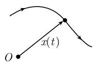
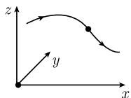
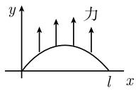
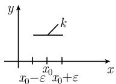
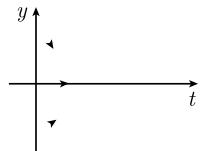
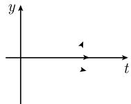

##### 1.12.2 基本概念

在自然界中和技术中, 许多过程是由微分方程描述的.

(i) 具有有限多个自由度的系统相应于常微分方程 (例如, 牛顿力学中有限多个质点的运动).

(ii) 具有无限多个自由度的系统相应于偏微分方程 (例如, 弹性体、液体、气体、电磁场和量子系统的运动、生物学和化学中反应过程和扩散过程的描述, 或者宇宙随时间变化的描述).

物理学中不同学科的基本方程都是微分方程. 它们中有许多方程的出发点是对于一个质量为 $m$ 的粒子的 (如行星和恒星) 牛顿运动定律:

$$
\boxed {m \boldsymbol {x} ^ {\prime \prime} (t) = \boldsymbol {F} (\boldsymbol {x} (t), t).}\tag{1.219}
$$

用语言表达, 这个定律是说, 质点的质量乘以它的加速度等于作用在其上的力. 我们要寻找粒子的轨道

$$
\boxed {\boldsymbol {x} = \boldsymbol {x} (t),}
$$

它满足方程 (1.219)(图 1.124). 通常, 一个微分方程除了包含所寻求的函数外, 还包含它的导数 (因而, 自然地称为 “微分方程”).

  
(a)

  
(b)  
图1.124

常微分方程 如果所求函数仅依赖于一个实变量 (如依赖于时间 t), 那么该微分方程称为常微分方程.

例 1: (1.219) 中有一个常微分方程.

偏微分方程 在物理学的各种场论中,所涉及的量 (如电磁场的温度或强度) 依赖于几个变量 (如依赖于时间和位置). 此时对于这些量的微分方程包含了所求函数的偏导数. 这样, 它就被称为一个偏微分方程.

例 2: 在许多情形, 一个物体的温度场 $T = T(x, y, z, t)$ 满足热导方程

$$
\boxed {T _ {t} - \kappa \Delta T = 0,}\tag{1.220}
$$

其中 $\Delta T := T_{xx} + T_{yy} + T_{zz}$ . 这里 $T(x, y, z, t)$ 表示在位置 $(x, y, z)$ 处及在时刻 t 时的温度. 物质常量 $\kappa$ 刻画了物体的热传导能力.

1.12.2.1 自然科学中基本的“无穷小”认识论策略

微分方程 (1.219) 描述了在“无穷小水平”上轨道的性状, 粗略地说, 对非常小的时刻 t, 它是成立的. $^{1)}$ 这是惊人的认识论现象的一部分, 粗略地说是这样的:

$$
\text {在“无穷小水平”(即,对于非常小的时间和非常小的空间距离),自然界中的所有过程都变得非常简单,并且可以用少数几个方程来表示.}
$$

这样, 这些方程包含着多得不可置信的信息量. 解密这些信息是数学的事, 即, 对于合理的时间和空间距离解这些微分方程.

随着无穷小演算——微积分学的创立,对于自然科学中出现的现象,牛顿和莱布尼茨已经给了我们深刻理解的钥匙.对人类智力的这项成就的赞美不会过高的.

1.12.2.2 初始条件的作用

牛顿的微分方程 (1.219) 描述了质量为 $m$ 的所有可能的运动. 例如, 天文学家真正感兴趣于计算天体的轨道. 为了计算这些轨道, 除了牛顿的方程外, 人们还必须引入所论天体在一个给定时刻 $t_0$ 的状态. 更明确地, 人们必须考虑下述问题:

$$
\boxed { \begin{array}{c c} {{m \pmb {x} ^ {\prime \prime} (t) = \pmb {F} (\pmb {x} (t), t)}} & {{\quad (\text {运动方程}),}} \\ {{\pmb {x} (t _ {0}) = \pmb {x} _ {0}}} & {{\quad (\text {初始位置}),}} \\ {{\pmb {x} ^ {\prime} (t _ {0}) = \pmb {v} _ {0}}} & {{\quad (\text {初始速度}).}} \end{array} }\tag{1.221}
$$

存在性和唯一性结果 假设下述:

(i) 在初始时刻 $t_{0}$ ，给定了位置 $x_{0}$ 和该点处的速度向量 $v_{0}$ .

(ii) 对所有位置 x 和对在初始时刻 $t_{0}$ 的一个小邻域中的所有时刻 t，力场 $\boldsymbol{F} = \boldsymbol{F}(\boldsymbol{x}, t)$ 是充分光滑的 (如 $C^{1}$ 类).

那么, $^{2)}$ 存在一个空间邻域 $U(\boldsymbol{x}_{0})$ 和一个时间区间 $J(t_{0})$ ，问题 (1.221) 恰有一个解，它是对于所有时刻 $t \in J(t_{0})$ 都在 $U(\boldsymbol{x}_{0})$ 中的一个轨道

$$
\boldsymbol {x} = \boldsymbol {x} (t).
$$

这个结果使人惊奇地保证了只对于充分小的时刻轨道的存在性. 但是在一般情形, 我们不能期望获得更多. 下述关系是可能的:

$$
\boxed {\lim _ {t \to t _ {1}} | \boldsymbol {x} (t) | = \infty ,}
$$

即, 力 F 是如此之强, 以致在一有限时刻 $t_{1}$ 质点延伸到 “无限”. 例(模型问题): 对于力 $F(x) := 2mx(1 + x^{2})$ , 微分方程

$$
\begin{array}{l} {m x ^ {\prime \prime} = F (x),} \\ {x (0) = 0, \quad x ^ {\prime} (0) = 1} \end{array}
$$

有唯一解

$$
x (t) = \tan t, - \frac {\pi}{2} <   t <   \frac {\pi}{2}.
$$

这里我们有

$$
\lim _ {t \to \frac {\pi}{2} - 0} | x (t) | = + \infty .
$$

为了保证一个解对所有时刻都存在, 人们利用下述的一般原则:

$$
\mathrm{先验估计确保整体解}.
$$

这可在 1.12.9.8 中找到.

1.12.2.3 稳定性的作用

太阳的引力场有形式

$$
\pmb {F} = - \frac {G M m}{| \pmb {x} | ^ {3}} \pmb {x},\tag{1.222}
$$

其中 $M$ 是太阳的质量, $m$ 是太阳的引力场中大粒子或物体的质量, $G$ 是引力常量. 在太阳的中心 $\pmb{x} = \omega$ , \* 这迫使场有奇性.

太阳系统稳定性的著名问题 这个问题总结在下述两个问题中.

(a) 行星的轨道是否稳定？即，它们是否在长时间后非常小地改变它们的形式？

(b) 行星是否会撞向太阳？或是否可能完全从太阳系逃逸？

自从拉格朗日 (Lagrange, 1736—1813) 起, 许多伟大的数学家都曾研究过这个问题. 首先, 他们试图通过 “初等函数” 用闭形式来表示行星的轨道. 然而, 直到 19 世纪末庞加莱 (Poincaré, 1854—1912) 认识到这是不可能的, 即使在原则上也行不通. 这就导致数学上两个完全新的发展方向:

(I) 存在性的抽象证明和拓扑学 既然似乎不可能明确地写下解, 那么至少试图通过非直接的、抽象的方法来证明解的存在性. 这就导致不动点定理的发展, 将在 [212] 中描述其细节. 关于常微分方程和偏微分方程解的存在性的一个基本的拓扑原理是 1934 年创始的著名的勒雷 (Leray)-绍德尔 (Schauder) 原理, 它被叙述为

$$
\boxed {\text {先验估计确保解的存在性}.}
$$

(II) 动力系统和拓扑学 科学家和工程师通常并不对解的确切形式感兴趣, 而只对解的基本性质感兴趣 (例如, 稳定周期振动的稳定平衡位置的存在性, 或者, 过渡到混沌的可能性). 这类问题是动力系统科学的研究对象, 其细节将在 [212] 中被描述.

对对象的定性性质更感兴趣的数学的分支是拓扑学. 拓扑学和动力系统理论是由伟大的法国数学家庞加莱在他关于天体力学中稳定性研究中所创立的. $^{1)}$ 这方面的一份可读的材料可在文献 [217] 中找到.

19 世纪中叶工程师发展了稳定性理论的某些方面. 他们感兴趣以这样的方式来制造机器, 建造大楼和桥梁: 它们是稳定的, 不容易被自然力量 (风和风暴) 所破坏.

稳定性理论基本的一般性的数学结果由俄国数学家李雅普诺夫 (Lyapunov) 于 1892 年所得到. 自此, 稳定性理论变为一门独立的数学学科, 至今仍是大量研究的主题. 对于许多复杂的问题来说, 解的稳定性的性质至今仍不甚了了. 注意:

$$
\text { 数学上完全正确的解,   如果它们是不稳定的,   可以与现实世界完全无关,   因而在自然界中不能实现. }
$$

一个类似的陈述对于计算机上所用的数值程序是不容置疑的. 只有稳定的数值程序, 即关于舍入误差是鲁棒的那些程序, 才是有用的.

今天, 太阳系的稳定性问题仍未解决. 在 1955 年科尔莫戈罗夫 (Kolmogorov), 以及后来还有阿诺尔德 (Arnol'd) 和莫泽 (Moser), 他们证明了拟周期运动 (如太阳系的运动) 的扰动对于扰动的类型是非常敏感的, 并且可以结束于混沌 (KAM 理论). 一个极小的粒子可能导致系统整体运动的改变. 由于这个原因, 从理论上考虑总不能解决太阳系的稳定性问题. 经过一周在数台超级计算机上的计算 (例如, 在著名的位于波士顿的麻省理工学院 (MIT)), 结果表明太阳系至少在下一个 100 万年中仍将保持稳定.

1.12.2.4 边界条件的作用和格林函数的基本想法

除了初始条件外, 我们还必须考虑边界条件.

例 3 (弹性杆): 一个弹性杆在一个外力的影响下的运动 (位移) $y = y(x)$ 由下述数学问题描述:

$$
\boxed { \begin{array}{c c} {- \kappa y ^ {\prime \prime} (x) = f (x)} & {(\text {力的平衡}),} \\ {y (0) = y (l) = 0} & {(\text {边界条件}).} \end{array} }\tag{1.223}
$$

这里， $\left(\int_{a}^{b}f(x)\mathrm{d}x\right)j$ 表示作用在区间 $[a,b]$ 中弹性杆上、沿着 $y$ 轴方向的力，即$f(x)$ 是外力在点 $x$ 处的密度. 正物质常量 $\kappa$ 描述杆的弹性性质. 边界条件描述了杆被固定于两个点 $x = 0$ 和 $x = l$ 处的事实 (图1.125(a)).

  
(a)

  
(b)  
图 1.125 弹性杆的微分方程

与变分学的联系

对于与变分学有关的问题,边界条件的出现是典型的.

例如, (1.223) 是从最小作用原理

$$
\boxed { \begin{array}{c} {\int_ {0} ^ {l} L (y (x), y ^ {\prime} (x)) \mathrm{d} x \stackrel {!} {=} \text {平稳的},} \\ {y (0) = y (l) = 0} \end{array} }
$$

作为其欧拉-拉格朗日方程而得到的, 这里的拉格朗日函数 $L := \frac{\kappa}{2} y'^{2} - fy$ (参阅 5.1.2). 这里, 有

$$
\int_ {0} ^ {l} L \mathrm{d} x = \text {杆的弹性能} - \text {力所做的功}.
$$

解用格林函数的表示 (1.123) 的唯一解由公式

$$
\boxed {y (x) = \int_ {0} ^ {l} G (x, \xi) f (\xi) \mathrm{d} \xi}\tag{1.224}
$$

给出. 这里, 问题 (1.223) 的格林函数是

$$
G (x, \xi) := \left\{ \begin{array}{l l} \frac {(l - \xi) x}{l \kappa}, & 0 \leqslant x \leqslant \xi \leqslant l, \\ \frac {(l - \xi) \xi}{l \kappa}, & 0 \leqslant \xi \leqslant x \leqslant l. \end{array} \right.
$$

格林函数的物理解释 选取力密度

$$
f _ {\varepsilon} (x) = \left\{ \begin{array}{l l} { \frac {1}{2 \varepsilon},} & {x _ {0} - \varepsilon \leqslant x \leqslant x _ {0} + \varepsilon ,} \\ {0,} & {\text {其他},} \end{array} \right.
$$

对于越来越小的 $\varepsilon$ ，它越来越集中在点 $x_{0}$ 处，并且，它所对应的总力为 1 (图 1.125(b)):

$$
\int_ {0} ^ {l} f _ {\varepsilon} (x) \mathrm{d} x = 1.
$$

由 $f_{\varepsilon}(x)$ 确定的运动由 $y_{\varepsilon}$ 表示. 那么有

$$
\boxed {\lim _ {\varepsilon \to 0} y _ {\varepsilon} (x) = G (x, x _ {0}).}
$$

狄拉克 (Dirac) $\delta$ 函数的形式应用 物理学家经常写形式的表达式

$$
\delta (x - x _ {0}) = \lim _ {\varepsilon \to 0} f _ {\varepsilon} (x) = \left\{ \begin{array}{l l} {+ \infty ,} & {x = x _ {0},} \\ {0,} & {\text {其他},} \end{array} \right.
$$

并且说 $y(x) := G(x, x_0)$ 是对于点密度力 $f(x) := \delta(x - x_0)$ 的初值问题 (1.223) 的一个解. 函数 $\delta(x - x_0)$ 称为狄拉克 $\delta$ 函数. 在这个形式的意义下, 有

$$
\boxed { \begin{array}{c l} {- \kappa G _ {x x} (x, x _ {0}) = \delta (x - x _ {0}),} & {\text {在} ] 0, l [ \text {上},} \\ {G (0, x _ {0}) = G (l, x _ {0}) = 0} & (\text {边界条件}). \end{array} }\tag{1.225}
$$

在广义函数理论框架中明确的数学表述 格林函数是边值问题

$$
\boxed { \begin{array}{c c} {- \kappa G _ {x x} (x, x _ {0}) - = \delta_ {x _ {0}},} & {\text {在} ] 0, l [ \text {上},} \\ {G (0, x _ {0}) = G (l, x _ {0}) = 0} & (\text {边界条件}) \end{array} }\tag{1.226}
$$

的一个解. 这里, $\delta_{x_0}$ 代表 $\delta$ 广义函数, 并且 (1.226) 的解是在广义函数的意义下理解的. $^{1)}$

格林函数在 1830 年前后由英国数学家和物理学家 G. 格林 (Green, 1793—1841) 所引进. 其一般策略为

$$
\begin{array}{l} \text {格林函数描述由高度集中的外部影响} \mathcal {E} \text {所产生的物理效应}. \\ \text {一般外部影响的效应作为具有与} \mathcal {E} \text {类似的(严格)形式的外部影响的假设而导得}. \end{array}
$$

格林函数方法被广泛地用于物理学的所有领域, 因为它允许物理效应的局部化, 并展示了如何建构一般的物理效应. 例如, 在量子场论中, 借助于费恩曼 (Feynman) 积分 (路径积分) 可以算得格林函数.

1) 广义函数理论于 1950 年前后由法国数学家施瓦兹 (Laurent Schwarts) 所创立, [212] 中描述了这一理论. 这样, 方程 (1.226) 意味着对所有检验函数 $\varphi \in C_0^\infty(0, l)$ 有

(1.227)

用 $\varphi$ 乘以 (1.225)，再在 $[0,l]$ 上部分积分两次，并利用

解的公式 (1.224) 表示了作为局限于点 $\xi$ 处的单独的力

$$
G (x, \xi) f (\xi)
$$

的叠加的一个任意力的作用.

1.12.2.5 边界-初始条件的作用

在一些物理场论中, 必须描述在初始时刻 $t_{0}$ 和在一个域的边界处场的结构. 通常置 $t_{0} := 0$ .

例 (热传导): 为了唯一确定在一个物体中的温度分布, 必须知道在初始时刻 $t = 0$ 的温度分布和在任何时刻 $t \geqslant 0$ 沿该物体边界的温度分布. 因而, 必须对热导方程 (1.220) 附加下述条件:

$$
\boxed { \begin{array}{r l r l} T _ {t} - \kappa \Delta T = 0, & & P \in D, t > 0, \\ T (P, 0) = T _ {0} (P), & & P \in D & (\text {初始温度}), \\ T (P, t) = T _ {1} (P, t), & & P \in \partial D, t > 0 & (\text {边界温度}). \end{array} }\tag{1.228}
$$

这里令 $P := (x, y, z)$ .

存在性和唯一性定理 如果 $D \in \mathbb{R}$ 是一个具有光滑边界的有界域, 并且如果指定的初始温度 $T_0$ 和给定的边界温度 $T_1$ 是光滑的, 那么热导方程 (1.228) 在 $D$ 中对所有时刻 $t \geqslant 0$ 有一个唯一确定的光滑解 $T$ .

1.12.2.6 适定问题

为了微分方程形式的数学模型能用于科学现象的研究, 微分方程必须具有下述性质:

(i) 有一个唯一解.

(ii) 初始条件的小改变导致解的小改变.

具有这些性质的问题被称为适定的。在每一情形，人们必须弄得更清楚些，所谓“小”改变是什么意思。

在与时间相关的问题中, 人们还对整体稳定性感兴趣:

(iii) 解对于所有时刻 $t \geqslant t_0$ 存在, 并且当 $t \to +\infty$ 时解趋于一个平衡态. 例1: 初值问题

$$
y ^ {\prime} = - y, \quad y (0) = \varepsilon\tag{1.229}
$$

对于 $\varepsilon=0$ 是适定的, 因为对于任意 $\varepsilon$ (1.229) 有唯一解

$$
y (t) = \varepsilon \mathrm{e} ^ {- t}, \quad t \in \mathbb {R}.\tag{1.230}
$$

若 $\varepsilon = 0$ , 得到平衡解 $y(t) = 0$ . 对于小扰动 $\varepsilon$ , 解 (1.230) 有改变, 然而很微小, 并且因为

$$
\lim _ {t \to + \infty} \varepsilon \mathrm{e} ^ {- t} = 0,
$$

对于大时刻 t, 在此情形它趋于平衡解 y = 0 (图 1.126(a)).

  
(a) 稳定

  
(b) 不稳定  
图 1.126 微分方程解的扰动

例 2: 初值问题

$$
y ^ {\prime} = y, \quad y (0) = \varepsilon
$$

对于 $\varepsilon=0$ 是不适定的. 事实上, 唯一确定的解

$$
y (t) = \varepsilon \mathrm{e} ^ {t}
$$

对每个任意小的初值 $\varepsilon \neq 0$ (当 t 大时) 破裂 (图 1.126(b)).

例 3 (不适定逆问题): 卫星测量地球的引力场. 由此, 人们要确定地球的密度 $\rho$ ; 人们特别对确定油田位置感兴趣.

这个问题是不适定的, 即从测量所得不能唯一确定密度 $\rho$ .

1.12.2.7 约化为积分方程

例 1: 问题

$$
y ^ {\prime} (t) = g (t), \quad y (0) = a
$$

有唯一解

$$
y (t) = a + \int_ {0} ^ {t} g (\tau) \mathrm{d} \tau .
$$

因而，人们把更一般的问题

$$
\boxed {y ^ {\prime} (t) = f (t, y (t)), \quad y (0) = a}
$$

归结为等价的问题

$$
\boxed {y (t) = a + \int_ {0} ^ {t} f (\tau , y (\tau)) \mathrm{d} \tau .}
$$

这个方程在积分号下包含未知函数 $y$ ，因而被称为是一个积分方程。利用迭代过程

$$
\boxed {y _ {n + 1} (t) = a + \int_ {0} ^ {t} f (\tau , y _ {n} (\tau)) \mathrm{d} \tau , \quad y _ {0} (t) \equiv a, \quad n = 1, 2, \dots}
$$

可以解这个积分方程.

例 2: 边值问题

$$
\boxed { \begin{array}{c} - \kappa y ^ {\prime \prime} (x) = f (x, y (x)), \\ y (0) = y (l) = 0 \end{array} }
$$

可以 (因为公式 (1.224) 是它的一个解) 归结为等价的积分方程

$$
y (x) = \int_ {0} ^ {l} G (x, \xi) f (\xi , y (\xi)) \mathrm{d} \xi .
$$

[212] 系统地处理积分方程. 在偏微分方程的经典理论中, 通过利用格林函数, 人们通常过渡到积分方程. 然而, 这个方法对于更复杂的问题变得有点烦琐, 在有些情形完全得不到任何结果. 在 1935 年前后出现的较现代的偏微分方程的泛函分析理论中, 从一开始偏微分方程就被看成微分算子的方程, 而并不过渡到积分方程.

1.12.2.8 可积性条件的重要性

对于 $C^{2}$ 类的函数 $u = u(x, y)$ ，有偏微商的交换性：

$$
\boxed {u _ {x y} = u _ {y x}.}
$$

在偏微分方程理论的许多问题中这个关系起着重要的作用.

例 1: 方程

$$
u _ {x} = x, \quad u _ {y} = x
$$

没有任何解. 事实上, 对于一个解 $u$ , 我们会有 $u_{xy} = u_{yx}$ . 由于 $u_{xy} = 0$ 和 $u_{yx} = 1$ , 这不可能成立.

例 2: 令在域 $D \in R^{2}$ 中给定 $C^{1}$ 函数 $f = f(x, y), g = g(x, y)$ . 考虑方程

$$
\boxed {u _ {x} (x, y) = f (x, y), \quad u _ {y} (x, y) = g (x, y), \quad \text {在} D \text {上},}
$$

如果存在一个 $C^{2}$ 解 u, 那么由于 $u_{xy} = u_{yx}$ , 所谓的可积性条件

$$
\boxed {f _ {y} (x, y) = g _ {x} (x, y), \quad \text {在} D \text {上}}
$$

必须成立. 如果 $D$ 是单连通的, 这个条件对于解的存在也是充分的. 此时, 解可以被确定为曲线积分

$$
u (x, y) = \text {常量} + \int_ {(x _ {0}, y _ {0})} ^ {(x, y)} f \mathrm{d} x + g \mathrm{d} y,
$$

它不依赖于积分的路径.

如果我们选择 $D$ 为围绕某点的一个小圆盘, 那么 $D$ 是单连通的. 这样, 可积性条件的成立对于局部地解初值问题 $u_x = f$ , $u_y = g$ 是充分的.

这是一个一次又一次得到的一个基本的经验, 即必要的可积性条件对于局部可解性而言也是充分的. 反之, 整体可解性以一种决定性的方式取决于区域的结构 (拓扑). $^{1)}$ 可积性条件在许多应用中起着重要的作用:

(i) 高斯 (Gauss) 的绝妙定理描述了曲面的导数方程的可积性条件 (参阅 3.6.3.3).

(ii) 两个事实: 每个无旋力场 (如引力场) 都有位势, 以及: 电磁场是一个 4-位势的导数. 这两个事实都是可积性条件的推论.

(iii) 热力学的一些重要的关系由与热力学第一定理和第二定理密切相关的吉布斯 (Gibbs) 方程的可积性条件而得 (参阅 1.13.1.10).

微分形式的嘉当 (Cartan)-凯勒 (Kähler) 定理给出了可积性条件简洁处理的恰当结构.
