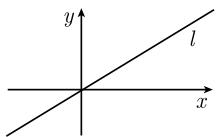
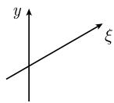
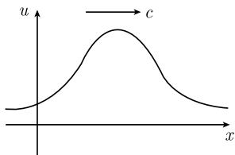

##### 1.12.3 微分方程的分类

微分方程的阶 在一个微分方程中出现的导数的最高次数称为它的阶.

例 1: 牛顿运动定律

$$
m \pmb {x} ^ {\prime \prime} = \pmb {F}
$$

包含二次导数, 因而其阶为 2.

热导方程

$$
T _ {t} - \kappa (T _ {x x} + T _ {y y} + T _ {z z}) = 0\tag{1.231}
$$

包含对时间的一次导数和对每个空间变量的二次导数. 因而这个微分方程有阶为 2. 微分方程组 热导方程(1.231) 是作为时间的函数的温度的一个微分方程. 在微分方程中当方程或函数个数多于一个时, 我们就说这是微分方程组.

例 2: 利用笛卡儿坐标可以把位置向量写为 $x := xi + yj + zk$ . 用同样的方式分解力向量后, 例 1 的牛顿运动定律可以写为

$$
m x ^ {\prime \prime} (t) = X (P (t), t), \quad m y ^ {\prime \prime} (t) = Y (P (t), t), \quad m z ^ {\prime \prime} (t) = Z (P (t), t),
$$

其中 $P := (x, y, z)$ . 这是一个 2 阶微分方程组.

1.12.3.1 约化原理

通过引进适当的变量, 任何微分方程和微分方程组可以被约化为一个等价的一阶微分方程组.

例 1: 2 阶微分方程

$$
y ^ {\prime \prime} + y ^ {\prime} + y = 0
$$

1) 在这个方向上的一个非常深刻的结果是德拉姆 (de Rham) 定理 (见 [212]).

通过引进新的变量 $p := y'$ 被变为等价的一阶微分方程组

$$
\begin{array}{l} {y ^ {\prime} = p,} \\ {p ^ {\prime} + p + y = 0.} \end{array}
$$

微分方程

$$
y ^ {\prime \prime \prime} + y ^ {\prime \prime} + y ^ {\prime} + y = 0
$$

可以用类似的方法, 通过引进 $p := y'$ 和 $q := y''$ 被变为

$$
\begin{array}{l} {p = y ^ {\prime}, q = p ^ {\prime},} \\ {p ^ {\prime} + q + p + y = 0.} \end{array}
$$

例 2: 拉普拉斯方程

$$
u _ {x x} + u _ {y y} = 0
$$

通过变量代换为 $p := u_{x}$ 和 $q := u_{y}$ 被变为等价的一阶组

$$
\begin{array}{l} p = u _ {x}, q = u _ {y}, \\ p _ {x} + q _ {y} = 0. \end{array}
$$

1.12.3.2 线性微分方程和叠加原理

按定义, 未知函数 u 的一个线性微分方程具有形式

$$
\boxed {L u = f,}\tag{1.232}
$$

其中右端还依赖于变量 u，并且对于所有充分光滑的函数 u, v 和所有实数 $\alpha, \beta$ ，微分算子 L 有特征性质

$$
\boxed {L (\alpha u + \beta v) = \alpha L (u) + \beta L (v).}\tag{1.233}
$$

例 1: 常微分方程

$$
u ^ {\prime \prime} (t) = f (t)
$$

是线性的. 为了看到这一点, 令

$$
L u := \frac {\mathrm{d} ^ {2} u}{\mathrm{d} t ^ {2}}.
$$

人们经常就写为 $L := \frac{d^{2}}{dt^{2}}$ . 从微商的可加性得到

$$
L (\alpha u + \beta v) = (\alpha u + \beta v) ^ {\prime \prime} = \alpha u ^ {\prime \prime} + \beta v ^ {\prime \prime} = \alpha L u + \beta L v.
$$

因而, 线性条件 (1.233) 即被满足.

例 2: 函数 $u = u(t)$ 的最一般的 n 阶 (线性) 常微分方程具有形式

$$
\boxed {a _ {0} u + a _ {1} u ^ {\prime} + a _ {2} u ^ {\prime \prime} + \dots + a _ {n} u ^ {(n)} = f,}
$$

其中所有系数 $a_{i}$ 和 $f$ 都是时刻 $t$ 的函数, 并且 $a_{n} \neq 0$ . 最一般的线性 (偏) 微分方程是未知函数的诸导数与系数的线性组合, 它们都是与作为方程解的函数有相同变量的函数.

例 3: 令 $u = u(x, y)$ . 微分方程

$$
a u _ {x x} + b u _ {y y} = f\tag{1.234}
$$

在 $a = a(x,y)$ , $b = b(x,y)$ 和 $f = f(x,y)$ 都只是自变量 $x$ 和 $y$ 的函数的情形是线性的. 在右端 $f = f(x,y,u)$ 还依赖于未知函数的情形, 方程 (1.234) 是一个非线性微分方程.

齐次方程 对于线性微分方程 (1.232)，如果 $f \equiv 0$ 则它称为齐次的；否则称为非齐次的.

叠加原理 (i) 对于一个齐次微分方程, 解 u 和 v 的线性组合 $\alpha u + \beta v$ 也是该方程的解.

(ii) 对于非齐次方程, 有下述重要规则:

$$
\begin{array}{r l} {{\text {非齐次方程的通解} = \text {非齐次方程的一个特解}}} \\ & {{+ \text {对应的齐次方程的通解}.}} \end{array}\tag{1.235}
$$

例 4: 考虑微分方程

$$
\boxed {u ^ {\prime} = 1, \quad \text {在} \mathbb {R} \text {上}.}
$$

它的一个特解是 $u = t$ . 齐次方程 $u' = 0$ 的通解是 $u = \text{常数}$ . 因而非齐次方程的通解是

$$
u = t + \text { 常数 }.
$$

1.12.3.3 非线性微分方程

非线性微分方程描述交互作用过程.

自然界中大多数过程是交互作用类型的. 这就解释了非线性微分方程在自然科学中的重要性. 电磁场的麦克斯韦 (Maxwell) 方程组形成了这个规则的一个明显的例外. 然而, 这些方程只描述了一部分电磁场的现象. 量子电动力学的完全方程描述了电磁波 (光子)、电子和正电子之间的交互作用. 这些方程的确是非线性的.

对于非线性方程, 叠加原理不成立.

例 1: 在太阳系引力场中的行星的牛顿运动方程是

$$
m \pmb {x} ^ {\prime \prime} (t) = - \frac {G m M}{| \pmb {x} (t) | ^ {3}} \pmb {x} (t).
$$

这些方程 (对于向量 x 的每个坐标) 是非线性的, 并且描述了太阳与诸行星之间的引力交互作用.

半线性方程 若 $L$ 是一个如同 (1.232) 中那样的 $n$ 阶线性微分算子, 称形如

$$
L u = f (u)
$$

的一个方程为半线性的; 其右端依赖于所求函数 u 及其直到 n-1 阶的导数.

例 2: 方程 $u_{xx} + u_{yy} = f(u, u_x, u_y, x, y)$ 是半线性的.

拟线性方程 一个对其最高阶导数是线性的方程被称为拟线性的.

例 3: 方程 $au_{xx} + bu_{yy} = f$ 是拟线性的, 如果 a, b 和 f (仅) 依赖于 x, y, u, $u_x$ 和 $u_y$ .

1.12.3.4 平稳过程和非平稳过程

依赖于时间 t 的过程被称为非平稳的. 与时间无关的过程称为平稳过程.

平稳过程相应于自然界, 技术和经济中的平衡架构.

1.12.3.5 平衡架构

稳定平衡架构 一个平衡架构被称为稳定的, 如果该系统不被小扰动所影响, 即, 在偏离平衡位置的一个小扰动后, 该架构在有限时间后仍归于平衡位置.

在我们的物理世界中, 只出现稳定的平衡架构.

不稳定的平衡架构是那些在小扰动后无限偏离平衡位置的平衡架构.

平衡原理 为了对于一个非平稳过程的微分方程寻找平衡解, 人们把微分方程中所有关于时间的导数置于零, 然后再解所得到的微分方程.

例 1: 考虑非平稳的热导方程

$$
\boxed {T _ {t} - \kappa \Delta T = 0.}\tag{1.236}
$$

通过寻找与时间无关的解 $T = T(x,y,z)$ , 可以得到平衡解. 这样, 有 $T_{t} \equiv 0$ . 即要找平稳热导方程

$$
\boxed {- \kappa \Delta T = 0}\tag{1.237}
$$

的解. 我们希望, 一个非平稳 (与时间无关的) 热分布在适度的假设下当 $t \to \infty$ 时趋于一个平衡分布, 即, (1.236) 的某种解当 $t \to \infty$ 时趋于 (1.237) 的一个解.

在适当的假设下, 对于一般的情形, 可以严格地证明这个期望是正确的.

在下述简单的模型问题中我们来解释这个事情.

例 2: 令 $a \neq 0$ . 为了找到微分方程

$$
\boxed {y ^ {\prime} = a y (t)}
$$

的平衡解, 假设解与时间无关. 这样, $y'(t) = 0$ , 因而

$$
\boxed {y (t) = 0, \quad \text {对所有的} t.}
$$

根据 1.12.2.6 的例 1 和例 2, 这个平衡解当 a = -1 时是稳定的, 当 a = 1 时是不稳定的 (图 1.126).

1.12.3.6 比较系数法 —— 一个一般解法

例 1: 为了解方程

$$
\boxed {u ^ {\prime \prime} = u + 1,}
$$

用泰勒展开式

$$
u (t) = u (0) + u ^ {\prime} (0) t + u ^ {\prime \prime} (0) \frac {t ^ {2}}{2} + u ^ {\prime \prime \prime} (0) \frac {t ^ {3}}{3 !} + \dots .
$$

如果知道 $u(0)$ 和 $u'(0)$ ，那么所有高阶导数 $u''(0), u'''(0), \cdots$ 可以从微分方程计算而得。同时，为了得到一个唯一解，必须考虑下述初值问题：

$$
\boxed {u ^ {\prime \prime} = u + 1, \quad u (0) = a, \quad u ^ {\prime} (0) = b.}
$$

此时得到

$$
\begin{array}{l} u ^ {\prime \prime} (0) = u (0) + 1 = a + 1, u ^ {\prime \prime \prime} (0) = u ^ {\prime} (0) = b, \\ u ^ {(2 n)} (0) = a + 1, u ^ {(2 n + 1)} (0) = b, n = 1, 2, \dots . \end{array}
$$

用相同方法可以解任何最高阶导数可被解出的常微分方程.

相同的方法也适用于偏微分方程. 然而在此情形, 一个新的因素介入了, 这就是必须考虑 (偏) 微分方程的特征.

例 2: 令函数 $\varphi = \varphi(x)$ 被给定. 要找一个函数 $u := u(x, y)$ ，它满足下述初值问题:

$$
\boxed { \begin{array}{l l} & u _ {y} = u, \\ & u (x, 0) = \varphi (x) \quad (\text {初始值}), \end{array} }
$$

即规定了 u 沿着 x 轴的值. 为了进行下去, 取函数在原点处的泰勒展开式

$$
u (x, y) = u (0, 0) + u _ {x} (0, 0) x + u _ {y} (0, 0) y + \dots .
$$

为了这个方法能产生唯一定义的表达式, 必须能从初始值和微分方程确定 $u$ 的所有偏微商. 事实上, 对于现在的这个问题, 这是可能的. 首先, 初始条件 $u(x,0) = \varphi(x)$ 产生了所有关于 $x$ 的微商:

$$
u (0, 0) = \varphi (0), \quad u _ {x} (0, 0) = \varphi^ {\prime} (0), \quad u _ {x x} (0, 0) = \varphi^ {\prime \prime} (0), \dots .
$$

从微分方程 $u_{y} = u$ 可以得到

$$
u _ {y} (0, 0) = u (0, 0) = \varphi (0, 0).
$$

通过对微分方程求导数可以确定所有剩余的导数:

$$
u _ {y x} (0, 0) = u _ {x} (0, 0), \quad \dots .
$$

例 3: 对于初值问题

$$
\boxed { \begin{array}{l} u _ {y} = u, \\ u (0, y) = \psi (y) \quad (\text {初始值}), \end{array} }
$$

情形完全不同, 这里规定了 u 沿着 y 轴的值.

在此情形, 没有关于 $x$ 导数的任何信息. 事实上, 微分方程与初值问题可以相互矛盾, 以致全然没有解存在. 例如, 解必须满足 $u_y(0,0) = \psi'(0)$ , 并且同时满足 $y_y(0,0) = u(0,0) = \psi(0)$ , 因而

$$
\boxed {\psi (0) = \psi^ {\prime} (0).}
$$

对于解的存在的这个必要条件被称为相容性条件；如果这个条件不被满足，那么没有解存在.

例 4: 设给定直线 $l: y = \alpha x$ ，这里 $\alpha \neq 0$ 。为了解初值问题

$$
\begin{array}{r l} & {u _ {y} = u,} \\ & {u \text {沿着直线} l \text {已知} (\text {初始值}),} \end{array}
$$

把 l 作为 $\xi$ 坐标轴, 并引进新的坐标系 $\xi, y$ (图 1.127(b)).

  
(a)

  
(b)  
图1.127

如果把函数 u 在新坐标系中写下, 那么得到问题

$$
\boxed { \begin{array}{l} u _ {y} = u, \\ u (\xi , 0) = \varphi (\xi), \end{array} }
$$

可以用上述例 2 中相同的方法解此问题. $^{1)}$

特征 由于上述例 2～例 4 的提示,可以说,在这些情形,y 轴是微分方程

$$
u _ {y} = u
$$

的特征, 而过原点的其他任何直线都不是特征.

特征的一般理论及其他们的物理解释将在 1.13.3 中阐述. 同时,微分方程特征的性状可以被用于微分方程的分类(椭圆的、抛物的和双曲的,参阅 1.13.3.2).

粗略地讲, 有

与系统的初始条件相配的特征, 不唯一地确定解, 或根本不允许有解.

从物理的观点看, 特征是重要的, 因为它们描述了波前. 波的传播对于自然界中能量的输运是最重要的机理.

例 5: 方程

$$
u (x, t) = \varphi (x - c t)\tag{1.238}
$$

描述了一个具有速度 c，从左向右的波的传播(图 1.128).

(i) 如果在初始时刻 $t = 0$ 指定 $u$ 的值, 那么可以从方程 $u(x,0) = \varphi (x)$ 唯一地确定函数 $\varphi$ .

(ii) 另一方面, 如果沿着直线 $x - ct =$ 常数 $= a$ 指定 $u$ 的值, 那么只有 $\varphi(a)$ 被确定, 而函数 $\varphi$ 除了这个值外是任意的.

图1.128

1.12.3.7 不需实际上解出而可以从微分方程得到的重要信息

在许多情形, 不可能显式地解出微分方程. 因此, 尽可能多地直接从一个给定的微分方程推导得物理上相关的信息是具有很大价值的. 除了其他一些以外, 下述类型的信息可以用这种方式得到:

(i) 守恒律(如能量的守恒);

(ii) 波前方程 (特征), 见 1.13.3.1;

(iii) 最大值原理 (参阅 1.13.4.2);

(iv) 稳定性判别准则 (参阅 1.12.7).

例 (能量守恒): 令 $x = x(t)$ 是微分方程

$$
m x ^ {\prime \prime} (t) = - U ^ {\prime} (x (t))
$$

的一个解. 如果令

$$
E (t) := \frac {m x ^ {\prime} (t) ^ {2}}{2} + U (x (t)),
$$

则有

$$
\frac {\mathrm{d} E (t)}{\mathrm{d} t} = m x ^ {\prime \prime} (t) x ^ {\prime} (t) + U ^ {\prime} (x (t)) x ^ {\prime} (t) = 0,
$$

换言之，

$$
\boxed {E (t) = \text {常数}.}
$$

这是能量守恒律.

推导这个关系只用到了微分方程, 而未用到解的形式.

1.12.3.8 对称性和守恒律

例 1 (能量守恒): 考虑拉格朗日函数 L 和函数 $P(t) := (q(t), q'(t))$ 的欧拉-拉格朗日方程 (见 5.1.1 和 14.5.2):

$$
\boxed {\frac {\mathrm{d}}{\mathrm{d} t} L _ {q ^ {\prime}} (P (t)) - L _ {q} (P (t)) = 0.}\tag{1.239}
$$

如果令

$$
E (t) := q ^ {\prime} (t) L _ {q ^ {\prime}} (P (t)) - L (P (t)),
$$

那么对于 $(1.239)$ 的每个解有下述能量守恒律:

$$
\boxed {E (t) = \text {常数}.}\tag{1.240}
$$

守恒律在自然界中具有基本重要性, 并且对于我们周围世界各种形式的稳定性是可靠的保证. 没有守恒律的世界会是完全混沌的.

什么是出现这样的守恒律的深刻原因呢？对这个困难问题的一个答案如下：

$$
\mathrm{我们的世界的对称性是我们所观察到的守恒律的根源}.
$$

这个基本的认识论原理的严格数学表述是诺特 (E. Noether) 于 1918 年证明的著名定理的内容. 这个对理论物理具有极端重要性的定理的更多细节将在 [212] 中被讨论.

例 2: 能量守恒 (1.240) 是诺特定理的一个特殊情形. 从拉格朗日函数 L 不依赖于时间 t 这一事实推得相应的对称性质. 由此, 方程 (1.239) 在时间的平移下是不变的. 这意味着: 若

$$
q = q (t)
$$

是 (1.239) 的一个解, 那么函数

$$
q = q (t + t _ {0})
$$

也是一个解, 其中 $t_{0}$ 表示一个任意的时间常数.

定义 我们说一个物理系统在时间平移下是不变的, 如果下述陈述成立: 如果一个物理过程 P 是可能的, 那么从 P 加以一个任意时间常数而得到的过程也是可能的.

$$
\text {   在时间平移下不变的系统具有一个守恒量,   称为能量.   }
$$

例 3: 我们的太阳的引力场是与时间无关的. 因而, 围绕太阳的所有行星的运动在时间平移下是不变的, 这样, 从一个真实的运动通过一个时间的平移所产生的任何运动都是可能的.

如果太阳的引力场是与时间相关的, 那么初始值 (时间) 的选取对于确定行星的运动是极端重要的. 在此情形, 行星运动的能量守恒不成立 (参阅 1.9.6).

在旋转下不变的系统具有一个守恒量,称为角动量.

角动量守恒意味着：如果一个过程 P 是可能的，

那么从 P 经过一个旋转而得到的过程也是可能的.

例 4: 太阳的引力场是旋转对称的. 这样, 对于太阳系, 角动量是一个守恒量.

在平移下不变的系统具有一个守恒量, 称为动量.

例 5: 如果让太阳系中的太阳的位置是可变的, 而不是位于原点, 那么太阳系在平移下不变. 这样, 对于太阳系, 动量是一个守恒量. 这等价于下述陈述: 太阳系的质量中心沿一条直线以常速度运动 (参阅 1.9.6).

1.12.3.9 获得唯一性结果的策略

对于常微分方程, 有一个非常简单的一般性的唯一性结果 (参阅 1.12.4.2). 对于偏微分方程, 情况远为复杂. 为了检查解的唯一性, 有以下一些方法:

(i) 能量方法, 它基于能量守恒律 (参阅 1.13.4.1), 以及

(ii) 最大值原理 (参阅 1.13.4.2).

用两个简单的例子来解释基本的想法.

能量方法

例 1: 初值问题

$$
m x ^ {\prime \prime} = - x, \quad x (0) = a, \quad x ^ {\prime} (0) = b\tag{1.241}
$$

至多有一个解.

证明：假设存在两个不同的解 $x_{1}$ 和 $x_{2}$ . 那么如同在所有唯一性论证中那样, 考虑它们的差

$$
y (t) := x _ {1} (t) - x _ {2} (t).
$$

如果能证明 $y(t) \equiv 0$ ，那么就完成了证明.

为此, 首先注意, y 的方程是从对于 $x = x_{1}$ 和 $x = x_{2}$ 的 (1.241) 相减而得:

$$
m y ^ {\prime \prime} = - y, \quad y (0) = 0, \quad y ^ {\prime} (0) = 0.
$$

从如同 1.12.3.7 中的能量守恒, 令其中的 $U = y^{2}/2$ , 有

$$
\frac {m y ^ {\prime} (t) ^ {2}}{2} + \frac {y (t) ^ {2}}{2} = \text {常数} = E.
$$

如果考虑初始时刻 t=0, 那么从关系式 $y(0)=y'(0)=0$ 得到 E=0. 因而

$$
y (t) = 0.
$$

在这个证明背后的简单的物理思想是在直观上很清楚的事实:

如果一个其中能量守恒成立的系统在某个初始时刻是静止的, 那么该系统无能量, 并且对所有时刻仍是静止的.

最大值原理

例 2: 令 $\Omega$ 是 $R^{3}$ 中的有界域. 平稳热导方程

$$
T _ {x x} + T _ {y y} + T _ {z z} = 0, \quad \text {在} \Omega \text {上}\tag{1.242}
$$

的每个在闭包 $\overline{\Omega} = \Omega \cup \partial \Omega$ 上的 $C^{2}$ 解在边界上达到它的最大值和最小值.

特别地, 如果在 $\partial \Omega$ 上对于 (1.242) 的解 $T$ 有 $T \equiv 0$ , 那么在 $\overline{\Omega}$ 上 $T \equiv 0$ . 物理解释: 如果温度在边界上为零, 那么不存在这样的内点 $P$ , 使得 $T(P) \neq 0$ . 否则, 温度变化流将导致一个时间相关热流, 这与系统的时间无关 (平稳) 性相矛盾. 例3 (唯一性): 令函数 $T_0$ 被给定. 边值问题

$$
\begin{array}{l l} {{T _ {x x} + T _ {y y} + T _ {z z} = 0,}} & {{\text {在} \varOmega \text {上},}} \\ {{T = T _ {0},}} & {{\text {在} \partial \varOmega \text {上}}} \end{array}\tag{1.243}
$$

至多有一个解.

证明：如果 $T_{1}$ 和 $T_{2}$ 是不同的解，那么差 $T := T_{1} - T_{2}$ 满足 $T_{0} = 0$ 时的方程 (1.243). 因而，由例子 2 知 $T \equiv 0$ .
