##### 1.12.4 初等解法

拉普拉斯变换 每个任意阶的常系数线性微分方程, 以及每个这样的微分方程组, 都可以借助于拉普拉斯变换得到其解 (参阅 1.11.1.2).

求积分 按定义, 一个微分方程可以由求积分被解, 如果可以通过计算积分而得到解. 下述所谓的初等解法即为这种类型. $^{1)}$

1.12.4.1 局部存在性和唯一性定理

$$
\boxed { \begin{array}{l} x ^ {\prime} (t) = f (t, x (t)), \\ x \left(t _ {0}\right) = x _ {0} \quad (\text {初始值}). \end{array} }\tag{1.244}
$$

定义 令点 $(t_0, x_0) \in \mathbb{R}^2$ 被给定．初值问题(1.244)是局部唯一可解的，当且仅当存在一个矩形 $R := \{(t, x) \in \mathbb{R}^2 : |t - t_0| \leqslant \alpha, |x - x_0| \leqslant \beta\}$ ，使得在 $R$ 中存在(1.244)的一个唯一解 $x = x(t)$ (图1.129).

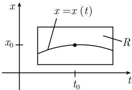  
图1.129

皮卡 (1890) 和林德勒夫 (1894) 定理 如果在点 $(t_0, x_0)$ 的一个邻域中 $f$ 是 $C^1$ 类的, 那么初值问题是局部唯一可解的. 这个解可以利用迭代格式

$$
\boxed {x _ {n + 1} (t) = x _ {0} + \int_ {t _ {0}} ^ {t} f (\tau , x _ {n} (\tau)) \mathrm{d} \tau , \quad n = 0, 1, \dots}
$$

而得到. $^{3)}$ 零阶逼近是常数函数 $x_{0}(t) \equiv x_{0}$ .

放松假设 只需下述假设之一被满足就是充分的了:

(i) 在点 $(t_0, x_0)$ 的一个邻域中 $f$ 和偏导数 $f_x$ 是连续的.

(ii) $f$ 在点 $(t_0, x_0)$ 的一个邻域 $U$ 中是连续的, 并且关于 $x$ 是利普希茨(R. O. S. Lipschitz, 1832—1903) 连续的, 即, 对于在 $U$ 中的所有点 $(t, x)$ 和 $(t, y)$ 有

$$
| f (t, x) - f (t, y) | \leqslant \text { 常数 }   | x - y |.
$$

事实上, (i) 是 (ii) 的一个特殊情形.

佩亚诺 (Peano) 定理 (1890) 如果 $f$ 在点 $(t_0, x_0)$ 的一个邻域 $U$ 中是连续的, 那么初值问题 (1.244) 是局部可解的.

然而, 这样解的唯一性不能被保证. $^{1)}$

对于微分方程组的推广 当 (1.244) 表示一个微分方程组的时候, 上面所有的陈述仍然成立. 在这个情形, $x = (x_{1}, \cdots, x_{n})$ 和 $f = (f_{1}, \cdots, f_{n})$ . 此时方程 (1.244) 可显式地表为 $^{2)}$

$$
\boxed { \begin{array}{l} x _ {j} ^ {\prime} (t) = f _ {j} (t, x (t)), \quad j = 1, \dots , n, \\ x _ {j} (t _ {0}) = x _ {j 0}. \end{array} }\tag{1.245}
$$

根据约化原理, 一个任意阶的任意的微分方程组可以被归化为形式 (1.245) (参阅 1.12.3.1).

对于复变量微分方程组的推广 如果诸 $x_{j}$ 是复变量, 并且 $f_{j}(t,x)$ 的值是复的, 那么在适当的调整下所有的陈述仍然成立.

整体存在性和唯一性结果 关于这方面内容, 见 1.12.9.1.

1.12.4.2 整体唯一性定理

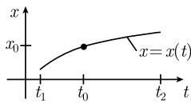  
图1.130

定理 假设 $x = x(t), t_1 < t < t_2$ 是 (1.244) 的一个解, 使得每个点 $(t, x(t))$ 有一个邻域 $U$ , 在 $U$ 中 $f$ 是 $C^1$ 的. 那么, $^{3)}$ 初值问题 (1.244) 在区间 $[t_1, t_2]$ 上没有别的解 (图 1.130). 证明思想: 一个另外的解必定在某个点与所给定的解不同, 而由皮卡 - 林德勒夫定理, 这是不可能的.

推广 对于实值和复值组, 一个类似的结果也成立.

1.12.4.3 求解的一个一般策略

物理学家和工程师 (同样地, 17 世纪和 18 世纪的数学家) 发展了一些容易记忆的和非常简单、形式的方法来解微分方程 (例如, 参阅 1.12.4.4). 如果人们借助于这些方法之一已经找到了一个 “解”, 那么有两个重要的问题:

(a) 实际上它是一个解吗?

(b) 这是一个唯一的解吗？还是有形式的方法没有发现的更多的解？

答案是:

(a) 一个解可以通过在微分方程中显式地实现微商而被确认.

(b) 利用 1.12.4.2 中的整体唯一性结果.

在下一节中我们将考虑这个一般策略的应用.

1.12.4.4 分离变量法

$$
\boxed { \begin{array}{c} {\frac {\mathrm{d} x}{\mathrm{d} t} = f (t) g (x),} \\ {x (t _ {0}) = x _ {0} \quad (\text {初始值}).} \end{array} }\tag{1.246}
$$

形式方法 莱布尼茨的微分学优美地导致了

$$
{\frac {\mathrm{d} x}{g (x)}} = f (t) \mathrm{d} t
$$

以及

$$
\int \frac {\mathrm{d} x}{g (x)} = \int f (t) \mathrm{d} t.
$$

如果想提供初始条件, 那么可以写为

$$
\boxed {\int_ {x _ {0}} ^ {x} \frac {\mathrm{d} x}{g (x)} = \int_ {t _ {0}} ^ {t} f (t) \mathrm{d} t.}\tag{1.247}
$$

定理 如果 $f$ 在 $t_0$ 的一个邻域里是连续的, $g$ 在 $x_0$ 的一个邻域里是 $C^1$ 的, 并且 $g(x_0) \neq 0$ , 那么初值问题 (1.246) 是局部唯一可解的. 其解可以通过对 $x$ 解出方程 (1.247) 而得.

注 这个定理保证了对于位于初始时刻的一个小邻域中时刻的解．一般地，不可能得到比此更多 (参阅下述例 2)．然而在具体的情形中，人们可以利用这个方法去得到一个候选解 $x = x(t)$ ，它也许在更长的时间区间中存在．在这点上，利用在1.12.4.3中说明的策略是有利的.

例 1: 考虑初值问题

$$
\boxed { \begin{array}{c} {{ \frac {\mathrm{d} x}{\mathrm{d} t} = a x (t),}} \\ {{x (0) = x _ {0} \quad (\text {初始值}).}} \end{array} }\tag{1.248}
$$

这里 a 是一个实常数. (1.248) 的唯一解是

$$
\boxed {x (t) = x _ {0} \mathrm{e} ^ {a t}, \quad t \in \mathbb {R}.}\tag{1.249}
$$

形式方法 首先假设 $x_{0} > 0$ . 那么, 应用分离变量法即产生

$$
\int_ {x _ {0}} ^ {x} \frac {\mathrm{d} x}{x} = \int_ {t _ {0}} ^ {t} a \mathrm{d} t.
$$

由此即得 $\ln x - \ln x_0 = at$ ，因而 $\ln \frac{x}{x_0} = at$ ，即 $\frac{x}{x_0} = e^{at}$ .

精确解 对 (1.249) 求导数给出

$$
x ^ {\prime} = a x _ {0} \mathrm{e} ^ {a t} = a x,
$$

即 (1.249) 中的函数事实上是 (1.248) 的一个解. 由于其右端 $f := ax$ 是 $C^1$ 的, 整体唯一性定理 1.12.4.2 说明了不存在另外的解.

这些考虑对于所有 $x_{0} \in R$ 都是成立的, 然而形式方法对于 $x_{0} = 0$ 是失效的, 因为 “ $\ln 0 = -\infty$ ”.

例 2:

$$
\boxed { \begin{array}{c} {\frac {\mathrm{d} x}{\mathrm{d} t} = \frac {(1 + x ^ {2})}{\varepsilon},} \\ {x (0) = 0 \quad (\text {初始值}).} \end{array} }\tag{1.250}
$$

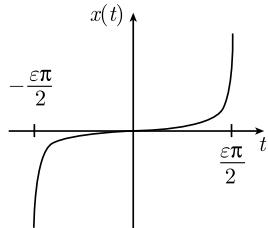  
图1.131

这里 $\varepsilon > 0$ 是一个常数. (1.250) 的唯一确定的解是

$$
\boxed {x (t) = \tan {\frac {t}{\varepsilon}}, - \frac {\varepsilon \pi}{2} <   t <   \frac {\varepsilon \pi}{2}.}
$$

并且当 $t\to\frac{\varepsilon\pi}{2}-0$ 时有 $x(t)\to\infty$ .ε越小,解破裂得越快(图1.131).

形式方法 分离变量法产生了

$$
\int_ {0} ^ {x} \frac {\mathrm{d} x}{1 + x ^ {2}} = \int_ {0} ^ {t} \frac {\mathrm{d} t}{t},
$$

以致 $\arctan x = t / \varepsilon$ ，即 $x = \tan (t / \varepsilon)$

精确解 结果如同在例 1 中所有.

1.12.4.5 线性微分方程和传播子

$$
\boxed { \begin{array}{c} {x ^ {\prime} = A (t) x + B (t),} \\ {x (0) = x _ {0} \quad (\text {初始值}).} \end{array} }\tag{1.251}
$$

定理 如果在一个开区间 $J$ 上 $A, B: J \to \mathbb{R}$ 是连续的, 那么初值问题 (1.251) 在 $J$ 上有唯一解

$$
\boxed {x (t) = P (t, t _ {0}) x _ {0} + \int_ {t _ {0}} ^ {t} P (t, \tau) B (\tau) \mathrm{d} \tau ,}\tag{1.252}
$$

其中的 $P(t,\tau)$ 是所谓的传播子:

$$
\boxed {P (t, \tau) := \exp \left(\int_ {\tau} ^ {t} A (s) \mathrm{d} s\right).}
$$

对于传播子, 有

$$
P _ {t} (t, \tau) = A (t) P (t, \tau), \quad P (\tau , \tau) = 1,\tag{1.253}
$$

并且对于 $t_1 < t_2 < t_3$ 我们有 $P(t_3, t_1) = P(t_3, t_2)P(t_2, t_1)$ .

证明: 对 (1.252) 求微商, 产生

$$
x ^ {\prime} (t) = P _ {t} (t, t _ {0}) x _ {0} + \int_ {t _ {0}} ^ {t} P _ {t} (t, \tau) B (\tau) \mathrm{d} \tau + P (t, t) B (t).
$$

考虑到 (1.253), 得到

$$
x ^ {\prime} (t) = A (t) x (t) + B (t).
$$

唯一性从 1.12.4.2 中的整体唯一性结果即得.

传播子的基本重要性将在 1.12.6.1 中讨论.

利用一种所谓常数变易法的方法求得了解 (1.252)，常数变易法是拉格朗日在处理行星运动时所发明的.

常数变易法 第1步: 齐次问题的解. 如果令 $B \equiv 0$ , 那么从 (1.251) 由分离变量法我们得到表达式

$$
\int_ {x _ {0}} ^ {x} \frac {\mathrm{d} x}{x} = \int_ {t _ {0}} ^ {t} A (s) \mathrm{d} s.
$$

对于 $x_0 > 0$ ，这给出了 $\ln \frac{x}{x_0} = \int_{t_0}^{t}A(s)\mathrm{d}s,$ 因而

$$
x = C \exp \left(\int_ {t _ {0}} ^ {t} A (s) \mathrm{d} s\right),\tag{1.254}
$$

其中常数 $C = x_0$

第 2 步: 非齐次问题的解. 拉格朗日的想法是, 通过引进扰动 B, 常数 $C = C(t)$ 就变为依赖于时间的了. 对 (1.254) 求微商产生

$$
x ^ {\prime} = C ^ {\prime} \exp \left(\int_ {t _ {0}} ^ {t} A (s) \mathrm{d} s\right) + A x.
$$

将其与给定的微分方程 $x' = Ax + B$ 相比较, 可以得到微分方程

$$
C ^ {\prime} (t) = \exp \bigg (- \int_ {t _ {0}} ^ {t} A (s) \mathrm{d} s \bigg) B (t),
$$

它的解为

$$
C (t) = x _ {0} + \int_ {t _ {0}} ^ {t} \exp \left(- \int_ {t _ {0}} ^ {\tau} A (s) \mathrm{d} s\right) B (\tau) \mathrm{d} \tau .
$$

这就是 (1.252).

叠加原理的应用

例 3: 一个直觉的猜测导致微分方程

$$
x ^ {\prime} = x - 1\tag{1.255}
$$

的一个特解 $x = 1$ 。由 (1.248)，齐次方程 $x' = x$ 有通解 $x = \text{常数} \cdot \mathrm{e}^t$ 。因而，由 1.12.3.2 中的叠加原理，微分方程 (1.255) 有通解

$$
x = \mathrm{常数} \cdot \mathrm{e} ^ {t} + 1.
$$

1.12.4.6 伯努利微分方程

$$
\boxed {x ^ {\prime} = A (t) x + B (t) x ^ {\alpha}, \quad \alpha \neq 1.}
$$

由代换 $y = x^{1 - \alpha}$ ，可以由此得到线性微分方程

$$
y ^ {\prime} = (1 - \alpha) A y + (1 - \alpha) B.
$$

这个微分方程由雅各布·伯努利 (J. Bernoulli, 1654—1705) 首先研究.

1.12.4.7 里卡蒂微分方程和控制问题

$$
\boxed {x ^ {\prime} = A (t) x + B (t) x ^ {2} + C (t).}\tag{1.256}
$$

如果知道它的一个特解 $x_{*}$ ，那么通过代换 $x = x_{*} + \frac{1}{y}$ 就得到线性微分方程

$$
- y ^ {\prime} = (A + 2 x _ {*} B) y + B.\tag{1.257}
$$

例: 非齐次逻辑斯谛方程

$$
x ^ {\prime} = x - x ^ {2} + 2
$$

有特解 $x = 2$ 。其相应的微分方程 (1.257) 是 $y' = 3y + 1$ ，因而有通解 $y = \frac{1}{3}(Ce^{3t} - 1)$ 。由此及 (1.256) 即得带常数 $C$ 的通解

$$
x = 2 + \frac {3}{C \mathrm{e} ^ {3 t} - 1}, \qquad t \in \mathbb {R}.
$$

交比 如果知道 (1.256) 的 3 个解 $x_{1}, x_{2}$ 和 $x_{3}$ , 那么通过下述条件可以得到 (1.256) 的通解 $x = x(t)$ : 这 4 个函数的交比

$$
\boxed {\frac {x (t) - x _ {2} (t)}{x (t) - x _ {1} (t)}: \frac {x _ {3} (t) - x _ {2} (t)}{x _ {3} (t) - x _ {1} (t)}}
$$

是常数. 由里卡蒂 (J. C. Riccati, 1676—1754) 所研究的这个微分方程今天在具有二次费用函数的 (线性) 控制理论中起着中心的作用 (参阅 5.3.2).

1.12.4.8 齐次微分方程

$$
\boxed {x ^ {\prime} = F (x, t).}
$$

如果对于所有 $\lambda \in \mathbb{R}$ 有 $F(\lambda x, \lambda t) = F(x, t)$ , 则 $F(x, t) = f\left(\frac{x}{t}\right)$ , 这意味着 $F$ 实际上只是比 $x / t$ 的函数. 代换

$$
y = \frac {x}{t}
$$

即导致微分方程

$$
\frac {\mathrm{d} y}{\mathrm{d} t} = \frac {f (y) - y}{t},
$$

而它则可通过分离变量法得到解.

例: 微分方程

$$
x ^ {\prime} = \frac {x}{t}\tag{1.258}
$$

可通过代换 y = x/t 变为方程 $y' = 0$ ; 它有 (通) 解 y = 常数. 因而,

$$
x = \mathrm{常数} \cdot t
$$

是 (1.258) 的通解.

1.12.4.9 正合微分方程

$$
\boxed { \begin{array}{l} {\frac {\mathrm{d} x}{\mathrm{d} t} = \frac {f (x , t)}{g (x , t)},} \\ {x (t _ {0}) = x _ {0} \quad (\text {初始值}).} \end{array} }\tag{1.259}
$$

令 $g(x_0,t_0)\neq 0$

定义 微分方程 (1.259) 被称为正合的, 当且仅当在 $(x_0, t_0)$ 的一个邻域 $U$ 中 $f$ 和 $g$ 是 $C^1$ 的, 并且在 $U$ 中满足相容性条件

$$
\boxed {f _ {x} (x, t) = - g _ {t} (x, t).}\tag{1.260}
$$

定理 在具有正合性的情形, 方程 (1.259) 是局部可解的. 从方程

$$
\boxed {\int_ {x _ {0}} ^ {x} g (\xi , \xi_ {0}) \mathrm{d} \xi = \int_ {t _ {0}} ^ {t} f (x _ {0}, \tau) \mathrm{d} \tau}\tag{1.261}
$$

中解出 x 即得其解.

这是分离变量法的一个推广 (参阅 1.12.4.4).

全微分解的公式 (1.261) 等价于下述过程:

(i) 把微分方程写成形式

$$
g \mathrm{d} x - f \mathrm{d} t = 0.
$$

(ii) 作为方程

$$
\mathrm{d} F = g \mathrm{d} x - f \mathrm{d} t
$$

的解确定函数 $F$ 。由于 $\mathrm{d}(\mathrm{d}F) = (g_t + f_x)\mathrm{d}t \wedge \mathrm{d}x$ 和 (1.260)，满足可积性条件 $\mathrm{d}(\mathrm{d}F) = 0$ .

(iii) 对 $x$ 解方程

$$
F (x, t) = F (x _ {0}, t _ {0}),
$$

并且得到 (1.259) 的一个解 $x = x(t)$ . 显式地, 这意味着

$$
F (x, t) = \int_ {x _ {0}} ^ {x} f (\xi , t _ {0}) \mathrm{d} \xi - \int_ {t _ {0}} ^ {t} f (x _ {0}, \tau) \mathrm{d} \tau + \text {常数}.
$$

由此即得 (1.261).

在一些简单情形不必利用 (1.261), 因为函数容易被猜出来. 下述例子就说明了此点.

例: 方程

$$
\boxed {\frac {\mathrm{d} x}{\mathrm{d} t} = - \frac {3 x ^ {2} t ^ {2} + x}{2 x t ^ {3} + t}}\tag{1.262}
$$

可以写为下述形式:

$$
(2 x t ^ {3} + t) \mathrm{d} x + (3 x ^ {2} t ^ {2} + x) \mathrm{d} t = 0.
$$

人们容易猜测, 方程

$$
\mathrm{d} F = F _ {x} \mathrm{d} x + F _ {t} \mathrm{d} t = (2 x t ^ {3} + t) \mathrm{d} x + (3 x ^ {2} t ^ {2} + x) \mathrm{d} t
$$

有解 $F(x,t)=x^{3}t^{3}+xt$ . 方程 $F(x,t)=$ 常数, 即

$$
\boxed {x ^ {3} t ^ {3} + x t = \text {常数}}
$$

描述了表示 (1.262) 的通解的一族曲线.

1.12.4.10 欧拉乘子

如果微分方程 (1.261) 不是正合的, 那么可以尝试用 $M(x,t)$ 同时乘以分母和分子, 得到一个新的微分方程

$$
\boxed {\frac {\mathrm{d} x}{\mathrm{d} t} = \frac {M (x , t) f (x , t)}{M (x , t) g (x , t)},}
$$

而它是正合的. 如果因子 $M$ 做到了这点, 那么它就称为一个欧拉乘子.

例: 如果把这个方法应用于

$$
\boxed {\frac {\mathrm{d} x}{\mathrm{d} t} = - \frac {3 x ^ {4} t ^ {3} + x ^ {3} t}{2 x ^ {3} t ^ {4} + x ^ {2} t ^ {2}},}
$$

取 $M := 1/x^{2}t$ ，那么就得到正合微分方程 (1.262).

1.12.4.11 高阶微分方程

类型 1 (能量方法)

$$
\boxed {x ^ {\prime \prime} = f (x).}\tag{1.263}
$$

令 $F(x) = \int f\mathrm{d}x$ ，即， $F$ 是 $f$ 的原函数．对于非常数解，方程(1.263）等价于所谓的能量守恒方程

$$
\boxed {\frac {x ^ {\prime 2}}{2} - F (x) = \text {常数}.}\tag{1.264}
$$

事实上, 求导数给出了

$$
\boxed {\frac {\mathrm{d}}{\mathrm{d} t} \left(\frac {x ^ {\prime 2}}{2} - F (x)\right) = (x ^ {\prime \prime} - f (x)) x ^ {\prime}.}
$$

因而, (1.263) 的每个解也是 (1.264) 的解. 对于非常数解, 其逆也成立.

这个方法对于确定地球的宇宙极限速度的一个应用将在 1.12.5.1 中考虑. 类型 2 (约化为低阶方程)

$$
\boxed {x ^ {\prime \prime} = f (x ^ {\prime}, t), \quad x (t _ {0}) = x _ {0}, \quad x ^ {\prime} (t _ {0}) = v.}\tag{1.265}
$$

由代换 $y = x'$ 得到一阶方程

$$
y ^ {\prime} = f (y, t), \quad y (t _ {0}) = v,
$$

其解 $y = y(t)$ 产生(1.265)的解

$$
x (t) = x _ {0} + \int_ {t _ {0}} ^ {t} y (\tau) \mathrm{d} \tau .
$$

类型 3 (逆函数方法)

$$
\boxed {x ^ {\prime \prime} = f (x, x ^ {\prime}), \quad x (t _ {0}) = x _ {0}, \quad x ^ {\prime} (t _ {0}) = v.}\tag{1.266}
$$

利用形式的莱布尼茨微积分演算, 并且令

$$
p := \frac {\mathrm{d} x}{\mathrm{d} t}.
$$

那么, 从 (1.266) 即得

$$
{\frac {\mathrm{d} p}{\mathrm{d} t}} = f (x, p).
$$

链式法则 $\frac{\mathrm{d}p}{\mathrm{d}x} = \frac{\mathrm{d}p}{\mathrm{d}t}\frac{\mathrm{d}t}{\mathrm{d}x} = \frac{\mathrm{d}p}{\mathrm{d}t}\frac{1}{p}$ 蕴涵着

$$
\frac {\mathrm{d} p}{\mathrm{d} x} = \frac {f (x , p)}{p}, \quad p (x _ {0}) = v.
$$

从这个方程的解 $p = p(x)$ 及 $\frac{\mathrm{d}t}{\mathrm{d}x} = \frac{1}{p}$ , 可以得到函数

$$
t (x) = t _ {0} + \int_ {x _ {0}} ^ {x} \frac {\mathrm{d} \xi}{p (\xi)}.
$$

此时 $t = t(x)$ 之逆就是 (1.266) 的解.

这些形式考虑可以被严格地验证.

类型 4 (常数变易法)

$$
\boxed {a (t) x ^ {\prime \prime} + b (t) x ^ {\prime} + c (t) x = d (t).}
$$

如果知道 $d \equiv 0$ 时的齐次方程的一个特解 $x_{*}$ ，那么令

$$
x (t) = C (t) x _ {*} (t)
$$

就导致一阶线性方程

$$
a x _ {*} y ^ {\prime} + (2 a x _ {*} ^ {\prime} + b x _ {*}) y = d,
$$

其中 $C' = y$ ，即 $C = \int y dt$ .

类型 5 (欧拉 - 拉格朗日方程)

$$
\boxed {\frac {\mathrm{d}}{\mathrm{d} t} L _ {x ^ {\prime}} - L _ {x} = 0.}
$$

这里 $L = L(x, x', t)$ . 所有可以从变分问题得到的微分方程都有这种形式. 解这类方程的特殊方法可以在5.1.1中找到.

1.12.4.12 一阶微分方程的几何解释

给定微分方程

$$
\boxed {x ^ {\prime} = f (t, x).}\tag{1.267}
$$

这个方程在每个点 $(t,x)$ 处与一数 $m:=f(t,x)$ 相联系. 通过每个点 $(t,x)$ 画具有斜率 $m$ 的一条短线段. 用这种方式形成了一个方向场 (图1.132(a)). (1.267) 的解刚好是这样的曲线 $x=x(t)$ , 它适合这个方向场, 即, 该曲线在点 $(x(t),t)$ 处的斜率等于 $m=f(t,x(t))$ (图1.132(b)).

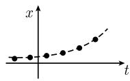  
(a)

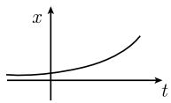  
(b)  
图1.132

解的分支 (分歧) 在隐式微分方程

$$
\boxed {F (t, x, x ^ {\prime}) = 0}\tag{1.268}
$$

的情形, 对每个点 $(t, x)$ , 有可能存在几个方向元素 $m$ 满足方程 $F(t, x, m) = 0$ . 几个不同的解可以通过这样的点.

例: 微分方程

$$
x ^ {\prime 2} = 1
$$

有两族曲线 $x = \pm t +$ 常数作为解曲线 (图 1.133).

1.12.4.13 包络和奇异解

定理 如果微分方程 (1.268) 有一族具有包络 $^{1)}$ 的解, 那么此包络也是该微分方程的解, 并且被称为一个奇异解.

构造 在 (1.268) 的奇异解存在的情形, 它可以通过解微分方程组

$$
F (t, x, C) = 0, \quad F _ {x ^ {\prime}} (t, x, C) = 0,\tag{1.269}
$$

并且消去常数 $C^{2)}$ 而得到.

例: 克莱罗微分方程 $^{3)}$

$$
\boxed {x = t x ^ {\prime} - \frac {1}{2} x ^ {\prime 2}}\tag{1.270}
$$

有一族由直线族

$$
\boxed {x = t C - \frac {1}{2} C ^ {2}}\tag{1.271}
$$

组成的解, 其中 C 为常数. 根据 3.7.1, 对 (1.271) 关于 C 求微商, 即用

$$
0 = t - C.
$$

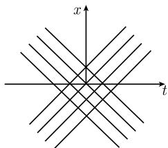  
图1.133

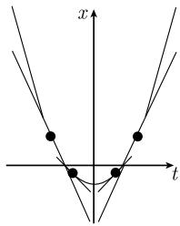  
图1.134

从 (1.271) 中消去 $C$ , 就得到它的包络. 这导致了

$$
\boxed {x = \frac {1}{2} t ^ {2}}\tag{1.272}
$$

是 (1.270) 的奇异解. 可以从抛物线及其切线族 (1.271)(图 1.134) 得到 (1.270) 的所有解. 可以通过利用 (1.269) 的方法得到相同的结果.

1.12.4.14 勒让德切触变换方法

基本思想 当给定的微分方程

$$
\boxed {f (t, x, x ^ {\prime}) = 0}\tag{1.273}
$$

用所求函数 $x = x(t)$ 的导数 $x'$ 表示时为复杂的, 而作为 $x$ 的函数时是简单的时候, 我们用勒让德 (Legendre, 1752—1833) 的切触变换. 在这个情形, 对于所求函数 $\xi = \xi(\tau)$ 的变换后的微分方程

$$
\boxed {F (\tau , \xi , \xi^ {\prime}) = 0}\tag{1.274}
$$

关于微商 $\xi'$ 有一个简单的结构. 在勒让德变换下, 微商 $x'$ 变为自变量 $\tau$ .

定义 勒让德变换 $(t,x,x^{\prime})\mapsto (\tau ,\xi ,\xi^{\prime})$ 由关系式

$$
\boxed {\tau = x ^ {\prime}, \quad \xi = t x ^ {\prime} - x, \quad \xi^ {\prime} = t}\tag{1.275}
$$

所定义. 这里所有的变量都考虑为实值的. 对称地, 其逆变换由

$$
\boxed {t = \xi^ {\prime}, \quad x = \tau \xi^ {\prime} - \xi , \quad x ^ {\prime} = \tau}\tag{1.276}
$$

给出. 自然地, 与关系式 (1.276) 相联, 存在 $f = f(t, x, x')$ 的一个变换 $F$ :

$$
\boxed {F (\tau , \xi , \xi^ {\prime}) := f (\xi^ {\prime}, \tau \xi^ {\prime} - \xi , \tau).}
$$

1.12.4.14.1 勒让德变换的基本不变性质

$$
\boxed {\text {在勒让德变换下, 微分方程的解是不变的.}}
$$

定理 (i) 如果 $x = x(t)$ 是微分方程 (1.273) 的一个解, 那么由参数化

$$
\tau = x ^ {\prime} (t), \quad \xi = t x ^ {\prime} (t) - x (t)
$$

给出的函数 $\xi = \xi(\tau)$ 是变换后的方程 (1.274) 的一个解.

(ii) 反之, 如果 $\xi = \xi(\tau)$ 是微分方程 (1.274) 的一个解, 那么由参数化

$$
\boxed {t = \xi^ {\prime} (\tau), \quad x = \tau \xi^ {\prime} (\tau) - \xi (\tau)}\tag{1.277}
$$

给出的函数 $x = x(t)$ 是原来的方程 (1.273) 的一个解.

1.12.4.14.2 对于克莱罗微分方程的应用

在勒让德变换 (1.275) 下, 微分方程

$$
\boxed {x - t x ^ {\prime} = g (x ^ {\prime})}\tag{1.278}
$$

变为方程

$$
\boxed {- \xi = g (\tau).}
$$

这个方程不再包含导数, 容易解出. 从逆变换 (1.277) 我们得到参数化

$$
t = - g ^ {\prime} (\tau), \quad x = - \tau g ^ {\prime} (\tau) + g (\tau),
$$

它是 (1.278) 的一个解. 由此得到 (1.278) 的一族具有参数 $\tau$ 的解:

$$
\boxed {x = \tau t + g (\tau).}
$$

这是一族直线.

1.12.4.14.3 对于拉格朗日微分方程的应用

$$
\boxed {a (x ^ {\prime}) t + b (x ^ {\prime}) x + c (x ^ {\prime}) = 0.}\tag{1.279}
$$

勒让德变换 (1.276) 在这里产生了线性微分方程

$$
\boxed {a (\tau) \xi^ {\prime} + b (\tau) (\tau \xi^ {\prime} - \xi) + c (\tau) = 0,}
$$

容易解此方程 (参阅 1.12.4.5). 逆变换 (1.277) 产生了 (1.279) 的解.

1.12.4.14.4 勒让德变换的几何解释

勒让德变换的基本几何想法是: 不把曲线看成一个点集, 而是看成它所有切线的包络.

这些切线的方程, 是一条曲线在切坐标中的方程 (图 1.135). 对这个想法, 我们要给出一个解析描述. 令在点坐标 $(t, x)$ 中给出一条曲线 $C$ 的方程

$$
\boxed {x = x (t).}
$$

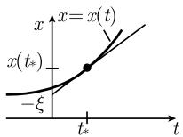  
(a)

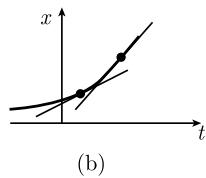  
图 1.135 在一条曲线上切线的包络

在曲线 C 的一个固定点 $(t_{*}, x(t_{*}))$ 处这条曲线的切线方程是

$$
\boxed {x = \tau t - \xi ,}\tag{1.280}
$$

其中 $\tau$ 为斜率, $-\xi$ 为与 x 轴的交 (图 (1.135(a)). 因而有

$$
\begin{array}{l} \tau = x ^ {\prime} (t _ {*}), \\ \xi = t _ {*} x ^ {\prime} (t _ {*}) - x (t _ {*}). \end{array}\tag{1.281}
$$

每条切线由其切坐标 $(\tau, \xi)$ 所唯一确定. $C$ 的所有这些切线的全体由方程

$$
\boxed {\xi = \xi (\tau)}\tag{1.282}
$$

给出.

(i) 曲线 C 在切坐标中的方程 (1.282) 是从 (1.281) 通过消去参数 $t_{*}$ 而得到的.

(ii) 反之, 如果 $C$ 在切坐标中方程 (1.282) 被给定, 那么根据 (1.280) 我们以下述形式得到 $C$ 的切线族的方程:

$$
x = \tau t - \xi (\tau).
$$

这族切线的包络通过从方程组

$$
x = \tau t - \xi (\tau), \quad \xi^ {\prime} (\tau) - t = 0
$$

中消去参数 $\tau$ 而得到 (参阅 3.7.1). 这产生了 C 的方程 $x = x(t)$ .

从点坐标到切坐标的变换恰好相应于勒让德变换.

例：曲线 $x = e^{t}, t \in R$ 在切坐标中的方程由 (图 1.136)

$$
\xi = \tau \ln \tau - \tau , \quad \tau > 0
$$

给出. 下述事实是有决定作用的:

勒让德变换把曲线的方向元素 $(t,x,x')$ 变为另一曲线的方向元素 $(\tau,\xi,\xi')$ (图1.136).

由此, 把勒让德变换称为切触变换 (参阅 1.13.1.11).

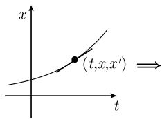

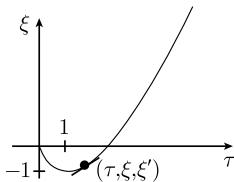  
图 1.136 勒让德变换

下述考虑是勒让德变换的解析核心, 并可以一种普遍的方式被应用于任意的常微分方程组和偏微分方程组. 这就用实例说明了嘉当的 (外) 微分运算的优美和广泛适应性.

1.12.4.14.5 微分形式和勒让德的积方法

如果令 $\tau = x'$ ，那么可以把原来的微分方程

$$
F (t, x, x ^ {\prime}) = 0\tag{1.283}
$$

表为其等价的形式

$$
\boxed { \begin{array}{c} F (t, x, \tau) = 0, \\ \mathrm{d} x - \tau \mathrm{d} t = 0. \end{array} }\tag{1.284}
$$

我们将在 (1.287) 中解释, 对于纯粹几何诠释而言, (1.284) 多于 (1.283). 勒让德的方法是对微分形式应用积规则 $^{1)}$

$$
\boxed {\mathrm{d} (\tau t) = \tau \mathrm{d} t + t \mathrm{d} \tau .}\tag{1.285}
$$

用此方法, 新的方程

$$
\begin{array}{l} F (t, x, \tau) = 0, \\ \mathrm{d} (\tau t - x) - t \mathrm{d} \tau = 0 \end{array}\tag{1.286}
$$

即从方程 (1.284) 得到. 如果引进新的变量

$$
\boxed {\xi := \tau t - x,}
$$

这个方程特别简单. 从 (1.286) 即得 $\mathrm{d}\xi - t\mathrm{d}\tau = 0$ , 即 $\xi' = t$ . 因而得到

$$
\tau = x ^ {\prime}, \quad \xi = x ^ {\prime} t - x, \quad \xi^ {\prime} = t.
$$

这样, 方程 (1.286) 就变为形式

$$
\boxed { \begin{array}{c} F (\xi^ {\prime}, \tau t - \xi , \tau t) = 0, \\ \mathrm{d} \xi - t \mathrm{d} \tau = 0, \end{array} }
$$

它等价于变换后的方程

$$
G (\tau , \xi , \xi^ {\prime}) = 0.
$$

用嘉当的微分运算的语言形成微分方程的优点

例: 微分方程

$$
{\frac {\mathrm{d} x}{\mathrm{d} t}} = {\frac {x}{t}}\tag{1.287}
$$

是不适定的, 因为它在 $t = 0$ 处包含一个奇点. 此外, (1.287) 并不确切地反映如在图 1.137 中由一族方向元素所给出的几何状况.

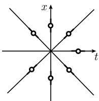  
图1.137

曲线族 $x =$ 常数 $\cdot t$ 和 $t = 0$ 适合这族方向元素. 然而, 解 $t = 0$ 不出现在 (1.287) 中. 正确的几何表述基于通过参数化

$$
x = x (p), \quad t = t (p)
$$

及代替 (1.287) 考虑方程

$$
\frac {\mathrm{d} x (p)}{\mathrm{d} p} t (p) - x (p) \frac {\mathrm{d} x (p)}{\mathrm{d} p} = 0
$$

而得到. 上述方程可写为简洁形式:

$$
t \mathrm{d} x - x \mathrm{d} t = 0.
$$

这相应于 (1.284) 中的过程, 在其中, 为了简单起见消去了变量 $\tau$ .

当用微分形式的语言在嘉当－凯勒的基本形式中考虑任意的偏微分方程组的时候, 这种形式表示的功效是显然的 (参阅 1.13.5.4).

1.12.4.14.6 应用于二阶微分方程

在这个情形利用勒让德变换

$$
\boxed {\tau = x ^ {\prime}, \quad \xi = t x ^ {\prime} - x, \quad \xi^ {\prime} = t, \quad \xi^ {\prime \prime} = \frac {1}{x ^ {\prime \prime}}}
$$

及其逆变换

$$
\boxed {t = \xi^ {\prime}, \quad x = \tau \xi^ {\prime} - \xi , \quad x ^ {\prime} = \tau , \quad x ^ {\prime \prime} = \frac {1}{\xi^ {\prime \prime}}.}
$$

例: 应用勒让德变换于

$$
x ^ {\prime \prime} x ^ {\prime} = 1\tag{1.288}
$$

产生了

$$
\xi^ {\prime \prime} = \tau ,
$$

它的通解为

$$
\xi = \frac {\tau^ {3}}{6} + C \tau + D.
$$

由于 $x = \tau\xi' - \xi$ 和 $t = \xi'$ ，由此就得到 (1.288) 的参数形式的解

$$
x = \frac {\tau^ {3}}{3} - D, t = \frac {\tau^ {2}}{2} + C,
$$

其中 $\tau$ 是参数, 而 C 和 D 是常数.
