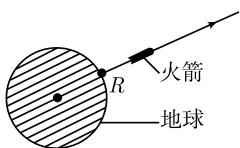
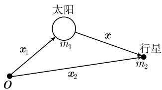
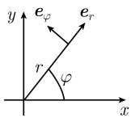

##### 1.12.5 应用

1.12.5.1 对地球的逃逸速度

一枚火箭在地球引力场中的径向运动 $r = r(t)$ 由牛顿运动定律给出

$$
\boxed {m r ^ {\prime \prime} = - \frac {G M m}{r ^ {2}}, \quad r (0) = R, \quad r ^ {\prime} (0) = v}\tag{1.289}
$$

(R 是地球半径, m 是火箭的质量, M 是地球的质量, G 是引力常数). 能量守恒定律 (1.264) 产生了

$$
r ^ {\prime 2} = \frac {2 G M}{r} + \text {常数}.
$$

计入初始条件, 这意味着

$$
r ^ {\prime 2} = \frac {2 G M}{r} + \left(v ^ {2} - \frac {2 G M}{R}\right).
$$

要确定火箭的初始速度 v, 这个速度对于火箭逃逸出地球引力场是必要的, 即, 使得对所有时刻 t 都有 $r'(t) > 0$ (图 1.138). v 的最小可能的值从方程 $v^{2} - 2GM/R = 0$ 得到, 即

$$
\boxed {v = \sqrt {\frac {2 G M}{R}} = 1 1. 2 \mathrm{km} \cdot \mathrm{s} ^ {- 1}.}
$$

图1.138

这就是所求的对地球的逃逸速度. 这个起始速度 v 相应于火箭的运动由

$$
r (t) = \left(R ^ {3 / 2} + \frac {3}{2} \sqrt {2 G M} t\right) ^ {2 / 3}
$$

给出.

1.12.5.2 二体问题

天体力学中的二体问题可以被归结为两个物体关于其中另一个物体的相对运动的一个一体问题, 这导致了开普勒 (Kepler, 1571—1630) 的运动定律.

牛顿运动定律 对于分别具有质量 $m_{1}$ 和 $m_{2}$ 的、总质量为 $m = m_{1} + m_{2}$ 的两个天体, 我们研究它们的运动

$$
\pmb {x} _ {1} = \pmb {x} _ {1} (t) \quad {\text {和}} \quad \pmb {x} _ {2} = \pmb {x} _ {2} (t).
$$

例如, $m_{1}$ 可以是太阳的质量, $m_{2}$ 可以是其行星之一的质量 (图 1.139). 运动定律为

$$
\boxed { \begin{array}{l l} m _ {1} \boldsymbol {x} _ {1} ^ {\prime \prime} = \boldsymbol {F}, & m _ {2} \boldsymbol {x} _ {2} ^ {\prime \prime} = - \boldsymbol {F}, \\ \boldsymbol {x} _ {j} (0) = \boldsymbol {x} _ {j 0}, & \boldsymbol {x} _ {j} ^ {\prime} (0) = \boldsymbol {v} _ {j}, \quad j = 1, 2 \quad (\text {初始值}), \end{array} }\tag{1.290}
$$

其中牛顿引力 $\pmb{F}$ 为

$$
\pmb {F} = G \frac {m _ {1} m _ {2} (\pmb {x} _ {2} - \pmb {x} _ {1})}{| \pmb {x} _ {2} - \pmb {x} _ {1} | ^ {3}}
$$

  
图1.139

(G 是引力常数). (1.290) 中力 F 和 -F 的出现相应于牛顿定律 “作用力 = 反作用力”.

质心运动的分离 对于这个系统的质心

$$
\boldsymbol {y} := \frac {1}{m} (m _ {1} \boldsymbol {x} _ {1} + m _ {2} \boldsymbol {x} _ {2})
$$

以及总动量 $P = m y'$ ，从（1.290）我们得到总动量守恒

$$
\boldsymbol {P} ^ {\prime} = \mathbf {0},
$$

这意味着 $my'' = 0$ ，它有解

$$
\pmb {y} (t) = \pmb {y} (0) + t \pmb {y} ^ {\prime} (0).
$$

因而质心以常速度沿一直线运动. 显式地, 有

$$
\boldsymbol {y} (0) = \frac {1}{m} (m _ {1} \boldsymbol {x} _ {1 0} + m _ {2} \boldsymbol {x} _ {2 0}), \quad \boldsymbol {y} ^ {\prime} (0) = \frac {1}{m} (m _ {1} \boldsymbol {v} _ {1} + m _ {2} \boldsymbol {v} _ {2}).
$$

对于关于质心的相对运动

$$
\boldsymbol {y} _ {j} := \boldsymbol {x} _ {j} - \boldsymbol {y},
$$

可以得到运动方程

$$
m _ {1} \pmb {y} _ {1} ^ {\prime \prime} = \pmb {F}, m _ {2} \pmb {y} _ {2} ^ {\prime \prime} = - \pmb {F}, m _ {1} \pmb {y} _ {1} + m _ {2} \pmb {y} _ {2} = \mathbf {0}.
$$

在系统由太阳及一个行星组成时, 其质心 y 位于太阳的内部.

两个天体关于其中另一个的相对运动 对于

$$
\boldsymbol {x} := \boldsymbol {x} _ {2} - \boldsymbol {x} _ {1},
$$

从 $x = y_{2} - y_{1}$ 可以得到运动定律

$$
\boxed { \begin{array}{l} m _ {2} \boldsymbol {x} ^ {\prime \prime} = - \frac {G m m _ {2} \boldsymbol {x}}{| \boldsymbol {x} | ^ {3}}, \\ \boldsymbol {x} (0) = \boldsymbol {x} _ {2 0} - \boldsymbol {x} _ {1 0}, \quad \boldsymbol {x} ^ {\prime} (0) = \boldsymbol {v} _ {2} - \boldsymbol {v} _ {1}. \end{array} }\tag{1.291}
$$

这是质量为 $m_{2}$ 的一物体在质量为 m 的物体的引力场中的一体问题.

如果知道 (1.291) 的解, 那么通过

$$
\pmb {x} _ {1} (t) = \pmb {y} (t) - \frac {m _ {2}}{m} \pmb {x} (t), \quad \pmb {x} _ {2} (t) = \pmb {y} (t) - \frac {m _ {1}}{m} \pmb {x} (t)
$$

可以得到原来的运动方程 (1.290) 的一个解.

守恒律 从 (1.291) 即得能量和角动量守恒律

$$
\frac {m _ {2}}{2} \pmb {x} ^ {\prime} (t) ^ {2} + U (\pmb {x} (t)) = \text {常数} = E,\tag{1.292}
$$

$$
m _ {2} \pmb {x} (t) \times \pmb {x} ^ {\prime} (t) = \text {常数} = N,\tag{1.293}
$$

其中 (参阅 1.9.6):

$$
U (\boldsymbol {x}) = - \frac {G m m _ {2}}{| \boldsymbol {x} |}, \quad E = \frac {m _ {2}}{2} \boldsymbol {x} ^ {\prime} (0) ^ {2} + U (\boldsymbol {x} (0)), \quad \boldsymbol {N} = m _ {2} \boldsymbol {x} (0) \times \boldsymbol {x} ^ {\prime} (0).
$$

选取初始条件, 使得 $N \neq 0$ .

平面运动 从角动量守恒 (1.293) 即得, 对所有时刻 $t$ 有 $\pmb{x}(t)\pmb{N} = 0$ . 因此, 该运动被限制于一个垂直于向量 $\pmb{N}$ 的平面中. 选取 $z$ 轴在向量 $\pmb{N}$ 的方向的笛卡儿坐标系 $(x,y,z)$ . 那么 $\pmb{x}(t)$ 就位于 $(x,y)$ 平面中, 即有

$$
\boldsymbol {x} (t) = x (t) \boldsymbol {i} + y (t) \boldsymbol {j}.
$$

极坐标(图 1.140) 选取极坐标

$$
x = r \cos \varphi , y = r \sin \varphi ,
$$

并且引进单位向量

  
图1.140

$$
\boldsymbol {e} _ {r} := \cos \varphi \boldsymbol {i} + \sin \varphi \boldsymbol {j}, \quad \boldsymbol {e} _ {\varphi} := - \sin \varphi \boldsymbol {i} + \cos \varphi \boldsymbol {j}.
$$

那么运动由 $\varphi = \varphi(t)$ , $r = r(t)$ 给出. 除此之外, 这样来选取 x 轴, 以使 $\varphi(0) = 0$ .

对时间 $t$ 求导数产生了

$$
\boldsymbol {e} _ {r} ^ {\prime} = (- \sin \varphi \boldsymbol {i} + \cos \varphi \boldsymbol {j}) \varphi^ {\prime} = \varphi^ {\prime} \boldsymbol {e} _ {\varphi}.
$$

从轨道方程

$$
\boxed {\boldsymbol {x} (t) = r (t) \boldsymbol {e} _ {r} (t)}
$$

得到 $x' = r'e_{r} + r\varphi'e_{\varphi}$ . 由于 $e_{r}e_{\varphi} = 0$ , 就有 $x'^{2} = (r')^{2} + r^{2}(\varphi')^{2}$ . 这样就从 (1.292) 得到方程组

$$
\boxed { \begin{array}{c} m _ {2} \bigg (r ^ {\prime 2} + r ^ {2} \varphi^ {\prime 2} - \frac {2 G m}{r} \bigg) = 2 E, \\ m _ {2} r ^ {2} \varphi^ {\prime} = | N |. \end{array} }\tag{1.294}
$$

定理 (1.294) 的解是

$$
\boxed {r = \frac {p}{1 + \varepsilon \cos \varphi}.}\tag{1.295}
$$

此时时间 $t$ 的运动由

$$
t = \frac {m _ {2}}{| \mathbf {N} |} \int_ {0} ^ {\varphi} r (\varphi) ^ {2} \mathrm{d} \varphi\tag{1.296}
$$

给出, 其中的诸常数为

$$
p := \boldsymbol {N} ^ {2} / \alpha m _ {2}, \quad \varepsilon := \sqrt {1 + 2 E \boldsymbol {N} ^ {2} / m _ {2} \alpha^ {2}}, \quad \alpha := G m m _ {2}.\tag{1.297}
$$

证明: 这由直接求微商容易得到验证. $^{1)}$

讨论 $0 \leqslant \varepsilon < 1$ 的情形.

开普勒第一定律 行星沿着椭圆轨道运行, 太阳位于椭圆的焦点之一的位置 (图 1.141).

  
(a)

  
(b)  
图 1.141 行星运动的开普勒定律

证明: 在笛卡儿坐标 x, y 中, 轨道方程 (1.295) 归为方程

$$
\frac {(x + \varepsilon a) ^ {2}}{a ^ {2}} + \frac {y ^ {2}}{b ^ {2}} = 1.
$$

1) 利用

$$
\frac {\mathrm{d} \varphi}{\mathrm{d} r} = \frac {\varphi^ {\prime} (t)}{r ^ {\prime} (t)} = F (t),
$$

并通过分离变量法积分此方程，就导致公式(1.295). 函数 $F(t)$ 从(1.294)中第一个方程推导而得．此外，从(1.294)中第二个方程即得(1.296). 在1.13.1.5中我们将利用雅可比(C.G.J.Jacobi, 1804—1850)漂亮的方法来计算这个解.

这里有 $a := p/(1 - \varepsilon^{2})$ 和 $b := p/\sqrt{1 - \varepsilon^{2}}$ . 太阳位于椭圆的焦点 $(0,0)$ .
开普勒第二定律 在相等的时间中, 行星的轨道扫过相等的面积.

证明：在时间区间 $[s,t]$ 中，面积

$$
\frac {1}{2} \int_ {s} ^ {t} r ^ {2} \varphi^ {\prime} \mathrm{d} t = \frac {(t - s) | N |}{2 m _ {2}}\tag{1.298}
$$

被扫过.

开普勒第三定律 对于所有行星而言, 周期 T 的平方与长半轴 a 的 3 次方之比是一个常数.

证明: 椭圆轨道所围成的面积为 $\pi ab$ . 在 (1.298) 中令 t = T 和 s = 0, 可以得到

$$
\frac {1}{2} \pi a b = \frac {T | \boldsymbol {N} |}{2 m _ {2}}.
$$

从 $a = p / (1 - \varepsilon^2)$ 和(1.297)得到

$$
\frac {T ^ {2}}{a ^ {3}} = \frac {4 \pi^ {2}}{G (m _ {1} + m _ {2})}.\tag{1.299}
$$

因为太阳的质量 $m_{1}$ 比行星的质量 $m_{2}$ 大得多, 在初级近似时在 (1.299) 中不妨忽略 $m_{2}$ . ☐

我们所考虑的说明了开普勒第三定律只是一个近似. 开普勒从对行星的大量观察数据的研究中得出了这个定律. 他凭经验得到的定律, 和以后由牛顿所发现的数学推导, 是当时数学和物理学的伟大成就.
