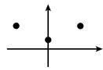

##### 1.12.7 稳定性

考虑线性微分方程

$$
\boxed { \begin{array}{c} {\pmb {x} ^ {\prime} = \pmb {A x} + \pmb {b} (\pmb {x}, t),} \\ {\pmb {x} (0) = \pmb {a} \quad (\text {初始值}),} \end{array} }\tag{1.304}
$$

其中 $\boldsymbol{x}=(x_{1},\cdots,x_{n})^{\mathrm{T}}$ ，A 是一个不依赖于时间的实 $n\times n$ 矩阵， $\boldsymbol{b}=(b_{1},\cdots,b_{n})^{\mathrm{T}}$ 的分量对原点的一个邻域中的所有 x 并对所有的时刻 $t\geqslant0$ 是实 $C^{1}$ 函数。此外，令

$$
\boxed {\boldsymbol {b} (\mathbf {0}, t) \equiv \mathbf {0}.}
$$

这里 $\boldsymbol{x}(t) \equiv \mathbf{0}$ 是 (1.304) 的一个解, 它相应于系统的一个平衡点. 我们也把这个性质简称为 “在 x = 0 处有一个平衡点”.

定义 (i) 稳定性 (图 1.142 (a)): 平衡点 x = 0 是稳定的, 当且仅当对每个 $\varepsilon > 0$ , 存在一个数 $\delta > 0$ , 使得从

  
(a) 稳定的

  
(b) 渐近稳定的

  
(c) 不稳定的  
图 1.142 线性微分方程解的稳定性

即得 (1.304) 存在一个唯一的解 $\pmb{x} = \pmb{x}(t)$ , 满足

$$
| \pmb {x} (t) | <   \varepsilon , \quad \text {对所有时刻} t \geqslant 0.
$$

这意味着在 x = 0 处的平衡架构的充分小的扰动对所有时刻 $t \geqslant 0$ 仍然是小的.

(ii) 渐近稳定性 (图 1.142(b)): 平衡点 x = 0 是渐近稳定的, 当且仅当它是稳定的, 此外, 存在一个数 $\delta_{*} > 0$ , 使得对满足 $|x(0)| < \delta_{*}$ 的每个解, 有极限关系式

$$
\lim _ {t \to \infty} \boldsymbol {x} (t) = \mathbf {0}.
$$

这意味着, 在时刻 t = 0 时平衡架构的小扰动在充分长的时间以后, 回到其开始时的架构.

(iii) 不稳定性 (图 1.142(c)): 平衡点 x = 0 是不稳定的, 当且仅当它不是稳定的.

李雅普诺夫 (A. M. Lyapunov, 1857—1918) 关于稳定性的定理 (1892) 假设具有常系数的线性方程组 $x' = Ax$ 的扰动 $b$ 充分地小, 即有

$$
\lim _ {| \boldsymbol {x} | \to 0} \left(\sup _ {t \geqslant 0} \frac {| \boldsymbol {b} (\boldsymbol {x} , t) |}{| \boldsymbol {x} |}\right) = 0.\tag{1.305}
$$

那么有

(i) 平衡点 x = 0 是渐近稳定的, 如果矩阵 A 的所有本征值 $^{1)} \lambda_{1}, \cdots, \lambda_{m}$ 位于左半平面中, 即, 对所有 j, $\lambda_{j}$ 有负实部 (图 1.143(a)).

  
(a) 渐近稳定的

  
(b) 不稳定的

  
(c) 临界的  
图 1.143 线性微分算子的本征值

(ii) 平衡点 x = 0 是不稳定的, 如果 A 的一个本征值位于右半平面中, 即, 对某个 j 有 $\operatorname{Re}\lambda_{j} > 0$ (图 1.143(b)).

如果算子 $A$ 的一个本征值在虚轴上 (图1.143(c)), 那么中心流形方法必定适用.

为了对控制论中的复杂问题有效地应用李雅普诺夫的稳定性判据, 人们需要在不进行本征值的显式计算的情形对方程 $\operatorname{det}(\boldsymbol{A}-\lambda\boldsymbol{I})=0$ 何时有零点在左半平面中有一个判别准则. 这个由麦克斯韦于 1868 年提出的问题, 在 1875 年被英国物理学家劳斯 (Louth) 所解决, 也独立地被德国数学家赫尔维茨 (Hurwitz) 于 1895 年所解决.

劳斯－赫尔维茨准则 首项系数 $a_{n} > 0$ 的实系数多项式

$$
\boxed {a _ {n} \lambda^ {n} + a _ {n - 1} \lambda^ {n - 1} + \dots + a _ {1} \lambda + a _ {0} = 0}
$$

的所有零点位于左半平面中, 当且仅当所有行列式 (当 m > n 时令 $a_{m} = 0$ )

$$
a _ {1}, \left| \begin{array}{c c} a _ {1} & a _ {0} \\ a _ {3} & a _ {2} \end{array} \right|, \left| \begin{array}{c c c} a _ {1} & a _ {0} & 0 \\ a _ {3} & a _ {2} & a _ {1} \\ a _ {5} & a _ {4} & a _ {3} \end{array} \right|, \dots , \left| \begin{array}{c c c c c c} a _ {1} & a _ {0} & 0 & 0 & \ldots & 0 \\ a _ {3} & a _ {2} & a _ {1} & 0 & \ldots & 0 \\ \vdots & \vdots & \vdots & \vdots & & \vdots \\ a _ {2 n - 1} & a _ {2 n - 2} & a _ {2 n - 3} & a _ {2 n - 4} & \dots & a _ {n} \end{array} \right|
$$

是正的.

应用 微分方程

$$
a _ {n} x ^ {(n)} + a _ {n - 1} x ^ {(n - 1)} + \dots + a _ {1} x ^ {\prime} + a _ {0} x = b (x, t)
$$

当 $b(0,t)\equiv 0$ 时的平衡点 $x = 0$ 是渐近稳定的，如果细小性准则(1.305）和劳斯-赫尔维茨准则被满足.

例 1: 微分方程

$$
x ^ {\prime \prime} + 2 x ^ {\prime} + x = x ^ {n}, \quad n = 1, 2, \dots
$$

的平衡点是渐近稳定的.

证明: 有

$$
a _ {1} = 2 > 0, \left| \begin{array}{c c} a _ {1} & a _ {0} \\ a _ {3} & a _ {2} \end{array} \right| = \left| \begin{array}{c c} 2 & 1 \\ 0 & 1 \end{array} \right| = 2 > 0.
$$

推广 为了考察微分方程

$$
y ^ {\prime} = f (y, t)
$$

任一解 $y_{*}$ 的稳定性, 令 $y = y_{*} + x$ . 这导致一个具有平衡点 $x = 0$ 的微分方程

$$
x ^ {\prime} = g (x, t).
$$

由定义, 这个点的稳定性等价于 $y_{*}$ 的稳定性.

例 2: 微分方程

$$
y ^ {\prime \prime} + 2 y ^ {\prime} + y - 1 - (y - 1) ^ {n} = 0, \quad n = 2, 3, \dots
$$

的解 $y(t) \equiv 1$ 是渐近稳定的.

证明: 如果令 $y = x + 1$ , 那么 x 就满足例 1 中的微分方程, 因而 x = 0 是渐近稳定的.
