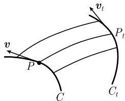
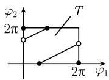
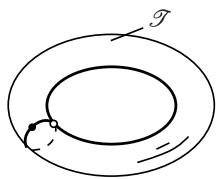
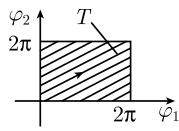
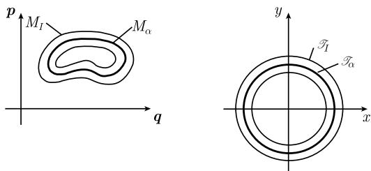

这个积分被称为希尔伯特的不变积分 (或者庞加莱-嘉当的绝对积分不变量).

广义开尔文涡旋定理 如果 C 是相空间中的一条闭曲线, 那么有关系式

$$
\boxed {\int_ {C} \boldsymbol {p} \mathrm{d} \boldsymbol {q} = \int_ {F _ {t} (C)} \boldsymbol {p} \mathrm{d} \boldsymbol {q}.}
$$

这个积分被称为庞加莱的相对积分不变量.

曲线的平行移动和由哈密顿流导出的切向量 (图 1.156)

在相空间中给定曲线

  
图1.156

$$
C \colon \boldsymbol {q} = \boldsymbol {q} (\alpha), \quad \boldsymbol {p} = \boldsymbol {p} (\alpha),
$$

它通过参数值 $\alpha = 0$ 时的点 P. 哈密顿流把点 P 带到点

$$
\boxed {P _ {t} := F _ {t} (P),}
$$

并且把曲线 C 移动为 $C_{t}$ . 此外, 曲线 C 上 P 点处的切向量 v 被传送为曲线 $C_{t}$ 上点 $P_{t}$ 处的切向量 $v_{t}$ . 如果两条曲线 C 和 $C'$ 在点 P 处有相同的切向量 v, 那么像曲线 $C_{t}$ 和 $C'_{t}$ 在点 $P_{t}$ 处有相同的切向量 $v_{t}$ . 用这种方式可以得到一个变换 $v \mapsto v_{t}$ . 写为

$$
\boxed {\boldsymbol {v} _ {t} = F _ {t} ^ {\prime} (P) \boldsymbol {v}, \quad \text {对所有的} \boldsymbol {v} \in \mathbb {R} ^ {2 n}}
$$

来表示这个变换. $^{1)}$ 称 $F_{t}^{\prime}(P)$ 为流算子在点 P 处的线性化. 事实上, $F_{t}^{\prime}(P)$ 就是 $F_{t}$ 在点 P 处的弗雷歇 (M. R. Fréchet, 1878—1973) 导数.

$$
\pmb {v} = \left(\frac {\mathrm{d} q (0)}{\mathrm{d} \alpha}, \frac {\mathrm{d} p (0)}{\mathrm{d} \alpha}\right) \quad \text {和} \quad \pmb {v} _ {t} = \frac {\mathrm{d}}{\mathrm{d} \alpha} F _ {t} (q (\alpha), p (\alpha)) \Big | _ {\alpha = 0}.
$$

由哈密顿流诱导的微分形式的自然变换 令 $\mu$ 是一个1形式. 利用自然的关系

$$
\boxed {(F _ {t} ^ {*} \mu) _ {P} (\boldsymbol {v}) := \mu_ {P _ {t}} (\boldsymbol {v} _ {t}), \quad \text {对所有的} \boldsymbol {v} \in \mathbb {R} ^ {2 n}}
$$

来定义 1 形式 $F_{t}^{*}\mu$ . 称 $F_{t}^{*}\mu$ 为微分形式 $\mu$ (关于给定的流) 的拉回. 事实上, $F_{t}^{*}\mu$ 在点 $P$ 处的值只依赖于在点 $P_{t}$ 处的形式 $\mu$ (图 1.156).

用同样的方法可以对任意的微分形式定义拉回. 例如, 下述对于一个 2 形式定义了拉回:

$$
(F _ {t} ^ {*} \omega) _ {P} (\pmb {v}, \pmb {w}) := \omega_ {P _ {t}} (\pmb {v} _ {t}, \pmb {w} _ {t}), \quad \text {对所有的} \pmb {v}, \pmb {w} \in \mathbb {R} ^ {2 n}.
$$

类似地, 当用微分同胚代替 $F_{t}$ 时, 也可以引进拉回.

用一种非常简洁的方式, 拉回被用于验证微分形式关于流的不变性质. 拉回关于外积的相容性 对于任意的微分形式 $\mu, \nu,$ 有 $^{1)}$

$$
\boxed {F _ {t} ^ {*} (\mu \wedge \nu) = F _ {t} ^ {*} \mu \wedge F _ {t} ^ {*} \nu}\tag{1.362}
$$

和

$$
\int_ {\Omega} F _ {t} ^ {*} \mu = \int_ {F _ {t} (\Omega)} \mu .\tag{1.363}
$$

当用一个任意的微分同胚代替 $F_{t}$ 时, 这个陈述仍然正确.

辛变换 令 $F: \Omega \subset \mathbb{R}^{2n} \to F(\Omega)$ 是相空间 $\mathbb{R}^{2n}$ 的一个域 $\Omega$ 的一个微分同胚, 假设它具有形式

$$
F \colon P = P (q, p), Q = Q (q, p).
$$

我们称 F 是一个辛变换, 如果辛形式 $\omega$ 在 F 下保持不变, 即, 如果

$$
\boxed {F ^ {*} \omega = \omega .}
$$

用分量形式表示, 这个方程变为

$$
\boxed {\sum_ {i = 1} ^ {n} \mathrm{d} Q _ {i} \wedge \mathrm{d} P _ {i} = \sum_ {i = 1} ^ {n} \mathrm{d} q _ {i} \wedge \mathrm{d} p _ {i}.}
$$

定理 如果 $F$ 是一个辛变换, 那么有

(i) $F^{*}\theta = \theta.$

(ii) $\int_{\Omega}\theta = \int_{F(\Omega)}\theta (F$ 是保积的).

(iii) 对于典范形式 $\sigma$ ，局部地存在一个函数 S，满足

$$
F ^ {*} \sigma - \sigma = \mathrm{d} S.\tag{1.364}
$$

(iv) 对于闭曲线 C, 有

$$
\int_ {C} \sigma = \int_ {F (C)} \sigma .
$$

可以容易地和简洁地从嘉当 (外) 微分学得到这些陈述.

证明: (i) 从 (1.362) 有

$$
F ^ {*} \theta = F ^ {*} (\omega \wedge \dots \wedge \omega) = F ^ {*} \omega \wedge \dots \wedge F ^ {*} \omega = \omega \wedge \dots \wedge \omega = \theta .
$$

(ii) 关系式 (1.363) 导致

$$
\int_ {\Omega} \theta = \int_ {\Omega} F ^ {*} \theta = \int_ {F (\Omega)} \theta .
$$

(iii) 有 $\mathrm{d}(F^{*}\sigma - \sigma) = F^{*}\mathrm{d}\sigma - \mathrm{d}\sigma = -F^{*}\omega + \omega = 0$ . 因而, 根据庞加莱引理, 方程 (1.364) 局部地有一个唯一解 $S$ (参阅 1.9.11).

(iv) 有 $\int_{C} \mathrm{d}S = 0$ . 这样, 关系式 (1.363) 就导致

$$
\int_ {C} F ^ {*} \sigma = \int_ {F (C)} \sigma .
$$

因而, 从 (iii) 即得 (iv).

哈密顿力学的主要定理

$$
\text { 对于每个时刻 } t, \text { 由哈密顿流生成的映射 } F _ {t} \text { 是辛映射. }
$$

因而, 在上述定理中, 各处的 F 都可由 $F_{t}$ 代替.

典范方程 哈密顿流的速度场v满足方程: $^{1)}$

$$
\boxed {\boldsymbol {v} _ {\lrcorner} \omega = \mathrm{d} H.}\tag{1.365}
$$

这是哈密顿典范方程的最简洁的叙述. 在这些方程中辛形式 $\omega$ 的出现对于在经典力学中辛几何的应用是关键的.

典范方程的辛不变量 典范方程 (1.365) 在辛变换下是不变的, 即, 在一个辛变换下, 典范方程

$$
\pmb {q} ^ {\prime} = H _ {\pmb {p}}, \quad \pmb {p} ^ {\prime} = - H _ {\pmb {q}}
$$

变为新的典范方程

$$
\boldsymbol {Q} ^ {\prime} = H _ {\boldsymbol {P}}, \quad \boldsymbol {P} ^ {\prime} = - H _ {\boldsymbol {Q}}.
$$

(1.365) 的证明 令 $\pmb{q} = \pmb{q}(t)$ , $\pmb{p} = \pmb{p}(t)$ 是哈密顿流的积分曲线. 那么对于在时刻 $t$ 的速度向量 $\pmb{v}$ , 我们有关系式

1) 符号 $\pmb{v} \perp \omega$ 表示 $\pmb{v}$ 与 $\omega$ 的所谓内积. 这是一个由关系式

$$
(\pmb {v} \lrcorner \omega) (\pmb {w}) = \omega (\pmb {v}, \pmb {w}), \quad \text {对所有的} \pmb {w} \in \mathbb {R} ^ {2 n}
$$

定义的线性泛函. 我们有时也把 $v \perp \omega$ 写成 $i_{\mathbf{v}}(\omega)$ .

$$
\boldsymbol {v} = (q ^ {\prime} (t), p ^ {\prime} (t)).
$$

此外, 如果我们令 $\boldsymbol{w} = (\boldsymbol{a}, \boldsymbol{b})$ , 其中 $a, b \in R^{n}$ , 那么方程 (1.365) 说明

$$
\omega (\pmb {v}, \pmb {w}) = \mathrm{d} H (\pmb {w}), \quad \text {对所有的} \pmb {w} \in \mathbb {R} ^ {2 n}.
$$

从 $\omega = \sum_{i}\mathrm{d}q_{i}\wedge \mathrm{d}p_{i}$ 和

$$
(\mathrm{d} q _ {i} \wedge \mathrm{d} p _ {i}) (\boldsymbol {v}, \boldsymbol {w}) = \mathrm{d} q _ {i} (\boldsymbol {v}) \mathrm{d} p _ {i} (\boldsymbol {w}) - \mathrm{d} q _ {i} (\boldsymbol {w}) \mathrm{d} p _ {i} (\boldsymbol {v}) = q _ {i} ^ {\prime} (t) a _ {i} - p _ {i} ^ {\prime} (t) b _ {i},
$$

可以得到, 对所有 $a_{i}, b_{i} \in \mathbb{R}$ 有 \*

$$
\sum_ {i = 1} ^ {n} q _ {i} ^ {\prime} (t) a _ {i} - p _ {i} ^ {\prime} (t) b _ {i} = \sum_ {i = 1} ^ {n} H _ {p _ {i}} a _ {i} + H _ {q _ {i}} b _ {i}.
$$

通过比较系数就产生了

$$
q _ {i} ^ {\prime} = H _ {p _ {i}}, \quad p _ {i} ^ {\prime} = - H _ {q _ {i}}.
$$

这些就是典范方程.

拉格朗日流形 令 $D$ 是 $\mathbb{R}^n$ 中的一个开集. 一个在其每点处都有切平面 $^{1)}$ 的 $n$ 维曲面

$$
\mathcal {F} \colon \boldsymbol {q} = \boldsymbol {q} (C), \quad \boldsymbol {p} = \boldsymbol {p} (C), \quad C \in D
$$

被称为是一个拉格朗日流形, 如果 $\omega$ 在 $\mathcal{F}$ 上为零, 即, 我们对 $\mathcal{F}$ 在点 $P$ 处的所有切向量 $\boldsymbol{v}$ 和 $\boldsymbol{w}$ 有 $^{2)}$

$$
\boxed {\omega_ {P} (\boldsymbol {v}, \boldsymbol {w}) = 0, \quad P \in \mathcal {F}.}\tag{1.366}
$$

在几何上, 这意味着 F 的每个切空间关于由其上的 $\omega$ 所诱导的辛形式是迷向的 (参阅 3.9.8).

不变性 在辛变换下拉格朗日流形被变为拉格朗日流形.

1.13.1.8 泊松括号和可积系统

对于 $q, p \in R^{n}$ ，考虑运动 $\boldsymbol{q} = \boldsymbol{q}(t), \boldsymbol{p} = \boldsymbol{p}(t)$ 的典范方程

$$
\boxed {\boldsymbol {p} ^ {\prime} = - H _ {\boldsymbol {q}} (\boldsymbol {q}, \boldsymbol {p}), \quad \boldsymbol {q} ^ {\prime} = H _ {\boldsymbol {p}} (\boldsymbol {q}, \boldsymbol {p}).}\tag{1.367}
$$

\* 原文把下式中的 $H_{p_i}$ 与 $H_{q_i}$ 互换位置. ——译者

2) 如果我们用在 1.13.1.3 中引进的拉格朗日括号, 那么 (1.366) 等价于方程

$[C_j, C_k](P) = 0$ 对所有的 $P \in \mathcal{F}$ 和所有的 $j, k$ .

我们的目的是找到系统 (1.367) 有解的条件, 在经过一个适当的坐标变换后它们具有形式

$$
\boxed {\varphi_ {j} (t) = \omega_ {j} t + \text {常数}, \quad j = 1, \dots , n.}\tag{1.368}
$$

这里诸 $\varphi_{j}$ 是以 $2\pi$ 为周期的角坐标, 即, $(\varphi_{1},\cdots,\varphi_{n})$ 与 $(\varphi_{1}+2\pi,\cdots,\varphi_{n}+2\pi)$ 描述了系统的相同状态.

拟周期运动 在 (1.368) 中, 每个坐标相应于具有角频率 $\omega_{j}$ 的一个周期运动. 因为这些频率很可能是不同的, 因此该运动作为整体而言被称为拟周期的. 集合

$$
T := \left\{\varphi \in \mathbb {R} ^ {n} \mid 0 \leqslant \varphi_ {j} \leqslant 2 \pi , j = 1, \dots , n \right\}
$$

称为一个 n 维环面.

例 1: 对于 n = 2, 图 1.157 画出了系统的状况. 这里以一种自然的方式把位于矩形对边上的点等同起来. 如果把 T 的这些点粘起来, 则得到在图 1.157(b) 中画出的几何环面 T.

  
(a)

  
(b)

  
(c)  
图 1.157 在如 (1.368) 的坐标系中的拟周期运动

(i) 如果比 $\omega_{1} / \omega_{2}$ 是有理数, 那么轨道 $\varphi_{1} = \omega_{1} +$ 常数, $\varphi_{2} = \omega_{2} +$ 常数 由有限段组成, 然后回到初始位置. 在 $\mathcal{T}$ 上的相应曲线是一条闭曲线, 在封闭之前它围绕 $\mathcal{T}$ 有限多圈.

(ii) 如果 $\omega_{1} / \omega_{2}$ 是无理数, 那么轨道稠密地覆盖 $T$ 和 $\mathcal{T}$ , 但不回到它的出发点 (图 1.157(c)).

泊松括号 $^{1)}$ 两个光滑函数 $f = f(q, p)$ 和 $g = g(q, p)$ 的泊松括号由公式

$$
\{f, g \} := \sum_ {j = 1} ^ {n} \frac {\partial f}{\partial p _ {j}} \frac {\partial g}{\partial q _ {j}} - \frac {\partial f}{\partial q _ {j}} \frac {\partial g}{\partial p _ {j}}
$$

所定义.

刘维尔定理 给出典范方程 (1.367) 的 n 个光滑守恒量 $F_{1}, \cdots, F_{n}: R^{2n} \rightarrow R$ ，其中 $F_{1} = H$ ，这些守恒量是对合的，即，它们满足

$$
\{F _ {j}, F _ {k} \} \equiv 0, \quad j, k = 1, \dots , n.
$$

此外假设, 对于固定的 $\alpha \in R^{n}$ , 满足

$$
F _ {j} (\boldsymbol {q}, \boldsymbol {p}) = \alpha_ {j}, \quad j = 1, \dots , n
$$

的所有点 $(\pmb {q},\pmb {p})\in \mathbb{R}^{2n}$ 的集合 $M_{\alpha}$ 形成一个 $n$ 维连通紧流形, 即, 一阶偏导数矩阵 $(\partial_kF_j)$ 在 $M_{\alpha}$ 的每一点处的秩为 $n$

这样, $M_{\alpha}$ 微分同胚于一个 $n$ 维环面 $T$ , 其中作为典范方程 (1.367) 解的轨道 $\boldsymbol{q} = \boldsymbol{q}(t), \boldsymbol{p} = \boldsymbol{p}(t)$ 表示 $M_{\alpha}$ 上的拟周期运动 (1.368).

不变环面叶状结构 假设存在 $\alpha$ 的一个开邻域 $U$ , 使得 $M_{\alpha}$ 在 $\mathbb{R}^{2n}$ 中的一个邻域微分同胚于积

$$
\boxed {T \times U.}
$$

这里, 当 $I \in U$ 时集合 $T \times \{I\}$ 微分同胚于 $M_{I}$ . 特别地, 参数 $I = \alpha$ 属于 $M_{\alpha}$ . 通过这个微分同胚

$$
\varphi = \varphi (\boldsymbol {q}, \boldsymbol {p}), \quad I = I (\boldsymbol {q}, \boldsymbol {p}),\tag{1.369}
$$

原来的典范方程 (1.367) 变为新的典范方程

$$
\boxed {\boldsymbol {I} ^ {\prime} = - \mathcal {H} _ {\varphi} (\boldsymbol {I}) = \boldsymbol {0}, \quad \varphi^ {\prime} = \mathcal {H} _ {\boldsymbol {I}} (\boldsymbol {I}).}\tag{1.370}
$$

它产生的解为

$$
I _ {j} = \text { 常数 }, \quad \varphi_ {j} = \omega_ {j} t + \text { 常数 }, \quad j = 1, \dots , n.\tag{1.371}
$$

这里 $\omega_{j} := \partial H(I)/\partial I_{j}$ . 诸变量 $I_{j}$ 被称为作用变量; 与诸角变量 $\varphi_{j}$ 一起, 它们形成可积哈密顿系统的作用-角变量集合.

曲线 (1.371) 相应于 $M_{I}$ 上的一个运动. 这里 $M_{I}$ 是相空间中满足

$$
F _ {j} (\boldsymbol {q}, \boldsymbol {p}) = I _ {j}, \quad j = 1, \dots , n
$$

的点 $(\pmb {q},\pmb {p})\in \mathbb{R}^{2n}$ 的集合.

$M_{I}$ 称为不变环面. 如果 $I$ 在 $\alpha$ 的一个充分小的邻域中, 那么从 $M_{\alpha}$ 通过一个小形变就得到 $M_{I}$ .

例 2: 在 n=1 时, 情形正如图 1.158 所示. 这里我们有 $T := \{\varphi \in R : 0 \leqslant \varphi \leqslant 2\pi\}$ , 其中点 $\varphi = 0$ 和 $\varphi = 2\pi$ 是等同的. $(\boldsymbol{q}, \boldsymbol{p})$ 相空间中的闭曲线族映为半径为 $I \in U$ 的圆族

$$
x = I \cos \varphi , \quad y = I \sin \varphi .
$$

这样, $M_{I}$ 相应于半径为 I (作用变量) 的圆 $T_{I}$ .

  
图 1.158 不变环面和作用-角变量

1.13.1.9 可积系统的扰动 (KAM 理论)

这里决定性的问题是：在小扰动下一个可积系统会如何动作？自然的回答是，系统只有小的形变；然而不幸的是，这是错的。其理由是，在角频率 $\omega_{1},\cdots,\omega_{n}$ 之间共振可能发生。代之以可积系统 (1.370)，考虑扰动系统

$$
\boxed {I ^ {\prime} = - H _ {\varphi} (I, \varphi , \varepsilon), \quad \varphi^ {\prime} = H _ {I} (I, \varphi , \varepsilon),}\tag{1.372}
$$

其中 $H := \mathcal{H}(I) + \varepsilon \mathcal{H}_{*}(I, \varphi)$ 为扰动哈密顿函数， $\varepsilon$ 为小参数。科尔莫戈罗夫-阿诺尔德-莫泽理论 (KAM 理论, A. N. Kolmogorov, 1903—1987; V. I. Arnol'd, 1937—2010; J. K. Moser, 1928—) 涉及扰动系统 (1.372) 的性态；KAM 理论最初是由科尔莫戈罗夫于 1953 年创立，在其后的一些年里由阿诺尔德和莫泽极大地发展的。

定义 在其上有一组解 (1.371) 的一个不变环面 $T \times \{I\}$ 被称为共振环面，当且仅当存在不全为零的有理数 $r_{1}, \cdots, r_{n}$ ，使得

$$
r _ {1} \omega_ {1} + \dots + r _ {n} \omega_ {n} = 0.
$$

下述结果对于非退化系统成立, 即, $\det(\partial^{2}\mathcal{H}(I_{0})/\partial I_{j}\partial I_{k})\neq0$ , 这里出现的是未扰动的哈密顿函数的二阶偏导数的行列式.

定理 如果扰动参数 $\varepsilon$ 充分地小, 那么非扰动系统的大多数非共振环面只有微小变形, 并且在这些环面上的轨道的定性性质不受扰动的影响.

情况的错综复杂在于下述事实: 在扰动下某些非共振环面可以被破坏. 并且, 在非扰动系统的情况下, 非共振环面和共振环面并非泾渭分明, 即, 在非共振环面的一个任意小的邻域里可能有共振环面.

在可能的最小扰动下, 在不变环面上轨道的定性性质可能发生引人注目的改变. 继而甚至可能在可积运动相反的意义下发生混沌运动.

对太阳系统稳定性的应用 如果在一级近似中忽略行星之间的引力, 也忽略各行星对于太阳的引力, 那么每个行星以不同的周期 (频率) 围绕太阳在一个周期轨道上运动 (一个椭圆, 太阳在其一个焦点上, 参阅 1.12.5.2 的开普勒第一定律). 这种情形相应于一个拟周期运动. 一旦在模型中考虑了行星的相互作用, 我们就得到了这个拟周期运动的一个扰动. 根据 KAM 理论, 原则上不可能证明太阳系在所有时刻的稳定性, 因为这个性质决定性地依赖于初始值, 而只可能以某种精确度知道它.

经典和现代的天体力学的许多方面都可以在百科全书 [121] 中, 也可以在 [122] 中找到.

1.13.1.10 热力学中的吉布斯方程

热力学第一定律

$$
E ^ {\prime} (t) = Q ^ {\prime} (t) + A ^ {\prime} (t).\tag{1.373}
$$

热力学第二定律

$$
\boxed {Q ^ {\prime} (t) \leqslant T (t) S ^ {\prime} (t).}\tag{1.374}
$$

这些方程描述了一般的热力学系统的温度变化规律. 这些是由巨大数目粒子 (如分子或光子) 组成的系统. 出现在这些方程中的诸量是:

$Q(t)$ 热能, 在时间区间 $[0, t]$ 中施加于系统上;

$A(t)$ 在时间区间 $[0, t]$ 中系统所做的功;

$E(t), S(t), T(t)$ 分别为系统在时刻 t 时的内能量, 熵和绝对温度.

如果对所有时刻 $t, Q'(t) = T(t)S'(t)$ ，那么过程称为可逆的。否则，过程称为不可逆的。

如果系统是封闭的, 那么这特别意味着从外界没有热能被加于该系统, 即, $Q(t) \equiv 0$ . 在此情形, 由第二定律 (1.374) 即得

$$
S ^ {\prime} (t) \geqslant 0.
$$

因而有

$$
\text { 在一个封闭热力学系统中,   熵是非减的. }
$$

在一个封闭系统中, 一个过程是可逆的, 当且仅当 $S'(t) = 0$ , 即, 其熵是常数.

下述方程刻画了一类重要的热力学系统.

吉布斯定律

$$
\boxed {\mathrm{d} E = T \mathrm{d} S - p \mathrm{d} V + \sum_ {j = 1} ^ {r} \mu_ {j} \mathrm{d} N _ {j}.}\tag{1.375}
$$

这个方程对于其状态可由下述参数所刻画的热力学系统成立:

T: 绝对温度, V: 体积, $N_{j}$ : 第 j 种物质的粒子数.

其他一些量是这些参数的函数:

$$
\begin{array}{l l} {{E = E (T, V, \pmb {N})}} & {{\quad (\text {内能量}),}} \\ {{S = S (T, V, \pmb {N})}} & {{\quad (\text {熵}),}} \\ {{p = p (T, V, \pmb {N})}} & {{\quad (\text {压力}),}} \\ {{\mu_ {j} = \mu_ {j} (T, V, \pmb {N})}} & {{\quad (\text {第} j \text {种物质的化学位势}).}} \end{array}
$$

其中 $N = (N_{1}, \cdots, N_{r})$ . 方程 (1.375) 等价于一阶偏微分方程组:

$$
\boxed {E _ {T} = T S _ {T}, E _ {V} = T S _ {V} - p, E _ {N _ {j}} = T S _ {N _ {j}} + \mu_ {j}, j = 1, \dots , r.}
$$

在这个情形中的热力学过程由方程

$$
T = T (t), V = V (t), \boldsymbol {N} = \boldsymbol {N} (t), \quad t _ {0} \leqslant t \leqslant t _ {1}\tag{1.376}
$$

所描述. 这包括了函数

$$
E (t) := E (\mathcal {P} (t)), \quad S (t) := S (\mathcal {P} (t)),\tag{1.377}
$$

其中 $\mathcal{P} := (T(t), V(t), \mathbf{N}(t))$ . 此外, 通过当 $Q(t_{0}) = A(t_{0}) = 0$ 时积分方程组

$$
\begin{array}{l} Q ^ {\prime} (t) = T (t) S ^ {\prime} (t), \\ A ^ {\prime} (t) = - p (\mathcal {P} (t)) V ^ {\prime} (t) + \sum_ {j = 1} ^ {r} \mu_ {j} (\mathcal {P} (t)) N _ {j} ^ {\prime} (t), \end{array}\tag{1.378}
$$

得到 $Q = Q(t)$ 和 $A = A(t)$ .

定理 1 如果知道基本的吉布斯方程 (1.375) 的一个解, 那么热力学过程 (1.376)-(1.378) 满足热力学第一和第二定律. 这个过程是可逆的.

气体和液体的特殊情形 考虑由某种粒子 N 个分子组成的系统, 分子的质量为 m. 这样系统的总质量为 M = Nm. 在此情形吉布斯方程为

$$
\boxed {\mathrm{d} E = T \mathrm{d} S - p \mathrm{d} V + \mu \mathrm{d} N.}\tag{1.379}
$$

引进下面一些量:

$$
\begin{array}{l l} {{\rho :=  \frac {M}{V}}} & {{\quad (\text {质量密度}),}} \\ {{e :=  \frac {E}{M}}} & {{\quad (\text {比固有能}),}} \\ {{s :=  \frac {S}{M}}} & {{\quad (\text {比熵}).}} \end{array}
$$

e, s, p 和 $\mu$ 是 T 和 $\rho$ 的函数. 此外, 由关系式 $c(T, \rho) := e_{T}(T, \rho)$ 定义比热.
定理 2 对于 T > 0 和 $\rho > 0$ , 假设给出两个光滑函数

$$
\boxed {p = p (T, \rho) \quad \text {和} \quad c = c (T, \rho),}
$$

其中, 限制条件 $c_{\rho} = -p_{TT}T / \rho^{2}$ 满足. 还假设给出了两个值 $e(T_0,\rho_0)$ 和 $s(T_0,\rho_0)$ . 那么吉布斯方程 (1.379) 的唯一确定的解为

$$
\begin{array}{l} e (T, \rho) = e (T _ {0}, \rho_ {0}) + \int_ {(T _ {0}, \rho_ {0})} ^ {(T, \rho)} c \mathrm{d} T + \rho^ {- 2} (p - p _ {T} T) \mathrm{d} \rho , \\ s (T, \rho) = s (T _ {0}, \rho_ {0}) + \int_ {(T _ {0}, \rho_ {0})} ^ {(T, \rho)} T ^ {- 1} c \mathrm{d} T + \rho^ {- 2} p _ {T} \mathrm{d} \rho , \\ \mu (T, \rho) = e (T, \rho) - T s (T, \rho) + \frac {p (T , \rho)}{\rho}. \end{array}
$$

所有这些曲线积分都与积分路径无关.

注 状态条件 $p = p(T, \rho)$ 和比热容 $c(T, \rho)$ 不得不由实验来确定. 然后, 所有其他的热力学量 $e, s$ 和 $\mu$ 由此随之而确定.

例 1: 对于在房间温度为 T 的一理想气体, 有

$$
p = r \rho T (\text {状态方程}), \quad c = \frac {\alpha r}{2} (\text {比热容}).
$$

这里 $r$ 称为气体常数, 而 $\alpha$ 相应于激发自由度 (通常有 $\alpha = 3,5,6$ , 分别相应于由 1 个, 2 个, $n$ 个 ( $n \geqslant 3$ ) 原子组成的气体). 由此得到关系式

$$
\begin{array}{l l} {{e = c T + \mathrm{常数},}} & {{s = c \ln (T \rho^ {1 - \gamma}) + \mathrm{常数},}} \\ {{\mu = e - T s + \frac {p}{\rho}}} & {{(\mathrm{化学位势}),}} \end{array}
$$

其中 $\gamma := 1 + r/c.$

勒让德变换和热力学位势 在热力学中经常需要变量变换. 这可以借助于吉布斯定律简洁地完成.

例 2: 吉布斯方程

$$
\mathrm{d} E = T \mathrm{d} S - p \mathrm{d} V + \mu \mathrm{d} N
$$

说明了 S, V 和 N 是内能量的自然变量. 由 $E = E(S, V, N)$ 即得

$$
T = E _ {S}, p = - E _ {V}, \mu = E _ {N}.
$$

由于 $E_{SV} = E_{VS}$ 及一些类似的等式, 由此得到可积性条件

$$
T _ {V} (\mathcal {P}) = - p _ {S} (\mathcal {P}), \quad p _ {N} (\mathcal {P}) = - \mu_ {V} (\mathcal {P}), \quad T _ {N} (\mathcal {P}) = \mu_ {S} (\mathcal {P}),
$$

其中已经令 $\mathcal{P} := (S, V, N)$ .

例 3: 函数 F := E - TS 称为自由能. 由于关系式 dF = dE - TdS - SdT, 有

$$
\mathrm{d} F = - S \mathrm{d} T - p \mathrm{d} V + \mu \mathrm{d} N.
$$

因而 T, V 和 N 是 F 的最自然的变量. 这样, 从 $F = F(T, V, N)$ 可以得到

$$
S = - F _ {T}, p = - F _ {V}, \mu = F _ {N}.
$$

称 $E$ 和 $F$ 为热力学位势, 因为可以通过求微商从它们得到所有其他的热力学量. 另外的热力学位势被列出在表1.7中.

表 1.7 重要的热力学位势

<table><tr><td>位势</td><td>全微分</td><td>自然变量</td><td>导数的解释</td></tr><tr><td>内能  $E$ </td><td> $\mathrm{d}E = T\mathrm{d}S - p\mathrm{d}V + \mu\mathrm{d}N$ </td><td> $E(S, V, N)$ </td><td> $E_S = T, E_V = -p, E_N = \mu$ </td></tr><tr><td>自由能  $F = E - TS$ </td><td> $\mathrm{d}F = -S\mathrm{d}T - p\mathrm{d}V + \mu\mathrm{d}N$ </td><td> $F(T, V, N)$ </td><td> $F_T = -S, F_V = -p,$  $F_N = \mu$ </td></tr><tr><td>熵  $S$ </td><td> $T\mathrm{d}S = \mathrm{d}E + p\mathrm{d}V - \mu\mathrm{d}N$ </td><td> $S(E, V, N)$ </td><td> $TS_E = 1, TS_V = p,$  $TS_N = -\mu$ </td></tr><tr><td>焓  $H = E + pV$ </td><td> $\mathrm{d}H = T\mathrm{d}S - V\mathrm{d}p + \mu\mathrm{d}N$ </td><td> $H(S, p, N)$ </td><td> $H_S = T, H_p = -V,$  $H_N = \mu$ </td></tr><tr><td>自由焓  $G = F + pV$ </td><td> $\mathrm{d}G = -S\mathrm{d}T - V\mathrm{d}p + \mu\mathrm{d}N$ </td><td> $G(T, p, N)$ </td><td> $G_T = -S, G_p = -V,$  $G_N = \mu$ </td></tr><tr><td>统计势  $\Omega = F - \mu N$ </td><td> $\mathrm{d}\Omega = -S\mathrm{d}T - p\mathrm{d}V - N\mathrm{d}\mu$ </td><td> $\Omega(T, V, \mu)$ </td><td> $\Omega_T = -S, \Omega_V = -p,$  $\Omega_\mu = -N$ </td></tr></table>

1.13.1.11 李的切触变换

取法普吕克 (J. Plücker, 1801—1868) 关于改变空间元素的思想, 我在 1868 年得到了切触变换的一般概念.

S. 李

在数学中经常可以通过实现一个适当的变换来简化问题. 对于微分方程而言, 切触变换就是实现这一点的恰当的一类变换. 它们是勒让德变换的推广, 其几何解释在 1.12.1.14 中讨论. 下述是重要的:

$$
\text {   在切触变换下,   微分方程的解被保留为变换后的微分方程的解.   }
$$

除了传统的应变量和自变量的变换外, 在切触变换中变量的导数可以被用作自变量. 定义 令 $\boldsymbol{x} = (x_{1}, \cdots, x_{n})$ 和 $\boldsymbol{p} = (p_{1}, \cdots, p_{n})$ . 并且令 $\boldsymbol{X} = (X_{1}, \cdots, X_{n})$ 和 $\boldsymbol{P} = (P_{1}, \cdots, P_{n})$ . 一个切触变换

$$
\boxed {X = X (\boldsymbol {x}, u, \boldsymbol {p}), \quad P = P (\boldsymbol {x}, u, \boldsymbol {p}), \quad U = U (\boldsymbol {x}, u, \boldsymbol {p})}\tag{1.380}
$$

是从 $\mathbb{R}^{2n + 1}$ 的一个开集 $G$ 到 $\mathbb{R}^{2n + 1}$ 的一个开集 $\Omega$ 的一个微分同胚, 使得在 $G$ 中关系式

$$
\boxed {\mathrm{d} U - \sum_ {j = 1} ^ {n} P _ {j} \mathrm{d} X _ {j} = \rho (x, u, p) \left(\mathrm{d} u - \sum_ {j = 1} ^ {n} p _ {j} \mathrm{d} x _ {j}\right)}\tag{1.381}
$$

被满足, 其中光滑函数 $\rho$ 在 G 中不为零.

定理 如果 $u = u(x)$ 是微分方程

$$
f (\pmb {x}, \pmb {u}, \pmb {u} ^ {\prime}) = 0\tag{1.382}
$$

的一个解, 其中 $\boldsymbol{u}^{\prime}=(u_{x_{1}},\cdots,u_{x_{n}})$ ，那么 $U=U(X)$ 是微分方程

$$
F (X, U, U ^ {\prime}) = 0
$$

的一个解, 这个方程是借助于切触变换 (1.380) 从 (1.382) 得到的, 在 (1.380) 中令

$$
p _ {j} = \frac {\partial u}{\partial x _ {j}}, \quad j = 1, \dots , n.
$$

此时还得到 $P_{j} = \partial U / \partial x_{j}, j = 1, \cdots, n.$

一般勒让德变换

$$
\boxed { \begin{array}{l} U = \sum_ {j = i} ^ {k} p _ {j} x _ {j} - u, X _ {j} = p _ {j}, P _ {j} = x _ {j}, j = 1, \dots , k, \\ X _ {r} = x _ {r}, P _ {r} = p _ {r}, r = k + 1, \dots , n, \end{array} }\tag{1.383}
$$

其中 $k$ 可以取 $1 \leqslant k \leqslant n$ 中的任意值. 当 $k = n$ 时, (1.383) 中的最后一行是空的. 从积规则 $\mathrm{d}(p_j x_j) = p_j \mathrm{d}x_j + x_j \mathrm{d}p_j$ , 即得 $\rho = -1$ 的 (1.381). 这样, (1.383) 就是一个切触变换.

例 1: 从 k=1 时的 (1.383) 得到热力学的勒让德变换. 例如, 在这个情形有 E=u (内能) 和 F=-U (自由能)(参阅 1.13.1.10).

例 2: 力学的勒让德变换是拉格朗日函数 L = u 和哈密顿函数 H = U (参阅 5.1.3) 的 (1.383). 在这个情形有 $x_{j} = q_{j}^{\prime}$ (速度坐标).
