##### 1.13.1 数学物理中的一阶方程

1.13.1.1 守恒律和特征线法

考虑方程

$$
\boxed {\boldsymbol {E} _ {t} + \boldsymbol {f} (\boldsymbol {x}, t) \boldsymbol {E} _ {\boldsymbol {x}} = \mathbf {0},}\tag{1.323}
$$

其中 $\boldsymbol{x}=(x_{1},\cdots,x_{n}),\boldsymbol{f}=(f_{1},\cdots,f_{n})$ 。在考虑所求函数为 $\boldsymbol{E}=\boldsymbol{E}(\boldsymbol{x},t)$ 的这个线性齐次一阶偏微分方程的同时，考虑一阶常微分方程组 $^{1)}$

$$
\boldsymbol {x} ^ {\prime} = \boldsymbol {f} (\boldsymbol {x}, t).\tag{1.324}
$$

(1.324) 的解 $\boldsymbol{x} = \boldsymbol{x}(t)$ 称为 (1.323) 的特征线.

1) 更明确些, 有

$$
E _ {t} + \sum_ {j = 1} ^ {n} f _ {j} (x, t) E _ {x _ {j}} = 0
$$

和

$$
x _ {j} ^ {\prime} (t) = f _ {j} (\pmb {x} (t), t), \quad j = 1, \dots , n.
$$

假设函数 $f: \Omega \subset \mathbb{R}^{n+1} \to \mathbb{R}$ 在一个域 $\Omega$ 中是光滑的。一个守恒量（也指(1.324)的一个积分）是一个函数 $E$ ，它沿着(1.324)的每个解是常数，即，沿所有特征线 $E$ 是常数。

守恒量 一个光滑函数 $E$ 是 (1.323) 的解, 当且仅当对于特征线而言它是个守恒量.

例 1: 令 $\boldsymbol{x} = (y, z)$ . 方程

$$
E _ {t} + z E _ {y} - y E _ {z} = 0\tag{1.325}
$$

有光滑解

$$
E = g (y ^ {2} + z ^ {2}),\tag{1.326}
$$

其中 g 是任意光滑函数. 这是 $(1.325)$ 最一般的光滑解.

证明：特征线 $y = y(t), z = z(t)$ 的方程为

$$
\begin{array}{l} {y ^ {\prime} = z, \quad z ^ {\prime} = - y,} \\ {y (0) = y _ {0}, \quad z (0) = z _ {0},} \end{array}\tag{1.327}
$$

它有解

$$
y = y _ {0} \cos t + z _ {0} \sin t, \quad z = - y _ {0} \sin t + z _ {0} \cos t.\tag{1.328}
$$

它们是一些半径为 $\sqrt{y_0^2 + z_0^2}$ 的圆 $y^{2} + z^{2} = y_{0}^{2} + z_{0}^{2}$ . 因而 (1.326) 是最一般的守恒量.

初值问题 除了 (1.323) 之外, 考虑另一个初值问题:

$$
\boxed { \begin{array}{l} E _ {t} + f (\pmb {x}, t) E _ {\pmb {x}} = 0, \\ E (\pmb {x}, 0) = E _ {0} (\pmb {x}) \quad (\text {初始条件}). \end{array} }\tag{1.329}
$$

定理 如果所给定的函数 $E_{0}$ 在点 x = p 的一个邻域中是光滑的, 那么在 $(p, 0)$ 的一个充分小的邻域中问题 (1.239) 有一个唯一解, 并且这个解是光滑的.

如果变动 $E_{0}$ ，那么在点 $(\boldsymbol{p},\boldsymbol{0})$ 的一个小邻域里我们得到了通解.

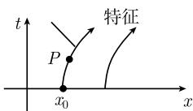  
图1.145

借助于特征线法, 解的结构 通过每个点 $x = x_0, t = 0$ , 都有一条特征线通过, 把它记为 (图 1.145)

$$
x = x (t, x _ {0}).\tag{1.330}
$$

沿着这些特征, (1.329) 的解 $E$ 必定是常数, 这意味着有

$$
E (x (t, x _ {0}), t) = E _ {0} (x _ {0}).
$$

如果对 $x_0$ 解方程(1.330)，那么我们得到 $x_0 = x_0(x,t)$ 和 $E(x,t) = E_0(x_0(x,t))$ 这就是所求的解.

例 2: 初值问题

$$
\begin{array}{l} {E _ {t} + z E _ {y} - y E _ {z} = 0,} \\ {E (y, z, 0) = E _ {0} (y, z) \quad (\text {初始条件})} \end{array}\tag{1.331}
$$

对每个光滑函数 $E_0\colon \mathbb{R}^2\to \mathbb{R}$ 有唯一解

$$
E (y, z, t) = E _ {0} (y \cos t - z \sin t, z \cos t + y \sin t), \quad {\text {对所有}} x, y, t \in \mathbb {R}.
$$

证明：根据例 1, 特征线是圆. 如果对 $y_{0}, z_{0}$ 解特征线 (1.328) 的方程, 那么可以得到

$$
y _ {0} = y \cos t - z \sin t, \quad z _ {0} = z \cos t + y \sin t.
$$

从 $E(x,y,t) = E_0(y_0,z_0)$ 即得(1.331）的解.

历史性的注 如果知道方程 $x' = f(x, t)$ 对于特征线的 n 个线性无关的守恒量 $E_{1}, \cdots, E_{n}, ^{1)}$ 并且如果 $C_{1}, \cdots, C_{n}$ 是常数, 那么在解方程

$$
E _ {j} (x, t) = C _ {j}, \quad j = 1, \dots , n
$$

时, 可以局部地得到 $x' = f(x, t)$ 的通解.

在 19 世纪, 人们曾试图用这个方法来解天体力学中的三体问题. 这个问题由轨道的 9 个分量的一个二阶微分方程组所给出. 这等价于 18 个变量的一个一阶组. 这样, 我们就需要 18 个守恒量. 动量 (质心的运动)、角动量和能量的守恒只产生 10 个守恒量. 分别在 1887 年和 1889 年, 布伦斯 (H. E. Bruns, 1848—1919) 和庞加莱证明了对于一大类函数不存在积分. 这样就认识到对于三体问题利用运动的积分来得到其闭形式的解是不可能的. 以闭形式得到解的失败的更深刻的原因在于实际上三体问题可以是混沌的这一事实.

处理 $n(n \geqslant 3)$ 体问题时, 在如今的卫星年代我们利用抽象的存在性和唯一性结果以及从这些结果中生成的有效的数值规程来计算轨道.

1.13.1.2 守恒量、激波和拉克斯的熵条件

虽然写下了确定流体运动的微分方程, 但是只是在其中压力之差是无穷小的情形中这些方程的积分才是成功的.

B. 黎曼 (1860) $^{2)}$

在流体动力学中, 人们经常遇到激波, 如超音速飞机的音爆. 这类激波相应于质量密度的非连续点, 使得流体动力学的处理异常困难. 方程

$$
\boxed { \begin{array}{c c} {\rho_ {t} + f (\rho) _ {x} = 0,} \\ {\rho (x, 0) = \rho_ {0} (x)} & {(\text {初始值})} \end{array} }\tag{1.332}
$$

是可能用来描述激波现象最简单的数学模型. 假设函数 $f: \mathbb{R} \to \mathbb{R}$ 是光滑的. 例1：在特殊情形 $f(\rho) = \rho^2 / 2$ , 可以得到所谓的伯格 (Burger)方程

$$
\rho_ {t} + \rho \rho_ {x} = 0, \quad \rho (x, 0) = \rho_ {0}.\tag{1.333}
$$

物理解释 考虑沿 x 轴的质量分布; 令 $\rho(x,t)$ 表示在点 x 和时刻 t 的密度. 引进质量密度流向量

$$
\boldsymbol {J} (x, t) := f (\rho (x, t)) \boldsymbol {i},
$$

那么不妨把方程 (1.332) 写为形式 $\rho_{t} + \mathrm{div}\boldsymbol{J} = 0$ ，即，方程 (1.332) 描述质量守恒 (参阅 1.9.7).

特征线 线

$$
\left| x = v _ {0} t + x _ {0}, \quad \text {其中} v _ {0} := f ^ {\prime} \left(\rho_ {0} \left(x _ {0}\right)\right) \right|\tag{1.334}
$$

称为特征线. 有

$$
\text { 守恒方程 } (1. 3 3 2) \text { 的每个光滑解沿着特征线是常数. }
$$

这可以给出下述物理解释：一个质点在初始时刻 t = 0 时位于点 $x_{0}$ ，根据 (1.334) 以常速度 $v_{0}$ 运动。这样的质点的碰撞导致 $\rho$ 的间断性，称之为激波。

激波 令对所有的 $\rho \in \mathbb{R}$ 有 $f''(\rho) > 0$ , 即, 函数 $f'$ 被假定为是单调增的. 如果 $x_0 < x_1$ , 并且

$$
\boxed {\rho_ {0} (x _ {0}) > \rho_ {0} (x _ {1}),}
$$

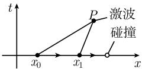  
图1.146

那么在 (1.334) 中 $v_{0} > v_{1}$ , 并且开始于 $x_{0}$ 的质点赶上了开始于 $x_{1}$ 的质点. 在 $(x, t)$ 坐标系中, 相应的特征线相交于某个点 $P$ 处 (图 1.146).

既然密度 $\rho$ 沿着特征线必定是常数, 那么 $\rho$ 必然在 $P$ 处间断. 按定义, 这意味着在 $P$ 处有一个激波.

初值问题的解 如果初始密度 $\rho_{0}$ 是光滑的, 那么通过令

$$
\rho (x, t) := \rho_ {0} (x _ {0})
$$

得到初值问题 (1.332) 的一个解 $\rho$ , 其中 $(x, t)$ 和 $x_{0}$ 是由方程 (1.334) 所联系的.

这个解是唯一的, 也是光滑的, 只要特征线在 $(x, t)$ 平面中不相交.

如果在 $\mathbb{R}$ 上 $f''(\rho) > 0$ , 那么无论初始函数 $\rho_0$ 的光滑性如何, 守恒量的方程 (1.332) 没有对于所有的 $\rho$ , 所有的时刻 $t \geqslant 0$ 的光滑解.

间断点通过激波而发展.

广义解 为了明确地研究间断的行为, 把函数 $\rho$ 称为方程 (1.332) 的广义解, 如果对所有检验函数 $\varphi \in C_0^\infty (\mathbb{R}_+^2)^{1)}$ 有

$$
\boxed {\int_ {\mathbb {R} _ {+} ^ {2}} (\rho \varphi_ {t} + f (\rho) \varphi_ {x}) \mathrm{d} x \mathrm{d} t = 0.}\tag{1.335}
$$

沿着激波的跳跃 给定特征线

$$
\mathcal {S} \colon x = v _ {0} t + x _ {0},
$$

以及 (1.332) 的一个广义解 $\rho$ , 它是光滑的, 除了沿特征线有一个跳跃. $\rho$ 的从特征线的右边和左边的单边极限将分别用 $\rho_{+}$ 和 $\rho_{-}$ 表示 (图 1.147). 那么, 下述关于跳跃的基本条件被满足:

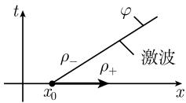  
图1.147

$$
\boxed {v _ {0} = \frac {f (\rho_ {+}) - f (\rho_ {-})}{\rho_ {+} - \rho_ {-}}.}\tag{1.336}
$$

关于跳跃位置的条件由黎曼于 1860 年首先引入流体的研究; 数年后, 兰金 (W. J. M. Rankine, 1820—1972) 和于戈尼奥 (P. H. Hugoniot, 1851—1887) 研究了更一般的形式. 关系式 (1.336) 把激波的速度与密度的跳跃联系起来了.

P. 拉克斯熵条件 (1957) 跳跃条件 (1.336) 对于稀疏波也成立. 然而, 当考虑所谓的熵条件

$$
\boxed {f ^ {\prime} (\rho_ {-}) > v _ {0} > f ^ {\prime} (\rho_ {+})}\tag{1.337}
$$

时, 这些条件就自然消失了.

物理意义的探讨 考虑一个带有活动活塞的金属柱体, 在活塞的两边有两种不同

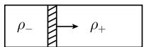  
图1.148

的流体 (或气体), 它们有不同的密度 $\rho_{-}$ 和 $\rho_{+}$ . 如果 $\rho_{-} > \rho_{+}$ , 那么活塞只能从左向右移动, 这是一个压缩过程 (图 1.148). 具有 $\rho_{-} < \rho_{+}$ 的疏散过程, 即在活动活塞前方的密度大于其后的密度, 这种情形在自然界中未被观察到.

热力学第二定律决定了一个过程在自然界中是否可能实现.

只有那些在封闭系统中有非减熵的过程才是可能的. 熵条件 (1.337) 代替了在模型 (1.332) 中的热力学第二定律.

对伯格方程的应用 考虑初值问题 (1.333).

例 2: 假设初始密度由函数

$$
\rho_ {0} (x) := \left\{ \begin{array}{l l} 1, & x > 1, \\ 0, & - 1 \leqslant x \leqslant 1 \end{array} \right.
$$

给出. 令 $f(\rho) := \rho^2 / 2$ 以及 $\rho_{-} = 1, \rho_{+} = 0$ . 跳跃条件 (1.336) 导致关系式

$$
v _ {0} = \frac {f (\rho_ {+}) - f (\rho_ {-})}{\rho_ {+} - \rho_ {-}} = \frac {1}{2}.
$$

这样, 激波以速度 $v_{0} = 1 / 2$ 自左向右传播. 在激波前 (相应地, 在其后) 密度 $\rho_{+} = 0$ (相应地 $\rho_{-} = 1$ ). 这是一个压缩过程, 由 $f'(\rho) = \rho$ 知道熵条件

$$
\rho_ {-} > v _ {0} > \rho_ {+}
$$

满足 (图 1.149).

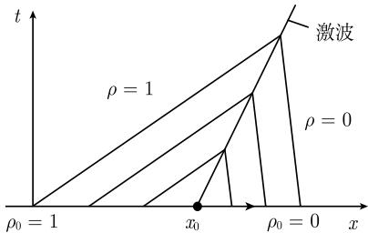  
图1.149

例 3: 如果初始密度是

$$
\rho_ {0} (x) := \left\{ \begin{array}{l l} 0, & x \leqslant x _ {0}, \\ 1, & x > x _ {0}, \end{array} \right.\tag{1.338}
$$

那么观察到如同例 2 中的相同激波. 然而在此情形中, 在波前 (相应地, 在其后) 密度 $\rho_{+} = 1$ (相应地 $\rho_{-} = 0$ ). 这在物理上是不可能的疏散过程, 对于它, 熵条件被破坏了 (图 1.150(b)).

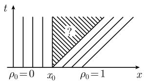  
(a)

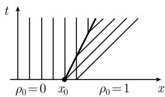  
(b)  
图 1.150 对于伯格方程的疏散过程

对于初始条件 (1.338) 的特征线被表示在图 1.150(a) 中. 这里有一个阴影区域, 其中没有特征线, 并且解在其中也不确定. 有很多种可能性来填补这个洞, 以致出现了广义解. 然而, 这些解中没有一个在物理上有意义.

1.13.1.3 哈密顿-雅可比微分方程

假设给定哈密顿 (W. R. Hamilton, 1805—1865) 函数 $H = H(\pmb{q}, \tau, \pmb{p})$ . 除了要求轨道 $\pmb{q} = \pmb{q}(\tau)$ , $\pmb{p} = \pmb{p}(\tau)$ 的典范方程

$$
\boxed { \begin{array}{c c} \boldsymbol {q} ^ {\prime} = H _ {\boldsymbol {p}}, & \boldsymbol {p} ^ {\prime} = - H _ {\boldsymbol {q}} \end{array} }\tag{1.339}
$$

之外, 还考虑下述要求的函数 $S = S(\boldsymbol{q}, \tau)$ 的雅可比偏微分方程, 它也称为哈密顿-雅可比偏微分方程:

$$
\boxed {S _ {\tau} + H (\boldsymbol {q}, \tau , S _ {\boldsymbol {q}}) = 0.}\tag{1.340}
$$

这里 $\boldsymbol{q}=(q_{1},\cdots,q_{n}),\boldsymbol{p}=(p_{1},\cdots,p_{n})$ . 如果 H 不依赖于 $\tau$ , 那么对于 (1.339) 而言 H 是守恒量. 在经典力学中, H 是系统的能量.

如果用辛几何的语言来描述的话, 这个理论是特别简洁、优美的. 为此, 需要典范微分形式

$$
\boxed {\sigma := p \mathrm{d} q}\tag{1.341}
$$

和相应的辛形式 $^{1)}$ .

$$
\boxed {w = - \mathrm{d} \sigma .}
$$

在光线和波前之间的基本对偶性 在几何光学中, 曲线

$$
\boxed {q = q (\tau)}\tag{1.342}
$$

称为光线, 其中 q 和 $\tau$ 表示空间变量. 方程 (1.340) 称为程函方程. 曲面

$$
\boxed {S = \text {常数}}\tag{1.343}
$$

相应于波前, 它垂直于光线. 如果沿着连接两个点 $(q_0, \tau_0), (q, \tau)$ 的光线 $q = q(\sigma), p = p(\sigma)$ 之一计算积分

$$
S (q, \tau) = \int_ {(q _ {0}, \tau_ {0})} ^ {(q, \tau)} (p (\sigma) q ^ {\prime} (\sigma) - H (q (\sigma), \sigma , p (\sigma))) \mathrm{d} \sigma ,\tag{1.344}
$$

1) 用分量形式, 有

$$
q _ {j} ^ {\prime} = H _ {p _ {j}}, \quad p _ {j} ^ {\prime} = - H _ {q _ {j}}.
$$

并且有 $\boldsymbol{S}_{\boldsymbol{q}}=(S_{q_{1}},\cdots,S_{q_{n}})$ 以及

$$
\sigma = \sum_ {j = 1} ^ {n} p _ {j} \mathrm{d} q _ {j}, \quad \omega = \sum_ {j = 1} ^ {n} \mathrm{d} q _ {j} \wedge \mathrm{d} p _ {j}.
$$

那么 $S(q,\tau)$ 就是光线经过这两点之间的距离所需要的时间.

既然在光线和波前的物理之间有着紧密的联系, 那么人们期望在方程 (1.339) 和 (1.340) 之间也有紧密的联系. 下述两个分别属于雅可比和拉格朗日的定理验证了情况确实如此. $^{1)}$

力学与几何光学之间类似的哈密顿系统 把几何光学的方法应用到经典力学的研究中, 这是爱尔兰数学家和物理学家哈密顿的想法. 在力学中, $q = q(\tau)$ 相应于一个质点系统在时刻 $\tau$ 的运动. 积分 (1.344) 描述沿着轨道被输运的作用. 作用是一个基本的物理量, 它具有能量乘以时间的量纲 (参阅 5.1.3).

用 $\boldsymbol{Q}=(Q_{1},\cdots,Q_{m}),\boldsymbol{P}=(P_{1},\cdots,P_{m})$ 表示实参数. 下面的结果包含在天体力学中比较复杂的情形中求解运动方程的一种重要的方法. 从几何光学的观点看, 这个定理说明了光线系统可以从波前系统而得到.

雅可比定理 如果有哈密顿-雅可比偏微分方程 (1.340) 的一个光滑解 $S = S(q, \tau, Q)$ ，那么利用

$$
\boxed {- S _ {Q} (q, \tau , Q) = P, \quad S _ {q} (q, \tau , Q) = p}\tag{1.345}
$$

可以得到典范方程 (1.339) 的一组解 $^{2)}$

$$
q = q (\tau ; Q, P), \quad p = p (\tau ; Q, P),
$$

它们依赖于 Q 和 P, 即, 依赖于 2m 个实参数.

我们将在下面的 1.13.1.4 和 1.13.1.5 中考虑这个结果的应用.

下述定理的基本思想是, 可以在没有光线系统的情况下构造出波前的程函函数. 对于任意的光线系统, 这个目标不能被达到; 这要求光线形成拉格朗日流形才能做到.

假设哈密顿函数 H 是光滑的.

拉格朗日定理和辛几何 给定典范微分方程 (1.339) 的一组解

$$
q = q (\tau , Q), \quad p = p (\tau , Q),\tag{1.346}
$$

其中 $q_{Q}(\tau_{0}, Q_{0}) \neq 0$ . 那么方程 $q = q(\tau, Q)$ 在 $(\tau_{0}, Q_{0})$ 的一个邻域中对变量 $Q$ 可解, 这就导致一个关系 $Q = Q(\tau, q)$ .

现在假设系统 (1.346) 于时刻 $\tau_0$ 在 $Q_0$ 的一个邻域中形成一个拉格朗日流形,

即, 沿着系统的解, 辛形式 $\omega$ 对于 $\tau_{0}$ 恒为零. $^{1)}$

曲线积分

$$
\boxed {\mathcal {S} (Q, \tau) = \int_ {(Q _ {0}, \tau_ {0})} ^ {(Q, \tau)} (p q _ {\tau} - H) \mathrm{d} t + p q _ {Q} \mathrm{d} Q,}
$$

其中 p 和 q 由 (1.346) 给出. 这个曲线积分与积分路径无关, 并且利用

$$
\boxed {S (q, \tau) := \mathcal {S} (Q (q, \tau), \tau)}
$$

得到哈密顿-雅可比微分方程 (1.340) 的一个解.

推论 解组 (1.346) 对于所有时刻 $\tau$ 形成一个拉格朗日流形.

初值问题的解

$$
\boxed { \begin{array}{c c} S _ {\tau} + H (q, S _ {q}, \tau) = 0, \\ S (q, 0) = 0 & (\text {初始值}). ^ {2)} \end{array} }\tag{1.347}
$$

定理 我们假设哈密顿函数 $H = H(q, \tau, p)$ 在点 $(q_0, 0, 0)$ 的一个邻域中是光滑的. 那么初值问题 (1.347) 在点 $(q_0, 0, 0)$ 的一个充分小的邻域中有一个唯一解, 并且这个解是光滑的.

解的构造 对于典范方程解初值问题

$$
q ^ {\prime} = H _ {p}, \quad p ^ {\prime} = - H _ {q}, \quad q (\tau_ {0}) = Q, \quad p (\tau_ {0}) = 0.
$$

由拉格朗日定理, 相应的解组 $q = q(\tau, Q)$ , $p = p(\tau, Q)$ 产生 (1.347) 的解 S.

1) 由于 $\omega = \sum_{i=1}^{n} \mathrm{d}q_i \wedge \mathrm{d}p_i$ ，因此这个条件蕴涵着

$$
\sum_ {j, k = 1} ^ {n} [ Q _ {j}, Q _ {k} ] \mathrm{d} Q _ {j} \wedge \mathrm{d} Q _ {k} = 0,
$$

因而对所有的参数 $Q_{i}$ 有

$$
\boxed {[ Q _ {j}, Q _ {k} ] (t _ {0}, Q) = 0, \quad k, j = 1, \dots , n.}
$$

这里我们用了由拉格朗日引进的括号

$$
[ Q _ {j}, Q _ {k} ] := \sum_ {i = 1} ^ {n} \frac {\partial q _ {i}}{\partial Q _ {j}} \frac {\partial p _ {i}}{\partial Q _ {k}} - \frac {\partial q _ {i}}{\partial Q _ {k}} \frac {\partial p _ {i}}{\partial Q _ {j}}.
$$

无疑, 拉格朗日已经很清楚: 辛几何的记号对于经典力学的数学描述是极其重要的. 然而, 直到大约 1960 年, 为了理解许多经典考虑的深刻性质, 也为了得到新的理解才开始明显地应用这些几何的记号. 这在 1.13.1.7 中将更细致地, 在 [212] 中将更一般地得到描述. 辛几何及其众多应用的现代标准参考书是教科书 [156].

2) 通过用差 $S - S_0$ 代替 $S$ , 具有初值条件 $S(q,0) = S_0(q)$ 的一般的初值问题可以立即被归化为 (1.347) 中所考虑的情形.

1.13.1.4 对几何光学的应用

$(\tau, q)$ 平面中光线 $q = q(\tau)$ 的运动可以由费马 (P. de Fermat, 1601—1665) 原理得到:

$$
\boxed { \begin{array}{c} \int_ {\tau_ {0}} ^ {\tau_ {1}} \frac {n (q (\tau))}{c} \sqrt {1 + q ^ {\prime} (\tau) ^ {2}} \mathrm{d} \tau \stackrel {!} {=} \min.  , \\ q (\tau_ {0}) = q _ {0}, \quad q (\tau_ {1}) = q _ {1}. \end{array} }\tag{1.348}
$$

这里 $n(q)$ 是指标函数, 即, 在点 $q(\tau)$ 处的折射指标 $(c/n(q)$ 是光在介质中的速度), c 是光在真空中的速度. 因而光以这样的方式运动: 用最少的时间通过两点间的距离.

欧拉-拉格朗日方程 如果引进拉格朗日函数 $L(q, q', \tau) := \frac{n(q)}{c} \sqrt{1 + (q')^2}$ , 那么(1.348)的每个解 $q = q(\tau)$ 满足二阶常微分方程

$$
\frac {\mathrm{d}}{\mathrm{d} \tau} L _ {q ^ {\prime}} - L _ {q} = 0,
$$

即

$$
\boxed {\frac {\mathrm{d}}{\mathrm{d} \tau} \frac {n q ^ {\prime}}{\sqrt {1 + (q ^ {\prime}) ^ {2}}} = n _ {q} \sqrt {1 + (q ^ {\prime}) ^ {2}}.}\tag{1.349}
$$

为了简化记号, 选取度量单位, 使得 c = 1.

典范哈密顿方程 勒让德变换

$$
p = L _ {q ^ {\prime}} (q, q ^ {\prime}, \tau), H = p q ^ {\prime} - L
$$

产生哈密顿函数

$$
H (q, p, \tau) = - \sqrt {n (q) ^ {2} - p ^ {2}}.
$$

此时典范哈密顿方程 $q' = H_{p}, p' = -H_{q}$ 为

$$
\boxed {q ^ {\prime} = \frac {p}{\sqrt {n ^ {2} - p ^ {2}}}, \quad p ^ {\prime} = \frac {n _ {q} n}{\sqrt {n ^ {2} - p ^ {2}}}.}\tag{1.350}
$$

这是一个一阶常微分方程组.

哈密顿-雅可比微分方程 方程 $S_{\tau} + H(q, S_{q}, \tau) = 0$ 即是

$$
S _ {\tau} - \sqrt {n ^ {2} - S _ {q} ^ {2}} = 0.
$$

这相应于程函方程

$$
\boxed {S _ {\tau} ^ {2} + S _ {q} ^ {2} = n ^ {2}.}\tag{1.351}
$$

雅可比的解法 考虑特殊情形 $n \equiv 1$ ，这相应于光在真空中传播。显然，

$$
S = Q \tau + \sqrt {1 - Q ^ {2}} q
$$

是 (1.351) 的一个解, 它依赖于参数 $Q$ . 根据 (1.345), 令 $-S_{Q} = P$ , $p = S_{q}$ , 可以得到典范方程

$$
\frac {Q _ {q}}{\sqrt {1 - Q ^ {2}}} - \tau = P, \quad p = \sqrt {1 - Q ^ {2}}
$$

的一组解, 它依赖于常数 $Q$ 和 $P$ , 因而是通解. 这个组是一组光线 $q = q(\tau)$ , 它垂直于直的波前 $S =$ 常数 (图 1.151).

1.13.1.5 对于二体问题的应用

牛顿运动方程 根据 1.12.5.2, 二体问题 (如太阳与一个行星) 导致平面运动 $q = q(t)$ 的方程

$$
\boxed {m _ {2} \boldsymbol {q} ^ {\prime \prime} = \boldsymbol {F},}\tag{1.352}
$$

其中取太阳的位置为原点 (图 1.152). 这里 $m_{1}$ 表示太阳的质量, $m_{2}$ 表示行星的质量, $m = m_{1} + m_{2}$ 是总质量, G 是引力常数. 力由关系式

$$
\pmb {F} = - \mathbf {g r a d}   U = - \frac {\alpha \pmb {q}}{| \pmb {q} | ^ {2}}, \quad \text {其中}   U := - \frac {\alpha}{| \pmb {q} |},   \alpha := G m _ {2} m
$$

给出.

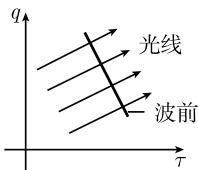  
图1.151

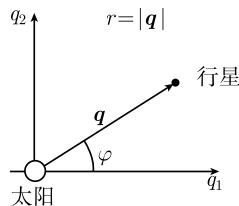  
图1.152

总能量 E 动能与势能之和给出了总能量, 即

$$
E = \frac {1}{2} m _ {2} (\boldsymbol {q} ^ {\prime}) ^ {2} + U (\boldsymbol {q}).
$$

典范哈密顿方程 我们引进动量 $p = m_{2}q'$ (质量乘以速度). 从上面关于能量 E 的表达式可以得到哈密顿函数

$$
H = \frac {\pmb {p} ^ {2}}{2 m _ {2}} + U (\pmb {q}).
$$

如果令 $q = q_{1}i + q_{2}j$ 和 $p = p_{1}i + p_{2}j$ ，那么典范方程 $q_{j}^{\prime} = H_{p_{j}}$ ， $p_{j} = -H_{q_{j}}$ 可以用向量形式写为

$$
\boxed {q ^ {\prime} = \frac {p}{m _ {2}}, \quad p ^ {\prime} = - \operatorname{grad} U.}
$$

这个方程等价于牛顿运动方程 (1.352).

哈密顿-雅可比方程 球函数 $S = S(q,t)$ 的方程 $S_{t} + H(q,S_{q}) = 0$ 显式地变为

$$
S _ {t} + \frac {S _ {q} ^ {2}}{2 m _ {2}} + U (\pmb {q}) = 0,
$$

其中 $S_{t} = \operatorname{grad} S$ . 为了方便地解这个方程, 重要的是过渡到极坐标. 这就给出了

$$
\boxed {S _ {t} + \frac {1}{2 m _ {2}} \bigg (S _ {r} ^ {2} + \frac {S _ {\varphi} ^ {2}}{r ^ {2}} \bigg) - \frac {\alpha}{r} = 0.}\tag{1.353}
$$

雅可比的解法 我们寻求 (1.353) 的双参数解族 $S = S(r, \varphi, t, Q_1, Q_2)$ , $Q_1, Q_2$ 为参数. 令

$$
S = - Q _ {1} t + Q _ {2} \varphi + s (r),
$$

这就产生了常微分方程

$$
- Q _ {1} + \frac {1}{2 m _ {2}} \left(s ^ {\prime} (r) ^ {2} + \frac {Q _ {2} ^ {2}}{r ^ {2}}\right) - \frac {\alpha}{r} = 0.
$$

这意味着 $s'(r) = f(r)$ ，其中

$$
f (r) := \sqrt {2 m _ {2} \left(Q _ {1} + \frac {\alpha}{r}\right) - \frac {Q _ {2} ^ {2}}{r ^ {2}}}.
$$

因而得到

$$
s (r) = \int f (r) \mathrm{d} r.
$$

根据 (1.345), 从方程 $-S_{Q_j} = P_j$ ( $P_j$ 是常数) 得到轨道的方程. 这给出了

$$
P _ {1} = t - \int {\frac {m _ {2} \mathrm{d} r}{f (r)}}, \quad P _ {2} = - \varphi + \int {\frac {Q _ {2} \mathrm{d} r}{r ^ {2} f (r)}}.
$$

为简单起见, 令 $Q_{1} = E$ 和 $Q_{2} = N$ . 积分第二个方程, 可以得到

$$
\varphi = \arccos {\frac {{\frac {N}{r}} - {\frac {m _ {2} \alpha}{N}}}{\sqrt {2 m _ {2} E + {\frac {m _ {2} ^ {2} \alpha^ {2}}{N}}}}} + \text {常数}.
$$

不妨设常数 =0. 这样就推导出轨道的方程为

$$
\boxed {r = \frac {p}{1 + \varepsilon \cos \varphi},}\tag{1.354}
$$

其中 $p := N^{2}/m_{2}\alpha, \varepsilon := \sqrt{1 + 2EN^{2}/m_{2}\alpha}$ . 这个运动的能量和角动量的计算蕴涵着常数 E 是能量, 常数 N 是角动量向量 N 的绝对值 $|N|$ .

轨道 (1.354) 是圆锥截线, 当 $0 < \varepsilon < 1$ 时它是椭圆. 从这些解可以推得关于行星轨道的开普勒定律.

1.13.1.6 典范雅可比变换

典范变换 一个微分同胚

$$
Q = Q (q, p, t), \quad P = P (q, p, t), \quad T = t
$$

称为典范方程

$$
\boxed {q ^ {\prime} = H _ {p}, \quad p ^ {\prime} = - H _ {q}}\tag{1.355}
$$

的一个典范变换, 如果这个变换把这个典范方程变为一个新的典范方程

$$
\boxed {Q ^ {\prime} = \mathcal {H} _ {P}, \quad P ^ {\prime} = - \mathcal {H} _ {Q}.}\tag{1.356}
$$

这里的思想是, 通过适当地选取典范变换, (1.355) 的解可以归为较简单的问题 (1.356) 的解. 这是解天体力学中复杂问题的最重要的方法.

雅可比生成函数 给定一个函数 $S = S(q, Q, t)$ . 利用关系式

$$
\boxed {\mathrm{d} S = p \mathrm{d} q - P \mathrm{d} Q + (\mathcal {H} - H) \mathrm{d} t,}\tag{1.357}
$$

再令

$$
P = - S _ {Q} (q, Q, t), \quad p = S _ {q} (q, Q, t)\tag{1.358}
$$

和

$$
\mathcal {H} = S _ {t} + H,
$$

就生成了一个典范变换. 这里假设, 利用隐函数定理, 方程 $p = S_q(q, Q, t)$ 可以对 $Q$ 解出.

雅可比的方法 如果选取 $S$ 为哈密顿-雅可比微分方程 $S_{t} + H = 0$ 的一个解, 那么 $\mathcal{H} \equiv 0$ . 变换后的典范方程 (1.356) 是平凡的, 因而有解 $Q =$ 常数和 $P =$ 常数. 因而, (1.358) 就是在 (1.345) 中所给出的雅可比方法.

辛变换 现在假设变换 $Q = Q(q, p)$ , $P = P(q, p)$ 是辛变换, 即, 它满足条件

$$
\mathrm{d} (P \mathrm{d} Q) = \mathrm{d} (p \mathrm{d} q).
$$

那么这个变换就是典范的, 满足 H = H.

证明：从关系式 $\mathrm{d}(pdq - P\mathrm{d}Q) = 0$ ，并由 1.9.11 知道方程

$$
\mathrm{d} S = p \mathrm{d} q - P \mathrm{d} Q
$$

局部地有解 S, 根据 (1.357), 它生成一个典范变换.

1.13.1.7 哈密顿力学和辛几何的流体动力学解释

在数学和物理学之间的交互作用总是起着一个明显的作用。对数学只有初步了解的物理学家处于一种极其不利的位置。而对物理应用不感兴趣的数学家，也失去了获得动机和深刻洞察力的机会。

加利福尼亚大学 舍希特尔 (Martin Schechter)

通过利用 $(q,p)$ 相空间中流体动力学图像, 并应用微分形式的语言, 可以对哈密顿力学得到的一种特别直观和简洁的解释. 在这个架构中, 哈密顿函数和 3 个微分形式

$$
\boxed {\sigma := p \mathrm{d} q, \quad \omega := \mathrm{d} \sigma , \quad \sigma - H \mathrm{d} t}
$$

起着关键的作用. 由于辛几何的功能, 辛形式 $\omega$ 担负着给出一个紧密的数学描述的责任.

下面假设所出现的所有函数和曲线都是光滑的. 并且只考虑具有光滑边界的有界域. 病态曲线和区域将不予考虑.

$\mathbb{R}^3$ 中的经典流

积分曲线 设给出速度场 $\boldsymbol{v} = \boldsymbol{v}(\boldsymbol{x}, t)$ . 满足微分方程

$$
\boxed {\boldsymbol {x} ^ {\prime} = \boldsymbol {v} (\boldsymbol {x} (t), t), \quad \boldsymbol {x} (0) = \boldsymbol {x} _ {0}}
$$

的曲线被称为该速度向量场的积分曲线, 或流线. 这些曲线描述了流体粒子流 (图 1.153(a)). 令

$$
F _ {t} (\boldsymbol {x} _ {0}) := \boldsymbol {x} (t),
$$

即, 对于流体的每个点 $P$ , $F_{t}$ 与在时刻 $t = 0$ 时出发的粒子在时刻 $t$ 时所在位置处的点 $P_{t}$ 相联系. 称 $F_{t}$ 为在时刻 $t$ 的流算子. $^{1)}$

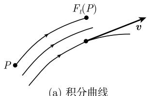  
(a) 积分曲线

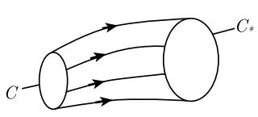  
(b) 涡线  
图1.153 $\mathbb{R}^3$ 中的流

流定理

$$
\boxed {\frac {\mathrm{d}}{\mathrm{d} t} \int_ {F _ {t} (\varOmega)} h (x, t) \mathrm{d} x = \int_ {F _ {t} (\varOmega)} (h _ {t} + (\operatorname{div} h) \boldsymbol {v}) (x, t) \mathrm{d} x.}\tag{1.359}
$$

例：如果 $h = \rho$ 是物质密度, 那么质量守恒意味着在 (1.359) 的左端的积分为零. 如果把区域 $\Omega$ 收缩为一个点, 那么从右端的积分为零产生了所谓的连续性方程

$$
\rho_ {t} + \mathrm{div} (\rho \pmb {v}) = 0.
$$

涡线 满足

$$
\boxed {\boldsymbol {x} ^ {\prime} (t) = \frac {1}{2} (\mathbf {c u r l}   \boldsymbol {v}) (\boldsymbol {x} (t), t)}
$$

的曲线 $\boldsymbol{x} = \boldsymbol{x}(t)$ 称为涡线. 沿着一条闭曲线 C 的周线积分

$$
\int_ {C} \pmb {v} \mathrm{d} \pmb {x}
$$

称为速度场沿着 C 的环流量. 如果场 v 是无涡的, 即, $\operatorname{curl} v \equiv 0$ , 那么沿着每条闭曲线环流量为零. 因而从斯托克斯 (G. G. Stokes, 1819—1903) 定理即得

$$
\int_ {\partial F} \boldsymbol {v} \mathrm{d} \boldsymbol {x} = \int_ {F} (\mathbf {c u r l} \boldsymbol {v}) \boldsymbol {n} \mathrm{d} F = 0,
$$

若 $C$ 是一个曲面 $F$ 的边界 $\partial F$ . 一般地, 环流量是不为零的, 并且产生流体中涡旋强度的一个度量. 对于沿着曲线的环流量, 有两个重要的守恒律.

亥姆霍兹 (H. L. F. Helmholtz, 1821—1894) 涡旋定理 如果曲线 $C_*$ 是 $C$ 沿着涡线平移而得到的 (图 1.153(b)), 那么有关系式

$$
\boxed {\int_ {C} \boldsymbol {v} \mathrm{d} \boldsymbol {x} = \int_ {C _ {*}} \boldsymbol {v} \mathrm{d} \boldsymbol {x}.}
$$

开尔文 (L. Kelvin, 1824—1907) 涡旋定理 在理想流体中有关系式

$$
\boxed {\int_ {C} \boldsymbol {v} \mathrm{d} \boldsymbol {x} = \int_ {F _ {t} (C)} \boldsymbol {v} \mathrm{d} \boldsymbol {x}.}
$$

这里 $F_{t}(C)$ 由时刻 t 时的那些粒子组成, 它们在时刻 t = 0 时属于闭曲线 C. 因而, 沿着由理想流体粒子组成的闭曲线的环流量对于时间而言保持为常数.

理想流体 与亥姆霍兹涡旋定理不同, 开尔文定理中的速度场 v 必定是某个理想流体的欧拉运动方程的解. 这些方程是

$$
\begin{array}{r l} & {\rho \pmb {v} _ {t} + \rho (\pmb {v}   \mathbf {g r a d}) \pmb {v} = - \rho \mathbf {g r a d}   U - \mathbf {g r a d}   p \quad (\text {运动方程}),} \\ & {\rho_ {t} + \mathrm{div} (\rho \pmb {v}) = 0 \quad (\text {质量守恒}),} \\ & {\rho (\pmb {x}, t) = f (p (\pmb {x}, t)) \quad (\text {压力-密度定律}   \rho = f (p)).} \end{array}\tag{1.360}
$$

这里 $\rho$ 表示密度, p 表示压力, f = -grad U 表示力密度.

不可压缩流体 当密度 $\rho$ 为常数时, 称该流体是不可压缩流体. 此时从(1.360)中的连续性方程(质量守恒)即得所谓的不可压缩性条件:

$$
\operatorname{div} \boldsymbol {v} = 0.
$$

体积守恒 在不可压缩流体的情形, 流是保体积的, 即, 在时刻 t = 0 时位于区域 $\Omega$ 中的流体粒子在时刻 t 时在区域 $F_{t}(\Omega)$ 中, 这两个区域有相同的体积 (图 1.154). 解析地, 这意味着

$$
\boxed {\int_ {\Omega} \mathrm{d} \boldsymbol {x} = \int_ {F _ {t} (\Omega)} \mathrm{d} \boldsymbol {x}.}
$$

证明：这从其中 $h \equiv 1$ 和 div v = 0 的流方程 (1.359) 即得.

哈密顿流

相空间 令 $\boldsymbol{q}=(q_{1},\cdots,q_{n}),\boldsymbol{p}=(p_{1},\cdots,p_{n})$ ，所以 $(\boldsymbol{q},\boldsymbol{p})\in\mathbb{R}^{2n}$ 。这个 $(\boldsymbol{q},\boldsymbol{p})$ 空间表示为相空间。此外，令 $\boldsymbol{q}=\boldsymbol{q}(t)$ 和 $\boldsymbol{p}=\boldsymbol{p}(t)$ 是典范方程

$$
\begin{array}{l l} \boldsymbol {q} ^ {\prime} (t) = H _ {\boldsymbol {p}} (\boldsymbol {q} (t), \boldsymbol {p} (t)), & \boldsymbol {p} ^ {\prime} (t) = - H _ {\boldsymbol {q}} (\boldsymbol {q} (t), \boldsymbol {p} (t)), \\ \boldsymbol {q} (0) = \boldsymbol {q} _ {0}, & \boldsymbol {p} (0) = \boldsymbol {p} _ {0} \end{array}
$$

的解.

令

$$
F _ {t} (\boldsymbol {q} _ {0}, \boldsymbol {p} _ {0}) := (\boldsymbol {q} (t), \boldsymbol {p} (t)).
$$

以这种方式可以得到按定义被称为哈密顿流的东西 (图 1.155).

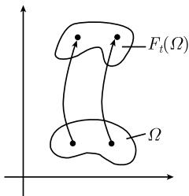  
图1.154 体积守恒

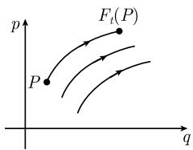  
图 1.155 哈密顿流

能量守恒 沿着哈密顿流的积分曲线哈密顿函数是常数.

刘维尔 (J. Liouville, 1809—1882) 定理 哈密顿流是保积的.

注 这个定理陈述了

$$
\int_ {\Omega} \mathrm{d} \boldsymbol {q} \mathrm{d} \boldsymbol {p} = \int_ {F _ {t} (\Omega)} \mathrm{d} \boldsymbol {q} \mathrm{d} \boldsymbol {p}.\tag{1.361}
$$

微分形式 $\theta := dq_{1} \wedge dq_{2} \wedge \cdots \wedge dq_{n} \wedge dp_{1} \wedge \cdots \wedge dp_{n}$ 是相空间的体积形式. 对辛形式 $\omega$ 而言重要的关系式在公式

$$
\boxed {\theta = \alpha_ {n} \omega \wedge \omega \wedge \dots \wedge \omega}
$$

中得到, 其中有 $n$ 个因子和一个常数 $\alpha_{n}$ . 此时关系式 (1.361) 相应于公式

$$
\boxed {\int_ {\Omega} \theta = \int_ {F _ {t} (\Omega)} \theta .}
$$

广义亥姆霍兹涡旋定理和希尔伯特 (D. Hilbert, 1862—1943) 不变积分 令 $C$ 和 $C_*$ 是两条闭曲线, 它们的点由哈密顿流的积分曲线所连接. 那么有

$$
\boxed {\int_ {C} \boldsymbol {p} \mathrm{d} \boldsymbol {q} - H \mathrm{d} t = \int_ {C _ {*}} \boldsymbol {p} \mathrm{d} \boldsymbol {q} - H \mathrm{d} t.}
$$

###### 本节续页

- [（续2）](<1.13.1 数学物理中的一阶方程-2.md>)
