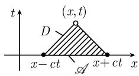
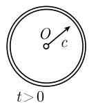
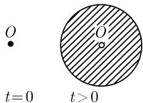

##### 1.13.2 二阶数学物理方程

热流方程, 发声体的振动方程, 以及流体的方程, 属于分析的范畴, 近来已被打开了, 值得去研究其最详.

J·B·J·傅里叶

《热的解析理论》, 1822

1.13.2.1 傅里叶通用方法

傅里叶方法的基本思想是把二阶偏微分方程的解表示成形式

$$
u (x, t) = \sum_ {k = 0} ^ {\infty} a _ {k} (x) b _ {k} (t).\tag{1.384}
$$

在一些重要的情形中 $a_{k}(x)b_{k}(t)$ 相应于物理系统的一个特征振荡. 隐藏在 (1.384) 后的是下述一般原理：

许多物理系统按时间的发展作为特征状态 (如特征振荡) 的叠加而给出.

这个原理于 1730 年由 D. 伯努利 (Bernoulli, 1700—1782) 首先用来处理杆和弦的振动. 每种乐器的声音, 以及每种歌声, 都由 (1.384) 形的表达式所描述, 其中 $a_{k}(x)b_{k}(t)$ 表示基音和较高的音, 它们的强度决定了音质. 有趣的是, 欧拉并不相信 D. 伯努利所作出的论断, 即, 借助于 (1.384) 人们可以得到随时间的发展. 我们必须记住, 在那个时代, 还没有大家认可的函数的一般概念, 和无穷级数收敛的概念.

在傅里叶于 1822 年出版的著作《热的解析理论》中, 他的方法 (1.384) 被发展为数学物理中的一个重要的工具. 然而, 直到 20 世纪初通过泛函分析方法的应用人们才对这个方法有了比较深刻的理解. 在 [212] 中将更详细地讨论这些.

1.13.2.2 应用于弦振动

$$
\boxed { \begin{array}{l l l} \frac {1}{c ^ {2}} u _ {t t} - u _ {x x} = 0, & 0 <   x <   L, t > 0 & (\text {微分方程}), \\ u (0, t) = u (L, t) = 0, & t \geqslant 0 & (\text {边界值}), \\ u (x, 0) = u _ {0} (x), & 0 \leqslant x \leqslant L & (\text {初始位置}), \\ u _ {t} (x, 0) = u _ {1} (x), & 0 \leqslant x \leqslant L & (\text {初始速度}). \end{array} }\tag{1.385}
$$

这个问题描述了两端固定、长为 $L$ 的弦的运动. 函数 $u$ 有下述解释: $u(x, t) =$ 弦在时刻 $t$ 在点 $x$ 处的位移 (图1.159). 数 $c$ 相应于弦波的传播速度.

  
图1.159

为了简化记号, 令 $L = \pi$ 和 c = 1.

存在性和唯一性结果 令 $u_{0}$ 和 $u_{1}$ 是给定的周期为 $2\pi$ 的光滑奇函数．那么问题(1.385)有唯一解

$$
\boxed {u (x, t) = \sum_ {k = 1} ^ {\infty} (a _ {k} \sin k t + b _ {k} \cos k t) \sin k x,}\tag{1.386}
$$

其中的记号使得

$$
u _ {0} (x) = \sum_ {k = 1} ^ {\infty} b _ {k} \sin k x, \quad u _ {1} (x) = \sum_ {k = 1} ^ {\infty} k a _ {k} \sin k x,\tag{1.387}
$$

即, 诸系数 $b_{k}$ (相应地, $ka_{k}$ ) 是 $u_{0}$ (相应地, $u_{1}$ ) 的傅里叶系数. 确切地, 这意味着

$$
b _ {k} = \frac {2}{\pi} \int_ {0} ^ {\pi} u _ {0} (x) \sin k x \mathrm{d} x, \quad a _ {k} = \frac {2}{k \pi} \int_ {0} ^ {\pi} u _ {1} (x) \sin k x \mathrm{d} x.
$$

物理解释 解 (1.386) 相应于具有角频率 $\omega = k$ 的弦的特征振动

$$
u (x, t) = \sin k t \sin k x \quad {\text {和}} \quad u (x, t) = \cos k t \sin k x
$$

的叠加.

下述一些考虑是傅里叶方法具有代表性的应用.

导出给定解的想法 (i) 首先寻找原始问题 (1.385) 的乘积形式

$$
\boxed {u (x, t) = \varphi (x) \psi (t)}
$$

的特解.

(ii) 令

$$
\varphi (0) = \psi (0) = 0,
$$

初始条件 $u(0,t)=u(\pi,t)=0$ 即被满足.

(iii) $\lambda$ 技巧：从微分方程 $u_{tt} - u_{xx} = 0$ 可以得到

$$
\varphi (x) \psi^ {\prime \prime} (t) = \varphi^ {\prime \prime} (x) \psi (t).
$$

通过令

$$
\frac {\psi^ {\prime \prime} (t)}{\psi (t)} = \frac {\varphi^ {\prime \prime} (x)}{\varphi (x)} = \lambda ,
$$

这个方程可以满足, 其中 $\lambda$ 为未知实数. 用这种方法可以得到两个方程:

$$
\boxed {\varphi^ {\prime \prime} (x) = \lambda \varphi (x), \quad \varphi (0) = \varphi (\pi) = 0}\tag{1.388}
$$

和

$$
\psi^ {\prime \prime} (t) = \lambda \psi (t).\tag{1.389}
$$

称 (1.388) 为具有本征值参数 $\lambda$ 的边值-本征值问题.

(iv) (1.388) 的非平凡解是

$$
\boxed {\varphi (x) = \sin k x, \lambda = - k ^ {2}, k = 1, 2, \dots .}
$$

如果在 (1.389) 中令 $\lambda = -k^2$ ，则得到解

$$
\psi (t) = \sin k t, \quad \cos k t.
$$

(v) 这些特解的叠加产生了

$$
u (x, t) = \sum_ {k = 1} ^ {\infty} (a _ {k} \sin k t + b _ {k} \cos k t) \sin k x,
$$

其中诸 $a_{k}, b_{k}$ 是未知系数. 关于 $t$ 求导数产生了

$$
u _ {t} (x, t) = \sum_ {k = 1} ^ {\infty} \left(k a _ {k} \cos k t - k b _ {k} \sin k t\right) \sin k x.
$$

(vi) 这样, 从初始条件 $u(x,0) = u_0(x)$ 和 $u_t(x,0) = u_1(x)$ 即得确定诸 $a_k$ 和 $b_k$ 的方程 (1.387).

1.13.2.3 应用于杆传热

$$
\boxed { \begin{array}{l l l} T _ {t} - \alpha T _ {x x} = 0, & 0 <   x <   L, t > 0 & (\text {微分方程}), \\ T (0, t) = T (L, t) = 0, & t \geqslant 0 & (\text {边界温度}), \\ T (x, 0) = T _ {0} (x), & 0 \leqslant x \leqslant L & (\text {初始温度}). \end{array} }\tag{1.390}
$$

这个问题描述了一个长为 L 的杆中的温度分布. 函数 T 有下述解释: $T(x,t)=$ 杆在时刻 t、在点 x 处的温度. 正数 $\alpha$ 是一个物质常数.

为了演算的简单起见, 令 $L = \pi$ 和 $\alpha = 1$ .

存在性和唯一性结果 令 $T_{0}$ 是给定的周期为 $2\pi$ 的光滑奇函数. 那么问题 (1.390) 有唯一解

$$
\boxed {T (x, t) = \sum_ {k = 1} ^ {\infty} b _ {k} \mathrm{e} ^ {- k ^ {2} t} \sin k x.}
$$

这里有

$$
T _ {0} (x) = \sum_ {k = 1} ^ {\infty} b _ {k} \sin k x,
$$

即, 诸系数 $b_{k}$ 是 $T_{0}$ 的傅里叶系数. 确切地, 这意味着

$$
b _ {k} = \frac {2}{\pi} \int_ {0} ^ {\pi} T _ {0} (x) \sin k x \mathrm{d} x.
$$

这个结果与 1.13.2.2 的结果类似.

1.13.2.4 瞬时热方程

$$
\begin{array}{l l l} {s \mu T _ {t} - \kappa \Delta T = 0,} & {x \in \Omega , t > 0} & {(\text {微分方程}),} \\ {T (x, t) = T _ {0} (x),} & {x \in \partial \Omega , t \geqslant 0} & {(\text {边界温度}),} \\ {T (x, 0) = T _ {1} (x),} & {x \in \Omega} & {(\text {初始温度}).} \end{array}\tag{1.391}
$$

这个问题描述了在 $\mathbb{R}^3$ 中一个具有光滑边界 $\partial \Omega$ 的有界域 $\Omega$ 中的温度分布. 函数 $T$ 有下述含义: $T(\pmb{x}, t) =$ 在时刻 $t$ 、在点 $\pmb{x} = (x_1, x_2, x_3)$ 处的温度. 常数 $s, \mu$ 和 $\kappa$ 的物理意义可以在 (1.170) 中找到. 算子

$$
\Delta T := \sum_ {j = 1} ^ {3} \frac {\partial^ {2} T}{\partial x _ {j} ^ {2}}\tag{1.392}
$$

称为拉普拉斯算子.

存在性和唯一性定理 给定两个光滑函数 $T_{0}$ 和 $T_{1}$ . 那么问题 (1.391) 有一个唯一解. 这个解是光滑的.

热源 一个类似的结果成立, 如果用

$$
s \mu T _ {t} - \kappa T _ {x x} = f, \quad x \in \Omega , t > 0\tag{1.393}
$$

代替 (1.391) 中的微分方程, 这里的 $f = f(x, t)$ 是一个光滑函数. 函数 $f$ 描述热源 (参阅 1.170).

全空间的初值问题

$$
\boxed { \begin{array}{l l l} T _ {t} - \alpha \Delta T = 0, & \boldsymbol {x} \in \mathbb {R} ^ {3}, t > 0 & (\text {微分方程}), \\ T (\boldsymbol {x}, 0) = T _ {0} (\boldsymbol {x}), & \boldsymbol {x} \in \mathbb {R} ^ {3} & (\text {初始温度}). \end{array} }\tag{1.394}
$$

存在性和唯一性结果 给定一个连续有界函数 $T_{0}$ 。那么对于所有 $\boldsymbol{x} \in \mathbb{R}^{3}$ 和所有 $t > 0$ 问题 (1.394) 有唯一解 $^{1)}$

$$
\boxed {T (\boldsymbol {x}, t) = \frac {1}{(4 \pi \alpha t) ^ {3 / 2}} \int_ {\mathbb {R} ^ {3}} \exp \left(\frac {- | \boldsymbol {x} - \boldsymbol {y} | ^ {2}}{4 \alpha t}\right) T _ {0} (\boldsymbol {y}) \mathrm{d} \boldsymbol {y}.}\tag{1.395}
$$

此外, 还有

$$
\lim _ {\pmb {x} \to + \mathbf {0}} T (\pmb {x}, t) = T _ {0} (\pmb {x}), \quad \text {对所有} \pmb {x} \in \mathbb {R} ^ {3}.
$$

注 (1.395) 中的解 $T$ 对所有时刻 $t > 0$ 是光滑的, 即使在时刻 $t = 0$ 时初始温度 $T_0$ 只是连续的. 对于所有流过程 (如热传导和热扩散), 这种磨光的效果是有代表性的.

1.13.2.5 瞬时扩散方程

方程 (1.391) 也描述扩散过程. 在那个情形中, $T$ 是粒子数的密度 (单位体积中的粒子数). 类似地, (1.394) 和 (1.395) 描述 $\mathbb{R}^3$ 中的扩散过程.

例: (1.394) 中粒子的初始密度集中于原点周围, 即有

$$
T _ {0} (x) = \left\{ \begin{array}{l l} { \frac {3 N}{4 \pi \varepsilon^ {3}},} & {| x | \leqslant \varepsilon ,} \\ {0,} & {\text {否则}.} \end{array} \right.
$$

这个密度相应于在原点的附近恰有 $N$ 个粒子．此时从(1.395)过渡到极限 $\varepsilon \rightarrow 0$ 即得解为

$$
\boxed {T (\boldsymbol {x}, t) = \frac {N}{(4 \pi \alpha t) ^ {3 / 2}} \exp \left(\frac {- | \boldsymbol {x} | ^ {2}}{4}\right) \alpha t, \quad t > 0,   \boldsymbol {x} \in \mathbb {R} ^ {3},}\tag{1.396}
$$

其中 T 表示粒子数的密度. 最初集中于原点附近的粒子, 扩散到整个空间. 从微观的观点来看, 这是粒子的布朗运动的一个随机过程 (参阅 6.4.4).

1.13.2.6 平稳热方程

如果温度 T 不依赖于时间 t, 那么从瞬时热方程 (1.393) 就得到平稳热方程

$$
\boxed {- \kappa \Delta T = f, \quad \boldsymbol {x} \in \Omega ,}\tag{1.397}
$$

它也称为泊松方程. 热流密度向量由

$$
J = - \kappa \operatorname{grad} T
$$

给出. 这里 $\Omega$ 是 $\mathbb{R}^3$ 中具有光滑边界 $\partial \Omega$ 的一个有界域. 除了微分方程 (1.397) 外, 还可以考虑 3 个不同类型的边界条件.

(i) 第一边界条件:

$$
\boxed {T = T _ {0}, \quad \text {在} \partial \Omega \text {上}.}
$$

(ii) 第二边界条件:

$$
\boxed {J n = g, \quad \text {在} \partial \Omega \text {上}.}
$$

这里 n 表示沿着边界 $\partial\Omega$ 的外法向量.

(iii) 第三边界条件:

$$
\boxed {J n = h T + g, \quad \text {在} \partial \Omega \text {上}.}
$$

这里假设在边界 $\partial \Omega$ 上 $h > 0$ . 此外有

$$
\pmb {J} \pmb {n} \equiv - \kappa {\frac {\partial T}{\partial n}}, \quad \text {在} \partial \Omega \text {上}.
$$

物理解释 在第一边界条件中, 边界温度是已知的, 而在后两个边界条件中, 热导密度向量在边界上的外法分量是已知的 (图 1.160).

图1.160

存在性和唯一性结果 令 f, g 和 h 是给定的光滑函数.

(i) 泊松方程 (1.397) 的第一和第三边值问题是唯一可解的.

(ii) 泊松方程 (1.397) 的第二边值问题是唯一可解的, 当且仅当

$$
\int_ {\Omega} f \mathrm{d} V = \int_ {\partial \Omega} g \mathrm{d} F.
$$

此时解是唯一的, 可以相差一个加法常数.

变分原理 (i) 极小问题

$$
\int_ {\varOmega} \left(\frac {\kappa}{2} (\mathbf {g r a d} T) ^ {2} - f T\right) \mathrm{d} x \stackrel {!} {=} \min., \quad T = T _ {0}, \text {在} \partial \varOmega \text {上}\tag{1.398}
$$

的每个光滑解是泊松方程 (1.397) 的第一边值问题的一个解.

(ii) 极小问题

$$
\int_ {\Omega} \left(\frac {\kappa}{2} (\mathbf {g r a d} T) ^ {2} - f T\right) \mathrm{d} x + \int_ {\partial \Omega} \left(\frac {1}{2} h T ^ {2} + g T\right) \mathrm{d} F \stackrel {!} {=} \min.
$$

的每个光滑解是泊松方程 (1.397) 的第三边值问题的一个解. 在 $h \equiv 0$ 的情形, 第二边值问题也有解.

对于半径为 $R$ 的一个球 $B_{R}$ 的第一边值问题

$$
\boxed {\Delta T = 0, \text {在} B _ {R} \text {上}, \quad T = T _ {0}, \text {在} \partial B _ {R} \text {上}.}\tag{1.399}
$$

令 $B_{R}$ 是 $\mathbb{R}^3$ 中半径为 $R$ , 中心在原点的一个开球. 如果 $T_{0}$ 在边界 $\partial B_{R}$ 上是连续的, 那么问题 (1.399) 有一个唯一解

$$
\boxed {T (\pmb {x}) = \frac {1}{4 \pi R} \int_ {\partial B _ {R}} \frac {R ^ {2} - | \pmb {x} | ^ {2}}{| \pmb {x} - \pmb {y} | ^ {3}} T _ {0} (\pmb {y}) \mathrm{d} F _ {\pmb {y}}, \quad \text {对所有的} \pmb {x} \in B _ {R}.}
$$

函数 T 在闭球 $\overline{B_{R}}$ 上是连续的.

注 即使边界的温度只是连续的, 在球内部的温度却有任意阶导数. 这种强磨光效果对于平稳过程是有代表性的.

1.13.2.7 调和函数的性质

令 $\Omega$ 是 $R^{3}$ 中的一个域.

定义 一个函数 $T: \Omega \to \mathbb{R}$ 称为是调和的, 如果在 $\Omega$ 上 $\Delta T = 0$ . 这里 $\Delta$ 是拉普拉斯算子 (见 1.392).

可以把 T 解释为 $\Omega$ 中的温度分布 (无热源).

光滑性 每个调和函数 $T: \Omega \rightarrow R$ 是光滑的.

外尔引理 如果函数 $T_{n}:\Omega\to R$ 是调和的, 并且如果

$$
\lim _ {n \to \infty} \int_ {\varOmega} T _ {n} \varphi \mathrm{d} x = \int_ {\varOmega} T \varphi \mathrm{d} x, \quad \text {对所有的} \varphi \in C _ {0} ^ {\infty} (\varOmega),\tag{1.400}
$$

其中函数 $T: \Omega \rightarrow R$ 是连续的, 那么 T 调和的.

特别地, 如果序列 $(T_{n})$ 在 $\Omega$ 的每个紧子集上一致收敛于 T, 那么条件 (1.400) 成立.

中值性质 一个连续函数 $T: \Omega \to \mathbb{R}$ 是调和的, 如果对位于 $\Omega$ 中的半径为 $R$ 的所有的球, 对于所有的 $R$ , 有

$$
T (\pmb {x}) = \frac {1}{4 \pi R ^ {2}} \int_ {| \pmb {x} - \pmb {y} | = R} T (\pmb {y}) \mathrm{d} F.
$$

最大值原理 一个非常数的调和函数 $T: \Omega \to \mathbb{R}$ 在 $\Omega$ 中既不取其最大值, 也不取其最小值.

推论 1 令 $T: \overline{\Omega} \rightarrow R$ 是一个非常数的连续函数. 如果 T 在 $\Omega$ 中是调和的, 那么 T 在边界 $\partial\Omega$ 上达到其最大值和最小值.

物理的动机 如果在 $\Omega$ 中有一个最大温度, 那么这将导致一个瞬时热流, 这与此状态的平稳性矛盾.

推论 2 令 $\Omega$ 是一个有界域, 其外部域为 $\Omega_{*} := \mathbb{R}^{3} - \overline{\Omega}$ . 若 $T: \overline{\Omega}_{*} \to \mathbb{R}$ 在 $\Omega_{*}$ 上是连续且调和的, 并且 $\lim_{|\boldsymbol{x}| \to \infty} T(\boldsymbol{x}) = 0$ , 那么有

$$
| T (\pmb {x}) | \leqslant \max _ {\pmb {y} \in \partial \Omega} | T (\pmb {y}) |, \quad \text {对所有的} \pmb {x} \in \overline {{{\Omega_ {*}}}}.
$$

哈纳克 (C. G. A. Harnack, 1851—1888) 不等式 如果在一个球 $B_{R} := \{x \in \mathbb{R}^{3}: |x| < R\}$ 上 $T$ 是调和且非负的, 那么我们有不等式

$$
\frac {R (R - | \pmb {x} |)}{(R + | \pmb {x} |) ^ {2}} T (\pmb {0}) \leqslant T (\pmb {x}) \leqslant \frac {R (R + | \pmb {x} |)}{(R - | \pmb {x} |) ^ {2}} T (\pmb {0}), \quad \text {对所有的} \pmb {x} \in B _ {R}.
$$

1.13.2.8 波方程

一维波方程

$$
\boxed {\frac {1}{c ^ {2}} u _ {t t} - u _ {x x} = 0, \quad x, t \in \mathbb {R}.}\tag{1.401}
$$

我们把 $u = u(x,t)$ 解释为无限长的振动着的弦在时刻 $t$ 时、在点 $x$ 处的位移. 这个方程称为一维波方程.

定理 (1.401) 的光滑通解有形式

$$
u (x, t) = f (x - c t) + g (x + c t),
$$

其中 $f, g: R \rightarrow R$ 是任意光滑函数.

物理解释：解 $u(x,t) = f(x - ct)$ 相应于一个从左向右以速度 $c$ 传播的波，并且在时刻 $t = 0$ 时 $f(x)$ 即为解 $u$ 在 $x$ 处的初值： $u(x,0) = f(x)$ (图1.161(a)). 类似地， $u(x,t) = g(x + ct)$ 相应于一个从右向左以速度 $c$ 传播的波.

  
(a)

  
(b)  
图 1.161 波方程的初值问题

初值问题的存在性和唯一性结果 令 $u_0, u_1: \mathbb{R} \to \mathbb{R}$ 和 $f: \mathbb{R}^2 \to \mathbb{R}$ 是光滑函数. 那么问题

$$
\boxed { \begin{array}{l} \frac {1}{c ^ {2}} u _ {t t} - u _ {x x} = f (x, t), \quad x, t \in \mathbb {R}, \\ u (x, 0) = u _ {0} (x), u _ {t} (x, 0) = u _ {1} (x), \quad x \in \mathbb {R} \end{array} }
$$

有唯一解

$$
\boxed {u (x, t) = \frac {1}{2} (u _ {0} (x - c t) + u _ {0} (x + c t)) + \frac {1}{2 c} \int_ {\mathcal {A}} u _ {1} (\xi) \mathrm{d} \xi + \frac {c}{2} \int_ {D} f \mathrm{d} x \mathrm{d} t.}
$$

这里 $\mathcal{A} := [x - ct, x + ct]$ , 而 $D$ 是图 1.161(b) 中画出的三角形. 线 $x = \pm ct +$ 常数称为特征. $D$ 的以 $(x, t)$ 为端点的边在这些特征之中.

依赖域 令 $f \equiv 0$ . 那么在时刻 $t$ 时解 $u$ 在点 $x$ 处的值只依赖于初值 $u_0$ 和 $u_1$ 在 $\mathcal{A}$ 上的值. 因而把 $\mathcal{A}$ 称为点 $(x, t)$ 的依赖域 (图1.161(b)).

注 与扩散过程和平稳过程不同, 对于波过程, 其初值对其解不发生磨光现象是有代表性的.

二维波方程

存在性和唯一性结果 令 $u_0, u_1: \mathbb{R}^2 \to \mathbb{R}$ 是光滑函数. 那么初值问题

$$
\boxed { \begin{array}{l} \frac {1}{c ^ {2}} u _ {t t} - \Delta u = 0, \quad \boldsymbol {x} \in \mathbb {R} ^ {2},   t > 0, \\ u (\boldsymbol {x}, 0) = u _ {0} (\boldsymbol {x}),   u _ {t} (\boldsymbol {x}, 0) = u _ {1} (\boldsymbol {x}), \quad \boldsymbol {x} \in \mathbb {R} ^ {2} \end{array} }\tag{1.402}
$$

有唯一解

$$
u (\boldsymbol {x}, t) = \frac {1}{2 \pi c} \int_ {B _ {c t} (\boldsymbol {x})} \frac {u _ {1} (\boldsymbol {y})}{(c ^ {2} t ^ {2} - | \boldsymbol {y} - \boldsymbol {x} | ^ {2}) ^ {1 / 2}} \mathrm{d} \boldsymbol {y} + \frac {\partial}{\partial t} \left(\frac {1}{2 \pi c} \int_ {B _ {c t} (\boldsymbol {x})} \frac {u _ {0} (\boldsymbol {y})}{(c ^ {2} t ^ {2} - | \boldsymbol {y} - \boldsymbol {x} | ^ {2}) ^ {1 / 2}} \mathrm{d} \boldsymbol {y}\right),
$$

这里 $B_{ct}(\boldsymbol{x})$ 表示中心在 x 处、半径为 ct 的一个球.

三维波方程

存在性和唯一性结果 令 $u_0, u_1: \mathbb{R}^3 \to \mathbb{R}$ 和 $f: \mathbb{R}^4 \to \mathbb{R}$ 是光滑函数. 那么初值问题

$$
\boxed { \begin{array}{l} \frac {1}{c ^ {2}} u _ {t t} - \Delta u = f (\boldsymbol {x}, t), \quad \boldsymbol {x} \in \mathbb {R} ^ {3},   t > 0, \\ u (\boldsymbol {x}, 0) = u _ {0} (\boldsymbol {x}),   u _ {t} (\boldsymbol {x}, 0) = u _ {1} (\boldsymbol {x}), \quad \boldsymbol {x} \in \mathbb {R} ^ {3} \end{array} }\tag{1.403}
$$

有唯一解

$$
\boxed {u (\boldsymbol {x}, t) = t \mathcal {M} _ {c t} ^ {x} (u _ {1}) + \frac {\partial}{\partial t} (t \mathcal {M} _ {c t} ^ {x} (u _ {0})) + \frac {1}{4 \pi} \int_ {B _ {c t} (\boldsymbol {x})} \frac {f \left(t - \frac {| \boldsymbol {y} - \boldsymbol {x} |}{c} , \boldsymbol {y}\right)}{| \boldsymbol {y} - \boldsymbol {x} |} \mathrm{d} \boldsymbol {y}.}
$$

这里 $\mathcal{M}_r^x (u)$ 表示中值

$$
\mathcal {M} _ {r} ^ {x} (u) := \frac {1}{4 \pi r ^ {2}} \int_ {\partial B _ {r} (\boldsymbol {x})} u \mathrm{d} F.
$$

在上述公式中, $\partial B_r(\pmb{x})$ 表示中心在 $\pmb{x}$ 处、半径为 $r$ 的球 $B_r(\pmb{x})$ 的边界 (这是半径为 $r$ 的一个球面).

依赖域 令 $f \equiv 0$ . 那么在时刻 $t$ 时解 $u$ 在点 $x$ 处的值仅依赖于 $u_0$ 和 $u_1$ 以及 $u_0$ 的一阶导数在集合 $\mathcal{A} := \partial B_{ct}(\boldsymbol{x})$ 上的值, 因而 $\mathcal{A}$ 被称为 $(\boldsymbol{x}, t)$ 的依赖域.

信号的清晰传输和 $R^{3}$ 中惠更斯 (C. Huygens, 1629—1695) 原理 明确地, A 由所有满足

$$
| \pmb {y} - \pmb {x} | = c t
$$

的点 y 组成. 这相应于信号以速度 c 的清晰传输. 代之以信号的清晰传输, 也可以说 $R^{3}$ 中惠更斯原理的有效性. 如果 $u_{0}$ 和 $u_{1}$ 在时刻 t = 0 时集中于原点 x = 0 的一个小邻域中, 那么这些函数所表达的扰动以速度 c 传播, 因而在时刻 t 也集中在球的表面 $\partial B_{ct}(\mathbf{0})$ 的一个小邻域里 (图 1.162(a)).

  
(a) $\mathbb{R}^3$

  
(b) $R^{2}$  
图 1.162 $R^{2}$ 和 $R^{3}$ 中的惠更斯原理

$\mathbb{R}^2$ 中惠更斯原理的非有效性 在二维的情形, 解在时刻 $t$ 时在点 $\pmb{x}$ 处的依赖域由 $\mathcal{A} = B_{ct}(\pmb{x})$ 给出. 因而不存在信号的清晰传输. 集中在时刻 $t = 0$ , 点 $\pmb{x} = \pmb{0}$ 周围的小扰动传播到整个圆盘 $B_{ct}(\pmb{0})$ (图1.162(b)). 为了对这个情形获得一个直觉的感受, 想象生活在平面上. 在这个二维世界中的惠更斯原理的非有效性使得听收音机、看电视成为不可能的: 在不同时刻发出的信号通过叠加(外差), 所有的信号都被完全歪曲地到达你的天线.

1.13.2.9 电动力学的麦克斯韦方程

麦克斯韦方程的初值问题在于在时刻 $t = 0$ 时描述电场和磁场。此外，还有对所有时刻以及全空间定义的电荷密度 $\rho$ 和电流密度向量 $\pmb{j}$ ，它们必定满足连续性方程

$$
\rho_ {t} + \operatorname{div} \boldsymbol {j} = 0.
$$

如果这些量是光滑的, 那么它们对所有时刻以及全空间确定了唯一的电场和磁场. 麦克斯韦方程的显式解以及更详细的研究在 [212] 中被给出.

1.13.2.10 静电学和格林函数

静电学的基本方程

$$
\boxed { \begin{array}{c c} {- \varepsilon_ {0} \Delta U = \rho ,} & {\text {在} \Omega \text {上},} \\ {U = U _ {0},} & {\text {在} \partial \Omega \text {上}.} \end{array} }\tag{1.404}
$$

令 $\Omega$ 是 $\mathbb{R}^3$ 中具有光滑边界的一个有界域. 在给定了边界值 $U_0$ 和外部 (疑有误, 应为 “内部”. —— 译者) 电荷密度 $\rho$ 之后, 要确定电磁位势 $U$ . 在 $U_0 = 0$ 的特殊情形, 边界 $\partial \Omega$ 由导电物质组成 ( $\varepsilon_0$ 为真空的绝缘常数).

定理 1 如果函数 $\rho: \overline{\Omega} \rightarrow R$ 和 $U_{0}: \partial\Omega \rightarrow R$ 是光滑的, 那么问题 (1.404) 有一个唯一解. 相应的电场是 E = -grad U.

格林函数

$$
\boxed { \begin{array}{c} {- \varepsilon_ {0} \Delta G (\pmb {x}, \pmb {y}) = 0, \quad \text {在} \Omega \text {上}, \pmb {x} \neq \pmb {y},} \\ {G (\pmb {x}, \pmb {y}) = 0, \quad \text {在} \partial \Omega \text {上},} \\ {G (\pmb {x}, \pmb {y}) = \frac {1}{4 \pi \varepsilon_ {0} | \pmb {x} - \pmb {y} |} + V (\pmb {x}).} \end{array} }\tag{1.405}
$$

固定点 $y \in \Omega$ . 假设函数 V 在 $\overline{\Omega}$ 上是光滑的.

定理 2 (i) 对每个固定点 $y \in \Omega$ ，问题 (1.405) 有一个唯一解 G.

(ii) 对所有 $x, y \in \Omega$ ，有 $G(x, y) = G(y, x)$ ，即，G 是一个对称函数.

(iii) (1.404) 的唯一解由公式

$$
\boxed {U (x) = \int_ {\Omega} G (\boldsymbol {x}, \boldsymbol {y}) \rho (\boldsymbol {y}) \mathrm{d} \boldsymbol {y} - \int_ {\partial \Omega} \frac {\partial G (\boldsymbol {x} , \boldsymbol {y})}{\partial n _ {\boldsymbol {y}}} U _ {0} (\boldsymbol {y}) \mathrm{d} F _ {\boldsymbol {y}}}
$$

给出. 这里 $\partial/\partial n_{y}$ 表示关于 y 的外法导数.

物理解释 格林函数 $\boldsymbol{x} \mapsto G(\boldsymbol{x}, \boldsymbol{y})$ 相应于在点 y 处具有强度 Q = 1 的点电荷的静电位势, 这里 y 在由一个电导体所围的区域 $\Omega$ 中. 用广义函数的语言, 有

$$
\begin{array}{r l} {- \varepsilon_ {0} \Delta G (\pmb {x}, \pmb {y}) = \delta_ {y},} & {\text {在} \varOmega \text {上},} \\ {G (\pmb {x}, \pmb {y}) = 0,} & {\text {在} \partial \varOmega \text {上},} \end{array}\tag{1.406}
$$

这里 $\delta_{y}$ 表示狄拉克广义函数 (参阅 [212]). (1.406) 的第一行等价于关系式

$$
- \varepsilon_ {0} \int_ {\Omega} G (\pmb {x}, \pmb {y}) \Delta \varphi (\pmb {x}) \mathrm{d} \pmb {x} = \varphi (\pmb {y}), \quad \text {对所有} \varphi \in C _ {0} ^ {\infty} (\Omega).
$$

例 1: 对于球 $B_{R} := \{x \in R^{3} : |x| < R\}$ 的格林函数是

$$
G (\pmb {x}, \pmb {y}) = {\frac {1}{4 \pi \varepsilon_ {0} | \pmb {x} - \pmb {y} |}} - {\frac {R}{4 \pi \varepsilon_ {0} | \pmb {y} | | \pmb {x} - \pmb {y} _ {*} |}}, \quad {\text {对所有}}   \pmb {x}, \pmb {y} \in B _ {R}.
$$

点 $y_{*} := \frac{R^{2}}{|y|^{2}}y$ 从点 y 通过对球面 $\partial B_{R}$ 的反演而得到.

例 2: 对于半平面 $H_{+} := \{x \in R^{3} : x_{3} > 0\}$ 的格林函数有形式

$$
G (\pmb {x}, \pmb {y}) = {\frac {1}{4 \pi \varepsilon_ {0} | \pmb {x} - \pmb {y} |}} - {\frac {1}{4 \pi \varepsilon_ {0} | \pmb {x} - \pmb {y} _ {*} |}}, \quad {\text {对所有}}   \pmb {x}, \pmb {y} \in H _ {+}.
$$

点 $y_{*}$ 从点 y 通过对平面 $x_{3}=0$ 的反射而得到.

1.13.2.11 量子力学的薛定谔方程和氢原子

经典运动 对于位于具有位势 $U$ 的一个力场 $\pmb{F} = -\mathrm{grad}U$ 中的一个质量为 $m$ 的粒子, 其牛顿运动方程为

$$
m \pmb {x} ^ {\prime \prime} = \pmb {F}.
$$

系统的能量由

$$
\boxed {E = \frac {\boldsymbol {p} ^ {2}}{2 m} + U (\boldsymbol {x})}\tag{1.407}
$$

给出, 其中 $p = mx'$ 表示动能.

量子化运动 在量子力学中, 粒子的运动由薛定谔 (E. Schrödinger, 1887—1961) 方程

$$
\boxed {\mathrm{i} \hbar \psi_ {t} = - \frac {\hbar}{2 m} \Delta \psi + U \psi}\tag{1.408}
$$

给出 (h 是普朗克 (M. K. E. Planck, 1858—1947) 常量, 而 $\hbar = h/2\pi$ ). 粒子的复值波函数 $\psi = \psi(\boldsymbol{x}, t)$ 满足规范化条件:

$$
\int_ {\mathbb {R} ^ {3}} | \psi (\pmb {x}, t) | ^ {2} \mathrm{d} \pmb {x} = 1.
$$

数

$$
\int_ {\Omega} | \psi (\boldsymbol {x}, t) | ^ {2} \mathrm{d} \boldsymbol {x}
$$

等于在时刻 t 粒子被包含在区域 $\Omega$ 中的概率.

量子化规则 薛定谔于 1926 年推导出的薛定谔方程 (1.408) 从关于能量的经典公式 (1.407) 作变换

$$
E \Leftrightarrow \mathrm{i} \hbar \frac {\partial}{\partial t}, \quad p \Leftrightarrow \frac {\hbar}{\mathrm{i}} \mathbf {g r a d}
$$

也可得到. 这样, $p^{2}$ 就变为 $-\hbar \operatorname{grad}^{2} = \hbar \Delta$ .

严格能级态 称微分算子

$$
H := - \frac {\hbar}{2 m} \Delta + U
$$

为量子力学系统的哈密顿算子. 如果函数 $\varphi = \varphi(x)$ 是具有本征值 $E$ 的 $H$ 的本征函数, 即, 如果

$$
H \varphi = E \varphi ,
$$

那么函数

$$
\psi (x, t) = \mathrm{e} ^ {- \mathrm{i} t E / \hbar} \varphi (x)
$$

就是薛定谔方程 (1.408) 的一个解. 由定义, $\psi$ 相应于具有能量 $E$ 的粒子态.

氢原子 质量为 m、所带电荷 e < 0 的一个电子围绕所带电荷为 $|e|$ 的氢原子核的运动相应于位势

$$
U (x) = - \frac {e ^ {2}}{4 \pi \varepsilon_ {0}}
$$

(其中 $\varepsilon_{0}$ 是真空的绝缘常数). 相应的薛定谔方程在球面坐标中有解

$$
\boxed {\psi = \mathrm{e} ^ {- \mathrm{i} E _ {n} t / \hbar} \frac {1}{r} \sqrt {\frac {2}{n r _ {0}}} L _ {n - l - 1} ^ {2 l + 1} \left(\frac {2 r}{n r _ {0}}\right) Y _ {l} ^ {m} (\varphi , \theta),}\tag{1.409}
$$

其中 $n = 1, 2, \cdots$ 和 $l = 0, 1, 2, \cdots, n - 1$ 以及 $m = l, l - 1, \cdots, -l$ 称为量子数.
(1.409) 中的函数 $\psi$ 相应于能级为

$$
\boxed {E _ {n} = - \frac {\gamma}{n ^ {2}}}
$$

的电子态．这里，量 $\gamma$ 由 $\gamma := e^{4}m/8\varepsilon_{0}^{2}h^{2}$ 给出．此外， $r_{0} := 4\pi\varepsilon_{0}h^{2}/me^{2} = 5 \cdot 10^{-11}$ 米是原子的玻尔 (N. H. D. Bohr, 1885—1962) 半径.(1.409) 中出现的特殊函数的定义将在 1.13.2.13 中予以说明.

正交性 (1.409) 形式的属于不同的量子数的两个函数 $\psi$ 和 $\psi_{*}$ 是正交的, 即有

$$
\int_ {\mathbb {R} ^ {3}} \overline {{{{\psi (\pmb {x} , t)}}}} \psi_ {*} (\pmb {x}, t) \mathrm{d} \pmb {x} = 0, \quad \text {对所有的} t \in \mathbb {R}.
$$

在 $\psi = \psi_{*}$ 的情形, 积分等于单位 (=1).

氢原子的谱 如果位于具有能量 $E_{n}$ 的能壳中的一个电子跳跃到具有较低能量 $E_{k}$ 的能壳, 那么能量为 $\Delta E = E_{n} - E_{k}$ 的一个光子以频率 $\nu$ 被放射出来, 它们满足下述公式:

$$
\boxed {\Delta E = h \nu .}
$$

只有在泛函分析的框架中才有可能更深刻地理解量子力学. 这些在 [212] 中被讨论.

1.13.2.12 量子力学中的谐振子和普朗克辐射定律

经典运动 方程

$$
m x ^ {\prime \prime} = - m \omega^ {2} x
$$

相应于 x 轴上质量为 m 具有能量

$$
\boxed {E = \frac {p ^ {2}}{2 m} + \frac {m \omega^ {2}}{2}}
$$

以及动量 $p = mx'$ 的一个点的振动.

量子化运动 在量子力学中, 一个粒子的运动由薛定谔方程

$$
\boxed {\mathrm{i} \hbar \psi_ {t} = - \frac {\hbar}{2 m} \psi_ {x x} + \frac {m \omega^ {2}}{2} \psi}\tag{1.410}
$$

以及规范化条件

$$
\int_ {\mathbb {R}} | \psi (x, t) | ^ {2} \mathrm{d} x = 1
$$

所确定. 数

$$
\int_ {a} ^ {b} | \psi (x, t) | ^ {2} \mathrm{d} x
$$

等于粒子可以在区间 $[a, b]$ 中被发现的概率. 薛定谔方程 (1.410) 有解

$$
\psi = \mathrm{e} ^ {- \mathrm{i} E _ {n} t / \hbar} \frac {1}{x _ {0}} H _ {n} \left(\frac {x}{x _ {0}}\right), \quad n = 0, 1, \dots ,
$$

其中 $x_0 := \sqrt{\hbar / m\omega}$ (参阅 1.13.2.13). 它们具有能态

$$
\boxed {E _ {n} = \hbar \omega \left(n + \frac {1}{2}\right).}\tag{1.411}
$$

对于 $\Delta E := E_{n+1} - E_n$ ，可以得到

$$
\boxed {\Delta E = \hbar \omega .}\tag{1.412}
$$

普朗克辐射定律 (1900) 方程 (1.412) 包含了著名的普朗克量子公式, 它是量子力学的出发点, 与利用经典力学不成功的尝试不同, 它给出了正确的辐射定律. 根据普朗克定律, 一个温度为 $T$ 的、具有表面积 $F$ 的星体在时间区间 $\Delta t$ 中发出的能量等于

$$
E = 2 \pi h c ^ {2} F \Delta t \int_ {0} ^ {\infty} \frac {\mathrm{d} \lambda}{\lambda^ {5} (\mathrm{e} ^ {h c / k T \lambda} - 1)},
$$

其中 $\lambda$ 是光的波长, h 是普朗克常量, c 是光速, k 是玻尔兹曼 (L. Boltzmann, 1844—1906) 常量.

海森伯 (W. K. Heisenberg, 1901—1976) 的零点能 公式 (1.411) 是于 1924 年由海森伯在他的矩阵力学框架中得到的。以这种方式海森伯创立了量子力学。(1.411) 的最有意义之处在于其最低态 $n = 0$ 仍有非零的能量 $E_0 = \hbar \omega / 2$ 这一事实。这导致下述事实：具有无穷多自由度的量子场的最低态有“无穷大的”能量。这就是从数学上建立严格的量子场论有不可克服的困难的原因之一。

1.13.2.13 量子力学的特殊函数

规范正交系 令 X 是具有标量积 $(u,v)$ 的一个希尔伯特空间. 那么元素 $u_{0}, u_{1}, \cdots$ 的集合在 X 中形成一个完备的规范正交系, 如果

$$
(u _ {k}, u _ {m}) = \delta_ {k m}, \quad \text {对所有的} k, m = 0, 1, 2, \dots
$$

并且每个元素 $u \in X$ 可以写成形式

$$
u = \sum_ {k = 0} ^ {\infty} (u _ {k}, u) u _ {k}.
$$

这意味着

$$
\lim _ {n \rightarrow \infty} \left\| u - \sum_ {k = 0} ^ {n} (u _ {k}, u) u _ {k} \right\| = 0,
$$

其中 $\| v\| := (v,v)^{1 / 2}$ .在下文中，令 $x\in \mathbb{R}$ .下面要讨论的大多数函数已经在0.7.2中介绍过了.

埃尔米特 (C. Hermite, 1822—1901) 函数 (见 123 页)

$$
\mathcal {H} _ {n} (x) := \frac {(- 1) ^ {n}}{\sqrt {2 ^ {n} n ! \sqrt {\pi}}} \mathrm{e} ^ {x ^ {2} / 2} \frac {\mathrm{d} ^ {n}}{\mathrm{d} x ^ {n}} \mathrm{e} ^ {- x ^ {2}}.
$$

对于 $n=0,1,2,\cdots$ ，这些函数满足微分方程

$$
- y ^ {\prime \prime} + x ^ {2} y = (2 n + 1) y,
$$

并且在具有标量积

$$
(u, v) := \int_ {- \infty} ^ {\infty} u (x) v (x) \mathrm{d} x
$$

的希尔伯特空间 $L_{2}(-\infty,\infty)$ 中形成一个完备规范正交系. $^{1)}$

规范化的勒让德多项式

$$
\mathcal {P} _ {n} (x) := \sqrt {\frac {2 n + 1}{2 ^ {2 n + 1} (n !) ^ {2}}} \frac {\mathrm{d} ^ {n} (1 - x ^ {2}) ^ {n}}{\mathrm{d} x ^ {n}}.
$$

对于 $n=0,1,2,\cdots$ ，这些函数满足微分方程

$$
- ((1 - x ^ {2}) y ^ {\prime}) ^ {\prime} = n (n + 1) y,
$$

并且在具有标量积

$$
(u, v) := \int_ {- 1} ^ {1} u (x) v (x) \mathrm{d} x
$$

的希尔伯特空间 $L_{2}(-1,1)$ 中形成一个完备规范正交系.

广义勒让德多项式

$$
\mathcal {P} _ {l} ^ {k} (x) := \sqrt {\frac {(l - k) !}{(l + k) !}} (1 - x ^ {2}) ^ {l / 2} \frac {\mathrm{d} ^ {k} \mathcal {P} _ {l} (x)}{\mathrm{d} x ^ {k}}.
$$

1) 一个函数 $u: \mathbb{R} \to \mathbb{R}$ 属于 $L_{2}(-\infty, \infty)$ ，当且仅当 $(u, u) < \infty$ ，其中的积分是在勒贝格意义下被理解的 (参阅 [212])。特别地，连续或几乎处处连续的函数 $u: \mathbb{R} \to \mathbb{R}$ 属于 $L_{2}(-\infty, \infty)$ ，当且仅当 $(u, u) < \infty$ 。类似地，诸如 $L_{2}(-1, 1)$ 之类的空间也可被定义。

对于 $k=0,1,2,\cdots$ 和 $l=k,k+1,k+2,\cdots$ ，这些函数满足微分方程

$$
- ((l - x ^ {2}) y ^ {\prime}) ^ {\prime} + k ^ {2} (1 - x ^ {2}) ^ {- 1} y = l (l + 1) y,
$$

###### 本节续页

- [（续2）](<1.13.2 二阶数学物理方程-2.md>)
