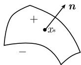
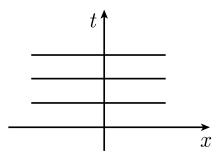
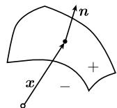

##### 1.13.3 特征的作用

涉及波的物理过程的重要信息从相应的微分方程 (不需要实际地解它们) 可以收集到. 在弱间断性 (高阶导数的跳跃) 与强间断性 (函数本身的跳跃) 之间有一个差别. 弱间断性与特征有关, 并导致 (例如) 下述重要的物理命题:

(i) 电磁波是横波;

(ii) 声波是纵波;

(iii) 弹性波可以是横波, 也可以是纵波.

强间断性相应于气体动力学中的激波和相应的兰金 (W. J. M. Rankine, 1820—1872)—于戈尼奥 (P. H. Hugoniot, 1851—1887) 条件.
跳跃的性态 在 $R^{N+1}$ 中给定曲面

$$
\mathcal {F} \colon \psi (\boldsymbol {x}) = 0,
$$

其中 $\boldsymbol{x}=(x_{1},\cdots,x_{N})$ . 在点 x 处的法向量 n 由

$$
\boldsymbol {n} := \frac {\psi^ {\prime} (\boldsymbol {x})}{| \psi^ {\prime} (\boldsymbol {x}) |}
$$

给出.1)

用关系式

  
图1.163

$$
\boxed {[ u ] (\boldsymbol {x}) := u _ {+} (\boldsymbol {x}) - u _ {-} (\boldsymbol {x})}
$$

来定义跳跃的大小, 其中 $u_{\pm}(\boldsymbol{x}) = \lim_{h \to +0} u(\boldsymbol{x} \pm h \boldsymbol{n})$ (图 1.163).

记号 令

$$
\boldsymbol {x} = (x _ {1}, \dots , x _ {N}), \quad \boldsymbol {u} = (u _ {1}, \dots , u _ {M}) ^ {\mathrm{T}},
$$

$$
\partial_ {j} v := \frac {\partial v}{\partial x _ {j}}, \quad \boldsymbol {b} = (b _ {1}, \dots , b _ {M}) ^ {\mathrm{T}}.
$$

1）确切地，有 $\psi' = (\partial_{1}\psi, \cdots, \partial_{N}\psi)$ 和 $n = (n_{1}, \cdots, n_{N})$ ，其中 $n_{k} = \frac{\partial_{k}\psi(x)}{\left(\sum_{j=1}^{N} |\partial_{j}\psi(x)|^{2}\right)^{1/2}}$ .

为了对高阶偏导数有一个方便的记号, 引进多指标 $\alpha = (\alpha_{1}, \cdots, \alpha_{N})$ 作为诸自然数 $\alpha_{1}, \cdots, \alpha_{N}$ 的一个元素组, 并且记为

$$
\partial^ {\alpha} v := \partial_ {1} ^ {\alpha_ {1}} \partial_ {2} ^ {\alpha_ {2}} \dots \partial_ {N} ^ {\alpha_ {N}} v = \frac {\partial^ {| \alpha |} v}{\partial x _ {1} ^ {\alpha_ {1}} \cdots \partial x _ {N} ^ {\alpha_ {N}}},
$$

其中 $\left|\alpha\right|:=\alpha_{1}+\cdots+\alpha_{N}$ . 类似地, 令

$$
\pmb {\lambda} ^ {\alpha} := \lambda_ {1} ^ {\alpha_ {1}} \lambda_ {2} ^ {\alpha_ {2}} \dots \lambda_ {N} ^ {\alpha_ {N}}, \quad \text {对所有的} \pmb {\lambda} \in \mathbb {R} ^ {N}.
$$

特别地, 若 $\alpha=(0,\cdots,0)$ , 可以得到 $\partial^{\alpha}v:=v$ 和 $\lambda^{\alpha}:=1$ .

1.13.3.1 特征和间断性的传播

拟线性组 考虑初值问题

$$
\boxed { \begin{array}{l} {\sum_ {| \alpha | \leqslant m} \boldsymbol {a} _ {\alpha} (\boldsymbol {x}, \partial \boldsymbol {u}) \partial^ {\alpha} \boldsymbol {u} = b (\boldsymbol {x}, \partial \boldsymbol {u}),} \\ {\partial^ {\beta} \boldsymbol {u} = c _ {\beta}, \quad \text {在曲面} \mathcal {F} \text {上，对所有满足} | \beta | \leqslant m - 1 \text {的} \beta ,} \end{array} }\tag{1.413}
$$

其中诸系数函数 $a_{\alpha}, b$ 和 $c_{\beta}$ 是光滑的. 每个符号 $a_{\alpha}$ 表示一个二次的 $N \times N$ 矩阵. 在 (1.413) 中求和号是对于 $u$ 的所有直到 $m$ 阶的导数而取的, 其中零阶导数被理解为函数 $u$ 本身. 诸系数 $a_{\alpha}$ 和 $b$ 被假设为只包含 $u$ 的直到 $m - 1$ 阶的导数. 一个这种类型的方程组被称为 $m$ 阶拟线性方程组. 如果所有的系数函数 $a_{\alpha}$ 和 $b$ 与 $u$ 无关, 那么事实上这是一个线性组.

令曲面 $\mathcal{F}$ 由方程

$$
\psi (\boldsymbol {x}) = 0\tag{1.414}
$$

所定义, 其中, 对于 F 的所有点, 有 $\psi'(x) \neq 0$ .

象征 对于微分方程 (1.413), 将它与它的象征

$$
\boxed {\mathcal {S} (\boldsymbol {x}, u (\boldsymbol {x}), \boldsymbol {\lambda}) := \det \bigg (\sum_ {| \alpha | = m} \boldsymbol {a} _ {\alpha} (\boldsymbol {x}, \partial u (\boldsymbol {x})) \boldsymbol {\lambda} ^ {\alpha} \bigg), \quad \boldsymbol {\lambda} \in \mathbb {R} ^ {N}}
$$

联系在一起. 如果组 (1.413) 是线性的, 那么象征 $\mathcal{S}(\boldsymbol{x},\lambda)$ 不依赖于 u.

象征 S 包含了有关 (1.413) 的解组的基本信息.

特征 曲面 $\mathcal{F}$ : $\psi(x) = 0$ 称为一个特征, 当且仅当函数 $\psi$ 满足微分方程

$$
\boxed {\mathcal {S} (\boldsymbol {x}, u (\boldsymbol {x}), \psi^ {\prime} (\boldsymbol {x})) = 0.}
$$

一条曲线 $\boldsymbol{x}=\boldsymbol{x}(\sigma)$ 称为特征 $\psi$ 的次特征, 如果 $^{1)}$

$$
\boxed {\boldsymbol {x} ^ {\prime} (\sigma) = \mathcal {S} _ {\lambda} (\boldsymbol {x} (\sigma), u (\boldsymbol {x} (\sigma)), \psi^ {\prime} (\boldsymbol {x} (\sigma))).}
$$

1) 明确地, 有 $x_{k}(\sigma) = \frac{\partial\mathcal{S}}{\partial\lambda_{k}} (x(\sigma), u(x(\sigma)), \psi'(x(\sigma))), k = 1, \cdots, N$ .

物理解释 对于麦克斯韦方程, 次特征相应于光波, 并且特征是这些光波的波前 (参阅 1.13.3.3).

微分方程 $\mathcal{S}(\boldsymbol{x}, u(\boldsymbol{x}), \psi'(\boldsymbol{x})) = 0$ 对 $\psi$ 是一阶的．根据柯西的一个一般结果，可以在函数 $\psi$ 相应于次特征的情形用曲线构成一阶偏微分方程的解曲面（参阅1.13.5.2）.

间断性定理 令 $\pmb{u} = \pmb{u}(\pmb{x})$ 是拟线性组 (1.413) 的一个解, $\pmb{u}$ 及其直到 $(m - 1)^{st}$ 阶导数在 $\mathcal{F}$ 的一个邻域中是连续的. $\pmb{u}$ 在 $\pmb{x}$ 处可能的跳跃服从下述条件.

(i) 运动学相容性条件:

$$
\sum_ {| \alpha | = m} \boldsymbol {a} _ {\alpha} (\boldsymbol {x}, \partial u (\boldsymbol {x})) [ \partial^ {\alpha} u ] (\boldsymbol {x}) = 0.
$$

(ii) 动力学相容性条件:

$$
[ \partial^ {\alpha} u ] ({\pmb x}) = \psi^ {\prime} ({\pmb x}) ^ {\alpha} {\pmb \rho}, \quad \text {对所有满足} | \alpha | = m \text {的} \alpha .
$$

这里 $\rho$ 是 $R^{M}$ 中的一个固定的向量. $\rho \neq 0$ , 如果 $(\psi, u)$ 是在 x 处的特征, 即 $\mathcal{S}(\boldsymbol{x}, u(\boldsymbol{x}), \psi'(\boldsymbol{x})) = 0.$ ^{1)}

初值问题的弱适定性 对于光滑函数 $u, \psi$ ，下述命题是等价的：

(i) u 在 x 处的直到 m 阶的导数由微分方程和 (1.413) 的初值唯一地确定.

(ii) $(\psi, \boldsymbol{u})$ 不是在 x 处的特征, 即 $\mathcal{S}(\boldsymbol{x}, \boldsymbol{u}(\boldsymbol{x}), \psi'(\boldsymbol{x})) \neq 0$ .

1.13.3.2 应用于微分方程的分类

令 $\pmb{u}$ 是拟线性组(1.413)的一个光滑解．下述分类一般地依赖于 $\pmb{u}$ .然而，对于线性组而言，所描述的分类与 $\pmb{u}$ 无关.

固定点 x, 并考虑 $\lambda$ 多项式

$$
\boxed {\mathcal {P} (\boldsymbol {\lambda}) := \mathcal {S} (\boldsymbol {x}, u (\boldsymbol {x}), \boldsymbol {A} \boldsymbol {\lambda}), \quad \boldsymbol {\lambda} \in \mathbb {R} ^ {N},}
$$

其中 A 是一个固定的可逆实 $N \times N$ 矩阵, $\lambda$ 是一个列向量. 对于 A 的一个固定的选择 (如 $A\lambda \equiv \lambda$ ), 必须满足下述条件.

定义 (i) 拟线性组 (1.413) 称为在点 $x$ 处是椭圆的, 如果 $\lambda = 0$ 是 $\mathcal{P}$ 的唯一零点.

(ii) (1.413) 称为在点 x 处是抛物的, 如果多项式 P 是退化的, 即, 它依赖的变量数少于 N.

(iii) (1.413) 称为在点 x 处是严格双曲的, 如果方程

$$
\mathcal {P} (\boldsymbol {\lambda}) = 0, \quad \boldsymbol {\lambda} \in \mathbb {R} ^ {N}
$$

对于每个非零数组 $(\lambda_{1},\cdots,\lambda_{N-1})\in\mathbb{R}^{N-1}$ 恰有 MN 个不同的实解 $\lambda_{N}$ .
定性性态 粗略地说, 有下述事实:

1) 令 $\psi' = (\partial_{1}\psi, \cdots, \partial_{N}\psi)$ 和 $\psi'(x)^{\alpha} = \partial_{1}^{\alpha_{1}}\psi(x)\partial_{2}^{\alpha_{2}}\psi(x)\cdots\partial_{N}^{\alpha_{N}}\psi(x).$

(i) 椭圆问题相应于自然界中的平稳过程. 这种情形不存在特征. 解没有间断.

(ii) 抛物问题相应于流过程 (如热导和热扩散). 这些过程对于时间而言具有磨光效果.

(iii) 双曲问题属于波过程. 这里间断沿着波前的传播对于自然界中输运物理效果是一种重要的机理.

二阶方程的分类 考虑方程

$$
\sum_ {j, k = 1} ^ {n} a _ {j k} \partial_ {j} \partial_ {k} u + \sum_ {j = 1} ^ {n} a _ {j} \partial_ {j} u + a u = f,\tag{1.415}
$$

其中 $\partial_j := \partial / \partial x_j$ ，而 $A = (a_{jk})$ 是一个实对称矩阵。我们的目的是找一个是该方程的解的实函数 $u = u(x)$ 。诸系数 $a_{jk}, a_j$ 和 $a$ 被假设为是实数。相应的象征由

$$
\mathcal {S} (\boldsymbol {\lambda}) := \sum_ {j, k = 1} ^ {n} a _ {j k} \lambda_ {j} \lambda_ {k}
$$

给出, 即 $\mathcal{S}(\boldsymbol{\lambda}) = \boldsymbol{\lambda}^{\mathrm{T}} \boldsymbol{A} \boldsymbol{\lambda}$ . 特征的方程是 $\psi(x) = 0$ . 函数 $\psi$ 满足方程 $\mathcal{S}(\psi'(x)) = 0$ , 即

$$
\sum_ {j, k = 1} ^ {n} a _ {j k} \partial_ {j} \psi \partial_ {k} \psi = 0.
$$

次特征 $\boldsymbol{x}=\boldsymbol{x}(\sigma)$ 的方程是

$$
\boldsymbol {x} ^ {\prime} (\sigma) = 2 \boldsymbol {A} \psi^ {\prime} (\boldsymbol {x} (\sigma)).
$$

定理 (i) 方程 (1.415) 是椭圆的, 当且仅当 $\mathbf{A}$ 的本征值都是正的 (或都是负的).

(ii) 方程 (1.415) 是抛物的, 当且仅当至少 A 有一个本征值为零.

(iii) 方程 (1.415) 是严格双曲的, 当且仅当 A 的一个本征值是正的, 而所有其他本征值是负的 (或者一个为负的, 其他为正的).

例 1: 拉普拉斯方程

$$
\boxed {u _ {x x} + u _ {y y} = 0}
$$

可以写为形式 $\partial_1^2 u + \partial_2^2 u = 0$ 因而其象征为

$$
\mathcal {S} (\boldsymbol {\lambda}) := \lambda_ {1} ^ {2} + \lambda_ {2} ^ {2}, \quad (\lambda_ {1}, \lambda_ {2}) \in \mathbb {R} ^ {2}.
$$

从 $\mathcal{S}(\boldsymbol{\lambda})=0$ 即得 $\lambda=0$ . 因而拉普拉斯方程是椭圆的.

例 2: 热导方程

$$
\boxed {u _ {t} + u _ {x x} = 0}
$$

有象征 $\mathcal{S}(\boldsymbol{\lambda}) = -\lambda_{1}^{2}$ ，因而是退化的，因为它不依赖于 $\lambda_{2}$ 。因而热导方程是抛物的。

特征的方程 $\psi (x,t) = 0$ 由 $\psi_x^2 = 0$ 的解所确定.其解族 $\psi = t +$ 常数相应于直线族

$$
\boxed {t = \text {常数}}
$$

作为特征 (图 1.164(a)).

  
(a) $t =$ 常数

  
(b) $x = \pm ct +$ 常数  
图 1.164 热导方程和弦振动方程的特征

例 3: 弦振动方程

$$
\boxed {\frac {1}{c ^ {2}} u _ {t t} - u _ {x x} = 0}
$$

有象征 $\mathcal{S}(\lambda):=\frac{1}{c^{2}}\lambda_{1}^{2}-\lambda_{2}^{2}$ . 对于每个实数 $\lambda_{1}\neq0$ , 方程 $\mathcal{S}(\lambda)=0$ 有两个实解 $\lambda_{2}$ . 因而弦振动方程是严格双曲的.

特征的方程是 $\psi(x,t)=0$ . 函数 $\psi$ 作为方程

$$
\frac {1}{c ^ {2}} \psi_ {t} ^ {2} - \psi_ {x} ^ {2} = 0
$$

的解而得到. 解族 $\psi = \pm ct - x +$ 常数 相应于特征 (图 1.164(b)):

$$
\boxed {x = \pm c t + \text {常数}.}
$$

注 当传播速度 $c$ 增加时, 这些特征接近热方程的特征 $t =$ 常数. 事实上, 热导方程的初始扰动以任意快的速度被传播. 这个事实与爱因斯坦 (A. Einstein, 1879—1955) 原理相矛盾, 根据这个原理, 物理效应至多以光速传播. 因而必须以狭义相对论来修正热方程.

例 4: 令 $\Delta u := u_{xx} + u_{yy} + u_{zz}$ .

(i) 泊松方程

$$
\Delta u = f
$$

是椭圆的.

(ii) 热导方程

$$
u _ {t} - \alpha \Delta u = f
$$

是抛物的.

(iii) 波动方程

$$
\frac {1}{c ^ {2}} u _ {t t} - \Delta u = f
$$

是严格双曲的. 波动方程的相应于活动波前的特征 $\psi(x, y, z, t) = 0$ 是程函方程

$$
\frac {1}{c ^ {2}} \psi_ {t} ^ {2} - (\mathbf {g r a d} \psi) ^ {2} = 0
$$

的解. 特别地, 对于形如 $\psi = ct - \varphi(x, y, z)$ 的特征, 可以从微分方程

$$
\boldsymbol {x} ^ {\prime} (t) = \operatorname{grad} \varphi (\boldsymbol {x} (t))
$$

得到次特征 $\boldsymbol{x} = \boldsymbol{x}(t)$ . 这些是垂直于波曲面 $\varphi(x, y, z) = \text{常数的曲线}$ . 在 $\varphi(x, y, z) = \alpha x + \beta y + \gamma z + \delta$ 的特殊情形, 特征

$$
\alpha x + \beta y + \gamma z + \delta = c t
$$

相应于在法线方向以速度 c 传播的平面. 次特征是直线, 它们垂直于这些平面.

1.13.3.3 应用于电磁波

考虑麦克斯韦方程的初值问题

$$
\begin{array}{l} {\mathbf {c u r l}   E = - B _ {t}, \quad \mathbf {c u r l}   B = \frac {1}{c ^ {2}} E _ {t},} \\ {E = E _ {0}, \quad B = B _ {0}, \quad \text {在时刻} t = 0,} \end{array}\tag{1.416}
$$

其中 E 和 B 分别为没有电荷和电流时真空中的电场向量和磁场向量, c 表示光在真空中的速度. 假设 $\operatorname{div}E_{0}=0$ 和 $\operatorname{div}B_{0}=0$ . 对于 (1.416) 的解, 这意味着对所有时刻 t 自动地有 $\operatorname{div}E=\operatorname{div}B=0$ .

特征 (1.416) 的特征的方程是 $\psi = 0$ . 函数 $\psi$ 是方程

$$
\left(\frac {1}{c ^ {2}} \psi_ {t} ^ {2} - (\mathbf {g r a d} \psi) ^ {2}\right) \psi_ {t} ^ {4} = 0
$$

的解. 考虑其中 $\varphi$ 满足 $(\operatorname{grad} \varphi)^2 \equiv 1$ 的形如 $\psi(x) = \varphi(x) - ct$ 的解. 那么

$$
\mathcal {F} \colon \varphi (\boldsymbol {x}) - c t = 0
$$

相应于波前沿着单位法向量

$$
\boldsymbol {n} = \operatorname{grad} \varphi (\boldsymbol {x})
$$

方向以速度 c 的传播 (图 1.165). 我们有 $x = x_{1}i +$

图1.165

$x_{2}j + x_{3}k$ 和 $\pmb {n} = n_1\pmb {i} + n_2\pmb {j} + n_3\pmb{k}$

跳跃条件 如果电磁场 E, B 沿着波前 F 是连续的, 那么 E 和 B 在 x 处的一阶导数的可能的跳跃满足关系式 $^{1)}$

$$
\boxed {[ \partial_ {k} \boldsymbol {E} ] = \boldsymbol {a} n _ {k}, \quad [ \partial_ {k} \boldsymbol {B} ] = c ^ {- 1} \boldsymbol {b} n _ {k}, \quad k = 1, 2, 3.}
$$

这里 a 和 b 是满足 $a^{2} + b^{2} \neq 0$ ,

$$
\pmb {a} = \pmb {b} \times \pmb {n} \quad {\text {和}} \quad \pmb {b} = \pmb {n} \times \pmb {a}
$$

的向量. 由于 a 和 b 垂直于波前传播方向 n, 所以说它们是横波.

例：如果一个无线电台于时刻 t = 0 时开始一天的节目, 那么就以下述方式产生了电磁波前: E 和 B 在波前为零, 而在其后不为零.

1) $[f] := f_{+} - f_{-}$ , 其中 $f_{\pm}(\pmb{x}, t) := \lim_{h \to +0} f(\pmb{x} \pm h\pmb{n}, t)$ .

1.13.3.4 应用于弹性波

考虑弹性体的小形变, 即, 具有位置向量 x 的一个点在这个形变中在时刻 t 变为具有位置向量

$$
\boldsymbol {y} = \boldsymbol {x} + \boldsymbol {u} (\boldsymbol {x}, t)
$$

的点. 主导线性弹性理论的方程是 $^{1)}$

$$
\boxed {\rho \boldsymbol {u} _ {t t} = \kappa \Delta \boldsymbol {u} + (\lambda + \kappa) \mathbf {g r a d} \operatorname{div} \boldsymbol {u}.}
$$

这里 $\rho$ 是弹性体的常数密度, $\kappa$ 和 $\lambda$ 表示拉梅 (G. Lamé, 1795—1870) 物质常量. 特征 方程 (1, 2) $^{3}$ (1, 2)

$$
\left(\frac {1}{c _ {\mathrm{tr}} ^ {2}} \psi_ {t} ^ {2} - (\mathbf {g r a d} \psi) ^ {2}\right) ^ {2} \left(\frac {1}{c _ {1} ^ {2}} \psi_ {t} ^ {2} - (\mathbf {g r a d} \psi) ^ {2}\right) = 0\tag{1.417}
$$

的解 $\psi$ 导致了特征 $\mathcal{F}\colon \psi (\pmb {x},t) = 0,$ 其中

$$
c _ {\mathrm{tr}} := \sqrt {\frac {\kappa}{\rho}}, \quad c _ {1} := \sqrt {\frac {\lambda + 2 \kappa}{\rho}}.
$$

横波 令 $\varphi$ 是一个满足 $(\operatorname{grad} \varphi)^2 \equiv 1$ 的函数. 那么函数

$$
\psi := c _ {\mathrm{tr}} t - \varphi (\boldsymbol {x})
$$

是 (1.417) 的一个解, 这里 $\mathcal{F}$ 相应于一个曲面, 它沿着自身的法向量 $n := \operatorname{grad} \varphi(x)$ 方向以速度 $c_{\mathrm{tr}}$ 移动 (图 1.165). 在波前的点 $x$ 处、在时刻 $t$ 时 $u$ 的二阶导数的间断性条件为

$$
\boxed {[ \partial_ {j} \partial_ {k} \boldsymbol {u} ] = \boldsymbol {a} n _ {j} n _ {k}, \quad j, k = 1, 2, 3.}
$$

向量 $a \neq 0$ 垂直于 n. 所以说这是一个横波.

纵波 如果用 $c_{1}$ 代替 $c_{tr}$ ，那么得到相同的结果，但现在向量 a 平行于 n，即有一个纵波.

1.13.3.5 应用于声波

可压缩流体的运动 (无内摩擦) 方程是

$$
\boxed { \begin{array}{r l} {\rho \boldsymbol {v} _ {t} + \rho (\boldsymbol {v} \operatorname{grad}) \boldsymbol {v} = \boldsymbol {f} - \operatorname{grad} p} & {(\text {运动方程}),} \\ {\rho_ {t} + \operatorname{div} (\rho \boldsymbol {v}) = 0} & {(\text {质量守恒}),} \\ {p = p (\rho)} & {(\text {状态绝热方程}). ^ {2})} \end{array} }
$$

这里的记号如下： $v(x,t)$ 是流体粒子在时刻 t、在点 x 处的速度， $\rho(x,t)$ 是流体在时刻 t、在点 x 处的密度，f 是外力的密度，p 是压力.

令 $\psi_t(x,t) < 0$ 方程

$$
\mathcal {F} \colon \psi_ {t} (\boldsymbol {x}, t) = 0
$$

1) 非线性弹性理论的一般方程可在 [212] 中找到.

2) 如果我们引进密度 $\rho$ 和比熵密度 $s$ , 那么从满足 $s =$ 常数 (绝热过程) 的 $p = p(\rho, s)$ 得到狄拉克密度关系式 $p = p(\rho)$ . 这些考虑对于气体仍然成立 (参阅 1.13.3.6).

描述了 $\mathbb{R}^3$ 中一曲面在时刻 $t$ 、在点 $\pmb{x}$ 处沿自身的单位法向量 $\pmb{n}$ 的方向速度为 $c$ 的运动.我们有

$$
c = - \frac {\psi_ {t} (\boldsymbol {x} , t)}{| \mathbf {g r a d} \psi |}, \quad \boldsymbol {n} = \frac {\mathbf {g r a d} \psi}{| \mathbf {g r a d} \psi |}.
$$

在曲面的点 x 处的流体粒子在时刻 t 有速度向量 v, 它的法分量为 vn. 对于在波前与粒子间的相对速度 c - vn, 我们得到

$$
c - \pmb {v} \pmb {n} = - \frac {1}{| \mathbf {g r a d} \psi |} D _ {t} \psi ,
$$

其中 $D_{t}\psi := \psi_{t} + v \operatorname{grad} \psi.$

特征方程

$$
\left(D _ {t} \psi\right) ^ {2} \left(\frac {1}{c _ {\mathrm{S}} ^ {2}} \left(D _ {t} \psi\right) ^ {2} - \left(\mathbf {g r a d} \psi\right) ^ {2}\right) = 0,\tag{1.418}
$$

其中已经令

$$
c _ {\mathrm{S}} := \sqrt {p ^ {\prime} (\rho)}.
$$

声波 如果 $\psi$ 是方程

$$
\frac {1}{c _ {\mathrm{S}} ^ {2}} (D _ {t} \psi) ^ {2} - (\mathbf {g r a d} \psi) ^ {2} = 0
$$

的解, 那么 (1.418) 被满足. 对于相对速度, 可以得到

$$
c - \boldsymbol {v} \boldsymbol {n} = c _ {\mathrm{S}}.
$$

量 $c_{S}$ 被称为声速. v 和 $\rho$ 在时刻 t、在点 x 处一阶导数的间断性条件为

$$
\boxed {[ \partial_ {j} \boldsymbol {v} ] = \boldsymbol {a} n _ {j}, [ \partial_ {j} \rho ] = b n _ {j},}
$$

其中 $a = bc_{S}\rho^{-1}n$ ，且 $a^{2} + b^{2} \neq 0$ 。由于跳跃向量 a 平行于曲面法向量 n，所以有一个纵波。

1.13.3.6 气体动力学中的激波

气体 (无摩擦、无热导) 的运动方程是

$$
\boxed { \begin{array}{c c} (\rho \boldsymbol {v}) _ {t} + \operatorname{div} (\rho \boldsymbol {v} \otimes \boldsymbol {v} + p I) = \boldsymbol {f} & \text {(动量守恒),} ^ {1)} \\ \rho_ {t} + \operatorname{div} (\rho \boldsymbol {v}) = 0 & \text {(质量守恒)}, \\ \epsilon_ {t} + \operatorname{div} (\epsilon \boldsymbol {v} + p \boldsymbol {v}) = \boldsymbol {f v} & \text {(能量守恒)}, \\ (\rho s) _ {t} + \operatorname{div} (\rho s \boldsymbol {v}) \geqslant 0 & \text {(熵方程)}. \end{array} }\tag{1.419}
$$

1) 这里的张量积被认同于一个线性算子, 它由关系式

$$
(\boldsymbol {a} \otimes \boldsymbol {b}) \boldsymbol {c} := \boldsymbol {a} (\boldsymbol {b c}), \quad \text {对所有的向量} \boldsymbol {c}
$$

所定义. 在老文献中人们用记号 $(\pmb{a} \circ \pmb{b})\pmb{c} = \pmb{a}(\pmb{b}\pmb{c})$ ，并称其为二元积. $\operatorname{div}(\pmb{a} \otimes \pmb{b})$ 的含义由高斯积分公式

$$
\int_ {G} \operatorname{div} (\boldsymbol {a} \otimes \boldsymbol {b}) \mathrm{d} \boldsymbol {x} = \int_ {\partial G} (\boldsymbol {a} \otimes \boldsymbol {b}) \boldsymbol {n} \mathrm{d} S
$$

给出, 其中 n 是外法向量. 在具有基向量 $e_{1}, e_{2}, e_{3}$ 的笛卡儿坐标系中, 有下述用分量的表示:

$$
\operatorname{div} (\boldsymbol {a} \otimes \boldsymbol {b}) = \sum_ {j = 1} ^ {3} \operatorname{div} (a _ {j} \boldsymbol {b}) \boldsymbol {e} _ {j} = \sum_ {j, k = 1} ^ {3} \partial_ {k} (a _ {j} b _ {k}) \boldsymbol {e} _ {j}.
$$

由于质量守恒 $\rho_{t} + \mathrm{div}(\rho\boldsymbol{v}) = 0$ ，动量守恒 (1.419) 即等价于运动方程

$$
\rho \boldsymbol {v} _ {t} + \rho (\boldsymbol {v} \operatorname{grad}) \boldsymbol {v} = \boldsymbol {f} - \operatorname{grad} p.
$$

除此以外还有热力学关系式

$$
\begin{array}{l} {{p = p (\rho , T), \quad e = e (\rho , T), \quad s = s (\rho , T),}} \\ {{\mathrm{d} e = T \mathrm{d} s + p \frac {\mathrm{d} \rho}{\rho^ {2}} \quad (\text {吉布斯方程}).}} \end{array}
$$

与液体的情形不一样, 在处理气体时必须考虑热力学的影响.

记号如下： $\pmb{v}$ 是速度向量， $p$ 是压力， $T$ 是绝对温度， $\rho$ 是密度， $\pmb{f}$ 是外力密度， $e$ 是比内能密度（单位质量的内能）， $s$ 是比熵密度。此外，

$$
\epsilon := \frac {1}{2} \rho \pmb {v} ^ {2} + \rho e
$$

是总能量密度.

例：在理想气体的特殊情形, 在温度不是太低的条件下, 有

$$
p = r \rho T, e = c T, s = c \ln (T \rho^ {1 - \gamma}), \gamma = 1 + r / c,\tag{1.420}
$$

其中 r 是气体常数, c 是比热容.

兰金-于戈尼奥间断性条件 给定一个活动曲面

$$
\mathcal {F} \colon \varphi (\boldsymbol {x}) - t = 0,\tag{1.421}
$$

它不必是一特征. 对于物理量在曲面上的点 x 处在时刻 t 的可能的跳跃, 有 $^{1)}$

$$
\boxed { \begin{array}{l} - [ \rho \boldsymbol {v} ] + [ \rho \boldsymbol {v} \otimes \boldsymbol {v} + p I ] \varphi^ {\prime} (\boldsymbol {x}) = \mathbf {0}, \\ - [ \rho ] + [ \rho \boldsymbol {v} ] \varphi^ {\prime} (\boldsymbol {x}) = 0, \\ - [ \epsilon ] + [ \epsilon \boldsymbol {v} + p \boldsymbol {v} ] \varphi^ {\prime} (\boldsymbol {x}) = 0, \\ - [ \rho s ] + [ \rho s \boldsymbol {v} ] \varphi^ {\prime} (\boldsymbol {x}) \geqslant 0. \end{array} }\tag{1.422}
$$

如果这种类型的间断性出现, 那么用 $\mathcal{F}$ 表示一个激波. 例如, 超音速飞机产生激波. 气体动力学中方程的理论的和数值的处理经常由于激波的出现而变得复杂. 这些数学问题在设计具有最小燃料消耗的现代飞机结构中极为重要.

对于守恒律的激波 考虑方程

$$
\boxed {\mu_ {t} + \operatorname{div} \boldsymbol {j} = g.}\tag{1.423}
$$

如果这个方程的解 $\mu$ 和 j 在 (1.421) 中曲面 F 上的一点 x 处有跳跃, 则有

1) 令 $\varphi' = \mathbf{grad} \varphi$ 和

$$
[ f ] = f _ {+} - f _ {-}, \quad \text {其中} f _ {\pm} := \lim _ {h \to + 0} f (\pmb {x} \pm h \pmb {n}).
$$

这里 $\boldsymbol{n} := \varphi'(\boldsymbol{x}) / |\varphi'(\boldsymbol{x})|$ 是曲面 F 在点 x 处的单位法向量 (参阅图 1.165). 此外, 有

$$
[ \rho \pmb {v} \otimes \pmb {v} + p I ] \varphi^ {\prime} (\pmb {x}) = [ \rho \pmb {v} (\pmb {v} \varphi^ {\prime} (\pmb {x})) ] + [ p ] \varphi^ {\prime} (\pmb {x}).
$$

$$
\boxed {- [ \mu ] + [ j ] \varphi^ {\prime} (\boldsymbol {x}) = 0.}\tag{1.424}
$$

在 (1.424) 的推导中假设了方程 (1.423) 在广义函数的意义下被满足 (参阅 [212]).

因为气体动力学大基本方程 (1.419) 具有守恒律的形式, 所以关于跳跃的诸关系式 (1.422) 从 (1.424) 即得.

气体中的声波 声音的传播是一个进行得如此快的过程, 以致其中的体积单元不能与另一个交换任何热量. 因而比熵密度 s 保持为常数. 从 s 为常数的 (1.420) 可以得到关系式

$$
T = \mathrm{常数} \cdot \rho^ {\gamma - 1}, e = c T
$$

以及状态绝热方程

$$
\boxed {p = \text {常数} \cdot \rho^ {\gamma}.}
$$

类似于 1.13.3.5 中那样, 从关系式 $c_{\mathrm{S}} = \sqrt{p'(\rho)}$ 得到声速 $c_{S}$ , 因而

$$
\boxed {c _ {\mathrm{S}} = \sqrt {\gamma p / \rho}.}
$$

对于构成我们的大气的混合气体, 实验产生了值 $\gamma \sim 1.4$ .
