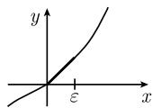

##### 1.14.1 基本思想

分析中的局部-整体原理 $^{2)}$ 复变函数论的优美是以下面3个基本事实为基础的：

(i) 开集上的每个可微复值函数都能局部地展开成幂级数, 即, 它是解析的.

(ii) 单连通区域中的解析函数的围道积分与积分路径无关.

(iii) 在一个点的某个邻域内解析的局部给定的每个函数, 可以唯一扩充成整体

解析的函数, 如果把黎曼面的概念用作扩张的定义域. 因此有

$$
\text {一个解析函数的局部行为唯一决定了它的整体行为.}\tag{1.451}
$$

一般地, 实值函数不具备这种严格行为.

例 1: 可以用无数种方式把 $x \in [0, \varepsilon]$ 时的实值函数 $f(x) := x$ 延拓成可微函数 (图 1.167). 看作复值函数时这个函数的唯一扩张是解析函数

$$
f (z) = z, \qquad z \in \mathbb {C}.\tag{1.452}
$$

  
(a)

  
(b)

  
(c)  
图1.167 平面上的非解析函数

例 2: 图 1.167(b), (c) 中描述的可微函数不能延拓成复数域上的解析函数. 这是因为它们局部地与函数 (1.452) 一样, 但是整体上不一样.

原理 (1.451) 在物理中十分重要. 如果知道一个物理量是解析的, 那么只需要知道它在一个小的开集中的表现, 就能理解 (或至少确定) 它的整体行为. 例如, S 矩阵的元素就是这种情形, S 矩阵描述了现代粒子加速器中基本粒子的散射. 由此事实就得到了所谓的色散关系.
