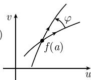
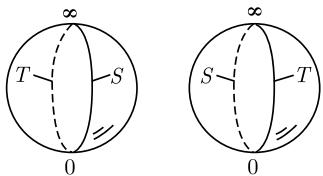

##### 1.14.11 共形映射的例子

为了从几何上解释全纯函数 $f: U \subseteq C \rightarrow C$ 的性质, 我们把

$$
\boxed {w = f (z)}
$$

看成是一个映射, 它把 z 平面的每个点 z 与 w 平面的点 w 联系起来.

共形映射 由 $f$ 定义的映射称为在点 $z = a$ 处是保角的或共形的, 如果在这个映射下, 过点 $a$ 的两条 $C^1$ 曲线的夹角 (包括方向) 保持不变 (图 1.180).

  
(a) $z$ 平面

  
(b) $w$ 平面  
图 1.180 共形映射

一个映射称为是保角的或共形的, 如果在定义域的每个点处它都是如此的.

定理 定义在点 $a$ 的某个邻域 $U$ 上的全纯函数 $f: U \subseteq \mathbb{C} \to \mathbb{C}$ 确定了一个在点 $a$ 处的共形映射, 当且仅当 $f'(a) \neq 0$ .

每个双全纯映射 $f: U \rightarrow V$ 是共形的.

1.14.11.1 相似变换群

令 a, b 为固定复数, 且 $a \neq 0$ . 那么

$$
\boxed {w = a z + b \quad \text {对所有} z \in \mathbb {C}}\tag{1.469}
$$

确定了一个从复平面 $\mathbb{C}$ 映到自身的双全纯 (因而是共形的) 映射 $w: \mathbb{C} \to \mathbb{C}$ . 例1：对于 $a = 1$ ，映射(1.469)是平移变换.

从 1907 年开始, 深刻的庞加莱和克贝单值化定理以如下方式推广了黎曼映射定理: 每个单连通黎曼面恰可以被双全纯地映射到下列情形之一: 单位圆的内部, 复平面本身, 或者是闭的复平面 $\overline{C}$ (黎曼球面), 可见 1.14.11.3. 这个推广的详细情况可见 [212].

例 2: 令 $z = r e^{i \varphi}$ . 如果 b = 0, $a = |a| e^{i \alpha}$ , 则有

$$
w = | a | r \mathrm{e} ^ {\mathrm{i} (\varphi + \alpha)}.
$$

因而, 映射 $w = az$ 是角度旋转了 $\alpha$ , 同时长度乘以 $|a|$ 的一个旋转.

当 b=0, a>0 时, 得到正常相似变换(长度乘以 a).

所有变换 (1.469) 构成的集合形成从复平面 $\mathbb{C}$ 映射到自身的保定向的相似变换群.

1.14.11.2 单位圆上的反演

映射

$$
\boxed {w = \frac {1}{z} \quad \text {对所有满足} z \neq 0 \text {的} z \in \mathbb {C}}
$$

  
图1.181

是双全纯的, 因而是从有孔复平面 $C - \{0\}$ 到自身的共形映射. 如果令 $z = r e^{i \varphi}$ , 则有

$$
w = \frac {1}{r} \mathrm{e} ^ {- \mathrm{i} \varphi}.
$$

由于 $|w| = \frac{1}{|z|}$ , 所以通过点 $z$ 关于单位圆周的反射点, 同时关于实轴的反射, 就得到了点 $w$ (图 1.181).

1.14.11.3 复平面的闭包

令

$$
\boxed {\overline {{\mathbb {C}}} := \mathbb {C} \cup \{\infty \}}
$$

即, 我们把点 $\infty$ 加到复平面 $\mathbb{C}$ 上, 称 $\overline{\mathbb{C}}$ 为完备的复平面. 对于复流形的构造, 下述构造是有代表性的. 我们的目的是给出 $\overline{\mathbb{C}}$ 上的局部坐标.

局部坐标的定义 (i) 对每个点 $a \in \mathbb{C}$ , 我们把邻域 $U := \mathbb{C}$ 作为邻域, 对于 $z \in \mathbb{C}$ , 其坐标为 $\zeta := z$ .

(ii) 我们把 $V := \overline{C} - \{0\}$ ，取作点 $\infty$ 的邻域，其局部坐标是

$$
\zeta^ {\prime} := \left\{ \begin{array}{l l} { \frac {1}{z},} & {\text {对满足} z \neq 0 \text {的} z \in \mathbb {C},} \\ {0,} & {\text {对} z = \infty .} \end{array} \right.
$$

这样, 对每个点 $z \in \overline{\mathbb{C}} - \{0\}$ , 我们有两个不同的局部坐标 $\zeta = z$ 和 $\zeta' = 1/z$ , 这两个局部坐标满足关系式 $\zeta = 1/\zeta'$ . 点 0 只有局部坐标 $\zeta = 0$ , 而点 $\infty$ 的局部坐标 $\zeta' = 0$ . 这样, 我们得到了记号 $0 = 1/\infty$ 的一个严格表达式.

完备复平面的映射 通过过渡到局部坐标定义了映射

$$
\boxed {f: U \subseteq \overline {{\mathbb {C}}} \to \overline {{\mathbb {C}}}}
$$

的性质. 例如, $f$ 是全纯的, 当且仅当, 过渡到局部坐标它也是全纯的.

例 1: 令 $n = 1, 2, \cdots$ . 映射

$$
f (z) = {\left\{ \begin{array}{l l} {z ^ {n}, \qquad {\text {对}} z \in \mathbb {C},} \\ {\infty , \qquad {\text {对}} z = \infty} \end{array} \right.}
$$

是一个全纯映射 $f: \overline{C} \rightarrow \overline{C}$ .

证明：首先，f 显然在开集 $U := C$ 上全纯. 把方程

$$
w = f (z), \qquad z \in \overline {{\mathbb {C}}} - \{0 \}
$$

变换到局部坐标 $\zeta = \frac{1}{z}$ , $\mu = \frac{1}{w}$ , 得到 $\frac{1}{\mu} = \frac{1}{\zeta^n}$ , 因而, 在另一个开集 $V$ 上, 有

$$
\boxed {\mu = \zeta^ {n}.}\tag{1.470}
$$

这是 $\mathbb{C}$ 上的一个全纯函数. 因而, 由定义, $f$ 在 $V = \overline{\mathbb{C}} - \{0\}$ 上是全纯的. $\square$

根据方程 (1.470), 在局部坐标里有一个 $n$ 阶零点. 因为 $\zeta = 0$ 对应着点 $z = \infty$ , 并且 $f(\infty) = \infty$ , 所以我们说 $f$ 在 $\infty$ 处有一个 $n$ 阶无穷 (极点).

例 2: 映射

$$
f (z) = {\left\{ \begin{array}{l l} {z,} & {\quad {\text {对}} z \in \mathbb {C},} \\ {\infty ,} & {\quad {\text {对}} z = \infty} \end{array} \right.}
$$

是一个双全纯映射 $f: \overline{C} \rightarrow \overline{C}$ .

证明：由例1知， $f$ 是全纯的．此外， $f:\overline{\mathbb{C}}\to \overline{\mathbb{C}}$ 是一一映射，且 $f^{-1} = f$ ，因而得到，正如我们所要证明的， $f^{-1}:\overline{\mathbb{C}}\rightarrow \overline{\mathbb{C}}$ 是全纯的.

例 3: 如果 $w = p(z)$ 是 n 次多项式, 且如果令 $p(\infty) := \infty$ , 则 $p : \overline{C} \to \overline{C}$ 是一个全纯函数, 且在点 $z = \infty$ 处有一个 n 阶极点.

例 4: 令 $n = 1, 2, \cdots$ . 令

$$
f (z) = {\left\{ \begin{array}{l l} {{\frac {1}{z ^ {n}},}} & {{\quad {\text {对所有满足}} z \neq 0 {\text {的}} z \in \mathbb {C},}} \\ {{\infty ,}} & {{\quad {\text {对}} z = 0,}} \\ {{0,}} & {{\quad {\text {对}} z = \infty ,}} \end{array} \right.}
$$

则 $f: \overline{\mathbb{C}} \to \overline{\mathbb{C}}$ 是全纯映射, 且在点 $z = 0$ 处有一个 $n$ 阶极点, 在点 $z = \infty$ 处有一个 $n$ 阶零点.

对于 $n = 1, f: \overline{\mathbb{C}} \to \overline{\mathbb{C}}$ 是双全纯的.

证明：为了在 $z = 0$ 的某个邻域内研究 $w = f(z)$ ，利用局部坐标 $w = 1 / \mu$ 和 $\zeta = z$ 。由此形成的函数

$$
\mu = \zeta^ {n}
$$

在 $\zeta = 0$ 的某个邻域内是全纯的, 且有一个 $n$ 阶零点. 因而, $f$ 在 $z = 0$ 处有一个 $n$ 阶极点.

邻域 令给定 $\varepsilon > 0$ . 对每个点 $p \in \overline{\mathbb{C}}$ , 我们定义它的 $\varepsilon$ 邻域为

$$
U _ {\varepsilon} (p) := \{z \in \mathbb {C}: | z - p | <   \varepsilon \}, \quad \text {当} p \in \mathbb {C} \text {时},
$$

并令 $U_{\varepsilon}(\infty)$ 为所有满足 $|z| > \varepsilon^{-1}$ 的复数 z 及点 $\infty$ 构成的集合.

开集 完备复数球面 $\overline{\mathbb{C}}$ 的子集合 $U$ 称为开集, 如果对此集合中的每个点, $U$ 至少包含那个点的一个 $\varepsilon$ 邻域.

注 (i) 借助于这些开集, 我们可以给完备复数球面 $\overline{\mathbb{C}}$ 一个拓扑空间结构, 这样对它就可以应用拓扑空间的所有概念 (参看 [212]). 特别地, $\overline{\mathbb{C}}$ 为紧集, 连通集.

(ii) 对于我们已经引入的局部坐标, 空间 $\overline{C}$ 变成了一维复流形, 因此对它可以应用复流形的所有概念 (参看 [212]).

(iii) 由定义, 一维复流形是黎曼面. 因而 $\overline{\mathbb{C}}$ 也是一个紧黎曼面.

19 世纪中期, 黎曼研究黎曼面的直观概念 (参看 1.14.11.6). 在历史上, 对 “黎曼面” 的概念从数学上进行严格化的努力, 为拓扑学和流形理论的发展作出了巨大贡献. 在这个方向上作出的决定性一步是 H. 外尔(Hermann Weyl) 出版于 1913 年的著作《黎曼面的思想》.

1.14.11.4 黎曼球面

令 $(x,y,\zeta)$ 是给定的笛卡儿坐标系. 球面

$$
S ^ {2} := \{(x, y, \zeta) \in \mathbb {R} ^ {3} | x ^ {2} + y ^ {2} + \zeta^ {2} = 1 \}
$$

  
图1.182

称为黎曼球面. 令 N 表示北极, 即, 坐标为 $(0, 0, 1)$ 的点. 球极平面投影

$$
\boxed {\varphi : S ^ {2} - \{N \} \to \mathbb {C}}
$$

的定义是, 把 $S^2 - \{N\}$ 的给定点 $P$ 映射为连接 $N$ 和 $P$ 的直线 $NP$ 与 $(x, y)$ 平面的交点 $z = \varphi(P)$ (图1.182展示了 $S^2$ 与 $(x, \zeta)$ 平面的交点). 把 $N$ 映射到点 $\infty$ , 就可以把这一映射扩充为 $\varphi: S^2 \to \overline{\mathbb{C}}$ .

例： $S^{2}$ 的南极 $S(\text{坐标是 } (0, 0, -1))$ 被 $\varphi$ 映射到复平面 C 的原点，而 $(S^{2}$ 的) 赤道被映射到单位圆周.

定理 映射 $\varphi: S^{2} \rightarrow \overline{C}$ 是同胚映射, 即, 它把 $S^{2} - \{N\}$ 共形地映射到 C.

推论 如果我们把局部坐标从 $\overline{C}$ 变换到 $S^{2}$ ，那么黎曼球面 $S^{2}$ 成为一维复流形，且映射 $\varphi: S^{2} \rightarrow \overline{C}$ 是双全纯的。更确切地说， $S^{2}$ 是紧的黎曼面。

1.14.11.5 默比乌斯变换群

定义 所有双全纯映射 $f: \overline{\mathbb{C}} \to \overline{\mathbb{C}}$ 的集合形成一个群, 称为 $\overline{\mathbb{C}}$ 的自同构群 $\operatorname{Aut} (\overline{\mathbb{C}})^{1)}$

$\bar{\mathbb{C}}$ 上的共形几何学 群 $\operatorname{Aut}(\overline{\mathbb{C}})$ 确定了完备平面 $\overline{\mathbb{C}}$ 上的共形对称的概念. 如果某个性质在群 $\operatorname{Aut}(\overline{\mathbb{C}})$ 的所有变换下保持不变, 那么由定义, 这个性质属于 $\overline{\mathbb{C}}$ 的共形几何学.

例 1: $\overline{C}$ 上的一个广义圆是, C 中的一个圆 (在 $\overline{C}$ 中的象) 或 C 中一条具有点 $\infty$ 的直线.

Aut ( $\overline{C}$ ) 的元素把广义圆映射到广义圆.

默比乌斯变换 如果 a, b, c, d 是复数, 且 $ad - bc \neq 0$ , 那么变换

$$
\boxed {f (z) := \frac {a z + b}{c z + d}}\tag{1.471}
$$

称为默比乌斯变换, 其中我们约定:

(i) 对于 c=0, 令 $f(\infty):=\infty$ .

(ii) 对于 $c \neq 0$ ，令 $f(\infty) := a/c$ ，且 $f(-d/c) := \infty$ .

默比乌斯(August Ferdinand Möbius, 1790-1868) 首先研究了这些变换.

定理 1 $\overline{C}$ 的自同构群 Aut ( $\overline{C}$ ) 恰由默比乌斯变换构成.

例 2: 把上半平面 $H_{+} := \{ z \in C | Im z > 0 \}$ 共形 (保角) 映射到自身的默比乌斯变换, 是形如 (1.471) 那些的变换, 其中 a, b, c, d 是实数, 且 ad - bc > 0.

例 3: 把上半平面共形映射到单位圆盘 (单位圆周的内部) 的默比乌斯变换, 是形如

$$
a \frac {z - p}{z - \overline {{p}}}
$$

那些的变换, 其中 a, p 为复数, 且 $|a| = 1$ , $\operatorname{Im} p > 0$ .

例 4: 把单位圆盘的内部共形映射到自身的所有默比乌斯变换, 是由

$$
a \frac {z - p}{\overline {{p}} z - 1}
$$

给出的所有映射, 其中 a, p 为复数, 且 $|a| = 1$ , $|p| < 1$ .

默比乌斯变换的性质 对于一个默比乌斯变换 f, 有

(i) $f$ 可以是由平移, 旋转, 正常的相似变换及关于单位圆周的反演复合而成. 反之, 每个这样的映射的复合是默比乌斯变换.

(ii) f 是共形的, 把广义圆映到广义圆.

(iii) f 保持 $\overline{C}$ 中四个点的交比

$$
\frac {z _ {4} - z _ {3}}{z _ {4} - z _ {2}}: \frac {z _ {1} - z _ {3}}{z _ {1} - z _ {2}}
$$

不变. $^{1)}$

(iv) 每个不是恒等变换的默比乌斯变换至少有一个、至多有两个不动点(满足 $f(P)=P$ 的点 P).

令 $GL(2,\mathbb{C})$ 表示所有 $2\times2$ 阶复的可逆矩阵的群. 此外, 令 D 表示 $GL(2,\mathbb{C})$ 中所有形如 $\lambda I(\lambda\neq0)$ 的矩阵构成的子群 $^{2)}$ (这里, I 表示单位矩阵 $I=\begin{pmatrix}1&0\\0&1\end{pmatrix}$ ). 定理 2 形如

$$
\left( \begin{array}{c c} a & b \\ c & d \end{array} \right) \mapsto \frac {a z + b}{c z + d}
$$

的映射是从 $GL(2,\mathbb{C})$ 到 Aut ( $\overline{C}$ ) 的群同态 $^{3)}$ ，其核为 D。因而有一个群同构（一一群同态）

$$
G L (2, \mathbb {C}) / D \cong \operatorname{Aut} (\overline {{\mathbb {C}}}),
$$

即, Aut ( $\overline{C}$ ) 同构于复射影群 $PGL(2,\mathbb{C})$ .

1.14.11.6 平方根的黎曼面

黎曼的天才思想是考虑定义在复平面 $\mathbb{C}$ 上的多值复函数 (比如 $z = \sqrt{w}$ ), 通过把定义域变成比 $\mathbb{C}$ 更复杂的对象 $D$ , 从而使函数成为单值的. 在一些简单的情况中, 沿某些线段切割几个复平面, 然后沿这些割线把它们粘起来就得到 $D$ . 这导致黎曼面概念的产生.

映射 $w = z^2$ 令 $z = r\mathrm{e}^{\mathrm{i}\varphi}, - \pi <  \varphi \leqslant \pi ,$ 则有

$$
\boxed {w = r ^ {2} \mathrm{e} ^ {2 \mathrm{i} \varphi}.}
$$

映射 $w = z^{2}$ 把点 z 到原点的距离 r 自乘, 并把 z 的辐角 $\varphi$ 加倍.

为了更准确地研究 $w = z^2$ ，我们考虑 $z$ 平面上以原点为圆心、半径为 $r$ 的圆周 $C$ ，其中 $C$ 的方向是数学上的正定向。如果在 $z$ 平面中绕 $C$ 一圈，那么在 $w$ 平面中的象是绕原点两次的 $r^2$ 为半径的圆周。

为了便于研究逆映射 $z = \sqrt{w}$ , 我们沿负实轴切割两个 $w$ 平面是有好处的 (图1.183).

(a) $z$ 平面  
  
(b) 两个 $w$ 平面  
图1.183 $z = \sqrt{w}$ 的黎曼面

(i) 在 $z$ 平面中如果我们沿着 $C$ 从点 $z = r$ 到点 $z = \mathrm{i}r$ , 那么象点在第一个 $w$ 平面上, 或者说沿着黎曼面的第一片, 从点 $r^2$ 跑到了点 $-r^2$ .

(ii) 我们继续沿着 $C$ 从点 $\mathrm{i}r$ 到点 $-\mathrm{i}r$ . 则象点在黎曼面的第二片从点 $-r^2$ 经过点 $r^2$ 到点 $-r^2$ .

(iii) 最后如果我们沿 $C$ 从点 $-\mathrm{i}r$ 到点 $r$ , 那么象点沿着黎曼面的第一片从点 $-r^2$ 到点 $r^2$ .

逆映射 $z = \sqrt{w}$ 重要的观察结果是

对两片 $w$ 平面任一片上的每个点 $w \neq 0$ , 恰有 $z$ 平面上的一个点 $z$ 使得 $w = z^2$ .

这个结果使得两片 $w$ 平面的并集上的函数 $z = \sqrt{w}$ 是唯一定义的 (单值的). 对于满足 $-\pi < \psi \leqslant \pi$ 的点 $w = Re^{\mathrm{i}\psi}$ , 显然有

$$
\sqrt {w} := \left\{ \begin{array}{c} \sqrt {R} \mathrm{e} ^ {\mathrm{i} \psi / 2}, \\ - \sqrt {R} \mathrm{e} ^ {\mathrm{i} \psi / 2}, \end{array} \right.
$$

这里 $\sqrt{R} \geqslant 0$ . 第一片上的 $\sqrt{w}$ 值称为 $\sqrt{w}$ 的主值, 记作 $+\sqrt{w}$ .

$z = \sqrt{w}$ 的直观黎曼面 $\mathcal{F}$ 如果我们把两片如图 1.183(b) 中所示粘起来 (即, $T$ 与 $T, S$ 与 $S$ ), 那么就得到了 $z = \sqrt{w}$ 的直观黎曼面 $\mathcal{F}$ .

黎曼面 $\mathcal{F}$ 的拓扑型 如果用两个黎曼球面代替两个 $w$ 平面, 那么情况就变得容易理解: 沿着从南极到北极的一条曲线切割两个黎曼球面, 然后如图 1.184 所示把它们粘起来. 这样得到的物体可以像吹气球一样把它鼓成一个球面. 这样, $\mathcal{F}$ 即同胚于一个球面, 因而也同胚于黎曼球面.

二值函数 $z = \sqrt{w}$ 的直观黎曼面 $\mathcal{F}$ 同胚于黎曼球面.

可以类似地处理映射 $w = z^{n}, n = 3, 4, \cdots$ 。这时要求用 n 个 w 平面来得到函数两个 $z = \sqrt[n]{w}$ 的直观黎曼面。

  
图 1.184 两 “片” 黎曼面

注 对某些简单的情况而言, 用纸、剪刀和胶水来表现黎曼面具有启发意义, 而且直观. 然而, 这个方法对较复杂的函数就受到了局限. 对任意一个解析函数, 从数学上构造一个令人满意的黎曼面可见 [212].

1.14.11.7 对数的黎曼面

方程

$$
\boxed {w = \mathrm{e} ^ {z}}
$$

有一个多值的反函数, 记作 $z = \mathrm{Ln}w$ . 为了描述这个函数, 对每个整数 $k$ , 我们选取一个 $w$ 平面 $B_{k}$ , 然后沿着负实轴切割平面. 当 $w = R\mathrm{e}^{\mathrm{i}\psi}, -\pi < \psi \leqslant \pi$ , 且 $w \neq 0$ 时, 令

$$
\left| \mathrm{Ln} w := \ln R + \mathrm{i} \psi + 2 k \pi \mathrm{i}, \text {在} B _ {k} \text {上,} k = 0 \pm 1, \pm 2, \dots . \right|
$$

如果我们沿着如图 1.185 中用 S 表示的切口把 $B_{k}$ 与 $B_{k+1}$ 粘起来, 并令 k 取遍所有整数, 则得到 “无穷圈楼梯” F, 函数 $z = \ln w$ 在 F 上是唯一定义的. 我们称 F 为对数的直观黎曼面.

  
图1.185 对数Ln的黎曼面

分支点 称 $w = 0$ 为黎曼面 $\mathcal{F}$ 的无穷阶分支点. 对于函数 $z = \sqrt{w}$ , 点 $w = 0$ 称为二阶分支点.

对数的主值 令 $w = Re^{\mathrm{i}\psi}$ , 其中 $-\pi < \psi \leqslant \pi$ , 且 $w \neq 0$ . 令

$$
\boxed {\ln w := \ln R + \mathrm{i} \psi ,}
$$

并称 $\ln w$ 为 $w$ 的对数的主值．这个值对应于 $B_0$ 上的 $\operatorname{Ln} w$ (这里的要点是假设 $-\pi < \psi \leqslant \pi$ ).

例 1: 对所有满足 $|z| < 1$ 的 $z \in C$ , 有

$$
\ln (1 + z) = z - \frac {z ^ {3}}{3} + \frac {z ^ {5}}{5} - \dots
$$

对于 $w = Re^{i\psi}$ ，其中 $-\pi < \psi \leqslant \pi$ ，当 $n = 2, 3, \cdots$ 时， $\sqrt[n]{w}$ 的主值定义为 $\sqrt[n]{Re}^{i\psi/n}$ .
例 2: 对所有满足 $|z| < 1$ 的 $z \in C$ ，有

$$
\sqrt [ n ]{1 + z} = 1 + \alpha z + (\alpha / 2) z ^ {2} + (\alpha / 3) z ^ {3} + \dots ,
$$

n 次根主值的意义下 $\alpha = 1/n$ .

1.14.11.8 施瓦茨-克里斯托费尔映射公式

$$
\boxed {w = \int_ {\mathrm{i}} ^ {z} (\zeta - z _ {1}) ^ {\gamma_ {1} - 1} (\zeta - z _ {2}) ^ {\gamma_ {2} - 1} \dots (\zeta - z _ {n}) ^ {\gamma_ {n} - 1} \mathrm{d} \zeta .}
$$

这个函数把上半平面 $\{z \in C \mid \operatorname{Im} z > 0\}$ 双全纯 (因而是共形) 地映射到内角为 $\gamma_{j}\pi(j=1,\cdots,n)$ 的 n 边形内部 (图 1.186 所示为 n=3 的情况). 假设所有的 $z_{j}$ 为实数, 满足 $z_{1} < z_{2} < \cdots < z_{n}$ , 并对所有的 j 有 $0 < \gamma_{j}\pi < 2\pi$ , 且 $\gamma_{1}\pi + \cdots + \gamma_{n}\pi = (n-2)\pi(n$ 边形所有角的和). 点 $z_{1}, \cdots, z_{n}$ 被映射为 n 边形的角点 (顶点).

  
图1.186
