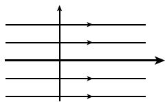
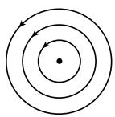
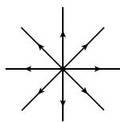
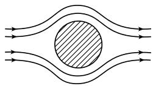
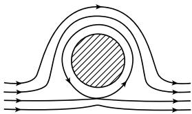
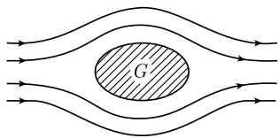
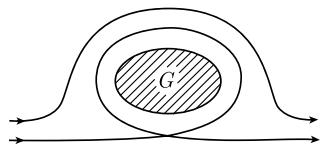

##### 1.14.13 在流体动力学上的应用

平面流基本方程

$$
\boxed { \begin{array}{l} {\rho (\pmb {v} \operatorname{grad}) \pmb {v} = \pmb {f} - \operatorname{grad} p,} \\ {\operatorname{div} \pmb {v} = 0, \quad \operatorname{curl} \pmb {v} = \mathbf {0}, \quad \text {在} \Omega \text {上}.} \end{array} }\tag{1.475}
$$

这些方程描述了与常数密度 $\rho$ 的无源理想 $^{1)}$ 流体的平面平稳 (与时间无关) 流. 我们把点 $(x,y)$ 等同于 $z = x + \mathrm{i}y$ . (1.475) 中的符号含义如下. $\pmb{v}(z)$ 是流体质点在点 $z$ 处的速度向量, $p(z)$ 是在点 $z$ 处的压力, $\pmb{f} = -\mathrm{grad}W$ 是具有位势 $W$ 的外力的密度.

环流与源强度 令 C 是一条正定向闭曲线. 数

$$
\boxed {Z (C) := \int_ {C} \boldsymbol {v} \mathrm{d} \boldsymbol {x}}
$$

称为 C 的环流. 另外, 称

$$
Q (C) := \int_ {C} \boldsymbol {v n} \mathrm{d} s
$$

为包围 C 的区域的源强度(其中 n 是外法向量, s 表示弧长).

积分曲线 流体质点沿积分曲线 (或流线) 运动, 即, 速度向量 v 与积分曲线相切. 下面, 我们把速度向量 $v = ai + bj$ 等同于复数 $a + ib$ .

与全纯函数的联系 在复平面 C 的区域 $\Omega$ 上, 每个全纯函数

$$
f (z) = U (z) + \mathrm{i} V (z)
$$

对应着一个平面流, 即, 以如下方式, 它是基本方程 (1.475) 的一个解.

(i) 由 $\pmb{v} = -\mathrm{grad}U$ 得到速度场 $\pmb{v}$ , 因而

$$
\boxed {\boldsymbol {v} (z) = - \overline {{f ^ {\prime} (z)}}.}
$$

函数 U 称为速度势; f 称为复速度势. 此外, $|v(z)| = |f'(z)|$ .

(ii) 可以由伯努利方程

$$
\frac {\pmb {v} ^ {2}}{2} + \frac {p}{\rho} + \frac {W}{\rho} = \text {常数}, \quad \text {在} \varOmega \text {上}
$$

计算出压力p. 方程中的常数由描述某一固定点处的压力确定.

(iii) 曲线 $V(x,y)=$ 常数是积分曲线.

(iv) 曲线 $U(x, y) =$ 常数称为等势曲线. 在使 $f'(z) \neq 0$ 的点 $z$ 处, 积分曲线正交于等势曲线.

(v) 环流与源强度满足公式:

$$
z (C) + \mathrm{i} Q (C) = - \int_ {C} f ^ {\prime} (z) \mathrm{d} z.
$$

借助于留数定理可以方便地计算出上述积分.

纯平行流(图 1.187(a)) 令 c > 0. 函数

$$
\boxed {f (z) := - c z}
$$

(因而 U = -cx 和 V = -cy) 对应着平行流

$$
\boldsymbol {v} = \boldsymbol {c},
$$

即, v = ci. 直线 y = 常数是积分曲线, 直线 x = 常数是等势曲线, 正交于积分曲线.

  
(a) 平行流

  
(b) 环流

  
(c) 源流  
图 1.187 流体动力流

纯环流(图 1.187(b)) 令 $\Gamma$ 为一实数. 令 $z = r e^{i\varphi}$ . 对函数

$$
\boxed {f (z) := - \frac {\Gamma}{2 \pi \mathrm{i}} \ln z}
$$

有 $U = -\frac{\Gamma}{2\pi}\varphi, V = \frac{\Gamma}{2\pi} \ln r,$ 及 $\pmb{v} = -\overline{f'(z)}$ 。这可导出速度场为

$$
\pmb {v} (z) = \frac {\mathrm{i} \Gamma z}{2 \pi r ^ {2}}.
$$

令 C 是围绕原点的圆周. 对环流, 由留数定理得到

$$
z (C) = \frac {\Gamma}{2 \pi \mathrm{i}} \int_ {C} \frac {\mathrm{d} z}{z} = \Gamma .
$$

积分曲线 V = 常数是围绕原点的同心圆, 等势曲线 U = 常数是以原点为起点的射线.

纯源流(图 1.187(c)) 令 q > 0. 函数

$$
f (z) = - \frac {q}{2 \pi} \ln z
$$

对应着速度场为

$$
\pmb {v} (z) = \frac {q z}{2 \pi r ^ {2}}
$$

的源流, 它的位势是 $U = -\frac{q}{2\pi} \ln r$ , 它的源强度等于

$$
Q (C) = \frac {q}{2 \pi \mathrm{i}} \int_ {C} \frac {\mathrm{d} z}{z} = q.
$$

积分曲线是以原点为起点的射线, 等势曲线是围绕原点的同心圆.

经圆盘形障碍物的流(图 1.188) 令 c>0 和 $\Gamma\geqslant0$ . 函数

$$
\boxed {f (z) = - c \left(z + \frac {R ^ {2}}{z}\right) - \frac {\Gamma}{2 \pi \mathrm{i}} \ln z}\tag{1.476}
$$

描述了经过半径为 R 的圆盘的流; 这个流由速度为 c 的平行流及由 $\Gamma$ 确定的环流组成.

  
(a) 无环流

  
(b) 大环流  
图 1.188 绕过障碍物 (圆盘) 的流

共形映射技巧 由于双全纯映射把全纯函数变换成全纯函数, 所以同时可得到流的映射, 它把积分曲线变换为积分曲线. 我们知道, 双全纯映射总是共形的.

这说明了共形映射对于物理学和技术的重要性. 同样的原理也适用于静电学及静磁学 (参看 1.14.14).

经过障碍物区域 $G$ 的流(图1.189) 假设给定一个有光滑边界的单连通区域 $G$ . 令 $g$ 为从 $G$ 到一个圆盘的双全纯映射. 由黎曼映射定理可知, 这种映射总是存在的. 我们选取函数 $f$ 为 (1.476) 中 $R = 1$ 的情况, 则复合函数

$$
w = f (g (z))
$$

是一个围绕区域 G 的流.

  
(a) 无环流

  
(b) 大环流  
图1.189 经过任意单连通区域障碍物 $G$ 的流
