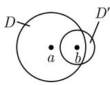
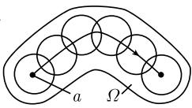
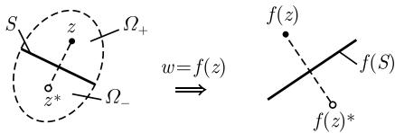

##### 1.14.15 解析延拓与恒等原理

全纯函数最出色的一个性质是, 可以把方程或微分方程唯一解析延拓到更大的定义域, 而不改变方程的形式.

定义 在区域 $U$ 和 $V$ 上给定两个全纯函数 $f: U \subseteq \mathbb{C} \to \mathbb{C}$ 及 $\mathrm{F}: V \subseteq \mathbb{C} \to \mathbb{C}$ , 其中 $U \subset V$ . 如果有

$$
f = F, \quad \text { 在 } U \text { 上 },
$$

则 F 完全由 f 确定, 它称为 f 的解析延拓.

例 1：对满足 $|z| < 1$ 的所有 $z \in C$ ，令

$$
f (z) := 1 + z + z ^ {2} + \dots ,
$$

且对满足 $z \neq 1$ 的所有 $z \in \mathbb{C}$ , 令

$$
F (z) := \frac {1}{1 - z},
$$

则 F 是 $C - \{1\}$ 上 f 的解析延拓.

恒等原理 在区域 $\Omega$ 上给定两个全纯函数 $f, g: \Omega \to C$ ，并假设

$$
\boxed {f (z _ {n}) = g (z _ {n}), \quad \text {对所有} n = 1, 2, \dots ,}
$$

其中, $(z_{n})$ 是一个序列, 当 $n\to \infty$ 时, $z_{n}\rightarrow a,$ 而 $a\in \Omega$ ，另外还假设对所有的 $n,z_n\neq a.$ 那么在 $\Omega$ 上 $f = g$

例 2: 假设对所有 $x, y \in] - \alpha, \alpha[$ , 有加法定理

$$
\sin (x + y) = \sin x \cos y + \cos x \sin y,\tag{1.478}
$$

其中 $\alpha > 0$ 为小角度. 既然 $w = \sin z$ 和 $w = \cos z$ 是 $\mathbb{C}$ 上的全纯函数, 所以 (不需计算) 我们知道加法定理对所有复数 $x$ 与 $y$ 都成立.

例 3: 假设我们已经对所有 $x \in] - \alpha, \alpha[$ 证明了导数公式

$$
{\frac {\mathrm{d} \sin x}{\mathrm{d} x}} = \cos x.
$$

那么即知这个公式对所有复数 z 都成立.

沿一条曲线的解析延拓 假设给定幂级数

$$
f (z) = a _ {0} + a _ {1} (z - a) + a _ {2} (z - a) ^ {2} + \dots ,\tag{1.479}
$$

它的收敛域为 $D = \{z\in \mathbb{C}:|z - a| < r\}$ .选一个点 $b\in D$ ，并令 $z - a = (z - b) + b - a.$ 对级数(1.479）重新排序，得到新的幂级数

$$
g (z) = b _ {0} + b _ {1} (z - b) + b _ {2} (z - b) ^ {2} + \dots ,
$$

其收敛域为 $D' = \{z \in \mathbb{C} : |z - b| < R\}$ (图 1.191(a)). 这里, 在交集 $D \cap D'$ 上有 $f = g$ . 如果 $D'$ 包含不在 $D$ 里的点, 令

$$
\text { 在 } D \text { 上 } F := f, \text { 在 } D ^ {\prime} \text { 上 } F := g,
$$

那么我们就得到了并集 $D \cup D'$ 上 $f$ 的一个解析延拓 $F$ 。可以尝试继续这个过程 (图 1.191(b)).

  
(a)

  
(b)  
图 1.191 解析延拓

例 4: 函数

$$
f (z) := \sum_ {n = 1} ^ {\infty} z ^ {2 ^ {n}}
$$

在单位圆盘上是全纯的. 然而它不能被解析延拓到一个更大的区域. $^{1)}$

单值性定理 令 $\Omega$ 是单连通区域, 函数 $f$ 在点 $a \in \Omega$ 的一个圆形邻域内是全纯的, 因而 $f$ 可以局部地在点 $a$ 处展开成幂级数.

如果函数 $f$ 可以沿 $\Omega$ 中一条 $C^1$ 曲线解析延拓, 则可得区域 $\Omega$ 上一个唯一确定的全纯函数 $F$ (图1.191(b)).

解析延拓与黎曼面 如果区域 $\Omega$ 不是单连通的, 则解析延拓可能导致一个多值函数.

例5：令 $C$ 是 $w$ 平面上的一个正定向圆. 我们在点 $w = 1$ 的某个邻域内沿一条曲线对函数

$$
z = _ {+} \sqrt {w}
$$

的主值进行解析延拓．在绕 C 一周后，沿曲线 C 的解析延拓在 w = 1 处产生 $+\sqrt{w}$ (主值的负值) 的幂级数展开．再一次绕 C 一周，我们就又回到了 $+\sqrt{w}$ 的幂级数展开.

如果使用函数 $z = \sqrt{w}$ 的直观黎曼面 (参看1.14.11.6), 上述情况就变得可以理解了. 我们从第一片上的点 $w = 1$ 开始, 绕 $C$ 一周后到第二片上. 第二次绕 $C$ 一周后, 我们再次登上第一片.

例 6: 如果在点 w = 1 的某邻域内, 对主值

$$
z = \ln w
$$

1) 符号 $z^{2^n}$ 表示 $z^{(2^n)}$ , 不应该与 $(z^2)^n = z^{2 \cdot n}$ 混淆. 一般, $a^{b^c}$ 表示 $a^{(b^c)}$ .

的幂级数展开进行解析延拓, 那么沿 C 绕 w = 1 点 m 周后就得到了

$$
z = \ln w + 2 \pi m \mathrm{i}, \quad m = 0, \pm 1, \pm 2, \dots
$$

的幂级数展开. 这里数 $m = -1$ 对应着负向, 即逆向, 绕 $C$ 一周, 如此等等. 这个程序导出上面讨论的多值函数 $z = \mathrm{Ln}w$ .

借助 1.14.11.7 中 $z = \operatorname{Ln} w$ 的直观黎曼面, 我们可以把上述解析延拓解释如下. 我们从第零片上的点 w = 1 开始, 沿 C 绕第一圈后登上第一片, 绕完第二圈后登上第二片, 如此类推.

一般地, 可以利用这个程序把 $f$ 的给定幂级数展开延拓到 $f$ 的最大解析延拓的黎曼面上. [212] 描述了这一过程.

应用施瓦茨反射原理的解析延拓 假设给定区域

$$
\varOmega = \varOmega_ {+} \cup \varOmega_ {-} \cup S,
$$

它由两个区域 $\Omega_{+}$ , $\Omega_{-}$ 及线段 $S$ 组成. 这里, $\Omega_{-}$ 是 $\Omega_{+}$ 关于线段 $S$ 反射后的象 (图 1.192). 我们作如下假设:

  
图1.192

(i) 函数 $f$ 在 $\Omega_{+}$ 上是全纯的, 并在并集 $\Omega_{+} \cup S$ 上连续.

(ii) 线段 S 在映射 $w = f(z)$ 下的象 $f(S)$ 是 w 平面上的线段.

(iii) 令对所有的 $z \in \Omega_{+}$ ,

$$
\boxed {f (z ^ {*}) := f (z) ^ {*}.}
$$

这里符号中的星号表示关于 z 平面中线段 S 的反射 (或 w 平面上对线段 $f(S)$ 的反射).

这一构造导出 f 在整个区域 $\Omega$ 上的解析延拓.

一般幂函数 令 $\alpha \in \mathbb{C}$ , 则对满足 $z > 0$ 所有的 $z \in \mathbb{R}$ , 有

$$
\boxed {z ^ {\alpha} = \mathrm{e} ^ {\alpha \ln z}.}
$$

等号右边的函数可以解析延拓. 此解析延拓为函数 $w = z^{\alpha}$ .

(i) 如果 $\operatorname{Re}\alpha$ 与 $\operatorname{Im}\alpha$ 是整数, 则 $w = z^{\alpha}$ 在 $\mathbb{C}$ 上是唯一定义.

(ii) 如果 $\operatorname{Re}\alpha$ 与 $\operatorname{Im}\alpha$ 是有理数而不是整数, 则 $w = z^{\alpha}$ 有有限个值(有如对辐角有限多个值的那么多个值).

(iii) 如果 $\operatorname{Re} \alpha$ 与 $\operatorname{Im} \alpha$ 是无理数, 则 $w = z^{\alpha}$ 有无穷多个值.

在情形 (ii), $w = z^{\alpha}$ 的直观黎曼面与函数 $w = \sqrt[n]{z}$ 的一样, 其中 $n \geqslant 2$ 为某一自然数.

在情形 (iii), $w = z^{\alpha}$ 的直观黎曼面与函数 $w = \mathrm{Ln}z$ 的一样.
