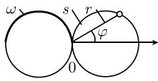
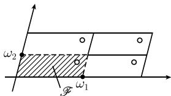

##### 1.14.17 椭圆函数和椭圆积分

1.14.17.1 基本思想

法尼亚诺加法定理(1781) 方程

$$
\boxed {r ^ {2} = \cos 2 \varphi}
$$

描述了极坐标下的 J. 伯努利(Jakob Bernoulli, 1654—1705) 双纽线, 其上到原点 O 的距离为 r 的点与 O 之间的弧长为

$$
s (r) = \int_ {0} ^ {r} \frac {\mathrm{d} \rho}{\sqrt {1 - \rho^ {4}}}\tag{1.482}
$$

(图 1.194). 意大利数学家法尼亚诺(Fagnano, 1682—1766)于 1718 年发现了加倍公式

$$
2 s (r) = s (R), \quad \text { 对于 } R = {\frac {2 r {\sqrt {1 - r ^ {4}}}}{1 + r ^ {4}}}.
$$

(1.483)

图1.194

这个公式给出了如何用圆规和直尺使双纽线加倍的方法.

1753 年, 欧拉发现了椭圆积分的许多加法公式, 称为加法定理.

高斯的发现 1796 年, 只有 19 岁的高斯就研究了双纽线. $^{1)}$ 他要研究的是, 如何根据弧长 s 来计算双纽线上的点到原点的距离 r. 换言之, 他感兴趣的是椭圆积分 (1.482) 的反函数 $r = r(s)$ . 对 (1.482) 求导后, 得

$$
s ^ {\prime} (r) = \frac {1}{\sqrt {1 - r ^ {4}}}, - 1 <   r <   1.
$$

因而在 ] - 1, 1[ 上有 $s'(r) > 0$ , 因此函数 $s: ] - 1, 1[\to \mathbb{R}$ 严格递增且有反函数, 高斯把此反函数记为

$$
r = \mathrm{sl} s, - \omega <   s <   \omega ,
$$

并称作双纽线正弦函数. 其中, 数

$$
w := \int_ {0} ^ {1} \frac {\mathrm{d} \rho}{\sqrt {1 - \rho^ {4}}}
$$

是双纽线的半弧的长度 (图 1.194). 此外, 高斯通过关系式

$$
\operatorname{cls} := \operatorname{sl} (\omega - s)\tag{1.484}
$$

引进了双纽线余弦函数. 我们有

$$
\mathrm{sl} ^ {2} s + \mathrm{cl} ^ {2} s + \mathrm{sl} ^ {2} s \mathrm{cl} ^ {2} s = 1,\tag{1.485}
$$

这个关系式表明, 高斯十分熟悉它们与三角函数的类似性. 如果考虑积分

$$
s (r) := \int_ {0} ^ {r} \frac {\mathrm{d} \rho}{\sqrt {1 - \rho^ {2}}}.
$$

那么这种类似性变得更明显. 由 $s = s(r)$ 的反函数得到三角正弦函数

$$
r = \sin s.
$$

如果选取数

$$
\omega := \int_ {0} ^ {1} \frac {\mathrm{d} \rho}{\sqrt {1 - \rho^ {2}}} = \frac {\pi}{2},
$$

那么就得到平行于 (1.484) 的三角余弦函数

$$
\cos s = \sin (\omega - s)
$$

及由 (1.485) 得到的熟悉的关系式

$$
\sin^ {2} s + \cos^ {2} s = 1.
$$

就像对三角函数有加法定理

$$
\sin (x + y) = \sin x \cos y + \cos x \sin y
$$

一样, 对双纽线正弦及余弦函数也有代数加法定理. 借助这些公式, 高斯对所有实自变量 $s$ 引进了函数 $r = \operatorname{sl} s$ 及 $r = \operatorname{cl} s$ . 高斯的闪光思想是把这些函数推广到了复自变量. 为此, 他首先利用了代换 $t = \mathrm{i}\rho$ , 并且形式地推导:

$$
\int_ {0} ^ {\mathrm{i} r} \frac {\mathrm{d} t}{\sqrt {1 - t ^ {4}}} = \mathrm{i} \int_ {0} ^ {r} \frac {\mathrm{d} \rho}{\sqrt {1 - \rho^ {4}}},
$$

因而 $s(\mathrm{i}r)=\mathrm{i}s(r)$ . 这使他得到定义

$$
\operatorname{sl} (\mathrm{i} s) := \mathrm{i} (\operatorname{sl} s), \quad {\text { 对所有}} s \in \mathbb {R}.
$$

通过这个关系式及加法定理, 他对所有复数 s 很容易地定义了 sls, 并作为推论得到了两个基本周期性关系式:

$$
\left| \operatorname{sl} (s + 4 \omega) = \operatorname{sl} s \text {和} \operatorname{sl} (s + 4 \omega \mathrm{i}) = \operatorname{sl} s \quad \text {对所有} s \in \mathbb {C}. \right|
$$

与三角正弦函数不同的是，双纽线正弦函数不仅有实周期 $4\omega$ ，而且还有第二个，纯虚周期 $4\omega \mathrm{i}$ .这说明sls是一个有双周期的亚纯函数.这类函数称为椭圆函数

在 1796 年高斯就已经发现了椭圆函数的存在性.

一般椭圆积分 形如

$$
\boxed {\int R (z, \sqrt {p (z)}) \mathrm{d} z}\tag{1.486}
$$

的积分称为有理的, 如果 $p$ 是有两个不同零点的二次多项式. 这类积分总可以用包含三角函数 (实变量或复变量) 的代换解出. 三角函数是周期函数.

如果 $p$ 是三次或四次多项式，且有两个不同的零点，那么称（1.486）为椭圆积分。通过含有椭圆函数——它是双周期函数——的代换，可以求得这类积分。

积分 (1.486) 称为是超椭圆的, 如果 $p$ 是有两个不同零点的五次或六次多项式. 形如

$$
\int R (z, w) \mathrm{d} z
$$

的积分称为阿贝尔积分, 其中 w 是代数函数. $^{1)}$ N. H. 阿贝尔(Niels H. Abel, 1802—1829) 研究过这样的积分.

椭圆积分的一般理论 勒让德(Legendre, 1752-1833) 和雅可比(Jacobi, 1804-1851) 系统研究过椭圆积分，雅可比使用了快速的收敛 $\theta$ 函数，并推导出雅可比正弦函数 $w = \mathrm{sn}z$ 和余弦函数 $w = \mathrm{cn}z$ ，从而推广了三角函数.

然而, 只有把椭圆函数看作椭圆积分理论的起点, 才能更深刻地理解这个理论. 这正是魏尔斯特拉斯于 1862 年在柏林大学的著名系列讲座中系统阐述的方式. 他的起点是他引进的 P 函数. 由此可得所有椭圆函数, 并且用有理运算能得到它的导数.

一般理论的基本思想如下：

(i) 借助通用代换可以求出椭圆积分, 在此代换中应用了魏尔斯特拉斯 P 函数.

(ii) 椭圆积分有局部反函数. 对这些局部反函数作解析延拓得到复平面 $\mathbb{C}$ 上的椭圆函数.

(iii) 椭圆积分的整体行为受积分号下函数 $\sqrt{p(z)}$ 的多值性影响. 为了使积分(1.486)成为唯一定义的曲线积分, 必须利用位于函数 $\sqrt{p(z)}$ 的黎曼面上的积分路径. 在这个黎曼面上, 函数 $w = \sqrt{p(z)}$ 是单值的. 这样, 积分号下的函数也变成单值的.

(iv) 魏尔斯特拉斯 P 函数满足代数加法定理.

法尼亚诺发现的加倍公式 (1.483), 欧拉的一般加法定理, 及像高斯双纽线正弦、余弦函数这样的一般椭圆函数的加法定理, 它们的基础是代数加法定理.

P 函数的加法定理存在的深刻理由是椭圆曲线上的群结构 (参看 3.8.1.3).

(v) 为了用 $\mathcal{P}$ 函数计算任意椭圆积分, 必须解决 $\mathcal{P}$ 函数的反演问题, 换言之, 根据 $\mathcal{P}$ 函数的某些给定不变量求出周期格. 这就导致模形式理论的诞生, 我们将在1.14.18中讨论. 模形式在数论及现代粒子物理学中的弦理论等多个领域中起着重要作用 (参看 [212]).

超椭圆积分著名的雅可比反演问题 1832 年雅可比阐述了如下猜想. 令 $w = p(z)$ 是六次多项式, 且只有一阶零点. 我们考虑两个函数 $u = u(a, b)$ 和 $v = v(a, b)$ , 它们是如下方程组的解:

$$
\int_ {u _ {0}} ^ {u} \frac {\mathrm{d} z}{\sqrt {p (z)}} + \int_ {v _ {0}} ^ {v} \frac {\mathrm{d} z}{\sqrt {p (z)}} = a,
$$

$$
\int_ {u _ {1}} ^ {u} \frac {z \mathrm{d} z}{\sqrt {p (z)}} + \int_ {v _ {1}} ^ {v} \frac {z \mathrm{d} z}{\sqrt {p (z)}} = b,
$$

其中 $u_{j}, v_{j}$ 是给定的复数, $j = 0,1$ . 那么, 函数 $u + v$ 与 $uv$ 是唯一的, 且有四个不同的周期.

黎曼和魏尔斯特拉斯对求解这个问题进行了深入的研究, 在这过程中发展了复变函数论的核心部分. 他们两个人用不同的方法都发现了这个问题的一个解, 并且证明, 这只是阿贝尔积分的更一般性质的特殊情形.

自守函数 代替椭圆积分中的椭圆函数, 在超椭圆积分中出现了自守函数. 自守函数是在某个区域 (例如上半平面或圆盘上) 上的亚纯函数, 它在那个区域的自同构的一个离散群作用下不变. 自守函数在计算阿贝尔积分中的重要性基于如下事实: 对每个亏格 $g \geqslant 2$ 的紧黎曼面 $R$ , 存在从开圆盘 $B$ 到 $R$ 的自同构映射 $p: B \to R$ , $p$ 在 $B$ 覆叠变换群下不变 (参看 [212]).

在椭圆积分的情形中使用椭圆函数 $p: \mathbb{C} \to R$ , 其中 $R$ 是亏格 $g = 1$ 的黎曼面, 因此 $R$ 同胚于环面. 使周期格不变的复平面 $\mathbb{C}$ 的所有平移组成的集合构成覆叠变换群. 分析学、代数学与几何学的异乎寻常的和谐的相互作用确定了阿贝尔积分的一般理论. 这个理论包含的丰富思想在许多其他领域也有丰硕成果, 并且从本质上影响了20世纪数学的发展.

1.14.17.2 椭圆函数的性质

定义 椭圆函数是双周期的亚纯函数 $f: C \rightarrow \bar{C}$ ，即，存在两个非零复数 $\omega_{1}, \omega_{2}$ ，使得

$$
\boxed {f (z + \omega_ {j}) = f (z), \quad \text {对所有} z \in \mathbb {C} \text {且} j = 1, 2.}\tag{1.487}
$$

令 $\tau := \omega_{2}/\omega_{1}$ ，并从此以后假设两个周期按照 Im $\tau > 0$ 排序。由 (1.487) 得到

$$
f (z + n \omega_ {1} + m \omega_ {2}) = f (z), \quad {\text {对所有}} z \in \mathbb {C},
$$

其中 n, m 是任意整数.

周期格 集合

$$
\Gamma := \{n \omega_ {1} + m \omega_ {2} | n, m \text {是整数} \}
$$

称为由 $\omega_{1}$ 和 $\omega_{2}$ 生成的周期格; $\Gamma$ 是加法群 C 的子群. 集合

$$
\mathscr {F} := \{\lambda \omega_ {1} + \mu \omega_ {2} | 0 \leqslant \lambda , \mu <   1 \}
$$

称为基本域. 这是由 $\omega_{1}$ 和 $\omega_{1}$ 张成的平行四边形 (图 1.195). 记

$$
z _ {1} \equiv z _ {2} \mod \Gamma ,
$$

当且仅当 $z_{1} - z_{2}\in \Gamma$ ，这时我们说 $z_{1}$ 与 $z_{2}$ 是等价的.双周期函数在等价点处的值相同.

例: 在图 1.195 中, 4 个开圆就是 4 个等价点.

定理 对复平面 $\mathbb{C}$ 中的每个点 $z_{1}$ , 在基本域 $\mathcal{F}$ 中存在唯一一个与 $z_{1}$ 等价的点 $z_{2}$ . 因此, 只需知道椭圆函数在它的基本域中的值, 就知道了它的所有值.

  
图 1.195 周期格

刘维尔定理(1847) 对一个不是常数的椭圆函数 $f: C \rightarrow \bar{C}$ ，有

(i) $f$ 在基本域 $\mathcal{F}$ 中至少有一个、至多有有限个极点.

(ii) f 在 F 中所有极点处留数的和是零.

(iii) f 在 F 的所有点上以相同的重数取每个值 $w \in C$ 和 $w = \infty$ .

1.14.17.3 魏尔斯特拉斯 P 函数

定义 令给定 $\omega_{1}$ 和 $\omega_{2}$ , 它们张成一个周期格. 对所有 $z \in \mathbb{C} - \Gamma$ , 令

$$
\boxed {\mathcal {P} (z) := \frac {1}{z ^ {2}} \sum_ {g \in \Gamma} ^ {\prime} \left(\frac {1}{(z - g) ^ {2}} - \frac {1}{g ^ {2}}\right).}
$$

带撇号的求和符号表明格点 g = 0 不在求和号中.

此外，令

$$
e _ {1} := \mathcal {P} \left(\frac {\omega_ {1}}{2}\right), \quad e _ {2} := \mathcal {P} \left(\frac {\omega_ {1} + \omega_ {2}}{2}\right), \quad e _ {3} = \mathcal {P} \left(\frac {\omega_ {2}}{2}\right),\tag{1.488}
$$

$$
g _ {2} := - 4 (e _ {1} e _ {2} + e _ {1} e _ {3} + e _ {2} e _ {3}), \quad g _ {3} := 4 e _ {1} e _ {2} e _ {3}.
$$

我们有

$$
4 (z - e _ {1}) (z - e _ {2}) (z - e _ {3}) = 4 z ^ {3} - g _ {2} z - g _ {3}.
$$

这个多项式的 (非正规化) 判别式是

$$
\varDelta := (g _ {2}) ^ {3} - 2 7 (g _ {3}) ^ {2}.
$$

如果数 $e_{1}, e_{2}, e_{3}$ 两两不同, 则 $\Delta \neq 0$ .

定理 1 (i) P 函数是椭圆函数, 周期为 $\omega_{1}$ 与 $\omega_{2}$ .

(ii) P 在基本域 F 中恰有一个极点. 它是点 z = 0, 且其重数为 2.

(iii) 在 $\mathcal{F}$ 中 $\mathcal{P}$ 函数两次取每个值 $w \in \mathbb{C}$ , 并且它是个偶函数, 即, 对所有的 $z \in \mathbb{C}$ , 有 $\mathcal{P}(-z) = \mathcal{P}(z)$ .

(iv) 对所有 $z \in \mathbb{C} - \Gamma$ , 函数 $w = \mathcal{P}(z)$ 满足微分方程

$$
\boxed {\omega^ {\prime 2} = 4 (\omega - e _ {1}) (\omega - e _ {2}) (\omega - e _ {3}).}\tag{1.489}
$$

(v) 对所有 $u, v \in C - \Gamma, u \neq v,$ 有加法定理:

$$
\boxed {\mathcal {P} (u + v) = - \mathcal {P} (u) - \mathcal {P} (v) + \frac {1}{4} \left(\frac {\mathcal {P} ^ {\prime} (u) - \mathcal {P} ^ {\prime} (v)}{\mathcal {P} (u) - \mathcal {P} (v)}\right) ^ {2}.}
$$

并且, 有关系式

$$
\mathcal {P} (2 u) = - 2 \mathcal {P} (u) + \frac {1}{4} \left(\frac {\mathcal {P} ^ {\prime \prime} (u)}{\mathcal {P} ^ {\prime} (u)}\right) ^ {2}.
$$

椭圆函数域 周期为 $\omega_{1},\omega_{2}$ 的所有椭圆函数的集合是一个域 $^{1)}$ $\mathcal{H}$ . 这个域是由 $\mathcal{P}$ 函数及其导数生成的. 显然, 形如

$$
\boxed {R (\mathcal {P}, \mathcal {P} ^ {\prime})}
$$

的所有函数构成 K, 其中 R 是任意二元有理函数(两个二元多项式的商).

艾森斯坦 (Eisenstein, 1832-1852) 级数 对于 $n = 3,4,\dots$ ，级数

$$
G _ {n} := \sum_ {\omega \in \Gamma} ^ {\prime} \frac {1}{\omega^ {n}}
$$

收敛. 这里, 带撇号的求和表明不包括格点 $\omega=0$ .

定理2 我们有 $g_{2} = 60G_{4}, g_{3} = 140G_{6}$ . 在 $z = 0$ 的某个邻域内, 有洛朗展开式

$$
\mathcal {P} (z) = \frac {1}{z ^ {2}} + \sum_ {n = 1} ^ {\infty} (2 n + 1) G _ {2 n + 2} z ^ {2 n}.
$$

1.14.17.4 雅可比 $\vartheta$ 函数

定义

$$
\boxed {\vartheta_ {0} (z; \tau) = 1 + 2 \sum_ {n = 1} ^ {\infty} (- 1) ^ {n} q ^ {n ^ {2}} \cos 2 \pi n z, \quad z \in \mathbb {C}.}
$$

这里, $q$ 定义为 $q := \mathrm{e}^{\mathrm{i}\pi \tau}$ , 其中 $\tau \in \mathbb{C}$ , 并且 $\operatorname{Im} \tau > 0$ . 2)

定理 对固定参数 $\tau$ ，函数 $\vartheta_{0}$ 是整函数。它的周期是 1，并且恰在点

$$
\frac {\tau}{2} + n + m \tau , \quad n, m \in \mathbb {Z}
$$

处有零点.

作为 z 与 $\tau$ 的函数, $\vartheta_{0}$ 满足复的热方程

$$
\frac {\partial^ {2} \vartheta_ {0}}{\partial z ^ {2}} = 4 \pi \mathrm{i} \frac {\partial \vartheta_ {0}}{\partial \tau}.
$$

定义 由 $\vartheta_{0}$ 可得其他的雅可比 $\vartheta$ 函数:

$$
\vartheta_ {1} (z; \tau) := - \mathrm{i} q ^ {1 / 4} \mathrm{e} ^ {\mathrm{i} \pi z} \vartheta_ {0} \left(z + \frac {\tau}{2}; \tau\right) = 2 \sum_ {n = 0} ^ {\infty} (- 1) ^ {n} q ^ {(n + \frac {1}{2}) ^ {2}} \sin (2 n + 1) z,
$$

$$
\vartheta_ {2} (z; \tau) := \vartheta_ {1} \left(z + \frac {1}{2}; \tau\right) = 2 \sum_ {n = 0} ^ {\infty} q ^ {(n + \frac {1}{2}) ^ {2}} \cos (2 n + 1) \pi z,
$$

$$
\vartheta_ {3} (z; \tau) := \vartheta_ {0} \left(z - \frac {1}{2}; \tau\right) = 1 + 2 \sum_ {n = 1} ^ {\infty} q ^ {n ^ {2}} \cos 2 \pi n z.
$$

1.14.17.5 雅可比椭圆函数

定义 令 $0 < k, k' < 1$ , 且 $k^2 + k'^2 = 1$ . 令

$$
\operatorname{sn} (z; k) := \frac {1}{\sqrt {k}} \frac {\vartheta_ {1} \left(\frac {z}{2 K} ; \tau\right)}{\vartheta_ {0} \left(\frac {z}{2 K} ; \tau\right)} \quad (\text {正弦振幅}),
$$

$$
\mathrm{cn} (z; k) = \sqrt {\frac {k ^ {\prime}}{k}} \frac {\vartheta_ {2} \left(\frac {z}{2 K} ; \tau\right)}{\vartheta_ {0} \left(\frac {z}{2 K} ; \tau\right)} (\text {余弦振幅}),
$$

$$
\mathrm{dn} (z; k) = \sqrt {k ^ {\prime}} \frac {\vartheta_ {2} \left(\frac {z}{2 K} ; \tau\right)}{\vartheta_ {0} \left(\frac {z}{2 K} ; \tau\right)} (\mathrm{delta} \text {振幅}),
$$

这里用到的量是

$$
K (k) = \int_ {0} ^ {\pi / 2} \frac {\mathrm{d} \varphi}{\sqrt {1 - k ^ {2} \sin \varphi}}
$$

和 $\tau:=\mathrm{i}K'(k)/K(k)$ ，其中 $K'(k):=K(k')$ . $^{1)}$ 下面把 k 固定，并把 $\operatorname{sn}(z;k)$ ， $\operatorname{cn}(z;k)$ ，以及 $K(k),K'(k)$ 简记为 $\operatorname{sn}z,\operatorname{cn}z,K,K'$ .

定理 三个函数 $w = \mathrm{sn}z, \mathrm{cn}z, \mathrm{dn}z$ 是具有表1.8中所列性质的椭圆函数。并且，对所有不是极点的 $z \in \mathbb{C}$ ，有

$$
\mathrm{sn} ^ {2} z + \mathrm{cn} ^ {2} z = 1 \text {和} (\mathrm{sn} z) ^ {\prime} = \mathrm{cn} z \mathrm{dn} z.
$$

函数 sn z 是奇函数, 而 cn z, dn z 是偶函数.

微分方程 微分方程

$$
u ^ {\prime 2} = (1 - u ^ {2}) (1 - k ^ {2} u ^ {2}),
$$

$$
v ^ {\prime 2} = (1 - v ^ {2}) (k ^ {\prime 2} + k ^ {2} v ^ {2}),
$$

$$
w ^ {\prime 2} = - (1 - w ^ {2}) (k ^ {\prime 2} - w ^ {2})
$$

(a)  
表 1.8 雅可比椭圆函数

<table><tr><td></td><td>周期</td><td>零点</td><td>极点</td><td>留数</td></tr><tr><td>snz</td><td>4K,2K&#x27;i</td><td>2mK+2nK&#x27;i</td><td>2mK+(2n+1)K&#x27;i</td><td> $\frac{1}{k}, -\frac{1}{k}$ </td></tr><tr><td>cnz</td><td>4K,2(K+K&#x27;i)</td><td>(2m+1)K+2nK&#x27;i</td><td>2mK+(2n+1)K&#x27;i</td><td> $\frac{\text{i}}{k}, -\frac{\text{i}}{k}$ </td></tr><tr><td>dnz</td><td>2K,4K&#x27;i</td><td>(2m+1)K+(2n+1)K&#x27;i</td><td>2mK+(2n+1)K&#x27;i</td><td>-i,i</td></tr></table>

注： $n$ 和 $m$ 是整数

非常数的一般解是

$$
u = \pm \mathrm{sn} (z + \mathrm{常数}),
$$

$$
v = \pm \mathrm{cn} (z + \mathrm{常数}),
$$

$$
w = \pm \mathrm{dn} (z + \text {常数}).
$$

加法定理

$$
\mathrm{sn} (u + v) = \frac {\mathrm{sn} u \mathrm{cn} v \mathrm{dn} v + \mathrm{sn} v \mathrm{cn} u \mathrm{dn} u}{1 - k ^ {2} \mathrm{sn} ^ {2} u \mathrm{sn} ^ {2} v},
$$

$$
\mathrm{cn} (u + v) = \frac {\mathrm{cn} u \mathrm{cn} v - \mathrm{sn} u \mathrm{sn} v \mathrm{dn} u \mathrm{dn} v}{1 - k ^ {2} \mathrm{sn} ^ {2} u \mathrm{sn} ^ {2} v},
$$

$$
\mathrm{dn} (u + v) = \frac {\mathrm{dn} u \mathrm{dn} v - k ^ {2} \mathrm{sn} u \mathrm{sn} v \mathrm{cn} u \mathrm{cn} v}{1 - k ^ {2} \mathrm{sn} ^ {2} u \mathrm{sn} ^ {2} v}.
$$
