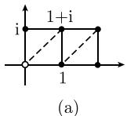
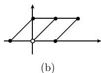
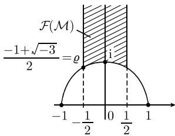

##### 1.14.18 模形式与 $\mathcal{P}$ 函数的反演问题

不同的周期 $\omega_{1}, \omega_{2}$ 可以导致相同的格.

例：两对周期 $(1, \mathrm{i})$ 与 $(1, 1 + \mathrm{i})$ 在 $\mathbb{C}$ 中生成相同的格 (图1.196)，即两个格点的集合一样.

  
图 1.196 定义相同格的不同周期

主定理 (i) 魏尔斯特拉斯 P 函数只与周期格有关, 与生成格的周期无关.

(ii) 如果给定三个不同的复数 $e_1, e_2, e_3$ ，则存在一个格，及属于这些值的一个 $\mathcal{P}$ 函数 (在 (1.488) 意义下).

注 解椭圆积分的通用方法基于这个结果, 即, 作代换 $w = \mathcal{P}'(t), z = \mathcal{P}(t)$ (参看1.14.19).

上面的定理是从下面要介绍的模形式理论推出的. 特别是应用了这一事实：克莱因模 $J$ 函数取每个复数作为它的值. 模形式理论在数论, 代数几何 (参看3.8.6.2中深刻的志村-谷山-韦伊猜想), $\pi$ 值的计算, 以及高能物理中的弦论中都有重要应用. 模群 设 $\mathcal{H}_{+} := \{z \in \mathbb{C} \mid \operatorname{Im} z > 0\}$ 表示上半平面. 由定义, 一个模变换由形如

$$
\tau^ {\prime} = \frac {a \tau + b}{c \tau + d}
$$

的默比乌斯变换所定义, 其中 $a, b, c, d$ 是整数, 并且 $ad - bc = 1$ . 这些变换把 $\mathcal{H}_{+}$ 双全纯 (因而是共形) 映射到自身.

所有模变换的集合形成 (默比乌斯变换的) 自同构群 (见 1.14.11.5) 的子群, 我们称它为模群 M.

令 $\tau, \tau' \in \mathcal{H}_+$ . 我们记

$$
\tau \equiv \tau^ {\prime} \mathrm{mod} \mathcal {M},
$$

当且仅当, 存在一个从 $\tau$ 到 $\tau'$ 的模变换. $\mathcal{M} \setminus \mathcal{H}_{+}$ 表示一个等价关系 (运算从左开始).

模群由变换 $\tau' = \tau + 1$ 与 $\tau' = -1/\tau$ 生成.
模群的基本域 令

$$
\mathscr {F} (\mathcal {M}) := \left\{z \in \mathscr {H} _ {+} \left| - \frac {1}{2} \leqslant \operatorname{Re} z \leqslant \frac {1}{2}, | z | \geqslant 1 \right. \right\}
$$

图 1.197 模群的基本域

(图 1.197), 则有

(i) 上半平面的每个点模 $\mathcal{M}$ 等价于 $\mathcal{F}(\mathcal{M})$ 的点 (这表示存在 $\mathcal{M}$ 的一个元素, 把给定点变换到基本域中的一个点).

(ii) $\mathcal{F}(\mathcal{M})$ 的任意两个点模 M 不等价, 当且仅当它们在边界上.

等价格 两个格 $\Gamma$ 与 $\Gamma'$ 称为是等价的, 如果存在一个复数 $a \neq 0$ , 使得 $\Gamma' = a\Gamma$ . 定理1 两对周期 $(\omega_1, \omega_2)(\omega_1', \omega_2')$ 生成等价格, 当且仅当商 $\omega_2 / \omega_1$ 与 $\omega_2' / \omega_1'$ 模 $\mathcal{M}$ 等价. 注意, 我们约定当 $\tau := \frac{\omega_2}{\omega_1}$ 时 $\operatorname{Im} \tau > 0$ .

$(\omega_{1}, \omega_{2}) \mapsto \omega_{2} / \omega_{1}$ 产生一个从格的等价类的集合到模群的基本域 $\mathcal{F}(\mathcal{M})$ 的一一映射.

模形式 权重为 $k$ 的模形式是一个亚纯函数 $f: \mathcal{H}_{+} \to \bar{\mathbb{C}}$ , 并且具有性质: 对所有的 $\tau \in \mathcal{H}_{+}$ 和所有模变换有

$$
f \left(\frac {a \tau + b}{c \tau + d}\right) = (c \tau + d) ^ {k} f (\tau).
$$

当 $k = 0$ 时, 我们称之为模函数. 在后面我们将使用 (1.488) 定义的量

$$
g _ {2} (\omega_ {1}, \omega_ {2}), g _ {3} (\omega_ {1}, \omega_ {2}) \text {及} \varDelta (\omega_ {1}, \omega_ {2}).
$$

这里我们标出了这些量与周期 $\omega_{1}, \omega_{2}$ 有关.

定义 令 $g_{j}(\tau):= g_{j}(1,\tau), j = 1,2,$ 并令 $\Delta(\tau):=\Delta(1,\tau)$ . 模(克莱因) $J$ 函数由关系式

$$
\boxed {J (\tau) := \frac {g _ {2} (\omega_ {1} , \omega_ {2}) ^ {3}}{\varDelta (\omega_ {1} , \omega_ {2})}}
$$

所定义. 函数 J 只依赖周期比 $\tau = \omega_{2} / \omega_{1}$ .

定理2 (i) 函数 $w = J(\tau), \Delta(\tau), g_2(\tau), g_3(\tau)$ 在上半平面上是全纯的.

(ii) J 是一个模函数, 它把模群的基本域 $\mathcal{F}(\mathcal{M})$ 一一映射到复平面 C 上.

(iii) 函数 $w = \Delta(\tau)$ 是权重为 12 的模形式.

戴德金 (Dedekind, 1831—1916) $\eta$ 函数

$$
\boxed {\eta (\tau) := \mathrm{e} ^ {\pi \mathrm{i} \tau / 1 2} \prod_ {n = 1} ^ {\infty} (1 - \mathrm{e} ^ {2 \pi \mathrm{i} n \tau}), \quad \tau \in \mathcal {H} _ {+}.}
$$

这个函数在数论及弦论中很重要, 它在上半平面上是全纯的, 且对所有 $\tau \in \mathcal{H}_{+}$ 和所有模变换, 它满足关系式

$$
\eta \left(\frac {a \tau + b}{c \tau + d}\right) = \varepsilon (c \tau + d) ^ {1 / 2} \eta (\tau),
$$

这里, $\varepsilon$ 是24次单位根, 即 $\varepsilon^{24} = 1$ . 此外, 有

$$
\varDelta (\tau) = (2 \pi) ^ {1 2} \eta (\tau) ^ {2 4}.
$$
