##### 1.14.19 椭圆积分

为了更好地掌握一般理论, 我们从一个重要的例子开始. 通过这个例子, 我们想阐明下面这个基本原理:

黎曼面在计算多值代数函数的积分 (例如椭圆积分) 时有巨大的实际价值.

1.14.19.1 第一类积分的勒让德标准形及雅可比正弦函数

基本积分 考虑实积分

$$
\boxed {f (z) := \int_ {0} ^ {z} \frac {\mathrm{d} x}{\sqrt {(1 - x ^ {2}) (1 - k ^ {2} x ^ {2})}}, \quad - 1 <   z <   1.}
$$

这里, $k, k'$ 是给定的数, 并满足 $0 < k, k' < 1, k^2 + k'^2 = 1$ . 再令

$$
K (k) := \int_ {0} ^ {1} \frac {\mathrm{d} x}{\sqrt {(1 - x ^ {2}) (1 - k ^ {2} x ^ {2})}}
$$

以及 $K' := K(k')$ . 如果利用积分

$$
F (k, \varphi) := \int_ {0} ^ {\varphi} \frac {\mathrm{d} \psi}{\sqrt {1 - k ^ {2} \sin^ {2} \psi}},
$$

那么有

$$
f (\sin \varphi) = F (k, \varphi) \quad {\text {对}} - {\frac {\pi}{2}} <   \varphi <   {\frac {\pi}{2}},
$$

以及 $K(k) = F\left(k, \frac{\pi}{2}\right)$ . 椭圆积分 $F(k, \varphi)$ 表列在 0.5.4 中. 对所有的 $z \in ] - 1, 1[$ , 有

$$
f ^ {\prime} (z) = \frac {1}{\sqrt {(1 - z ^ {2}) (1 - k ^ {2} z ^ {2})}}.
$$

因此函数 $f:]-1,1[\rightarrow]-K,K[$ 严格递增, 因而有唯一反函数, 雅可比把它记作

$$
\boxed {z = \operatorname{sn} (t; k) - K <   t <   K.}\tag{1.490}
$$

代替 $\operatorname{sn}(t; k)$ 和 $K(k)$ , 下面我们把它们简记作 $\operatorname{sn} t$ 和 $K$ . 因此有

$$
\boxed {t = \int_ {0} ^ {\mathrm{sn} t} \frac {\mathrm{d} x}{\sqrt {(1 - x ^ {2}) (1 - k ^ {2} x ^ {2})}}, \quad - K <   t <   K.}
$$

振幅函数 对每个固定的 $k \in] - 1, 1[$ , 函数

$$
t = F (k, \varphi), - \frac {\pi}{2} <   \varphi <   \frac {\pi}{2}
$$

严格递增, 因而有光滑的反函数

$$
\varphi = \operatorname{am} (k, t), - K <   t <   K,
$$

它称为振幅函数.

定理 1 对所有 $t \in] - K, K[, 有$

$$
\boxed {\mathrm{sn} t = \sin \mathrm{am} t, \mathrm{cn} t = \cos \mathrm{am} t \text {和} \mathrm{dn} t = \sqrt {1 - k ^ {2} \mathrm{sn} ^ {2} t}.}
$$

这就用雅可比函数 sn t 与 cn t 解释了术语正弦振幅与余弦振幅.

极限情形 k = 0 如果 k = 0, 则有 $K = \pi/2$ , 以及

$$
\operatorname{am} t = t, \operatorname{sn} t = \sin t, \operatorname{cn} t = \cos t, \operatorname{dn} t = 1 \quad {\text {对所有}} t \in \Big ] - {\frac {\pi}{2}}, {\frac {\pi}{2}} \Big [.
$$

解析延拓

定理 (雅可比) 定义在区间 ] - K, K[ 上的函数 z = sn t, cn t, dn t 可以用唯一的方式拓展到复平面 C 上. 它们拓展的结果都是椭圆函数.

在 1.14.17.5 中可以找到把这些函数用 $\vartheta$ 函数表示的相应公式. 特别地, 有

$$
\left| \operatorname{sn} (t + 4 K) = \operatorname{sn} t \text {以及} \operatorname{sn} (t + 2 K ^ {\prime} \mathrm{i}) = \operatorname{sn} t, \quad \text {对所有} t \in \mathbb {C}, \right|
$$

即, 函数 $z = \mathrm{sn} t$ 的实周期是 $4K$ , 纯虚周期是 $2K^{\prime}\mathrm{i}$ .

一般周线积分 只有在明确了如何理解沿曲线 $C$ 的多值平方根 (即, 函数沿哪一片取值?), 周线积分

$$
I (C) = \int_ {C} \frac {\mathrm{d} z}{\sqrt {(1 - z ^ {2}) (1 - k ^ {2} z ^ {2})}}
$$

才有意义. 既然函数

$$
w = \sqrt {(1 - z ^ {2}) (1 - k ^ {2} z ^ {2})}
$$

在它的黎曼面 $\mathcal{R}$ 上是单值的, 那么自然认为积分 $I(C)$ 的被积函数定义在 $\mathcal{R}$ 上. 为了简化, 我们记作

$$
\boxed {I (C) = \int_ {C} \frac {\mathrm{d} z}{\omega},}
$$

其中 w 满足代数方程

$$
w ^ {2} = (1 - z ^ {2}) (1 - k ^ {2} z ^ {2}).
$$

黎曼面R 选两片复 z 平面, 把它们沿区间

$$
\left[ - {\frac {1}{k}}, - 1 \right] \text {且与} \left[ 1, {\frac {1}{k}} \right],
$$

切割, 并把相应的刀口交叉粘起来 (图 1.198). 我们把这样构造的曲面记为 $\mathcal{R}$ . 定义 $^{1)}$

$$
w := \left\{ \begin{array}{l l} {+ \sqrt {(1 - z ^ {2}) (1 - k ^ {2} z ^ {2})},} & {\text {当} z \text {在第一切片上时},} \\ {- + \sqrt {(1 - z ^ {2}) (1 - k ^ {2} z ^ {2})},} & {\text {当} z \text {在第二切片上时},} \\ {\mathrm{i} _ {+} \sqrt {(1 - z ^ {2}) (k ^ {2} z ^ {2} - 1)},} & {\text {当} z \in \left[ - \frac {1}{k}, - 1 \right] \text {或} z \in \left[ 1, \frac {1}{k} \right] \text {时}.} \end{array} \right.
$$

根据这个定义, 函数 $w = \sqrt{(1 - z^2)(1 - k^2z^2)}$ 在 $\mathcal{R}$ 上是单值的, 即, $\mathcal{R}$ 是这个函数的直观黎曼面.

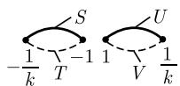  
(a) 第一片

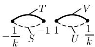  
(b) 第二片  
图 1.198 一个黎曼面的片

黎曼面上路径的参数化（整体单值化）

定理 2 黎曼面 R 上每个连续紧路径以一对一的方式对应着复 t- 平面上的一个路径

$$
C _ {*}: t = t (\tau), \quad \tau_ {0} \leqslant \tau \leqslant \tau_ {1},
$$

因此 $C$ 有一个参数化

$$
z = \operatorname{sn} t (\tau), \quad \tau_ {0} \leqslant \tau \leqslant \tau_ {1},\tag{1.491}
$$

其中 w 的相应值由 $w(\tau) = (\mathrm{sn})'(t(\tau))$ 给出. 这就澄清了 $\mathrm{sn} t(\tau)$ 在黎曼面的哪一片上取值的问题. $^{1)}$

积分计算 由定理 2 可得

$$
\boxed {I (C) = t (\tau_ {0}) - t (\tau_ {1})}
$$

实际上, 代换 (1.491) 导致

$$
I (C) = \int_ {C} \frac {\mathrm{d} z}{w} = \int_ {\tau_ {0}} ^ {\tau_ {1}} \frac {z ^ {\prime} (t (\tau)) t ^ {\prime} (\tau)}{w (t (\tau))} \mathrm{d} \tau = \int_ {\tau_ {0}} ^ {\tau_ {1}} t ^ {\prime} (\tau) \mathrm{d} \tau = t (\tau_ {1}) - t (\tau_ {0}).
$$

可更简单地记为 $z = \mathrm{sn}t, w = z'(t)$ , 因而

$$
I (C) = \int_ {C} \frac {\mathrm{d} z}{w} = \int_ {C _ {*}} \frac {z ^ {\prime} (t)}{w (t)} \mathrm{d} t = \int_ {C _ {*}} \mathrm{d} t = t (\tau_ {1}) - t (\tau_ {0}).
$$

共形映射 为了解释黎曼面上的路径 $C$ 与复 $t$ 平面上对应的路径 $C_*$ 之间的联系，我们来研究从复 $t$ 平面到复 $z$ 平面的函数

$$
\boxed {z = \operatorname{sn} t.}
$$

再次用 $\mathcal{H}_{+}=\left\{z\in\mathbb{C}\mid\operatorname{Im}z>0\right\}$ 表示 (z 平面的) 上半平面.

定理3 (i)函数

$$
\boxed {t = \int_ {0} ^ {z} \frac {\mathrm{d} \zeta}{+ \sqrt {(1 - \zeta^ {2}) (1 - k ^ {2} \zeta^ {2})}}, \quad z \in \mathscr {H} _ {+}}\tag{1.492}
$$

把上半平面 $\mathcal{H}_{+}$ 双全纯 (因而是共形) 地映射到复 $t$ 平面上的开矩形 $Q$ , 它有四个角点 $\pm K$ 和 $\pm K + K'\mathrm{i}$ .

(ii) 此外, 闭的下半平面 (包括 $\infty$ 点) 被同胚地映射到闭矩形 $\bar{Q}$ , 该映射把点 $-\frac{1}{k}, -1, 1, \frac{1}{k}$ 映为顶点 $-K + K'\mathrm{i}, -K, K, K + K'\mathrm{i}$ , 并且把这些点之间的边映射

1) 映射

$$
z = \mathrm{sn} t, w = (\mathrm{sn}) ^ {\prime} (t)\tag{1.493}
$$

与方程

$$
w ^ {2} = (1 - z ^ {2}) (1 - k ^ {2} z ^ {2})
$$

以及微分方程

$$
\left(\frac {\mathrm{d} \operatorname{sn} t}{\mathrm{d} t}\right) ^ {2} = (1 - \operatorname{sn} ^ {2} t) (1 - k ^ {2} \operatorname{sn} ^ {2} t).
$$

密切相关. 由一般拓扑的观点, 复 $t$ 平面是黎曼面 $\mathcal{R}$ 的万有覆盖面. 相应的覆叠映射 $p: \mathbb{C} \to \mathcal{R}$ 由 (1.493) 给出. [212] 讨论了流形的覆叠空间.

到 Q 的相应边界.

(iii)(1.492) 的从 $\bar{Q}$ 到 $\bar{H}_{+}$ 的逆映射为 z = sn t (图 1.199).

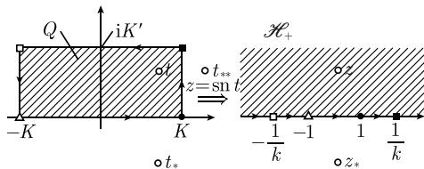  
图 1.199 正弦振幅函数

考虑周期矩形

$$
\mathscr {P} := \{t \in \mathbb {C}: - K \leqslant \operatorname{Re} t <   3 K, - K ^ {\prime} \leqslant \operatorname{Im} t <   K ^ {\prime} \}.
$$

定理 4 函数 z = sn t 把 P 一一映射到黎曼面 R 上.

例 1: t 平面上的路径 C 被变换为 R 上的路径 C, 在变换过程中, 有一个从第一片到第二片渡过的 (图 1.200).

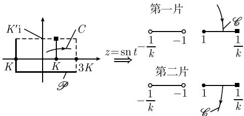  
图1.200 函数sn是一个单值化

证明：考虑图 1.199 中的点 t. t 关于实数轴的反射点是点 $t_{*}$ . 根据施瓦茨反射原理, z = sn t 的像点, 即通过实数轴反射得到的点 $z_{*} = \operatorname{sn} t_{*}$ (参看 1.14.15).

此外, $t$ 关于通过两个点 $K \pm K'\mathrm{i}$ 的线段的反射点是点 $t_{**}$ . 像点 $z_{**} = \mathrm{sn} t_{**}$ 由 $z = \mathrm{sn} t$ 关于实数轴的反射得到, 其中我们把 $z_{**}$ 看作第二片 $z$ 平面上的点. 简化积分的形变技巧 我们有如下两条由我们支配的重要法则:

(i) 如果 C 是黎曼面 R 上的一条闭路径, 它可以被连续形变为 R 上的一个点, 则有 $I(C) = 0$ .

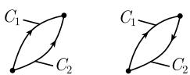

(ii) 如果 $C_1, C_2$ 是 $\mathcal{R}$ 上有相同起点和终点的两条路径, 则有

图1.201

$$
\boxed {I (C _ {1}) = I (C _ {2}),}
$$

如果闭曲线 $C = C_{1} - C_{2}$ 有性质 (i)(图 1.201).

例 2: 对于图 1.202(a) 中的路径 $C = A_{1} + A_{2}$ ，有

$$
\boxed {I (C) = 4 K.}
$$

这是函数 $z = \mathrm{sn}t$ 的一个周期.

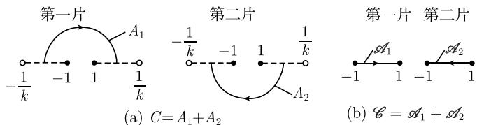  
图 1.202 为计算曲线积分而形变路径

证明：上面第二个法则 (ii) 给出 $I(A_{j}) = I(\mathcal{A}_{j})(j = 1,2)$ (图1.202(b)). 我们令 $g(z) := (1 - z^{2})(1 - k^{2}z^{2})$ ，则有

$$
I (C) = I (\mathscr {A} _ {1}) + I (\mathscr {A} _ {2}) = \int_ {- 1} ^ {1} \frac {\mathrm{d} z}{+ \sqrt {g (z)}} + \int_ {1} ^ {- 1} - \frac {\mathrm{d} z}{+ \sqrt {g (z)}} = 2 \int_ {- 1} ^ {1} \frac {\mathrm{d} z}{+ \sqrt {g (z)}} = 4 K.
$$

黎曼面的拓扑结构

取法黎曼, 人们应该通过思想而非野蛮计算来征服证明.
D. 希尔伯特(David Hilbert, 1862—1943)

令 $e_1 := -1 / k, e_2 := -1, e_3 := 1, e_4 := 1 / k$ . 我们考虑两个黎曼球面, 而不考虑两个 $\mathbf{z}$ 平面, 从 $e_1$ 到 $e_2$ (相应地, 从 $e_3$ 到 $e_4$ ) 切割它们, 并对角地把它们粘起来. 如果我们把生成的曲面像吹气球一样吹起来, 就得到一个环面 (图 1.203). 环面 $\mathcal{T}$ 的基本拓扑性质是, 在这样一个曲面上, 存在两类闭曲线不能被连续形变到一个点. 例如, 这类闭曲线是经线 $L$ , 与任意纬线 $M^*$ (图 1.203). 由例 2, 我们推断

$$
I (M) = 4 K.
$$

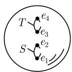  
(a)

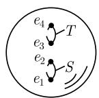

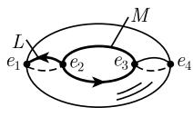  
(b)  
图 1.203 粘合两个球面以得到一个环面

此外, 我们有

$$
I (L) = 2 K ^ {\prime} \mathrm{i}.
$$

4K 和 $2K'$ i 恰是函数 z = sn t 的两个周期. 如果我们用 mM 表示绕 Mm 次的一条曲线, 则有

$$
\left| I (m M) = m I (M) = 4 m K, \quad I (m L) = m I (L) = 2 m K ^ {\prime} \mathrm{i}, \quad m = \pm 1, \pm 2, \dots . \right|
$$

因此椭圆积分 $I = \int_{C} \frac{\mathrm{d}z}{w}$ 有两个可加周期, 它们是反函数 $z = \operatorname{sn} t$ 的两个周期. 这些考虑对更一般的情形也成立:

椭圆积分的被积函数的黎曼面总具有环面的拓扑结构, 这就是椭圆积分的反函数是椭圆函数 (即, 是双周期函数) 的原因.

这个优美的拓扑讨论使黎曼不用任何计算就理解了任意阿贝尔积分的行为. 相应的黎曼面同胚于一个有 $g$ 个把手的球面, 其中 $g$ 称为黎曼面的亏格. 例如, 如图1.204中有一个把手的球可以变成按照上述切割、粘连手续得到的一个环面. 注意, 环面对应着 $g = 1$ 时的这种构造. 类似地, 可以证明下述一般结果:

如果被积函数的黎曼面的亏格为 g，则阿贝尔积分 $\int_{C} R(z, w)$ 有 2g 个可加周期.

借助这些拓扑思想, 黎曼打开了数学中的全新景观. 在 20 世纪, 拓扑学成功地迈进了数学的核心, 甚至在理论物理学中也起了重要作用.

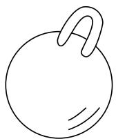  
(a)

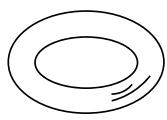

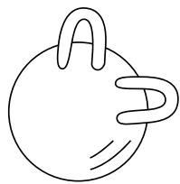  
(b)  
图 1.204 黎曼面

1.14.19.2 魏尔斯特拉斯代换的一般方法

对第一类积分的勒让德标准形的考虑可以推广到任意椭圆积分

$$
\boxed {\int_ {C} R (\zeta , \sqrt {(\zeta - a _ {1}) (\zeta - a _ {2}) (\zeta - a _ {3}) (\zeta - a _ {4})}) \mathrm{d} \zeta .}
$$

这里, $a_1, a_2, a_3, a_4$ 是四个不同的复数, $u = R(z, w)$ 表示复变量 $z$ 与 $w$ 的有理函数. 代换

$$
z = \frac {1}{\zeta - a _ {4}}
$$

把点 $a_{4}$ 映射到点 $z = \infty$ ，因而我们得到椭圆积分

$$
I (C) = \int_ {C} R (z, \sqrt {4 (z - e _ {1}) (z - e _ {2}) (z - e _ {3})}) \mathrm{d} z,
$$

其中 $R$ 为一个新的有理函数, $e_1, e_2, e_3$ 是三个不同的复数. 这个积分可以记为

$$
\boxed {I (C) = \int_ {C} R (z, w) \mathrm{d} z,}
$$

其中 $w$ 满足代数方程

$$
w ^ {2} = 4 (z - e _ {1}) (z - e _ {2}) (z - e _ {3}).
$$

具有周期 $\omega_{1}$ 与 $\omega_{2}$ 的魏尔斯特拉斯 $\mathcal{P}$ 函数属于这个方程, 这一事实是重要的. $\mathcal{P}$ 函数在 $\mathbb{C}$ 上满足微分方程

$$
\mathcal {P} ^ {\prime} (t) ^ {2} = 4 (\mathcal {P} (t) - e _ {1}) (\mathcal {P} (t) - e _ {2}) (\mathcal {P} (t) - e _ {3}).
$$

考虑复 $t$ 平面上的路径

$$
C _ {*}: t = t (\tau), \quad \tau_ {0} \leqslant \tau \leqslant \tau_ {1},
$$

并利用代换

$$
\boxed {z = \mathcal {P} (t), \quad w = \mathcal {P} ^ {\prime} (t).}
$$

这个把曲线 $C_{*}$ 映射为 C, 因而我们就得到了决定性的公式

$$
\boxed {I (C) = \int_ {C _ {*}} R (\mathcal {P} (t), \mathcal {P} ^ {\prime} (t)) \mathcal {P} ^ {\prime} (t) \mathrm{d} t.}
$$

这是 t 平面上周期为 $\omega_{1}$ 与 $\omega_{2}$ 的唯一定义的椭圆函数的积分 (图 1.205).

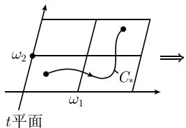

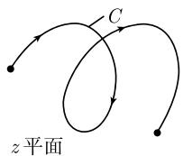  
图 1.205 一个椭圆积分的变换

黎曼面 和 1.14.19.1 一样, 曲线 $C$ 实际上是被积函数的黎曼面 $\mathcal{R}$ 上的曲线, 反之, $\mathcal{R}$ 上的每条曲线 $C$ , 对应着 $t$ 平面中的一条曲线 $C_*$ . 当 $e_4 = \infty$ 时, 如图 1.206 所示得到黎曼面 $\mathcal{R}$ .

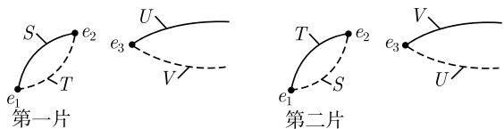  
图 1.206 构作黎曼面 R

对黎曼球面的这个构造对应着两个 $z$ 平面的选择, 它们沿从 $e_1$ 到 $e_2$ 的线段及从 $e_3$ 到 $\infty$ 的射线切割. 然后把两个刀口分别交叉粘合起来 (图 1.206). 可以在经典专著 [226] 中找到计算椭圆积分的具体方法.

1.14.19.3 应用

椭圆弧长 假设给定一个椭圆

$$
x = a \cos \varphi , \quad y = b \sin \varphi , \quad 0 \leqslant \varphi <   2 \pi ,
$$

其中长轴为 $a$ , 短轴为 $b$ , 数值离心率为 $\varepsilon = \sqrt{1 - (b / a)^2}$ . 则点 $(a,0)$ 与 $(x,y)$ 之间的椭圆弧长 $L$ 由椭圆积分

$$
\boxed {L = a \int_ {0} ^ {\varphi} \sqrt {1 - \varepsilon^ {2} \sin^ {2} \psi} \mathrm{d} \psi}
$$

给出 (图 1.207(a)). 这种积分值在 0.5.4 的表中. 几何关系导出了更广一类积分的 “椭圆积分” 的概念.

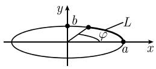  
(a)

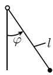  
(b)  
图 1.207 球面摆

球面摆 长度为 l 的球面摆在重力影响下的运动 $\varphi = \varphi(t)$ 导出微分方程

$$
\varphi^ {\prime \prime} + \omega^ {2} \sin \varphi = 0, \quad \varphi (0) = \varphi_ {0}, \varphi^ {\prime} (0) = 0,
$$

其中 $\omega^{2}=g/l, g$ 为重力加速度 (图 1.207(b)). 对 $\varphi$ 解方程

$$
\boxed {\sin \frac {\varphi}{2} = k \mathrm{sn} (\omega t, k)}
$$

得到上述微分方程的解, 其中 $k := \sin(\varphi_{0}/2)$ . 摆的周期是 $T = 4\omega K(k)$ . 更多细节可见 5.1.2.
