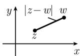

##### 1.14.2 复数列

每个复数 $z$ 可以写成

$$
\boxed {z = x + \mathrm{i} y,}
$$

其中 x, y 为实数. 另外, 我们知道

$$
\boxed {\mathrm{i} ^ {2} = - 1.}
$$

记 $\operatorname{Re} z := x(z$ 的实部), $\operatorname{Im} z := y(z$ 的虚部). 复数集用 $\mathbb{C}$ 表示, 复数的运算规则见 1.1.2.

复平面 $\mathbb{C}$ 的度量 如果 $z$ 和 $w$ 是两个复数, 则用公式

  
图1.168

$$
\boxed {d (z, w) := | z - w |}
$$

定义它们的距离．这是平面中两点间距离的经典定义 (图1.168). 它赋予 C 以度量空间的结构, 并且度量空间的所有一般结果 (参看 1.3.2) 都适用于 C.

复数列的收敛性 当且仅当复数列 $(z_{n})$ 满足关系式:

$$
\boxed {\lim _ {n \to \infty} | z _ {n} - z | = 0,}
$$

我们说 $(z_{n})$ 收敛, 表示为

$$
\boxed {\lim _ {n \to \infty} z _ {n} = z.}
$$

这等价于

$$
\lim _ {n \to \infty} \operatorname{Re} z _ {n} = \operatorname{Re} z   \text {和}    \lim _ {n \to \infty} \operatorname{Im} z _ {n} = \operatorname{Im} z.
$$

例 3: 由于当 $n \to \infty$ 时, $1/n \to 0$ , $n/(n+1) \to 1$ , 因而有

$$
\lim _ {n \to \infty} \left(\frac {1}{n} + \frac {n}{n + 1} \mathrm{i}\right) = \mathrm{i}.
$$

复数项级数的收敛性 这种收敛性用关系式:

$$
\sum_ {k = 0} ^ {\infty} a _ {k} = \lim _ {n \to \infty} \sum_ {k = 0} ^ {n} a _ {k}
$$

来定义. 1.10 中已经讨论过这种类型的级数.

复函数的收敛性 极限

$$
\lim _ {z \to a} f (z) = b
$$

表示, 对所有 $n$ 满足 $z_{n} \neq a$ , 并且满足 $\lim_{n \to \infty} z_{n} = a$ 的复数列 $(z_{n})$ 有 $\lim_{n \to \infty} f(z_{n}) = b$ .
