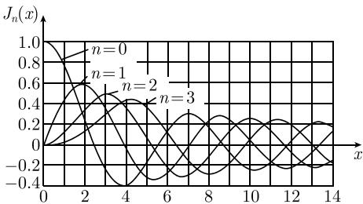
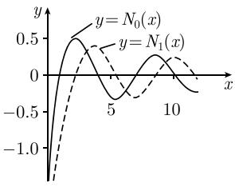

##### 1.14.22 在贝塞尔微分方程上的应用

令 $\alpha$ 为复数, 满足 Re $\alpha \geqslant 0$ . 贝塞尔微分方程

$$
\boxed {z ^ {2} w ^ {\prime \prime} + z w ^ {\prime} + (z ^ {2} - \alpha^ {2}) w = 0}\tag{1.499}
$$

在点 $z = 0$ 处有一个正则奇点, 在点 $z = \infty$ 处有一个非正则奇点. 考虑点 $z = 0$ . 指数方程

$$
\rho^ {2} - \alpha^ {2} = 0
$$

有两个解 $\rho_{1} = \alpha$ 和 $\rho_{2} = -\alpha$ . (1.499) 的通解是

$$
w = C _ {1} w _ {1} + C _ {2} w _ {2}.
$$

情形 1: 如果 $\alpha$ 不是整数, 则得到两个线性无关解 $w_{1} = J_{\alpha}$ 和 $w_{2} = J_{-\alpha}$ , 其中贝塞尔函数 $J_{\alpha}$ 由上式

$$
\boxed {J _ {\alpha} (z) := \left(\frac {z}{2}\right) ^ {\alpha} \sum_ {k = 0} ^ {\infty} \frac {(- 1) ^ {k}}{k ! \Gamma (k + \alpha + 1)} \left(\frac {z}{2}\right) ^ {2 k}}
$$

定义. 对所有复数 $z \in C$ , 这个幂级数收敛 (图 1.208(a)).

  
(a) $n = 0,1,2,3$ 时的贝塞尔函数 $J_{n}$

  
(b) 诺伊曼函数 $N_{0}$ 和 $N_{1}$  
图 1.208 贝塞尔微分方程的解

情形 2: 如果 $\alpha = n$ , 其中 $n = 0,1,2,\cdots$ , 则有 $J_{-n}(z) = (-1)^{n}J_{n}(z)$ . 因此函数 $J_{-n}$ 与 $J_{n}$ 线性相关. 这时取 $w_{1} = J_{n}, w_{2} = N_{n}$ , 其中 $N_{n}$ 是诺伊曼函数, 定义为

$$
N _ {n} (z) := \frac {1}{\pi} \left. \left(\frac {\partial J _ {\alpha} (z)}{\partial \alpha} - (- 1) ^ {n} \frac {\partial J _ {- \alpha} (z)}{\partial \alpha}\right) \right| _ {\alpha = n}.
$$

更确切地说, 由它可推出公式:

$$
\begin{array}{c} N _ {n} (z) = \frac {2}{\pi} (C + \ln z - \ln 2) J _ {n} (z) - \frac {1}{\pi} \sum_ {k = 0} ^ {n - 1} \frac {(n - k - 1) !}{k !} \left(\frac {2}{z}\right) ^ {n - 2 k} \\ - \frac {1}{\pi} \sum_ {k = 0} ^ {\infty} \frac {(- 1) ^ {k}}{k ! (n + k) !} \left(\frac {z}{2}\right) ^ {n + 2 k} (H _ {n + k} + H _ {k}), \end{array}
$$

其中欧拉常数 $C=0.5772\cdots,H_{k}:=\sum_{r=1}^{k}\frac{1}{r}$ ，且 $H_{0}:=0$ （图 1.208(b)）。对所有复数 $z\in\mathbb{C}$ ，幂级数收敛。

对于汉克尔函数, 虚变量的贝塞尔函数及麦克唐纳(MacDonald) 函数的更多公式可见 0.7.2.

应用到一个特征值问题 令 $D := \{(x, y) \in \mathbb{R}^2 | x^2 + y^2 < 1\}$ 是开单位圆盘. 特征值问题

$$
\boxed { \begin{array}{c c} {- v _ {x x} - v _ {y y} = \lambda v,} & {\text {在} D \text {上},} \\ {v = 0,} & {\text {在} \partial D \text {上}} \end{array} }\tag{1.500}
$$

有特征解

$$
v _ {k m} (x, y) := \frac {1}{\sqrt {\pi} | J _ {k} ^ {\prime} (\lambda_ {k m}) |} J _ {k} (\lambda_ {k m} r) \mathrm{e} ^ {\mathrm{i} k \varphi}, \quad \lambda = \lambda_ {k m}
$$

其中 $k=0,1,\cdots,m=1,2,\cdots$ ，且 $x=r\cos\varphi,y=r\sin\varphi$ 。我们把贝塞尔函数 $J_{k}$ 的零点记作 $0<\lambda_{k_{1}}<\lambda_{k_{2}}<\cdots$ 。函数 $\{v_{km}\}$ 在希尔伯特空间 $L_{2}(D)$ 形成一个完备规范正交系，标量积为

$$
(u, v) := \int_ {D} u (x, y) v (x, y) \mathrm{d} x \mathrm{d} y
$$

(参看 1.13.2.13).

在生成薄膜的振动上的应用 令 $u(x,y,t)$ 是在时刻 $t$ 时薄膜在点 $(x,y)$ 处的位移. 振动问题是

$$
\boxed { \begin{array}{l l} {\frac {1}{c ^ {2}} u _ {t t} - u _ {x x} - u _ {y y} = 0,} & {(x, y) \in D, t > 0,} \\ {u = 0, \text {在} \partial D \text {上},} & {(\text {边界值}),} \\ {u (x, y, 0) = u _ {0} (x, y), u _ {t} (x, y, 0) = u _ {1} (x, y),} & {(\text {初始值}).} \end{array} }\tag{1.501}
$$

我们令 c = 1.

定理 如果指定的连续函数 $u_0, u_1: \bar{D} \to \mathbb{R}$ 是光滑的, 则边界-初值问题 (1.501) 有唯一解

$$
\boxed {u (x, y) = \sum_ {k, m = 0} ^ {\infty} (a _ {k m} \cos (\lambda_ {k m} t) + b _ {k m} \sin (\lambda_ {k m} t)) v _ {k m} (x, y),}
$$

其中

$$
a _ {k m} = (u _ {0}, v _ {k m}), \quad \lambda_ {k m} b _ {k m} = (u _ {1}, v _ {k m}).
$$

这个解是通过考虑 (1.500), 利用傅里叶方法得到的.
